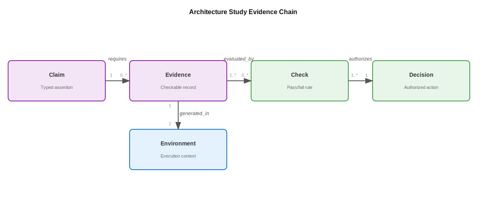

# Design-Loop Card and Review Rubric {#sec-appendix-b-design-loop-card}

```{=latex}
\abstract*{This appendix provides a compact review index and rubric for scoped AI-assisted architecture studies. Schema 2.0 records typed claims, evidence, pass/fail checks, replay information, and decision rights in separate review profiles.}
```

Architecture 2.0 work will often arrive as a paper or project report before it arrives as stable infrastructure, making a reported result only the start of review. Another architect must be able to reconstruct the bounded study, identify the claim and comparator, inspect what the evidence supports, and tell which role may authorize the next action.

The **design-loop card** provides a compact summary and index into that review packet for both single evaluations and multi-iteration studies. The card names the study boundary, records typed claims and their evidence links, summarizes failed or rejected work, and points to deeper artifacts. It supplements rather than replaces the supporting evidence record where detailed observations belong and the replay package which holds executable commands, environment bindings, inputs, and outputs.

The card should remain short enough to use, with one page serving as a good first pass. A few linked records can contain disputed evidence, raw tool output, or protected details. A form that is too long often goes unfinished, while one that is too vague hides the study boundary and evidence, and neither helps another architect make a bounded judgment.

## Why a Card, Not a Paper Summary

A conventional summary names the problem, method, result, and limitations, but it often omits the state the method could see, illegal actions, evaluation budget, failed alternatives, tool versions, and the checks that could stop advancement. Those omissions matter once models generate candidates, call tools, select experiments, or summarize evidence.

The card borrows the compact disclosure format of several established records. Component datasheets and datasheets for datasets record provenance and usage limits [@GebruEtAl2021Datasheets], while model and system cards state intended use, evaluated conditions, and limitations [@MitchellEtAl2019ModelCards; @MetaAI2022SystemCards]. Assurance cases connect claims, context, evidence, and defeaters [@Kelly2004GSN], and Architecture Decision Records preserve alternatives and rationale [@Nygard2011ADR]. Artifact-review and reporting checklists distinguish a claim from an exercisable artifact [@ACM2020ArtifactReview; @PineauEtAl2021Reproducibility; @PageEtAl2021PRISMA], and benchmark and supply-chain records add versioned run rules and integrity bindings [@MattsonEtAl2020MLPerf; @SPDX2021Standard; @SLSA2026Framework].
@tbl-card-precedents maps each precedent to the feature the card adopts.

| **Precedent** | **What it records** | **What the card borrows** |
| --- | --- | --- |
| Model and system cards | Intended use, evaluated conditions, configuration, limitations, and mitigations. | Claims must state scope, non-claims, and the conditions under which an outcome was evaluated. |
| Datasheets | Motivation, provenance, composition, maintenance, and recommended use. | Workloads, traces, and artifacts need provenance and usage limits alongside final metrics. |
| Assurance cases | Claim, context, evidence, defeaters, and residual risk. | Evidence must link to the claim, while failed checks and reversal conditions remain in the record. |
| Architecture Decision Records | Context, alternatives, decision, and consequences. | Rejected and deferred alternatives make an architecture decision intelligible. |
| Artifact and benchmark records | Versions, run rules, inputs, dependencies, and exercisability. | Replay and comparison require named artifacts with integrity checks and documented run rules. |

: **Precedents for the design-loop card.** These formats show how a short record can state scope, evidence, limits, alternatives, and provenance. {#tbl-card-precedents tbl-colwidths="[23,32,35]"}

Each precedent contributes a different part of the review. Scope and use conditions bound the claim, provenance and run rules make the evidence inspectable, and alternatives and authority connect the evidence to a decision. Together, these entries make missing structure harder to hide while leaving the reviewer to judge whether the evidence supports the claim.

## The Twelve Review Fields

The human-facing card maintains twelve review fields. Before execution, a study owner can use them to bound the work and state the proposed claim, then add evidence, failed or rejected work, and rejection-check results during execution. At review, the owner records the supported claim boundary and accountable decision. Schema 2.0 represents some fields with more than one machine key because claim support and decision authority require separate records rather than a single prose string. @tbl-design-loop-card-fields gives the review question and schema representation for each field.

| **Field** | **Question and schema representation** |
| --- | --- |
| **Intent** | What objective, constraints, non-goals, risks, and deployment assumptions bound the study? |
| **Task** | What bounded work is being done? The open `task.kind` identifies a local task family, while `task.description` says what this study actually does. |
| **Design space** | Which choices are legal, invalid, or deferred? |
| **Representation** | What state can each participant read, write, or assume, and which uncertainties remain? |
| **Environment** | Which actions and observations exist, which actions are invalid, what fidelity is used, and how is blast radius bounded? |
| **Method role** | Which people, models, tools, pipelines, teams, or policies act, what roles do they play, and what are their limitations? |
| **Feedback budget** | How many evaluations are available, at what latency, compute or tool cost, human-review cost, model cost, and fidelity? |
| **Evidence** | Each evidence record identifies its producer, kind, status, tool and version, input and output artifacts, scope, uncertainty or limitations, and integrity check. |
| **Failed runs / rejected alternatives** | What was an environment failure, invalid candidate, rejected alternative, failed rejection check, or superseded record, and which evidence or check explains the outcome? |
| **Rejection checks and authority** | The schema calls each predeclared pass/fail check a `check`. Its record includes the criterion, result, authority, waiver rule, evidence links, and outcome. `decision_rights` separately names who may propose, execute, reject, waive, recommend, and commit. |
| **Evidence-supported claim boundary** | Each entry in `claims` states a type, statement, baseline or comparator, outcome, scope, non-claims, status, and evidence links. Architecture outcomes and AI contributions remain separate claims. |
| **Accountable decision** | What action is pending, authorized, rejected, deferred, or superseded; who holds the commit right; what scope is authorized; and what would reopen the decision? |

: **Twelve fields for reviewing a study.** Together they let a reviewer trace the study from intent through authorized action and assess whether the linked evidence supports each claim. {#tbl-design-loop-card-fields tbl-colwidths="[23,64]"}

The display label **Accountable decision** maps to the stable machine schema key `accountable_decision`, creating a record that names the holder, action, scope, rationale, claim links, and conditions for reopening the decision.

The claim boundary is essential because a study may show an architecture outcome without showing that AI helped. If authors claim both, schema 2.0 expects two claim records where one represents the `architecture_outcome` and the other the `ai_contribution`, each with its own comparator, status, and evidence links. A better design from an AI-assisted arm does not by itself distinguish method benefit from a different evaluation budget, candidate set, or stopping rule.

The schema defines the evidence statuses `measured`, `computed`, `digitized`, `illustrative`, and `author-judgment`. The status tells the reader how the record came into being rather than ranking evidence quality. A careful computed simulation may support a bounded architecture claim better than a poorly controlled measurement, while an illustrative packet should never be presented as an empirical result.

## Blank Template

The one-page form in @tbl-blank-design-loop-card is enough to begin. Copy it when the study is proposed, record the initial boundary and claim, and update its links as evidence and decisions accumulate while keeping detailed observations in the evidence record and executable details in the replay package.

| **Field** | **Entry** |
| --- | --- |
| **Intent** |  |
| **Task** |  |
| **Design space** |  |
| **Representation** |  |
| **Environment** |  |
| **Method role** |  |
| **Feedback budget** |  |
| **Evidence** |  |
| **Failed runs / rejected alternatives** |  |
| **Rejection checks and authority** |  |
| **Evidence-supported claim boundary** |  |
| **Accountable decision** |  |

: **The blank card provides a reusable study index.** It applies to a paper, tool, benchmark, project proposal, class exercise, or internal study. {#tbl-blank-design-loop-card tbl-colwidths="[23,64]"}

The public companion materials provide five starting points.

- **YAML template:** [Download the schema 2.0 starter](https://arch2.mlsysbook.ai/design-loop-card/template.yaml).
- **Markdown template:** [Download the one-page review form](https://arch2.mlsysbook.ai/design-loop-card/template.md).
- **Synthetic card example:** [Inspect the canonical v2 card and replay fixture](https://arch2.mlsysbook.ai/examples/design-loop-cards/array-study-v2.yaml). Its evidence has the `illustrative` status.
- **Deterministic course lab using SCALE-Sim:** [Generate and review tool-produced evidence](https://github.com/harvard-edge/arch2/blob/main/labs/README.md). The course fixture uses no live model call and preserves raw reports, failures and rejections, replay bindings, and a separate decision exercise.
- **30-minute context workflow:** [Draft and validate the study boundary](https://arch2.mlsysbook.ai/start.html).

The synthetic fixture and deterministic course lab have different jobs, and neither replaces the executed AI-assisted study in @sec-running-the-loop.

## Machine Contract 2.0

Use the one-page card to draft and review a study. Use [JSON Schema version 2.0](https://arch2.mlsysbook.ai/schemas/design-loop-card.v2.schema.json), the canonical machine contract, when software needs to validate a card, check links among records, or exchange the card across tools.

Before reading the schema, use the mental model shown in @fig-claims-evidence-checks for its three core pillars.
- **1. Context/Environment (`context`, `environment`):** What are we doing? This bounds the task, the workload, and the permitted toolchain.
- **2. Claims/Evidence (`claims`, `evidence`):** What do we claim, and how is it proven? This links assertions to checkable execution logs.
- **3. Checks/Decision Rights (`checks`, `decision_rights`):** Who says it is okay? This is a lightweight adaptation of formal Verification and Validation (V&V) standards (like DO-178C in aerospace or ISO 26262 in automotive) applied to AI-assisted architecture, ensuring no automated action bypasses human accountability.

{#fig-claims-evidence-checks width="100%" fig-alt="Diagram showing the architecture study evidence chain, detailing the physical linkage between Claim, Evidence, Check, and Accountable Decision."}

The outline below shows the required structure without repeating every conditional rule.

```yaml
schema_version: "2.0"
design_loop_card:
  card_id: string
  profiles:
    context: complete
    inspectability: complete | partial | not_claimed
    replay: complete | partial | not_claimed
    independent_review: complete | partial | not_claimed
    disclosure: complete | partial | not_claimed
    decision_rights: complete | partial | not_claimed
  profile_gaps: { profile_name: [missing_binding] }
  intent: { objective, constraints, non_goals, risks? }
  task: { kind, description }
  design_space: { legal, invalid, deferred }
  representation: { state_schema_id, abstraction, reads, writes, uncertainties }
  environment:
    { environment_id, actions, invalid_actions, blast_radius_limit,
      observations, fidelity }
  method_roles:
    - { actor_id, actor_type, roles, reads, writes, limitations }
  feedback_budget:
    { evaluations, latency, compute_or_tool_cost, human_review, fidelity,
      model_calls?, energy_or_carbon? }
  claims:
    - { claim_id, claim_type, statement, baseline_or_comparator, outcome,
        scope, non_claims, status, evidence_refs }
  evidence:
    records:
      - evidence_id: string
        producer: { producer_id, producer_type }
        kind: string
        status: measured | computed | digitized | illustrative | author-judgment
        tool: { name, version }
        inputs: [{ artifact_id, uri, integrity }]
        outputs: [{ artifact_id, uri, integrity }]
        scope: string
        uncertainty: string       # optional when limitations define the bound
        limitations: [string]
        integrity: { sha256 } | { not_applicable_reason }
  failed_or_rejected:
    - { record_id, kind, candidate_id?, stage, reason, check_ref?, evidence_refs }
  checks:
    - { check_id, category, criterion, result, authority_id, waiver_rule,
        evidence_refs, disposition, notes? }
  decision_rights:
    - { action, holder_id, holder_type, scope, conditions }
  recommendation: { recommender_id, action, basis, claim_refs, authority_limit }
  accountable_decision:
    { status, holder_id, action, rationale, claim_refs, authorized_scope,
      recorded_at?, reopen_conditions }
  replay: { commands, environment_binding, inputs, outputs, expected_status,
            observed_status, validation_status, validated_at, validator }
  independent_review: { reviewer_id, independence_basis, shared_dependencies,
                        conflicts, result, claim_refs, evidence_refs }
  disclosure: { data_classes, redactions, reviewer_roles,
                release_boundary_or_compliance_review_id }
```

The outline abbreviates the `roles` definition, which includes a compact core enum of `generate`, `predict`, `optimize`, `critique`, `verify`, `plan`, `tool_call`, and `coordinate`. The eight roles in @sec-methods-generation-prediction-optimization form the teaching taxonomy for work inside a study, making the mapping of the machine enum to that taxonomy a separate implementation question.

The schema requires at least one typed claim. A proposed or untested claim may have an empty `evidence_refs` array, while every stronger status requires at least one evidence link. The validator also checks that referenced claim, evidence, and rejection-check IDs exist. These checks establish structural consistency and reference integrity rather than deciding whether the linked evidence supports the statement.

The machine schema uses the key `checks` to denote a predeclared pass/fail check, which never means a design change, workflow stage, reviewer, or general quality goal. Every entry has a typed category, a decidable criterion, result, authority, waiver rule, evidence links, and outcome. Free prose can add context under `notes` without replacing those fields. A tool crash should normally be recorded as an `environment_failure` and becomes a candidate-rejection check only when a predeclared rule makes that failure disqualifying for the candidate rather than evidence that the tool setup is broken.

Decision rights are assigned by action and scope rather than by a human-versus-machine classification. A model, tool, pipeline, policy, team, or person may hold a scoped right to propose, execute, reject, waive, or recommend. A complete decision-right profile must assign a holder for all six actions including `commit`, and the decision record names the holder of that commit right alongside the bounded organizational action. A reviewer must then assess the evidence separately from whether that holder has authority to act.

### Independent Profiles, Not a Maturity Ladder

Schema 2.0 replaces the former cumulative Level 0 to 3 ladder with six independent profiles. The profiles are non-ordinal, meaning that completing one neither requires nor strengthens another. @tbl-card-profiles states what each completion claim requires and what it does not imply.

| **Profile** | **A complete claim requires** | **It does not imply** |
| --- | --- | --- |
| **Context** | Intent, open task description, design-space boundaries, typed claims, and a pending or recorded decision. | Evidence exists or execution is authorized. |
| **Inspectability** | Representation, environment, method roles, feedback budget, evidence, failed or rejected records, and typed rejection checks. | Replay, independence, public disclosure, or high fidelity. |
| **Replay** | Commands, environment binding, hashed inputs and outputs, expected and observed status, and verified validation status. | Broader reproducibility, external validity, or an adequate workload. |
| **Independent review** | Reviewer identity, independence basis, shared dependencies, conflicts, result, and claim and evidence links. | Public access or freedom from every correlated dependency. |
| **Disclosure** | Data classes, redactions, reviewer roles, and a release or compliance boundary. | Replay, adequacy, or independence. |
| **Decision-right completeness** | Scoped holders for propose, execute, reject, waive, recommend, and commit. | That any action is wise or already authorized. |

: **Profiles are independent review claims.** A card may complete disclosure without replay, replay without independent review, or independent review under a restricted disclosure boundary. {#tbl-card-profiles tbl-colwidths="[22,38,30]"}

A `partial` profile must list its missing bindings in `profile_gaps`, and users should specify `not_claimed` when the profile is outside the current record. Do not mark a profile complete merely because some related prose exists.

Replay has the strictest mechanical rule, allowing a card to claim the replay profile as complete only when commands, an environment binding, inputs, outputs, expected status, observed status, hashes, and a verified result are present. The command-line validator checks hashes for local card-relative artifacts but cannot fetch and revalidate remote or protected artifacts. Successful replay shows that the named replay package ran in the declared environment, meaning broader reproducibility or transfer requires a separate evaluation. For proprietary EDA flows, NDAs, and closed-source PDKs, replay may only be verifiable by authorized internal reviewers. In these cases, the card must document the exact tool versions, licensing dependencies, and why public replay is impossible.

### Extensions and Compatibility

Open task identifiers and namespaced `x-...` fields allow new task-specific information without changing the versioned core, but an extension cannot silently redefine a claim status, evidence status, profile, rejection-check result, or decision right.

Schemas 1.0 and 1.1 remain readable for one public compatibility release with their cumulative levels and legacy keys frozen, meaning new cards should use 2.0. The migration command maps only content with a direct meaning.

```console
./arch2 migrate card old-card.yaml --output old-card.v2-migration-draft.yaml
```

The output is a migration draft rather than a valid v2 card. It lists unresolved semantics such as comparator, outcome, claim status, evidence status, typed rejection checks, replay validation, and decision rights. The migration cannot recover those meanings from a legacy card, and inventing them would misrepresent the study.

## Review Rubric

The rubric asks whether each field is strong enough for the claim and proposed action rather than acting as a numerical score. @tbl-design-loop-card-rubric separates a pass signal from the warning sign it is meant to catch.

| **Field** | **Pass signal** | **Warning sign** |
| --- | --- | --- |
| **Intent, task, and design space** | The record states the architecture question, choices, constraints, and stopping boundary. | The task is merely "use AI," or legal and invalid actions are ambiguous. |
| **Representation and environment** | The record states relevant state, actions, observations, uncertainty, fidelity, and blast radius. | Hidden defaults or wrappers determine the outcome without appearing in the record. |
| **Method roles and feedback budget** | The record states each actor's job, limitations, evaluations, latency, cost, and human attention. | A method is chosen for novelty, or its evaluation advantage is hidden. |
| **Evidence-supported claim boundary** | Statement, comparator, outcome, scope, non-claims, status, and evidence links agree. AI contribution is separate from architecture outcome. | A broad claim rests on a narrow benchmark, or AI receives credit without a matched no-AI or conventional comparison. |
| **Evidence** | Producer, status, tool version, artifacts, provenance, uncertainty, and limitations are available at the fidelity appropriate to the action. | A proxy is treated as truth, an illustrative packet as measurement, or hashes as proof of adequacy. |
| **Failed or rejected work** | Environment failures, invalid candidates, failed rejection checks, and rejected alternatives are distinguished and preserved. | Only successful candidates appear, or a tool failure is mislabeled as architectural evidence. |
| **Rejection checks and authority** | Criteria, results, authority, waivers, evidence, outcomes, and all six rights are stated. | A plausible but wrong result has no stopping path, or a recommender is treated as the decision owner. |
| **Accountable decision** | Status, holder, action, rationale, scope, claim links, and reopen conditions match the evidence. | Evidence is self-authorizing, the authorized scope exceeds support, or no role is responsible for the action. |

: **The review rubric separates support from polish.** Reviewers judge whether claim, evidence, rejection structure, and authority agree, not whether the card sounds confident. {#tbl-design-loop-card-rubric tbl-colwidths="[19,36,35]"}

::: {.callout-architect-checkpoint title="The Six-Capability Review"}
Before relying on a filled card, test it against the six learner
capabilities.

1. **Formulate.** Does the study bound the architecture question, baseline,
   claims, constraints, non-goals, and decision?
2. **Explore.** Does it compare meaningful alternatives, justify method roles,
   and preserve serious failures or rejections?
3. **Implement.** Does it connect selected alternatives to checkable state,
   artifacts, and the real tool path?
4. **Evaluate.** Do representative workloads, matched baselines, justified
   fidelity, uncertainty, counterevidence, and total feedback cost support each
   claim?
5. **Explain.** Does a mechanism hypothesis connect the outcome to architecture,
   workload, and software behavior, and has a discriminating test challenged it?
6. **Defend.** Are the recommendation, rejection checks, decision rights, commit-right boundary,
   and reopen conditions stated?
:::

If those questions cannot be answered, the work may still be promising but another architect cannot yet evaluate its architectural claim.

## Using the Card in Papers and Case Studies

A research paper and an industrial case study use the same card and may disclose different supporting records, but they do not need different claim or authority semantics.

For a paper, focus on the precise claim and comparator, evidence pointers, matched AI and conventional arms when method benefit is claimed, mechanism tests, failed alternatives, and the check that limits the conclusion. A paper may be technically interesting while leaving the study underdescribed, so the review question is whether a reader can tell what was tried, what failed, what was measured, and which action the result supports.

For a case study, focus on the action space, tool and workload provenance, decision-relevant regressions and cross-checks, disclosure boundary, and decision owner. Confidentiality does not imply absence and public release does not imply adequacy. @tbl-evidence-disclosure-tiers keeps four commonly conflated facts separate.

| **Disclosure fact** | **What to state** | **Claim limit** |
| --- | --- | --- |
| **Access and disclosure** | Which records are public, restricted, confidential, or redacted, and who may inspect protected material. | Access says nothing by itself about adequacy, replay, or independence. |
| **Evidence depth** | Whether the release contains context, a card, evidence summaries, or underlying run artifacts, with named omissions. | Audit is bounded by the observations and provenance actually available. |
| **Replay result** | Whether replay was not attempted, failed, or succeeded in a named environment, and who performed it. | Successful replay applies to that replay package and environment only. |
| **Review independence** | Who reviewed, what organizational separation exists, and which tools, data, or conflicts are shared. | Independence extends only to the disclosed organizational and technical boundary. |

: **Disclosure, evidence depth, replay, and review remain separate facts.** Do not turn them into one ordinal confidence label. {#tbl-evidence-disclosure-tiers tbl-colwidths="[22,39,29]"}

These dimensions can point in different directions because a public packet may lack the artifacts needed for replay while a restricted packet may support an independent review by authorized reviewers. Each dimension should be reported separately.

## Paper-to-Study Exercise

Ask two readers to inspect the same paper, where one writes a conventional summary and the other fills a context-profile card while marking every other profile `complete`, `partial`, or `not_claimed`. Comparing what each reading reveals usually exposes three patterns.

- A **fully specified study** names the action space, feedback budget, evidence,
  failure records, rejection checks, and decision owner.
- A **strong result with implicit structure** reports a speedup or Pareto point
  without reporting search budget, failed candidates, tool settings, or
  rejection criteria.
- A **broad claim from narrow evidence** treats one benchmark, simulator, or
  proxy result as support for a general design-method claim.

For the debrief, record which omission changed the claim or authorization judgment, and if a replay profile is complete, attempt the recorded command and report the result separately. If the card changed no judgment and identified no actionable omission, ask whether it earned its review cost.

## Executed Study Card Sketch

@tbl-executed-study-card-sketch shows how the executed systolic-array study in
@sec-running-the-loop appears in the card's human-facing fields. The linked
replay package contains the detailed machine records.

| **Field** | **Sketch** |
| --- | --- |
| **Intent and task** | Select a legal systolic-array geometry for one frozen three-layer GEMM workload under a 1,024-processing-element budget, and test the proposed mechanism. |
| **Design space** | Row and column dimensions from 8, 16, 32, 64, and 128 whose product does not exceed 1,024; 32 by 32 is the mandatory baseline. |
| **Representation and environment** | Versioned workload and transposed probe, SCALE-Sim 3.0.0, fixed dataflow and memory settings, structured model prompt and schema, candidate records, and replay bindings. |
| **Method roles and feedback budget** | The model proposes three candidates and one mechanism under one initial call and one possible repair. A frozen heuristic supplies the conventional arm. Each arm receives four SCALE-Sim evaluations, with four shared probe runs. |
| **Evidence-supported claim boundary** | The architecture claim requires a nonbaseline candidate to beat the baseline by at least 1 percent. The separate AI-contribution claim requires the model arm to beat the conventional arm under equal budgets. Neither claim is supported; the mechanism is falsified. |
| **Failed or rejected work** | The run archive distinguishes a pre-inference response-schema service failure from architecture outcomes and preserves dominated legal candidates. |
| **Rejection checks and authority** | Geometry and deadline criteria can reject candidates. The model may propose but may not execute, reject, waive, recommend, or commit; those rights remain separately assigned. |
| **Accountable decision** | The evidence supports retaining 32 by 32 and stopping. The recorded status remains `awaiting_author_confirmation`, keeping recommendation separate from the commit decision. |

: **The executed study card keeps negative outcomes distinct.** A tie, a falsified mechanism, dominated candidates, and an environment failure remain separate records with a bounded recommendation and pending decision. {#tbl-executed-study-card-sketch tbl-colwidths="[23,64]"}

## Common Failure Modes

The card proves most useful when it reveals failures early.

- **Missing or mislabeled evidence.** The observation is absent, unrelated to
  the claim, or presented at a stronger status than its production path allows.
- **Success-only reporting.** Failed candidates, invalid actions, tool failures,
  or rejected alternatives disappear.
- **Hidden state.** Defaults, flags, workloads, seeds, model identifiers, prompt
  revisions, or tool versions remain outside the record.
- **Proxy mismatch.** The method improves a metric that does not track the
  architecture objective.
- **Untested mechanism.** A plausible explanation is offered without a
  sensitivity, intervention, discriminating comparison, or ablation.
- **Confounded AI credit.** The AI arm receives more samples, different tools,
  extra expert correction, or a different stopping rule than the baseline.
- **Invalid action space.** Generated configurations cannot compile, simulate,
  synthesize, meet timing, or satisfy constraints.
- **False replay.** A source pointer is called replayable without commands,
  environment, expected result, outputs, or validated hashes.
- **Unowned authority.** A recommendation is treated as a commit decision, a waiver
  has no holder, or the authorized action exceeds the declared evidence.

These failures affect the study itself and can change which claim is supported or which action may be authorized, meaning correcting the card alone is not enough.

Solo researchers can address these issues without building a large review process.

::: {.callout-field-note title="Practical workflow tips for solo researchers"}
A useful first record can be small, as a local CSV of attempted parameters and tool results is enough to begin preserving failed work even if it does not prove adequate exploration. Record the command, tool version, candidate identity, and reason for failure. A segfault or compile failure is an environment failure to diagnose, and it becomes a candidate-rejection check only when a predeclared rule makes that outcome disqualifying.

The decision holder can be a student, advisor, reviewer, or project lead, so name who may propose, execute, reject, waive, recommend, and commit while keeping each right within a declared scope.

For an optional tool-backed replay activity, follow the
[Architecture 2.0 labs](https://github.com/harvard-edge/arch2/blob/main/labs/README.md).
:::

As the study grows, add links to the evidence record and replay package rather than expanding the card into an archive so the card remains a reliable index for later review.
