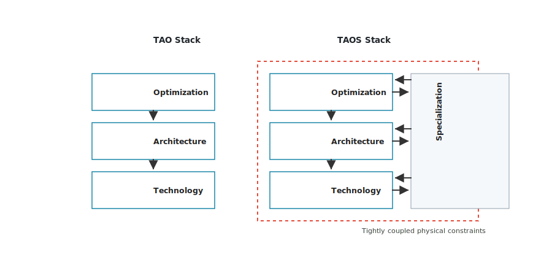
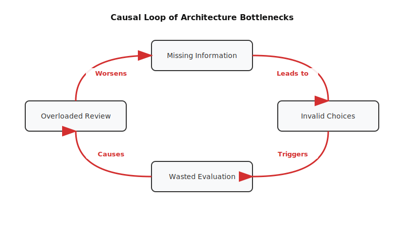

# The Design Loop No Longer Scales {#sec-design-loop-no-longer-scales}

::: {.epigraph}
> *"Feedback is the control of a system by reinserting into the system the results of its performance. If these results are merely used as numerical data for the criticism of the system and its regulation, we have the simple feedback of the control engineers."*
>
> — Norbert Wiener, *The Human Use of Human Beings* (1950) [@Wiener1950HumanUse]
:::

::: {.column-margin}
**Author's Note:** Norbert Wiener, who founded cybernetics, made feedback the defining property of control. In the passage quoted, he separates feedback that merely regulates a system from feedback that changes how the system acts. Architecture work turns on the same distinction. This chapter examines why the familiar feedback loops of design practice no longer scale, and where AI might reduce the burden without weakening the evidence behind a decision.
:::

::: {.callout-crux}
Why is familiar architecture work becoming harder to complete, and where can
AI reduce the burden without weakening the evidence behind a decision?

:::

Architecture work is getting harder to finish, not because good ideas are scarcer but because each new design must hold more of the system at once. The explosion of parameters across microarchitecture, power delivery, and software optimization outpaces the human capacity to hold the system state in a single mind, explaining why traditional heuristics fail.

A modern project spans more design information, more software and physical constraints, more possible designs, and more expensive forms of evaluation than an earlier one, and it must keep all of that consistent long enough to defend a single decision. Much of the complexity an architect once inherited from the next process node now has to be built and managed by hand.

That growth is not a flat list of independent problems. The pressures build on one another as a system gains layers. Microarchitecture and multicore execution add policies and coherence, specialization tailors a block to a workload, composing specialized blocks into a system-on-chip or a set of chiplets adds integration boundaries, and the executable software contract adds compilers, runtimes, and tests that keep moving even after the hardware is fixed. Each layer carries the constraints of the one beneath it and adds its own, so a fair comparison must hold more of the system at once. This chapter works through those layers in order, then turns to a pressure of a different kind, the rising cost and irreversibility of the evidence needed to settle the resulting comparison.

As those layers accumulate, the difficulty is not simply that modern projects can generate more candidates. Work becomes hard to complete when the project cannot keep its information
current, define useful and valid choices, afford decisive evaluation, review
the resulting evidence, or connect that evidence to a decision. These five failure modes, which the chapter returns to as a diagnostic once the layers are in view, require different remedies and can reinforce one another.

The Lighthouse prompt introduced in @sec-moonshot, a low-power 64-bit RISC-V mobile-XR compute-subsystem request that this chapter treats as the mobile XR subsystem example, makes that difficulty concrete by asking an architect to compare compute organizations for a real-time mobile XR workload within a 3\ W, 3\ nm-class mobile envelope. A useful answer must connect the workload and
software path to microarchitecture, memory movement, physical limits, and
verification. The short prompt therefore expands into many choices,
measurements, and reviews before it can support a decision.

AI can accelerate parts of that work, but strictly as an explorer and searcher. An agent might collect design information, propose alternatives, or predict PPA (Power, Performance, Area) costs, yet it cannot make final architectural commitments. A system working from incomplete context may strengthen the wrong comparison, while faster generation may flood the pipeline with weak candidates.

The human architect remains the final judge because architectural commitments are fundamentally exercises in risk buy-down; an AI can optimize a surrogate model, but the human underwrites the financial and schedule risk of the physical silicon. The architect orchestrates the evaluation harness to validate these proposals against physical silicon constraints like STA and DRC. The first task is to identify what is actually slowing the work, delegating rapid search to the AI.

::: {.callout-learning-objectives}
After reading this chapter, you can:

- Analyze how device-level physical scaling limits and heterogeneous specialization necessitate the transition from hierarchical hardware stacks to tightly constrained multi-layered design representations.
- Evaluate the system-level impacts of data-movement energy overheads, dynamic software stack evolution, and state-space explosion on hardware exploration and verification budgets.
- Diagnose the five structural failure modes that stall modern design loops by mapping candidate generation rates against evaluation costs and reviewer capacity.
- Formulate criteria for applying targeted AI search and surrogate modeling strategies to reduce specific loop bottlenecks while maintaining physical signoff integrity.

:::

## Architecture State and Evaluation

Every architecture project runs a design loop. The architect frames a question, proposes a candidate, evaluates it with workloads and tools, and revises or rejects it in light of the results. Designing a new cache replacement policy, for instance, means simulating it against standardized benchmarks, analyzing the miss rate and latency, and revising the policy until it meets its performance targets.

That loop is worth making precise, because the rest of this chapter traces where each of its parts strains. Computer architecture has always advanced through feedback and revision, with a typical project beginning with an aim such as improving latency, reducing energy, raising throughput, supporting a workload, or fitting a system within a power and cost envelope. The architect chooses an abstraction, builds or selects a model, runs an analysis or simulation, studies the result, and revises the design so that work surviving this cycle eventually reaches implementation,
validation, verification, and signoff. Textbooks and industrial practice both
follow this basic pattern.

Consider a traditional SPEC CPU study. An architect selects workloads, proposes
a cache-hierarchy or branch-predictor change, runs a simulator or performance
model, and inspects instructions per cycle (IPC), miss rates,
branch-misprediction rates, and area and power estimates. Candidates that help
one workload while harming others may be revised or discarded. Human judgment
shapes the comparison throughout, from workload selection and proxy choice to the
decision that a candidate deserves deeper analysis.

SPEC CPU 2017 provides an industry-standard suite for compute-intensive
performance across processor, memory-system, and compiler behavior
[@SPEC2017CPU]. What matters here is how the comparison is bounded. It
uses a stated workload set, model, and metrics and rejects weak candidates
explicitly. The architect still decides whether the resulting evidence is
sufficient.

Once that comparison is defined, AI could reduce some of the repeated work by suggesting cache configurations, preparing simulator runs, grouping failures, or comparing a new result with earlier experiments. While these tasks can make a large experiment set easier to run and review, they do not change what the comparison must establish.

Experienced architects also carry important context implicitly. They know which workloads were excluded, which tool settings are trusted, why a previous candidate failed, and what decision is actually under review.

Machine learning systems, however, hold that context imperfectly. Over a long session, an AI searcher can lose track of a critical thermal budget or DRC rule while optimizing a newly introduced STA timing violation, and it can produce a coherent analysis of a different comparison from the one the architect intended. The evaluation setup must therefore track workload assumptions, interface constraints, tool settings, and physical limitations explicitly, so the comparison the loop runs stays the comparison the architect meant to run.

### Explicit Inputs and Checks

Architects have repeatedly changed their working methods when informal
coordination stopped being sufficient. Some changes stabilized an interface.
Others established shared design rules, benchmarks, tool paths, or criteria
for rejecting a candidate. @tbl-historical-loop-transformations separates two
parts of each change. The middle column identifies what architects made
explicit, while the final column shows what that change made possible in later
design work.

| **Shift** | **What the design process made explicit** | **Why it mattered** |
| --- | --- | --- |
| System/360 compatibility | A stable Instruction Set Architecture (ISA) contract separated architecture from implementation across a product family [@AmdahlBlaauwBrooks1964System360]. | The ISA carries architectural commitments across implementations and product generations. |
| Mead--Conway VLSI and MOSIS | Design rules, layout abstractions, and fabrication access turned custom-chip design into a shareable and reusable loop [@USCISI2025MOSISFirstYear]. | Shared representations and fabrication access broaden participation in architecture work. |
| RISC | Workload, compiler, Very Large-Scale Integration (VLSI), and the quantitative cost/performance case became the architectural argument [@PattersonDitzel1980RISC]. | A complete comparison includes the workload, compiler, and implementation cost. |
| SPEC-style benchmarking | Workload selection, run rules, reporting conventions, and comparability became community infrastructure [@SPEC2017CPU]. | Benchmarks govern workload choice, execution, and comparison. |
| Logic synthesis and timing closure | Hardware Description Language (HDL), libraries, constraints, and timing reports let downstream checks reject upstream choices [@DeMicheli1994SynthesisOptimization]. Synthesis tools are not clean API calls; they require massive license servers, runtime budgets, and navigation of brittle failure logs. | Implementation checks can rule out architecture candidates before the project commits to them. |
| CUDA-style GPU programming | Kernels, thread hierarchies, memory spaces, libraries, and toolchains made specialized hardware programmable [@NickollsEtAl2008CUDA]. | Specialized hardware needs a usable programming model and toolchain. |

: **Six changes that made architecture work easier to inspect.** Each one established a shared representation, interface, tool path, benchmark, or decision criterion where informal coordination no longer sufficed. {#tbl-historical-loop-transformations tbl-colwidths="[22,39,28]"}

The examples solve different coordination problems. System/360 and CUDA make
interfaces explicit so that implementations and software can evolve around a
shared contract. Mead--Conway methods and logic synthesis connect a design to
the rules and tools that can accept or reject it. SPEC makes results comparable
across machines, and RISC shows why a hardware claim must include the workload,
compiler, and implementation cost. In each case, progress depended on making
more of the design work visible to other people and tools.

Release strategy shows what it looks like to make such a rule explicit rather than leave it to judgment. Intel's tick-tock model stated one publicly. A known microarchitecture moved to a new process in one release, and a new microarchitecture followed on the now-proven process in the next, so no release attempted both at once. The rule held only while the process cadence did. As node transitions lengthened, Intel retired the two-step model and stated that it would keep each process technology in use longer, adding an optimization step to the sequence [@Intel2016Form10K]. The schedule changed because the earlier division of technical risk no longer fit the work, which is the useful part of the example. An explicit rule can be checked against the conditions that justified it, and revised in public when those conditions move.

These changes did not eliminate iteration. They made the design's information,
choices, measurements, and decisions explicit enough for other people and tools
to work with. That explicit infrastructure also gives AI specific artifacts to
use. An ISA can constrain a proposed instruction, benchmark rules can govern a
generated run, and a timing report can show that a candidate needs revision.

The artifacts do not explain themselves. Some architectural knowledge lives in
specifications, but much of it is distributed across constraints, scripts,
traces, tool versions, and review decisions. Giving a model more prose does not
tell it which interface is fixed, which part of the design may change, or which
downstream check has authority to reject a proposal. AI assistance therefore
depends on access to the engineering artifacts and on an explicit account of
how architects use them. Historical interfaces, benchmarks, design rules, and
tool checks helped architecture scale because they stabilized a particular
boundary. Modern specialization requires several of those boundaries to remain
consistent at once.

### Design State Connections

For decades, computing advanced through a layered stack of technology, architecture, and optimization, which this book abbreviates TAO. Device scaling supplied faster transistors, microarchitecture organized them, and compilers mapped software onto the result. The end of Dennard scaling [@DennardEtAl1974Scaling], the property that kept power density constant as transistors shrank, added a fourth layer, specialization, extending TAO to TAOS, because physical limits at the device level now shape every layer above rather than receding beneath them (@fig-tao-vs-taos). Because a chip's transistors could no longer all switch within its power budget, a growing fraction had to stay dark at any moment, the dark-silicon or utilization-wall problem [@EsmaeilzadehEtAl2011DarkSilicon], which made specialized, selectively powered blocks the primary route to further efficiency.

{#fig-tao-vs-taos width="100%" fig-alt="TAO vs TAOS Stack"}

@fig-tao-vs-taos shows the shift. The older view is top-down, with device
technology setting the terms for the architecture and optimization layers above
it. The newer view is constrained from below, because power, thermal, and area
limits now shape the organization and the software mapping rather than following
from them. Leaning harder on caches, speculation, vector units, multicore
processors, accelerators, and system-level optimization recovered efficiency,
but each lever also increased the information an architect needs to compare two
designs fairly.

Each lever adds its own information to the comparison, and the rest of this
chapter takes them in turn. Microarchitecture and multicore execution add
policies, corner cases, and coherence; specialization adds interfaces and
verification work; composition into systems-on-chip and chiplets adds package
and integration boundaries; and the software contract and physical evidence
decide whether a choice survives. A comparison that omits one of these
interactions can rank a candidate highly for reasons that do not survive later
evaluation.

Architects adopt these levers to recover efficiency, but every added policy,
interface, or physical boundary creates another way for an early model to rank
the wrong candidate. @fig-architecture-levers shows how the information needed
for a comparison accumulates as the design moves from device scaling toward
specialization and system composition.

{#fig-architecture-levers width="85%" fig-alt="Horizontal chain of architecture levers from scaling through composition, showing that each efficiency lever adds design information and evidence requirements."}

The figure is not a sequence in which one design method replaces another.
Modern systems use all five. Device scaling changes the available transistor
budget, microarchitecture adds policies and mechanisms, optimization connects
those mechanisms to workloads and software, specialization introduces new
interfaces, and composition adds package and integration boundaries. An architect
may have to represent all of these at once, which is why an apparently
narrow design choice can require evidence from several parts of the stack.

A larger design space is useful only when architects have the information
needed to compare its choices. Because that information now spans several
sources, AI can help flag missing fields or conflicting assumptions before a
search begins.

That help is limited by what the system can inspect. If a package constraint,
compiler dependency, or process assumption is absent from its inputs, it may
still produce a confident ranking of thousands of candidates. The result can be
internally consistent and wrong for the system being designed. Retrieval and
structured descriptions can show which information is currently available and make
conflicts easier to find, but they do not determine the scope. The architect
must decide which workloads, interfaces, and implementation constraints could
change the claim and whether the available information is complete enough for
exploration to begin.

## Microarchitecture Complexity

Start with the levers already in every architect's toolkit. A deeper pipeline, a more aggressive branch predictor, a speculative scheduler, or a larger cache hierarchy each recovers performance, and each adds corner cases a fair comparison must cover. A prefetcher that helps one access pattern can pollute a cache under another. A speculation policy that raises throughput can raise energy, and the same speculative machinery later proved able to leak data across protection boundaries, as Spectre and Meltdown showed [@KocherEtAl2019Spectre; @LippEtAl2018Meltdown]. A gain measured on one workload can carry a cost that surfaces only under another.

That these levers have intrinsic limits is not a recent discovery. Palacharla, Jouppi, and Smith showed that the wakeup, selection, and bypass logic of a wide issue window scales badly enough to bound the clock it can support [@PalacharlaEtAl1997ComplexityEffective]. Agarwal and colleagues then projected that wire delay and clock scaling together would end the frequency-first road for conventional microarchitectures [@AgarwalEtAl2000ClockRateVersusIPC].

These costs are not hypothetical. Intel's Pentium 4, built on the NetBurst microarchitecture, pushed pipeline depth hard to chase clock frequency, reaching 31 pipeline stages in its 90\ nm Prescott generation [@BoggsEtAl2004Pentium4NinetyNm] on a roadmap that had projected clocks approaching 10\ GHz. The bet was internally coherent and wrong for the machine it produced. A pipeline that deep made every branch misprediction expensive to refill, and at 90\ nm the rising power density stalled frequency far short of the projected targets, leaving a part that ran hot and retired fewer instructions per clock than shorter-pipeline contemporaries. Intel abandoned the frequency-first design and moved to shorter pipelines and multiple cores. The direction of that reversal had been argued in the literature before the part shipped. The analysis existed, and the cost of the bet was still paid in silicon.

That turn to multiple cores added a further layer. Coherence protocols, memory-ordering rules, synchronization costs, and workload partitioning all shape how a candidate behaves under a real workload, and none of them shows up in a single-thread proxy. Even here, before any specialized block is added, the information a comparison must carry has already outgrown a single number.

This layer is also where AI assistance meets its first test. The cheap proxies a system would use to screen thousands of microarchitectural variants, such as a single-core instructions-per-cycle estimate, are the ones that hide coherence traffic, misprediction penalties, and speculative-energy cost. An AI screen is useful here only when it represents enough of the multicore and speculative state to rank candidates for reasons that still hold in silicon, and when the architect can check that the cheap estimate has not discarded a corner case a stronger tool would have caught. The specialized levers that follow only widen that gap.

## The Specialization Explosion

Specialization is the next layer, and it changes what a comparison must weigh. Where microarchitecture and multicore mechanisms tune a general-purpose machine, specialization tailors the hardware to a particular workload, which changes both the metrics that matter and the number of choices the architect must evaluate. A battery- and thermally limited mobile part and a warehouse-scale system bounded by power delivery and total cost of ownership (TCO) demand different measures of efficiency, and a specialized block is only worth judging against one such target.

Specialization has already produced that explosion in the field. What was once a handful of processor families is now a dense, heterogeneous mix of GPUs, FPGAs, neural processors, and other specialized parts, which the authors of Project Brainwave called a "Cambrian explosion" [@ChungEtAl2018Brainwave] and which @fig-accelerator-landscape plots across power and performance.

```{python}
#| label: fig-accelerator-landscape
#| fig-cap: |
#|   **The AI-accelerator landscape spans seven orders of magnitude in power.** Each point is a publicly announced accelerator from the MIT Lincoln Laboratory survey [@ReutherEtAl2025LAICS]: color marks form factor (chip, card, or system), filled versus hollow marks training versus inference, and the dashed diagonals are constant energy-efficiency contours. The "Cambrian explosion" is a dense, heterogeneous cloud rather than a single design point.
#| out-width: "100%"
#| fig-alt: "Log-log scatter of about 180 AI accelerators, peak performance in giga-operations per second versus peak power in watts. Points span from sub-watt embedded chips at the lower left to multi-kilowatt data-center systems at the upper right, roughly seven orders of magnitude in power and six in performance. Dashed diagonal lines mark constant energy efficiency from 100 giga-ops per watt to 100 tera-ops per watt. Chips, cards, and systems are colored distinctly; training parts are filled and inference parts hollow."

import csv
from pathlib import Path

import numpy as np
import matplotlib.pyplot as plt
from matplotlib.lines import Line2D
import _python.arch2_plots as _ap
from _python.arch2_plots import COLORS, apply_style
from _python.labels import place_labels

apply_style()

# Data: MIT Lincoln Laboratory AI accelerator survey, 2025 edition
# [@ReutherEtAl2025LAICS], one row per publicly announced accelerator with a
# stated peak performance and power. Values are dataset-transcribed.
# Accessed 2026-07-19. Receipt: data/source-receipts/chapter1-accelerator-landscape.csv
_root = Path(_ap.__file__).resolve().parents[2]
rows = []
with open(_root / "data" / "source-receipts" / "chapter1-accelerator-landscape.csv", encoding="utf-8") as fh:
    for d in csv.DictReader(fh):
        try:
            perf = float(d["peak_performance_ops_per_s"]) / 1e9
            power = float(d["power_w"])
        except ValueError:
            continue
        rows.append({"label": d["label"], "perf": perf, "power": power,
                     "form": d["form_factor"], "iort": d["inference_or_training"]})

forms = {"Chip": COLORS["workload"], "Card": COLORS["methods"], "System": COLORS["evidence"]}
fig, ax = plt.subplots(figsize=(6.0, 4.0))
xline = np.array([1e-3, 1e5])
for eff, lab in [(1e2, "100 GOPS/W"), (1e3, "1 TOPS/W"), (1e4, "10 TOPS/W"), (1e5, "100 TOPS/W")]:
    ax.plot(xline, eff * xline, ls=(0, (5, 4)), color=COLORS["grid"], lw=0.8, zorder=1)
    ax.text(2.4e-3, eff * 2.4e-3 * 1.3, lab, fontsize=4.6, color=COLORS["muted"],
            rotation=34, rotation_mode="anchor", va="bottom", ha="left", zorder=1)
for form, color in forms.items():
    for iort, filled in [("training", True), ("inference", False)]:
        pts = [d for d in rows if d["form"] == form and d["iort"] == iort]
        if not pts:
            continue
        xs = [d["power"] for d in pts]
        ys = [d["perf"] for d in pts]
        if filled:
            ax.scatter(xs, ys, s=14, marker="o", facecolor=color, edgecolor=color, linewidth=0.5, alpha=0.9, zorder=3)
        else:
            ax.scatter(xs, ys, s=14, marker="o", facecolors="white", edgecolors=color, linewidth=0.8, alpha=0.95, zorder=3)
for txt, x, y in [("Very low power", 0.02, 3.0e3), ("Embedded / autonomous", 1.5, 1.6e2),
                  ("Data-center cards", 4e2, 3.0e6), ("Data-center systems", 6e3, 3.0e7)]:
    ax.text(x, y, txt, fontsize=5.2, fontstyle="italic", color=COLORS["muted"], ha="center", va="center", zorder=2)
ax.set_xscale("log")
ax.set_yscale("log")
ax.set_xlim(8e-4, 7e4)
ax.set_ylim(3, 1e8)
ax.set_xlabel("Peak power (W)", fontsize=7.2)
ax.set_ylabel("Peak performance (GOps/sec)", fontsize=7.2)
ax.tick_params(labelsize=6.2, length=2.5, width=0.6)
for _sp in ("top", "right"):
    ax.spines[_sp].set_visible(False)
ax.grid(True, which="major", color=COLORS["row"], linewidth=0.4, zorder=0)
handles = [Line2D([0], [0], marker="o", ls="", markerfacecolor=c, markeredgecolor=c, markersize=5, label=f) for f, c in forms.items()]
handles += [Line2D([0], [0], marker="o", ls="", markerfacecolor=COLORS["ink"], markeredgecolor=COLORS["ink"], markersize=5, label="Training"),
            Line2D([0], [0], marker="o", ls="", markerfacecolor="white", markeredgecolor=COLORS["ink"], markersize=5, label="Inference")]
ax.legend(handles=handles, loc="upper left", frameon=False, fontsize=5.8, handletextpad=0.3, labelspacing=0.3, borderaxespad=0.4)
curated = ["Maxim", "GAP9", "Jetson1", "Perceive", "A100", "TPU4", "H100",
           "AMD-MI300X", "B200", "Gaudi3", "CS-2", "DGX-H100", "GroqNode", "Tachyum"]
by_label = {d["label"]: d for d in rows}
items = [(by_label[n]["power"], by_label[n]["perf"], n) for n in curated if n in by_label]
place_labels(ax, fig, items, fontsize=5.0, color=COLORS["ink"])
fig.subplots_adjust(left=0.095, right=0.98, top=0.98, bottom=0.11)
```

The scatter shows what specialization has done to the design space. Publicly announced accelerators now spread across seven orders of magnitude in power and six in performance, split among chips, cards, and full systems, with no single operating point a designer can treat as the target. Each is a distinct bundle of interfaces, precisions, and constraints, and choosing among them is the widened comparison this section is about.

An architect must decide what to specialize, where the specialized function belongs, and how it communicates with the rest of the system. Choosing between a CPU and an accelerator is only the start of designing a low-power XR subsystem, since the decision also raises questions about vector length, memory hierarchy, local buffers, compression, dataflow, quantization, runtime scheduling, compiler support, sensor streams, display deadlines, thermal behavior, and fallback modes.

This explosion in specialization implies that the traditional "general purpose" core is increasingly relegated to control plane tasks, while the bulk of the computational heavy lifting is done by a heterogeneous mosaic of Domain Specific Architectures (DSAs). Each new DSA introduces its own bespoke programming model, instruction set, and toolchain. For an AI agent attempting to navigate this space, the challenge is not just proposing a new MAC array, but proposing a complete hardware-software co-design that a real compiler can actually target.

Each of those questions widens the space of specialized options an AI system might explore, but the width is not the hard part. For the XR subsystem the trap is concrete. A vector unit sized for the throughput of one SLAM[^fn-slam-c02] [@DurrantWhyteBailey2006SLAM] matrix-multiplication kernel can post the best performance per watt in the search and still be the wrong block, because the perception model beside it has a different tensor shape and reuse pattern, and because the display holds a fixed per-frame deadline that a throughput-optimal design can miss while a slower design meets it. Specialization ties a candidate's worth to one workload's efficiency measure, so a method that optimizes performance per watt for the wrong workload, or that saves area while missing the display deadline, can rank candidates confidently in a way that means nothing for the target. AI can enumerate and score specialized options quickly; it helps only when the measure it optimizes is the one the deployment rewards and the architect has fixed which constraint a candidate may not violate. A larger search aimed at the wrong measure produces more candidates tuned for a workload no one will deploy.

[^fn-slam-c02]: **Simultaneous Localization and Mapping (SLAM)**: The robotics workload that builds a map of an unknown environment while tracking the sensor's own position within it. In mobile XR it runs continuously for head tracking, which is why its kernels anchor the subsystem's real-time compute demand.

## SoC and Chiplet Composition

Specialized blocks rarely ship alone. Architects compose them into a system-on-chip and, increasingly, across multiple chiplets, and each step of composition adds a further layer of coupled choices. Chiplets compound the effect. They make it possible to compose systems from
multiple dies and to mix process technologies, IP blocks, and memory
technologies. This disaggregation emerged for economic reasons distinct from
the power limits that ended Dennard scaling.

As the cost per transistor stopped
falling below roughly the 28 nm generation [@Shilov2023IBSDesignCost], large monolithic dies at the
leading edge yielded poorly and approached the reticle limit, so partitioning a
system into smaller dies improves yield and lets mature, cheaper nodes host
blocks that do not need the leading edge. But a chiplet system is more than a bigger board-level system
inside a package. The package changes latency, bandwidth, energy, thermal
coupling, test, repair, physical constraints, and business boundaries. Open
standards such as Universal Chiplet Interconnect Express (UCIe) show what an
interface standard can stabilize while leaving partitioning, implementation, and
evidence choices to architects [@UCIeConsortium2026Spec].

AMD's MI300 family shows compute, memory, packaging, and the
software-visible machine changing together in a real product family. MI300A
combines CPU and GPU compute dies with shared high-bandwidth memory, while
MI300X uses additional GPU compute dies in place of the CPU dies. They are not
independent chiplet selections from a catalog. AMD's CDNA 3 architecture white
paper documents the partition and the associated programming model
[@AMD2025CDNA3]. The source establishes AMD's published
product organization; it is not an independent performance evaluation.

The mobile XR subsystem example expands a choice among a CPU, accelerator, or SoC block
into workload, software, memory, physical-design, and verification questions.
Each question affects which candidates are legal, which tools can evaluate
them, and which measurements can support the 3\ W claim.

When a coupled design space is too large to explore manually, AI can help
propose partitions, tune configurations, predict costs, or direct expensive
tools toward promising candidates. These choices are conditional rather than
independent. Moving a function across a chiplet boundary changes the available
interfaces, package constraints, software path, and tools needed to evaluate
it. A compiler or runtime choice can likewise make a hardware configuration
feasible or unusable. Representing that coupled state, so another method or reviewer can see which choices depend on which, is the problem @sec-data-representations-world-models takes up.

A modern SoC integrates dozens to hundreds of heterogeneous IP blocks (CPU clusters, GPUs, NPUs, memory controllers, Network-on-Chip interconnects), often sourced from different vendors with different interface standards and incomplete documentation. Hill and Reddi name this regime accelerator-level parallelism, where the unit of design is no longer a core but a collection of specialized blocks that must be composed and managed together [@HillReddi2021AcceleratorLevelParallelism]. Coherence-protocol mismatches, unstated timing constraints, and system-level deadlocks surface only when the full SoC is assembled, so a method that optimizes one accelerator block but cannot synthesize correct glue logic or verify cross-domain coherence leaves the integration work untouched. Each added block narrows the set of valid designs and adds validation the search must account for.

The search can fail in two opposite ways. If its choices are broad but poorly
constrained, it spends evaluations on combinations that cannot be implemented.
If its choices are too narrow, it may search efficiently while excluding the
change needed to satisfy the task. Before the search begins, the architect
needs to state which transformations are permitted, which interfaces are
fixed, what makes a combination valid, and how much reliable evaluation is
available. Candidate count alone answers none of those questions.

Even a narrow comparison can contain many combinations, and the following arithmetic is illustrative rather than measured. Suppose an architect explores an accelerator and memory subsystem for one XRBench workload family and considers five compute organizations, four vector or accelerator interface choices, six memory hierarchy choices, four interconnect choices, three voltage/frequency policies, and three compiler/runtime policies. The product is

```{python}
#| echo: false
toy_design_candidates = 5 * 4 * 6 * 4 * 3 * 3
toy_candidate_evaluations = toy_design_candidates * 3
```

$$
5 \times 4 \times 6 \times 4 \times 3 \times 3
$$
That is `{python} f"{toy_design_candidates:,}"` candidate configurations before
counting workload versions, process corners, thermal constraints, or reliability
cases. Checking each candidate at three fidelity levels would create
`{python} f"{toy_candidate_evaluations:,}"` candidate--evaluation combinations,
even before rejecting a single invalid design. Real projects can grow far larger
or take far longer before silicon measurements are available.

The count alone says little about how many candidates can be evaluated well
enough to matter. If each surviving configuration needs an analytical model,
simulator run, synthesis check, or human review, a larger choice set also
increases the demand for feedback. Cheap models reduce evaluation cost, but
they do not establish whether a choice is legal or whether stronger
measurements will preserve its ranking. The practical limit is not how many
configurations a project can enumerate. It is how many it can evaluate well
enough to support the next decision.

This distinction becomes sharper as search moves from tuning predefined numerical knobs, such as cache sizes and queue depths, to generative methods that re-wire topology or inject new IP blocks. Traditional design-space exploration is fast but bounded by the existing architecture, since it only adjusts parameters within a fixed structure. Generative search using Graph Neural Networks (GNNs) or diffusion models can propose entirely new topological connectivity or additional IP blocks, which is more powerful but produces a far larger space of illegal, unverifiable RTL. The burden then shifts from generating novel designs to constraining generation so that it proposes only valid, verifiable topologies.

Other architecture tasks create similar problems in different ways
(@tbl-design-loop-scale-anchors). Mapping, design-space exploration (DSE),
physical design, and software tuning do not share one measurement scale, but
each combines many possible choices with constraints that make only some of them
useful.

Timeloop [@ParasharEtAl2019Timeloop], an analytical framework for mapping and evaluating
deep-neural-network (DNN) accelerators, provides a concrete example. For a single
CNN layer with seven nested loops and a four-level memory hierarchy, the
unconstrained mapspace already contains $(7!)^4 \times (2^4)^3$ arrangements.

| **Architecture task** | **Scale anchor** | **Why candidate count is not enough** |
| --- | --- | --- |
| DNN accelerator mapping | Timeloop enumerates loop permutations, factorization choices, and level-bypass alternatives. | Mapping is itself a combinatorial problem; architecture evaluation depends on the mapper and its constraints. |
| DNN accelerator DSE | MAESTRO, an analytical cost model for estimating DNN dataflow performance, reports 480M candidates, 2.5M valid designs, and 0.17M designs/s [@KwonEtAl2019MAESTRO]. | Pruning rules determine which candidates are evaluated and which are never seen. |
| TPU-block floorplanning | The AlphaChip paper reported reducing placement generation from months of human effort to hours of machine time [@MirhoseiniEtAl2021GraphPlacement]. | Routed physical quality and strong baselines still require separate evaluation. |
| Tensor-program tuning | AutoTVM, a machine learning-based tensor program optimizer, describes tensor-operator search spaces on the order of billions of possible implementations for a single GPU operator [@ChenEtAl2018AutoTVM]. | Compiler schedules create a hardware-dependent search problem of their own. |

: **Large search spaces place different demands on evaluation.** Mapping, accelerator DSE, floorplanning, and tensor-program tuning combine candidate scale, validity constraints, feedback cost, and different evidence requirements. {#tbl-design-loop-scale-anchors tbl-colwidths="[25,36,28]"}

The rows expose different parts of the same problem. Timeloop and MAESTRO show
how quickly mapping and accelerator choices multiply. AutoTVM shows that the
software schedule can create a large search space even after the hardware has
been chosen. The floorplanning example shows that producing a candidate quickly
does not establish its routed quality.

MAESTRO makes the distinction especially
clear. At 0.17M designs per second, its full 480M-candidate space can be examined
in under an hour. Cheap analytical feedback is plentiful in that case. The
difficult decision is which apparent winners justify more expensive evaluation.
@fig-search-vs-eval-gap places these examples on one logarithmic axis so that
their candidate counts can be compared without treating those counts as equal
amounts of evaluation work.

```{python}
#| label: fig-search-vs-eval-gap
#| fig-cap: |
#|   **Architecture search spaces span many orders of magnitude.** The scale anchors appear on one log axis, from the toy SoC design-candidate count computed above to Timeloop's unconstrained mapspace [@ParasharEtAl2019Timeloop; @KwonEtAl2019MAESTRO]. Filled markers are stated or computed counts; the hollow marker is AutoTVM's order-of-magnitude estimate. Candidate count does not measure evaluation cost or evidence strength.
#| out-width: "92%"
#| fig-alt: "Log-scale strip chart plotting four search-space sizes as points: a toy SoC design space with 4,320 candidate configurations, MAESTRO's 480 million candidates, AutoTVM's roughly one billion tensor programs, and Timeloop's 2.6 times ten to the eighteenth unconstrained mappings."

from math import factorial

import matplotlib.pyplot as plt
from _python.arch2_plots import COLORS, apply_style, row_axis, top_log_axis

# Data provenance (all values transcribed or computed from this chapter's text):
# - Toy SoC design candidates: 5*4*6*4*3*3 = 4,320, computed earlier in this chapter.
# - MAESTRO accelerator DSE: 480M candidates, stated [@KwonEtAl2019MAESTRO].
# - AutoTVM tensor programs: "on the order of billions" per GPU operator, stated
#   qualitatively (order-of-magnitude, hollow marker) [@ChenEtAl2018AutoTVM].
# - Timeloop unconstrained mapspace: (7!)^4 * (2^4)^3 ~= 2.6e18, computed from the
#   stated expression [@ParasharEtAl2019Timeloop]. Values not recomputed from sources.
# As-of: 2026-07-14.

toy_candidates = 5 * 4 * 6 * 4 * 3 * 3
timeloop_mapspace = factorial(7) ** 4 * (2**4) ** 3

rows = [
    {"label": "Toy SoC design candidates", "note": "computed in this chapter", "value": toy_candidates, "right": "$4.3\\times10^{3}$", "stated": True},
    {"label": "MAESTRO accelerator DSE", "note": "480M candidates, stated", "value": 4.8e8, "right": "$4.8\\times10^{8}$", "stated": True},
    {"label": "AutoTVM tensor programs", "note": "order of billions, approximate", "value": 1e9, "right": "$\\sim\\!10^{9}$", "stated": False},
    {"label": "Timeloop unconstrained mapspace", "note": "$(7!)^{4}\\times(2^{4})^{3}$, computed", "value": timeloop_mapspace, "right": "$2.6\\times10^{18}$", "stated": True},
]

apply_style()
fig, ax = plt.subplots(figsize=(4.95, 2.75))
fig.subplots_adjust(left=0.42, right=0.82, top=0.79, bottom=0.22)

row_axis(ax, len(rows))
top_log_axis(
    ax,
    xlim=(2e1, 4e19),
    xticks=[1e2, 1e5, 1e8, 1e11, 1e14, 1e17],
    xticklabels=["$10^{2}$", "$10^{5}$", "$10^{8}$", "$10^{11}$", "$10^{14}$", "$10^{17}$"],
    xlabel="search-space size (candidate configurations)",
)

for y, row in enumerate(rows):
    ax.axhline(y, color=COLORS["row"], linewidth=0.65, zorder=0)
    if row["stated"]:
        ax.scatter([row["value"]], [y], s=26, marker="o", facecolor=COLORS["designspace"], edgecolor=COLORS["designspace"], linewidth=1.0, zorder=3)
    else:
        ax.scatter([row["value"]], [y], s=26, marker="o", facecolors="white", edgecolors=COLORS["designspace"], linewidth=1.2, zorder=3)
    ax.text(-0.86, y - 0.17, row["label"], transform=ax.get_yaxis_transform(), ha="left", va="center", fontsize=6.6, fontweight="bold", color=COLORS["ink"], clip_on=False)
    ax.text(-0.86, y + 0.23, row["note"], transform=ax.get_yaxis_transform(), ha="left", va="center", fontsize=5.4, color=COLORS["muted"], clip_on=False)
    ax.text(1.04, y, row["right"], transform=ax.get_yaxis_transform(), ha="left", va="center", fontsize=6.1, fontweight="bold", color=COLORS["designspace_ink"], clip_on=False)

plt.show()
plt.close(fig)
```

The four anchors span nearly fifteen orders of magnitude, but the tasks do not
have the same evaluation cost. That difference shows why candidate count cannot
stand in for progress. The architect must decide which choices are worth
testing and how many reliable evaluations the project can afford.

Composition multiplies the physical and economic constraints a candidate must satisfy, and each one adds evaluation the search cannot skip. Software bring-up runs trillions of cycles, past the reach of software simulation, so it falls to hardware emulation and FPGA prototyping, which compile in days and give far less debug visibility than a simulator. Chiplet stacking adds a manufacturing constraint. In 2.5D and 3D integration such as TSMC CoWoS [@TSMCCoWoS] or Intel Foveros [@IntelFoveros], a defective die found only after packaging ruins the whole assembly, including the silicon interposer and the High Bandwidth Memory stacks, so a proposed partition is valid only if it preserves pre-bond test access to every die, the Known-Good-Die constraint.[^fn-known-good-die-c02] Reliability narrows the space again. Soft errors, silicon aging such as Negative Bias Temperature Instability (NBTI) and Hot Carrier Injection (HCI), and process variation [@Borkar2005ReliableSystems] decide viability in domains such as automotive systems under ISO 26262 [@ISO2018Iso26262], and they are measured by statistical fault injection and aging simulation rather than deterministic cycle counts.

[^fn-known-good-die-c02]: **Known-Good-Die (KGD)**: A bare die that has been tested to full quality before it is packaged. Single-die parts can be tested after packaging, so the term rarely comes up; multi-die assembly turns it into a hard constraint, because one bad die is discovered only after bonding and takes the whole package with it.

The remaining constraints work the same way. Sharing speculative-state buffers or execution units across secure and non-secure domains can save power while opening side channels, so security must be checked by formal methods or penetration testing that performance proxies cannot stand in for. Pushing hundreds of amps through a dense package produces IR drop and localized hotspots, so a Power Delivery Network (PDN) and thermomechanical model, not an aggregate-power proxy, decides whether a layout passes signoff. Much of the SoC is opaque as well. Third-party blocks such as ARM cores, PCIe PHYs, and DDR controllers arrive as datasheets and black-box models rather than executable RTL, which forces integration-level testing across interfaces the search cannot see inside. Every one of these constraints removes designs from the valid set and adds a check the search must pay for before silicon.

## Executable Software Paths

Even when a hardware candidate clears physical constraints and evaluation budgets, software must still be able to use it. The available choices extend beyond hardware. An accelerator, vector unit,
memory hierarchy, or chiplet partition may look efficient in isolation but
still be difficult to use. Programmers, compilers, runtimes, libraries, and
deployment systems must be able to use the mechanism without losing its benefit
to data movement, synchronization, code-generation overhead, or maintenance
cost.

The historical examples in @tbl-historical-loop-transformations show the same
dependence. RISC needed effective compiler support. CUDA, NVIDIA's parallel
computing platform and programming model, made GPU specialization accessible
through a programming model and toolchain [@NickollsEtAl2008CUDA].

Modern
tensor programs add a large software search problem of their own. Halide, a
language and compiler for image-processing pipelines, separates algorithms
from their schedules. MLIR provides reusable compiler infrastructure for
representing and lowering operations across levels of abstraction. Both make
scheduling, lowering, and intermediate representations part of the performance
comparison [@RaganKelleyEtAl2017HalideCACM; @LattnerEtAl2020MLIR].

Several well-known designs show why software assumptions belong in an
architecture comparison. Itanium's EPIC (Explicitly Parallel Instruction
Computing) architecture depended on compilers exposing enough instruction-level
parallelism [@SchlanskerRau2000EPIC]. Intel's Larrabee moved specific graphics
stages into software on many x86 cores while retaining fixed-function hardware
for others [@SeilerEtAl2008Larrabee]. Transmeta's Crusoe assumed that
code-morphing software would let a simple core match x86
[@DehnertEtAl2003Transmeta]. In all three designs, software capability
determined whether the proposed hardware could be used as intended. Hardware proposals remain incomplete when architects cannot inspect and test the software
path needed to use it.

Because hardware and software must be explored together, AI can help with the work between them. Earlier hardware-software co-design relied on negotiation between separate teams and often settled on compromised interfaces. In principle, a joint search could vary compiler schedules alongside hardware parameters and co-generate the intermediate representation and the hardware RTL, so a strong combination is not missed because the two were tuned in isolation, though co-generation at that fidelity remains a research direction rather than demonstrated practice. Separate AI methods might propose the hardware organization, compiler schedule, runtime configuration, and test plan, provided their assumptions are reconciled.

Those contributions are useful only when the pieces agree. They must use the
same ISA, memory model, data layout, and workload. A hardware optimizer can
improve a proxy while selecting a mechanism that the compiler cannot target, or
whose software overhead erases the predicted gain. A credible comparison must cover an
executable hardware--software path, not a hardware block in isolation. Building the environment that lets an AI system traverse that path under typed tool interfaces, rather than ad hoc scripts, is the subject of @sec-architecture-environments-tool-interfaces.

For the mobile XR subsystem example, the "64-bit RISC-V" constraint brings ABI, memory-model,
toolchain, and executable-test obligations into the architecture claim. The
software path is part of the architectural claim.

::: {.callout-lighthouse title="RISC-V is a software contract"}
**Context.** The ISA phrase specifies more than an instruction encoding. It
marks the boundary where hardware choices affect compilers, runtimes, libraries,
operating systems, and compatibility tests.

**In the mobile XR subsystem example.** "64-bit RISC-V-based" and "vector-capable CPU,
accelerator, or SoC block" make the software path part of the claim. The
architect must explain how code reaches the mechanism, which application binary
interface (ABI), memory-model, and toolchain assumptions it preserves, and which
tests would catch unsupported semantics.

The ISA defines the static software contract, but modern software stacks move fast. AI workloads need executable tests that hardware models can run continuously. Compiler and runtime integration, generated code, and executable tests provide the evidence that software can use the proposed subsystem as claimed under these dynamic conditions.

:::

For the mobile XR subsystem comparison, a proposed accelerator interface and its compiler
support belong to one comparison, even if different AI components produced
them. They must use the same interface and workload assumptions, and the
compiled program must show that data movement and software overhead preserve
the predicted benefit. A design that cannot be compiled, scheduled, and tested
should not advance because a hardware proxy looks favorable. At this point in
the argument, the architect is asking whether the selected compiler and runtime
can exercise the proposed interface under the stated workload and software
version. Establishing one executable path does not freeze it for the life of
the hardware. The software path can also change while the hardware is still
being designed.

## Tracking Software Co-Evolution {#sec-software-changes-faster-than-silicon}

Software moves faster than the hardware built to run it. New models, precision formats, and software stacks appear within the span of a single silicon program, while a chip design cycle still runs for years. Apple's release intervals have compressed from about 19 to 7 months, while NVIDIA's datacenter GPUs hold a steady two-year cycle (@fig-apple-silicon-cadence). Even the faster pace still trails the software the hardware must run.

```{python}
#| label: fig-apple-silicon-cadence
#| fig-cap: |
#|   **Hardware release cycles still trail software.** Apple's M-series intervals compress from 19 to 7 months while NVIDIA's datacenter GPUs hold a steady two-year cycle, both slower than the software stacks they run. Labels give the month gap between consecutive announced parts.
#| out-width: "100%"
#| fig-alt: "Two-row timeline. Apple's M1 (Nov 2020), M2 (Jun 2022), M3 (Oct 2023), and M4 (May 2024) fall 19, then 16, then 7 months apart, a shrinking interval; NVIDIA's A100 (May 2020), H100 (Mar 2022), B100 (Mar 2024), and R100 (Jan 2026) fall 22, 24, and 22 months apart."

import matplotlib.pyplot as plt
from _python.arch2_plots import COLORS, apply_style

# Release dates transcribed from public product announcements (as fractional
# year); month gaps computed between consecutive parts. Same data as the prior
# static figure, restyled to the house chart family. As-of: 2026-07-19.
apply_style()

apple = {
    "y": 1.0, "color": COLORS["workload"], "ink": COLORS["workload_ink"],
    "label": "Apple Silicon",
    "pts": [("M1", "Nov 2020", 2020.83), ("M2", "Jun 2022", 2022.42),
            ("M3", "Oct 2023", 2023.75), ("M4", "May 2024", 2024.33)],
    "gaps": ["19 mo", "16 mo", "7 mo"],
}
nvidia = {
    "y": 0.0, "color": COLORS["designspace"], "ink": COLORS["designspace_ink"],
    "label": "NVIDIA datacenter",
    "pts": [("A100", "May 2020", 2020.33), ("H100", "Mar 2022", 2022.17),
            ("B100", "Mar 2024", 2024.17), ("R100", "Jan 2026", 2026.0)],
    "gaps": ["22 mo", "24 mo", "22 mo"],
}

fig, ax = plt.subplots(figsize=(5.3, 2.35))
for s in (apple, nvidia):
    xs = [p[2] for p in s["pts"]]
    y = s["y"]
    ax.plot([xs[0], xs[-1]], [y, y], color=s["color"], linewidth=1.8, zorder=1,
            solid_capstyle="round")
    ax.scatter(xs, [y] * len(xs), s=42, marker="o", facecolor=s["color"],
               edgecolor=s["color"], linewidth=1.2, zorder=3)
    for name, date, x in s["pts"]:
        ax.text(x, y + 0.30, name, ha="center", va="bottom", fontsize=6.6,
                fontweight="bold", color=COLORS["ink"])
        ax.text(x, y + 0.155, date, ha="center", va="bottom", fontsize=5.6,
                color=COLORS["muted"])
    for i, gap in enumerate(s["gaps"]):
        xm = (xs[i] + xs[i + 1]) / 2
        ax.text(xm, y - 0.135, gap, ha="center", va="top", fontsize=5.8,
                fontweight="bold", color=s["ink"])
    ax.text(2018.7, y, s["label"], ha="left", va="center", fontsize=6.8,
            fontweight="bold", color=COLORS["ink"])

ax.set_xlim(2018.6, 2026.9)
ax.set_ylim(-0.7, 1.85)
for sp in ax.spines.values():
    sp.set_visible(False)
ax.set_yticks([])
ax.set_xticks([])
fig.subplots_adjust(left=0.01, right=0.99, top=0.98, bottom=0.04)
```

A hardware comparison can become outdated while the chip is still being designed.
During a multiyear silicon program, AI models, precision formats, sparsity
patterns, compiler passes, kernel libraries, runtimes, serving systems, batching
strategies, fleet policies, and benchmarks can all change. Precision formats
such as FP8, INT4, and block-scale formats[^fn-block-scale-formats-c02] may change
even though the hardware must commit to its supported data types years in
advance. Sparsity patterns, the structured or unstructured zeros in weights or
activations that hardware can skip, can change as models and software evolve.
When a long-lived hardware decision still rests on an outdated workload, the
evidence no longer supports the original commitment.

[^fn-block-scale-formats-c02]: **Block-scale formats**: Low-precision number formats that share one exponent across a block of mantissas, preserving dynamic range at a small memory cost. Committing to one in silicon fixes datapath choices years before deployment, so the architect must judge whether the format and its workload will still matter then.

The target moves in two different periods. Before release, hardware and software
teams can revise the design together, although late changes become increasingly
expensive. After release, the hardware is fixed but compilers, kernels,
libraries, runtimes, and deployment policies can continue to improve. A useful
comparison must say which period it covers because design-time co-design and
post-release enablement create different architectural evidence.

AI can reduce some of the work needed to track this change. A system can compare
workload traces, compiler versions, and benchmark definitions, then flag an
assumption that no longer matches the intended deployment. The same drift also
limits the reliability of AI assistance. A model trained on earlier traces may
accurately predict a workload that no longer matters, while a code generator
may find a strong schedule for an interface that a newer compiler handles
differently.

The hard part is deciding whether a change invalidates the architectural
comparison or leaves it intact. Detecting that two traces or software versions
differ does not answer that question. The architect must identify which differences
could reverse the decision and which measurements would test that possibility.

Whatever drives the change, a silicon program can target a software snapshot
that changes before deployment, while fabrication and physical closure still
impose a lower bound on the hardware schedule.

Specialization can improve efficiency while making a design less tolerant of
workload drift. Generality preserves flexibility, often at a cost in
performance per watt. The architect should therefore bound the workload, measure how
it changes, and revisit the hardware decision when its original assumptions no
longer hold.

Software can also adapt to deployed hardware. Compilers, kernels, and runtimes
may improve after launch, changing performance that the initial evaluation did
not capture. A claim about that change requires paired hardware, workload, and
software versions, as developed in @sec-loop-patterns-across-stack. The
architect should distinguish improvements made for the hardware from unrelated
changes in the workload. The former can strengthen the case for an existing
design, while the latter can make its original evidence stale.

AI workloads provide an unusually visible example of changing scale and shifting computation. Traditional convolutional networks performed fixed, deterministic computation, but modern generative models perform dynamic, iterative computation where memory access patterns change constantly due to growing key-value caches, variable sequence lengths, sparse mixture-of-experts[^fn-mixture-of-experts-c02] routing, and the split between prefill and decode phases that serving systems now place on separate hardware. An analysis of Epoch AI's model database estimated roughly four- to fivefold annual growth in training compute for recent notable and frontier models through May 2024 (@fig-training-compute-growth), with results that depend on model class, outliers, and the form of the fit [@SevillaRoldan2024ComputeGrowth]. Compute growth is not itself
workload drift. It does show why evidence tied to one model scale, software
stack, or training regime cannot be transferred to another without checking
the assumptions. For the mobile XR subsystem comparison, that means stating which model,
compiler, runtime, benchmark, trace, and deployment versions support each
decision.

[^fn-mixture-of-experts-c02]: **Mixture-of-experts (MoE) routing**: A model structure that activates only a small subset of its parameters, the experts, for each token. Which experts fire depends on the input, so the memory traffic a design must serve varies token to token instead of following a fixed schedule.

```{python}
#| label: fig-training-compute-growth
#| fig-cap: |
#|   **Training compute for notable AI models grows about 4.4-fold per year.** Each point is a notable model from Epoch AI's database [@SevillaRoldan2024ComputeGrowth]; the red line is a least-squares fit over the 2010--2026 points shown, which run past the cited analysis's May 2024 window. This workload scale climbs far faster than the silicon-release interval in @fig-apple-silicon-cadence, so a hardware comparison tied to one model scale can go stale within a single design cycle. The growth factor is fit to the points shown, not recomputed from the source.
#| out-width: "92%"
#| fig-alt: "Log-scale scatter of AI training compute in FLOP versus publication date from 2010 to 2026. Points rise from about ten to the fifteenth FLOP in 2010 to over ten to the twenty-sixth by 2025, frontier models tracing the upper edge. A fitted line marks roughly 4.4-fold growth per year. AlexNet, AlphaGo Zero, GPT-3, and GPT-4 are labeled along the rising frontier."

import csv
import datetime
import math
from pathlib import Path

import numpy as np
import matplotlib.pyplot as plt
import _python.arch2_plots as _ap
from _python.arch2_plots import COLORS, apply_style

apply_style()

# Data: Epoch AI "Notable AI Models" database, restricted to models carrying a
# publication date and a training-compute (FLOP) estimate. Values are
# dataset-transcribed, not recomputed; the growth factor is a least-squares
# log-linear fit to the points shown (2010-2026) [@SevillaRoldan2024ComputeGrowth].
# Accessed 2026-07-19. Receipt: data/source-receipts/chapter2-training-compute.csv
_root = Path(_ap.__file__).resolve().parents[2]

def _year(text):
    for fmt in ("%Y-%m-%d", "%Y-%m", "%Y"):
        try:
            d = datetime.datetime.strptime(text.strip(), fmt)
            return d.year + (d.timetuple().tm_yday - 1) / 365.25
        except ValueError:
            continue
    return None

pts = []
with open(_root / "data" / "source-receipts" / "chapter2-training-compute.csv", encoding="utf-8") as fh:
    for row in csv.DictReader(fh):
        yr = _year(row["publication_date"])
        try:
            flop = float(row["training_compute_flop"])
        except ValueError:
            flop = None
        if yr and flop and flop > 0 and 2010 <= yr <= 2026.6:
            pts.append({"yr": yr, "flop": flop, "name": row["model"], "frontier": row["frontier"] == "1"})

years = np.array([p["yr"] for p in pts])
logf = np.array([math.log10(p["flop"]) for p in pts])
slope, intercept = np.polyfit(years, logf, 1)
growth = 10 ** slope

fig, ax = plt.subplots(figsize=(5.2, 3.3))
other = [p for p in pts if not p["frontier"]]
front = [p for p in pts if p["frontier"]]
ax.scatter([p["yr"] for p in other], [p["flop"] for p in other], s=8, marker="o",
           facecolors="white", edgecolors=COLORS["grid"], linewidth=0.6, zorder=2, label="Notable models")
ax.scatter([p["yr"] for p in front], [p["flop"] for p in front], s=12, marker="o",
           facecolor=COLORS["workload"], edgecolor=COLORS["workload_ink"], linewidth=0.4, zorder=3, label="Frontier models")
xline = np.array([2010, 2026.5])
ax.plot(xline, 10 ** (intercept + slope * xline), color=COLORS["constraints"], lw=1.5, zorder=4)
ax.text(2013.2, 10 ** (intercept + slope * 2016.0), f"×{growth:.1f} per year", fontsize=6.6,
        fontweight="bold", color=COLORS["constraints_ink"], rotation=29, rotation_mode="anchor")

by_name = {p["name"]: p for p in pts}
landmarks = {"AlexNet": ("AlexNet", 6, -12), "AlphaGo Zero": ("AlphaGo Zero", -8, 11),
             "GPT-3 175B (davinci)": ("GPT-3", -8, 11), "GPT-4 (Jun 2023)": ("GPT-4", 6, 10)}
for key, (label, dx, dy) in landmarks.items():
    p = by_name.get(key)
    if p:
        ax.annotate(label, (p["yr"], p["flop"]), textcoords="offset points", xytext=(dx, dy),
                    fontsize=5.0, fontweight="bold", color=COLORS["ink"],
                    arrowprops=dict(arrowstyle="-", color=COLORS["muted"], lw=0.45))

ax.set_yscale("log")
ax.set_xlim(2010, 2026.7)
ax.set_ylim(1e14, 3e27)
ax.set_xlabel("Publication date", fontsize=7.2)
ax.set_ylabel("Training compute (FLOP)", fontsize=7.2)
ax.set_xticks([2010, 2013, 2016, 2019, 2022, 2025])
ax.tick_params(labelsize=6.4, length=2.5, width=0.6)
for _spine in ("top", "right"):
    ax.spines[_spine].set_visible(False)
ax.grid(True, which="major", axis="y", color=COLORS["row"], linewidth=0.4, zorder=0)
ax.legend(loc="lower right", frameon=False, fontsize=6.0, handletextpad=0.3, labelspacing=0.3)
fig.subplots_adjust(left=0.13, right=0.97, top=0.98, bottom=0.12)
```

The fitted line shows the mismatch directly. Training compute has climbed more than fourfold a year for over a decade, far outpacing the one- to two-year cycle at which the silicon underneath it turns over, so a design tuned to one model scale meets a different workload by the time it reaches silicon.

Because the software moves so quickly, architecture can no longer be a static target. The hardware design loop must co-evolve with the software stack, creating a continuous feedback loop where changes in PyTorch or MLIR directly influence the architectural parameters being searched. AI agents are uniquely positioned to bridge this gap, capable of ingesting nightly compiler builds and automatically re-running architectural benchmarks to ensure a hardware candidate hasn't been rendered obsolete by a software update.

Compiler 2.0 raises the same question one layer down. Amarasinghe
argues that compilers once hid much of the hardware from programmers, whereas
multicore processors, vector instructions, accelerators, and heterogeneous
systems have returned more of the performance burden to software developers, and
he proposes rebuilding compiler internals with machine learning rather than
hand-tuned heuristics [@Amarasinghe2026Compiler20CSAIL]. Architects face
the same shift. Abstractions remain essential, but architects must now represent
more of the workload, software, hardware, and physical information that earlier
abstractions could safely hide.

Benchmarks provide one way to keep changing workloads comparable. MLPerf
defines shared tasks and reporting rules for machine-learning systems
[@MattsonEtAl2020MLPerf]. Its inference benchmark
addressed a field with more than 100 organizations building ML inference chips
and systems spanning at least three orders of magnitude in power and five in
performance. The first submission round produced more than 600 reproducible
measurements from 14 organizations [@ReddiEtAl2020MLPerfInference]. Those
measurements are comparable because the benchmark specifies scenarios, latency
constraints, accuracy targets, and reporting rules while allowing submitters
to optimize their own software toolchains [@ReddiEtAl2021VisionBehindMLPerf].
A benchmark remains useful only while the
community maintains the tasks and run rules that make results comparable.[^fn-metrology-calibration-c02]
When those rules change, an earlier comparison may no longer answer the same
question.

[^fn-metrology-calibration-c02]: **Calibration chain (metrology)**: The U.S. National Institute of Standards and Technology (NIST) maintains reference standards and calibration chains so that a stated unit means the same thing in every laboratory. Architecture benchmarks need the same maintenance of tasks and run rules if their results are to stay comparable over time.

For the mobile XR subsystem example, "XR" is too broad to define a workload. The workload
is a moving bundle of sensing, perception, graphics, display, interaction, latency,
quality-of-experience, and energy constraints. Even with XRBench
[@KwonEtAl2023XRBench], the architect must still decide which traces, model
versions, deadlines, input distributions, and quality
targets matter. If the software stack changes faster than the hardware schedule
can absorb, the design may optimize yesterday's workload.

The comparisons and alerts produced by AI are useful triage, not proof that an
earlier result has expired. The workload description should be a versioned
input rather than a fixed prompt. Versioned traces, benchmark rules, compiler
and runtime assumptions, and tool results allow reviewers to see whether the
hardware claim still applies. The project also needs a trigger for repeating the
comparison when one of those inputs changes.

## Anchoring Early Results {#sec-physical-constraints-move-into-architecture}

The layers so far, microarchitecture, specialization, composition, and the software contract, each add to what a comparison must represent. The last pressure is different. It is not another layer to represent but the cost and finality of the evidence that settles the comparison, and physical effects are where that cost bites hardest. Physical effects create two distinct problems for an architecture comparison.

An
early model may omit an effect that later overturns the ranking. The measurement
needed to resolve that uncertainty may also arrive late or cost too much to run
on every candidate. Architecture connects system intent and hardware
mechanisms to these physical constraints. It does not replace the specialist
EDA and implementation flows needed to verify them.

Data-movement estimates, for example, can reverse an early ranking based on
compute alone. Moving data through a memory hierarchy often costs far more
energy than arithmetic. Horowitz's widely used estimates quantify the
difference [@Horowitz2014Energy]. A compute-only comparison can therefore rank
the wrong design. The result also depends on where the data resides, how often
it moves, who schedules it, what locality is available, which precision is
acceptable, and what the software stack can express.

@fig-data-movement-energy-scale puts the size of that difference on one
logarithmic scale. In the cited 45\ nm data, a 32-bit integer add costs a
fraction of a picojoule, an 8 KB SRAM access about two orders of magnitude
more, and an off-chip DRAM access about four orders of magnitude more. These
values are order-of-magnitude anchors, not predictions for a current process.

```{python}
#| label: fig-data-movement-energy-scale
#| fig-cap: |
#|   **Data movement can dominate arithmetic energy.** Rough Horowitz 45\ nm energy values show why architecture comparisons must represent locality, buffering, precision, scheduling, and memory hierarchy rather than counting arithmetic alone [@Horowitz2014Energy]. The values are transcribed order-of-magnitude anchors, including the source's 1.3--2.6\ nJ DRAM range, not current-node device estimates.
#| out-width: "92%"
#| fig-alt: "Log-scale plot comparing arithmetic and memory-access energy, showing a 32-bit integer add at 0.1 picojoules, SRAM accesses from 10 to 100 picojoules, and an off-chip DRAM access range from 1.3 to 2.6 nanojoules."

import matplotlib.pyplot as plt
from _python.arch2_plots import COLORS, add_note_box, apply_style, draw_range_rows, row_axis, top_log_axis

# Source receipt: data/source-receipts/chapter2-horowitz-energy.csv
rows = [
    {"display_label": "32b integer add", "display_note": "baseline arithmetic", "energy_low_pj": 0.1, "energy_high_pj": 0.1, "right_label": "1$\\times$", "color": COLORS["blue"]},
    {"display_label": "32b floating-point add", "display_note": "local arithmetic", "energy_low_pj": 0.9, "energy_high_pj": 0.9, "right_label": "9$\\times$", "color": COLORS["blue"]},
    {"display_label": "32b integer multiply", "display_note": "local arithmetic", "energy_low_pj": 3.0, "energy_high_pj": 3.0, "right_label": "30$\\times$", "color": COLORS["blue"]},
    {"display_label": "32b floating-point multiply", "display_note": "local arithmetic", "energy_low_pj": 4.0, "energy_high_pj": 4.0, "right_label": "40$\\times$", "color": COLORS["blue"]},
    {"display_label": "8 KB SRAM access", "display_note": "64b cache access", "energy_low_pj": 10, "energy_high_pj": 10, "right_label": "100$\\times$", "color": COLORS["green"]},
    {"display_label": "32 KB SRAM access", "display_note": "64b cache access", "energy_low_pj": 20, "energy_high_pj": 20, "right_label": "200$\\times$", "color": COLORS["green"]},
    {"display_label": "1 MB SRAM access", "display_note": "on-chip memory access", "energy_low_pj": 100, "energy_high_pj": 100, "right_label": "1000$\\times$", "color": COLORS["orange"]},
    {"display_label": "off-chip DRAM access", "display_note": "off-chip memory access", "energy_low_pj": 1300, "energy_high_pj": 2600, "right_label": "13k--26k$\\times$", "color": COLORS["red"]},
]

apply_style()
fig, ax = plt.subplots(figsize=(4.9, 3.45))
fig.subplots_adjust(left=0.40, right=0.80, top=0.82, bottom=0.17)

row_axis(ax, len(rows))
top_log_axis(
    ax,
    xlim=(0.06, 4000),
    xticks=[0.1, 1, 10, 100, 1000],
    xticklabels=["0.1 pJ", "1 pJ", "10 pJ", "100 pJ", "1 nJ"],
    xlabel="rough energy per operation or access",
)
draw_range_rows(ax, rows, low_key="energy_low_pj", high_key="energy_high_pj", label_x=-0.82, right_x=1.04, label_fontsize=6.6, note_fontsize=5.4, right_fontsize=6.1, label_dy=-0.17, note_dy=0.23)
add_note_box(fig, "Rough 45 nm values from Horowitz; use for orders of magnitude.", xywh=(0.14, 0.035, 0.72, 0.075), fontsize=5.5)

plt.show()
plt.close(fig)
```

Advanced nodes change the values, but they do not remove the cost of moving
data or driving wires. The comparison remains a useful reminder that locality
belongs in the architecture model before candidates are ranked.

A useful architecture-level decomposition is
$$
E_{\mathrm{system}} =
E_{\mathrm{compute}} + E_{\mathrm{memory}} +
E_{\mathrm{interconnect}} + E_{\mathrm{control}} +
E_{\mathrm{leakage}} .
$$
This decomposition reflects Amdahl's Law applied to energy. Optimizing the compute fraction yields diminishing system-level returns if the unoptimized data movement and leakage terms dominate the power budget. This decomposition is not a circuit-level energy model. It helps an architect
check whether the comparison includes every major source of energy that could
change the decision. A candidate that reduces arithmetic but increases memory
movement, interconnect traffic, control overhead, or leakage may make the
system worse. Nothing requires memory energy to rise when compute energy falls,
but an optimization focused on one term can allow the others to grow enough to
exceed the baseline total (@fig-waterbed-effect).

{#fig-waterbed-effect width="85%" fig-alt="Bar chart comparing a baseline energy breakdown with an illustrative candidate whose lower compute energy is outweighed by higher memory and interconnect energy."}

The baseline and candidate in the figure differ in more than arithmetic. The
candidate lowers the compute term, but its added memory traffic and
communication raise the system total above the baseline. The numbers are
illustrative, but the reversal is the point. An early proxy can favor a design
that loses once the comparison includes the costs of moving data through the system. This is the proxy-mismatch failure that @sec-feedback-verification-trust treats directly.

Interconnect costs deserve the same attention as memory movement. On-chip
networks, package links, memory interfaces, collectives, and host-device
protocols limit what a design can sustain. Timing, placement, routing, IR drop,
thermal behavior, power delivery, leakage, signoff, and test may also overturn
an architectural choice, so architects must consider the relevant EDA and
physical-design constraints early. Power and thermal density can flag a dense
accelerator mapping as risky before implementation.

Later IR-drop and thermal
signoff can confirm or clear that risk once a placed netlist and current profile
exist. Signoff runs each of these checks across multiple process, voltage, and temperature corners and operating modes, which is why a candidate can clear one corner and fail another. Because physical-design tools rely on heuristic optimization, one failed
closure attempt cannot reveal whether the candidate or the tool setup caused
the failure. Comparing constraints, seeds, and repeated outcomes helps separate
the two.

Architecture research already uses predictive models to reduce the number of
detailed simulations needed to explore a design space
[@IpekEtAl2006PredictiveDSE; @LeeBrooks2006RegressionModeling]. Multifidelity methods use the same basic strategy
across engineering optimization. They combine many inexpensive estimates with
selected high-fidelity evaluations and retain the stronger model to check
accuracy [@PeherstorferWillcoxGunzburger2018Multifidelity]. Physical constraints
require the same care. If an early model omits timing, congestion, thermal
behavior, or data movement, the architect needs a better model before generating
more candidates.

For the 3\ nm-class mobile XR subsystem comparison, a cheap energy proxy can support early
screening, but finalists need a current power model before they can support a
power or efficiency decision.

The same reversal appears in shipped silicon, not only in energy models. A
design can lead on the figures a data sheet reports and still fall behind on the
work a real program does.

::: {.callout-war-story title="A design that won on the spec sheet"}
**The claim.** AMD's Bulldozer [@Cutress2014FX9590] generation (Zambezi, 2011) bet that many simpler integer cores sharing a front-end and a floating-point unit, pushed to high clock speeds, would win on the numbers buyers and reviewers compared most directly, core count and clock frequency.

**The gap.** Those figures ignored how a real workload used the machine. The shared front-end and floating-point unit starved per-thread execution, so single-thread performance trailed even AMD's own previous generation, and raising clocks to compensate drove power up (the later FX-9590 part carried a 220 W rating [@Cutress2014FX9590]).

**The lesson.** Rank a candidate on the metric its workload rewards, not the number that is easiest to count. In silicon that gap is expensive to discover, because it appears only after the design has shipped. Restoring competitive per-thread performance took a clean-sheet microarchitecture, Zen [@AMDZen], several years later.
:::

### Evaluation Budgeting {#sec-stronger-evaluation-expensive}

Architects cannot run every candidate through every available tool.
Simulation, synthesis, physical design, emulation, verification, and expert
review consume different mixtures of compute, licenses, schedule, and human
attention. Feedback becomes scarce when the project requires more of that work
than the available people and tools can provide.

Scarce evaluation makes triage a useful role for AI. A system could reject
invalid configurations before they consume a tool run, predict which candidates
deserve a long simulation or physical implementation, and organize related
results before expert review. Used well, that assistance can save compute,
licenses, schedule, and engineering attention.

The allocation decision is itself difficult. Generating or scoring another
candidate may be cheap, but an inaccurate screen can discard a useful design or
send a weak one into an expensive stage. The architect must decide which
inexpensive checks can reject a candidate safely, which uncertainties require
stronger tools, and which measurements are likely to change the decision.
Otherwise, faster generation adds more work to the project's most
expensive stages.

Leading-edge chip-development costs show the scale of this constraint. Public
estimates vary and should not be treated as universal accounting rules. The
Semiconductor Industry Association reports that the cost of designing a
latest-node chip rose from about \$30M for a 65\ nm chip in 2006 to more than
\$540M for a 5\ nm chip in 2020, a greater than $18\times$ increase
[@SemiconductorIndustryAssociation2026ChipDesign]. A McKinsey analysis
gives a similar order of magnitude, estimating roughly \$175M for a 10\ nm
design, \$300M for a 7\ nm design, and \$540M for a 5\ nm design when validation,
IP qualification, and related development costs are included
[@BauerEtAl2020SemiconductorDesignManufacturing]. These estimates include more
than masks or wafers. They reflect architecture, design, validation,
verification, IP, tools, and engineering labor.

### Physical Limiters: Packaging, Thermals, and Yield

Beyond the initial design costs, physical and manufacturing limiters have become first-class constraints. Modern systems are increasingly bottlenecked not by logic density, but by power delivery networks (PDN), thermal dissipation ceilings, and the complex yield curves of 2.5D and 3D packaging. A chiplet-based architecture might look optimal on a spreadsheet, but if the interposer yields at 50% or the concentrated logic creates uncoolable "hot spots," the design will fail economically or physically in the real world.

In a traditional design loop, these physical constraints are often verified late in the process during physical signoff. Discovering a fatal thermal hotspot or a severe IR drop after the microarchitecture has been frozen forces massive, expensive rework that can derail an entire product schedule. Evaluating these physical constraints requires bridging the semantic gap between high-level architectural proposals and the legacy EDA formats (e.g., LEF/DEF, Liberty timing files) that AI agents cannot yet reliably generate or parse.

These physical constraints must therefore be elevated into the AI's early evaluation loops. An AI agent proposing architectures cannot treat "physical design" as an afterthought; it must maintain surrogate models of thermal behavior, package-level IR drop, and manufacturing yield. The true power of an AI surrogate model here—often driven by Bayesian Optimization or active learning to selectively sample the most uncertain regions of the physical design space—isn't just cycle-accurate precision, it is *shifting left*—pulling these physical failure modes forward into the very first hours of exploration so the architect never wastes time on an uncoolable design.

### The Verification Bottleneck

The driver of verification cost creates a similar, exponential bottleneck. When a designer adds a single state-holding element (like a flip-flop) to an integrated circuit, the size of the design increases linearly, but the number of possible states the system can inhabit doubles ($2^n$). As designs scale into billions of transistors and hundreds of specialized IP blocks, the state space that must be verified grows exponentially, far outpacing the linear growth of the design effort itself.

This means AI agents must optimize for more than just Power, Performance, and Area (PPA)—they must also optimize for *verifiability*. An architect might propose a highly aggressive, speculative cache coherence protocol that yields a 5% performance boost. However, if that protocol creates so many un-testable edge cases that the verification team will spend a year trying to prove it safe, it is ultimately a bad architecture.

Formal verification and simulation currently struggle to cover this explosion, turning verification into the single largest bottleneck in modern hardware development. This state-space explosion fundamentally limits Bounded Model Checking (BMC) and formal equivalence verification, forcing teams to rely heavily on constrained-random simulation instead [@Clarke2018ModelChecking]. This theoretical explosion has severe practical consequences on engineering teams, making the human cost of the design loop highly visible.

Foster's summary of the 2022 Wilson Research Group functional-verification study reports that demand for IC/ASIC verification engineers grew nearly three times as much as demand for design engineers from 2007 to 2022, about 146 percent versus 50 percent (@fig-verification-demand-scissors). Mean peak staffing was roughly one verification engineer per design engineer across most market segments, processor projects reached ratios as high as five to one, and design engineers spent 49 percent of their time on verification in 2022 [@Foster2022WilsonVerificationStudy]. Every invalid candidate that reaches these stages consumes compute and scarce engineering time. Generated candidates are cheap only until they require tools, verification, and expert review.

```{python}
#| label: fig-verification-demand-scissors
#| fig-cap: |
#|   **Verification staffing grew faster than design staffing.** Mean peak demand for IC/ASIC verification engineers grew about 146 percent from 2007 to 2022 while demand for design engineers grew about 50 percent, a 6.2 versus 2.7 percent compound annual growth rate [@Foster2022WilsonVerificationStudy]. Filled markers have printed data labels in the published study figures; hollow 2022 markers are chart-read approximations constrained by the study's stated growth figures.
#| out-width: "78%"
#| fig-alt: "Two-line chart indexing engineer demand to 2007, with verification-engineer demand rising to about 2.5 times its 2007 level by 2022 while design-engineer demand reaches about 1.5 times, opening a widening gap between the lines."

import matplotlib.pyplot as plt
from _python.arch2_plots import COLORS, apply_style

apply_style()

# Mean peak engineers per IC/ASIC project, Wilson Research Group / Siemens EDA
# functional-verification studies (Foster's published summaries). 2007-2020
# values have printed data labels; 2022 values are chart-read, constrained by
# the study's stated callouts of +50% design and +146% verification demand
# growth since 2007 (2.7% vs 6.2% CAGR).
# Receipt: data/source-receipts/chapter2-wilson-verification-staffing.csv
years = [2007, 2012, 2016, 2020, 2022]
design = [7.8, 8.5, 10.5, 10.3, 11.7]
verif = [4.8, 8.4, 11.6, 11.4, 11.8]

design_idx = [v / design[0] for v in design]
verif_idx = [v / verif[0] for v in verif]

fig, ax = plt.subplots(figsize=(4.65, 2.3))
fig.subplots_adjust(left=0.12, right=0.80, top=0.93, bottom=0.19)

ax.plot(years, verif_idx, color=COLORS["green"], linewidth=1.6, zorder=2)
ax.plot(years, design_idx, color=COLORS["blue"], linewidth=1.6, zorder=2)
ax.scatter(years[:-1], verif_idx[:-1], s=22, color=COLORS["green"], zorder=3)
ax.scatter(years[:-1], design_idx[:-1], s=20, marker="s", color=COLORS["blue"], zorder=3)
# 2022 values are chart-read approximations: draw them hollow
ax.scatter([years[-1]], [verif_idx[-1]], s=26, facecolors="white",
           edgecolors=COLORS["green"], linewidths=1.1, zorder=3)
ax.scatter([years[-1]], [design_idx[-1]], s=24, marker="s", facecolors="white",
           edgecolors=COLORS["blue"], linewidths=1.1, zorder=3)

ax.text(2022.6, verif_idx[-1], "verification\nengineers (+146%)", va="center",
        fontsize=6.0, color=COLORS["green"], clip_on=False)
ax.text(2022.6, design_idx[-1], "design\nengineers (+50%)", va="center",
        fontsize=6.0, color=COLORS["blue"], clip_on=False)

ax.set_xlim(2006, 2023)
ax.set_ylim(0.9, 2.7)
ax.set_xticks([2007, 2012, 2016, 2020, 2022])
ax.set_yticks([1.0, 1.5, 2.0, 2.5])
ax.set_yticklabels(["1.0$\\times$", "1.5$\\times$", "2.0$\\times$", "2.5$\\times$"])
ax.set_ylabel("mean peak demand vs. 2007", fontsize=7)
ax.tick_params(axis="both", labelsize=6.5, length=2.5, width=0.6, pad=2)
ax.grid(axis="y", color=COLORS["grid"], linewidth=0.6)

for spine in ["top", "right"]:
    ax.spines[spine].set_visible(False)
ax.spines["left"].set_color(COLORS["ink"])
ax.spines["bottom"].set_color(COLORS["ink"])

plt.show()
plt.close(fig)
```

The two lines in @fig-verification-demand-scissors are indexed to their 2007
values, so they show relative growth rather than absolute staffing levels. The
verification line rises much faster, driven by the exponential scaling of the verification state space compared to the linear scaling of design complexity. That widening difference does not identify
the cause of any single project's difficulty, but it does show that checking a
design has consumed a growing share of engineering capacity. A generated
candidate that reaches this stage is no longer cheap.

Hardware is unforgiving because a defect in shipped silicon is costly to address and never cleanly undone. The 1994 Pentium FDIV flaw shows why early checks matter, as a defect arising from five omitted lookup table entries [@Edelman1997PentiumDivision] led Intel to report a \$475M pretax charge for replacement and associated costs [@Intel1995PentiumCharge]. More recently, the Meltdown and Spectre vulnerabilities [@LippEtAl2018Meltdown; @KocherEtAl2019Spectre] exposed microarchitectural side channels in speculative execution that could not be fully patched in software without severe performance penalties. These episodes show how a hardware flaw becomes an expensive, long-lived liability after a design has shipped, one that replacement, support, or a costly software workaround can mitigate but not cleanly remove.

The Pentium charge reflects one escaped defect, but leading-edge development
raises the cost of commitment even when no public recall occurs. A 2023 report
of an IBS estimate places the cost of a large 2\ nm chip developed from scratch
without reusable IP at roughly \$725M
[@Shilov2023IBSDesignCost]. The estimate is not a
universal project price. It shows that high-fidelity evaluation and physical
implementation at the leading edge consume engineering budgets, not only
simulator cycles.

These estimates come from different accounting boundaries and do not form a controlled technology trend. What they do show is that the strongest evaluations and final implementation decisions take place within projects measured in hundreds of millions of dollars.

These costs change what should count as improvement. Producing more candidates
is not useful if every survivor adds simulation, synthesis, physical-design,
verification, and reviewer work to an already full queue. When results arrive faster than experts can reconcile
them, review queues grow and the project cannot close the decision. Turning scattered tool results into evidence a decision can rest on is the work of @sec-feedback-verification-trust, and @sec-running-the-loop carries one such comparison end to end under a fixed budget.

## Design Loop Pressure

Each problem described above can stall architecture work on its own. In
practice, they reinforce one another. Specialization expands the choice set,
each hardware choice creates software obligations, software changes can make
the workload description stale, and physical effects can reverse the remaining
rankings. The strongest checks then arrive at the point where tools and
engineering attention are most expensive.

AI may solve one problem and create another elsewhere. Faster
generation can fill an evaluation queue. Faster simulation can produce more
results than reviewers can settle. A better physical model can reveal that the
permitted choices cannot satisfy the task. The size of the design space is only
one part of the compound problem. The available information changes which
choices are legal, those choices determine what evaluation and review are
needed, and the resulting evidence determines what decision can be made.

The mobile XR subsystem example shows how the problems can accumulate. A search
may find a promising chiplet accelerator, only for the compiler path to rule out
its interface. A revised design may compile, but a newer XR trace can change its
memory behavior. A high-fidelity physical run may then expose a thermal or
data-movement cost that the early model missed. Each correction narrows the
comparison while creating new evaluation and review work. The architect has to track
those changes so that the final recommendation still answers the original
design question.

As a project considers more design choices, constraints, software paths,
physical questions, and supporting evidence, the work awaiting evaluation and
review can grow faster than the project can complete it.

@fig-scissors-gap draws the work a project must settle and the work its tools
and reviewers can examine as two diverging lines. The upper line rises as the
project adds choices, constraints, software paths, physical questions, and
evidence. The lower line grows more slowly because tools and reviewers can
examine only so much work. The widening region marks candidates, results, and
questions that have not received enough evaluation and review to support a
decision.

{#fig-scissors-gap width="85%" fig-alt="Diverging-line diagram where the work created by design choices, constraints, software paths, physical questions, and evidence grows faster than tools and reviewers can examine it."}

The curves are conceptual rather than a universal time series. The search-space
examples show how quickly a project can produce candidates, while the
verification-staffing data provide one measured example of the engineering
effort needed to check increasingly complex designs. Together, they show how
new choices and results can arrive faster than architects can evaluate them and
reach a decision.

A growing evaluation or review queue makes the problem visible. A project can
still be in trouble even when no queue is visible. It may be missing
information that would reverse the result, or its available choices may exclude
the design it needs.

{#fig-bottleneck-causal-loop fig-alt="The Bottleneck Causal Loop. Missing information leads to invalid choices, which waste expensive evaluation cycles, which in turn overload human review, ultimately worsening the original lack of information."}

The pressures form a causal chain rather than a catalog (@fig-bottleneck-causal-loop). Missing information
comes from inconsistent or stale state. Unhelpful or invalid choices come from
coupled specialization and missing software paths. Expensive evaluation comes
from the stronger checks that may reverse early models. Overloaded review
follows when scarce experts must reconcile conflicting outputs. An unclear
decision remains when no one has stated what the settled evidence permits next.
@tbl-loop-bottleneck-diagnostic separates these five problems.

| **What goes wrong** | **Mobile XR subsystem example** | **Why more candidates do not help** |
| --- | --- | --- |
| Missing information | The comparison omits memory-movement cost, so a later estimate overturns the ranking of XR compute organizations. | Every new candidate is judged with the same incomplete view of the system. |
| Unhelpful or invalid choices | The allowed choices let AI retune parameters but not change the accelerator interface needed to meet both the deadline and power limit. | A larger search cannot reach a design that lies outside the permitted choices. |
| Expensive evaluation | Only a few higher-fidelity estimates are affordable, so most candidates receive only cheap estimates. | More candidates compete for the same scarce measurements. |
| Overloaded review | Proxy, simulator, and compiler results disagree across several candidates, but reviewers cannot reconcile them before the next design review. | More candidates add results to the same unresolved review queue. |
| Unclear decision | A candidate clears the available checks, but the architect has not said whether that supports more exploration or implementation. | Additional results do not resolve what action the current evidence permits. |

: **Five problems that can keep architecture work from moving forward.** The examples show why more candidates may not help. {#tbl-loop-bottleneck-diagnostic tbl-colwidths="[24,40,36]"}

The rows separate problems that often appear together. A project with an
incomplete memory model may also lack simulation capacity and reviewer time.
Treating all three as a search limitation obscures what needs to be fixed first.
The missing model must be repaired before the architect can tell whether
evaluation or review still limits progress. If the results are complete but
waiting to be reconciled, the problem is review. If the evidence has been
reviewed but no next action is defined, the architect must decide whether it
supports more exploration, implementation, or no action at all.

Industry-wide trends cannot tell an individual project what is slowing it
down. Across the Wilson Research Group functional-verification studies,
first-silicon success fell from roughly one third of surveyed IC/ASIC projects
to 14 percent in 2024 [@Foster2023WilsonVerificationResults; @Foster2025WilsonVerification2024]. The series shows unresolved risk, but it
cannot say whether the cause was design, verification, integration, physical
implementation, manufacturing, scheduling, or organization. Each project needs
its own workload, tool, review, and decision information to find the problem.

## Applying AI Assistance at Bottlenecks {#sec-feedback-and-verification-become-the-bottleneck}

With the five problems named, the remaining question is where AI belongs among them. Faster candidate generation and a stronger architecture comparison are
different results. Faster generation helps only when architects can compare the
candidates under conditions that support the claim. To show that review is
actually the bottleneck, a project would need to measure how quickly candidates
arrive and are reviewed, whether the queue is growing, and why candidates are
rejected. No single throughput limit applies to every project.

The public AlphaChip debate illustrates a narrower point about bottlenecks. The
2021 AlphaChip paper reported that a reinforcement-learning method could produce
macro placements in hours [@MirhoseiniEtAl2021GraphPlacement], and a later public
disagreement turned on differences in cases, compute budgets, implementations,
and downstream physical-design checks [@ChengEtAl2023AssessmentRL; @GoldieEtAl2024ThatChipHasSailed]. None of those comparisons measured
candidate-arrival rates, review queues, or why candidates were rejected. We use
the case here only to ask whether faster candidate production reveals what is
slowing architecture work, not to judge learned placement. Faster placement
demonstrates candidate-production speed. It does not establish that reviewer
capacity is the bottleneck or identify which part of the project limits progress.

The technical disagreement remains open, and the full evidence dispute belongs to @sec-feedback-verification-trust. The diagnostic point is that a fair
comparison must align cases, implementations, proposal and simulator budgets,
downstream checks, and the evidence required for the architectural claim. A
bottleneck claim additionally needs measurements of candidate arrival,
evaluation, review, and rejection. Matching the task, proposal count, and tool
budget can make the comparison more informative, although model inference,
human setup, prior knowledge, and total engineering work may still differ.

Viewed together, the five problems in
@tbl-loop-bottleneck-diagnostic show why there is no generic place to insert AI.
A generator may broaden the available choices while overloading evaluation. A
surrogate may reduce tool cost while preserving a blind spot in its inputs. A
system that organizes evidence may save reviewer time without deciding what
action the evidence supports. Architects should judge each method against the
problem it is meant to address and the new work it creates elsewhere in the
project.

In the mobile XR subsystem comparison, an AI system might help collect workload and tool
information, rule out illegal configurations, predict which candidates deserve
expensive evaluation, compare tool outputs, or prepare evidence for a decision.
Those are different jobs. Each should save something concrete, such as tool
time, invalid runs, or reviewer effort, while leaving the decisive source
evidence, tool check, or design decision open to independent review.

@tbl-ai-contributions-by-bound returns to the five problems in
@tbl-loop-bottleneck-diagnostic. The second column gives AI a specific job, the
third names the engineering work that job should reduce, and the final column
states what must still be established from source material, engineering tools,
or a decision by the responsible architect. AI helps only when it reduces the
named work without weakening that final check.

| **Problem** | **How AI might help** | **Engineering work it could reduce** | **What the architect must still establish** |
| --- | --- | --- | --- |
| Missing information | Retrieve and reconcile workload, interface, tool, and result information, then flag missing variables or stale assumptions. | Manual search and synthesis across reports, repositories, traces, and prior studies. | Source provenance, versioning, coverage, and the architect's judgment that the available information is sufficient for the decision. |
| Unhelpful or invalid choices | Check constraints, screen illegal combinations, and identify when the permitted choices cannot satisfy the task. | Invalid tool runs and manual feasibility checks. | Tool-backed legality rules, fixed interfaces, and the architect's authority to change the design space. |
| Expensive evaluation | Screen candidates, estimate uncertainty, and select experiments for high-fidelity evaluation. | High-fidelity tool runs spent on candidates unlikely to change the decision. | Calibration against stronger tools, coverage of the relevant design space, and the measurements that can overturn the prediction. |
| Overloaded review | Compare results under common criteria, expose disagreements, and route uncertain cases to reviewers. | Reviewer time spent sorting repeated or weak results. | Independent checks, recorded rejection reasons, and the measured capacity of the review process. |
| Unclear decision | Organize evidence and prepare it for a stated action, flagging assumptions that would reopen the decision. | Preparation and reconciliation before a design review. | The decision scope, unresolved risks, rollback conditions, and the person authorized to act. |

: **Different problems call for different AI roles.** Each row identifies the engineering work AI could reduce and what the architect must still verify or decide without relying on the model. {#tbl-ai-contributions-by-bound tbl-colwidths="[20,29,23,28]"}

The rows are not interchangeable. A cost predictor addresses expensive
evaluation only if it reduces high-fidelity tool runs. It does not repair a
missing workload description or decide that a candidate is ready to implement.
In the mobile XR subsystem comparison, an AI ranking based on a cheap power proxy helps only
if stronger measurements test whether memory movement or physical limits
reverse that ranking. A useful evaluation should show whether the method
reduced the targeted engineering work while preserving the evidence needed for
the architectural claim.

No single AI method supplies all of these conditions. The architect needs a
clear question and scope, inspectable artifacts and tool outputs, an
architectural claim tied to evidence, and named responsibility for the decision.
Making those elements visible allows the architect to choose where AI belongs
and to judge whether it helped.

The practical test is to identify the work limiting progress before choosing a
method. AI is useful only when it reduces that specific burden without creating
more verification, review, or decision work elsewhere.

```{=latex}
\FloatBarrier
```

## Open Research Questions

Several questions from this chapter stay open. The chapter's method asks an architect to match AI to whichever bottleneck limits a project, and three practical uncertainties still stand in the way of doing that reliably.

**Theme 1: The Binding Bottleneck.** The chapter names five bottlenecks but shows that neither industry trends nor faster candidate generation reveals which one actually binds a given project.

- The chapter names five bottlenecks but shows that industry-wide trends and faster candidate generation cannot reveal which one limits a given project. What per-project instrumentation of candidate arrival, review throughput, and rejection reasons would identify the binding bottleneck instead of defaulting to the assumption that the search space is too large?
- The AlphaChip debate turned on the speed of macro placement without measuring review queues or why candidates were rejected. What experimental design would let a project show that reviewer capacity, rather than candidate production, is the constraint on its progress?
- How can a project detect when faster candidate generation is worsening progress because the true limit is simulation or review capacity rather than search?

**Theme 2: The Search Break-Even Point.** Autonomous search only pays off past some scale, and a project needs to find that point before it spends to build an agent.

- At what design-space scale does autonomous search outperform a conventional solver or expert-guided sweep, and what would measure that threshold before a project pays to train an agent?
- What cost model would let a project halt a search once the marginal gain in PPA no longer pays for the simulation the next round consumes?

**Theme 3: The Evidence-Trust Gap.** A cheap proxy can rank the wrong design first, and a moving software target can stale a comparison before signoff.

- When should an agent escalate from a cheap analytical estimate to an expensive cycle-accurate run to avoid the rank inversion a cheap proxy can produce, as when lower compute energy hides a worse system total (@fig-waterbed-effect)?
- How can a surrogate be constrained to prune physically unroutable or otherwise illegal candidates without a full oracle call?
- How can an architectural decision be kept robust when the software target shifts within a single silicon cycle, so a comparison tied to one model scale does not go stale before signoff?

## Conclusion

::: {.callout-design-principle title="Target the binding bottleneck"}
Accelerating candidate generation does not raise project velocity when the limiting constraint is simulation capacity or expert review; it only lengthens the queue at the real bottleneck. AI assistance must target the specific bottleneck, whether search, tool execution, telemetry parsing, or evidence synthesis, rather than uniformly increasing the volume of unverified artifacts.
:::


Architecture has always relied on feedback, but today's projects must coordinate much more information. Coupled choices, evolving software, and strict physical constraints create evidence requirements that can outpace a team's simulation capacity and review bandwidth, most acutely at the leading edge. Manual coordination is increasingly strained by the scale of validation required to close a design decision. Automation must shift from assisting with isolated point-tools to navigating the complex dependencies of the design loop itself, which is why architects are exploring AI assistance. The test is not whether AI participates, but whether it reduces a specific burden without weakening the evidence behind the decision.

These pressures do not share a single remedy. @tbl-loop-bottleneck-diagnostic separates the five ways architecture work stalls, from missing information to an unclear decision, and @tbl-ai-contributions-by-bound pairs each one with the engineering work an AI method would have to reduce and the check that must stay independent of the model. The rule is to match AI to whichever bottleneck is limiting a given project.

Producing more candidates does not help if the checks remain unaffordable or the next action stays unclear. Identify the limiting pressure first, then judge any AI method by whether it reduced that specific work without moving the burden to a less visible part of the project.

::: {.callout-carry-forward}
- **Carry forward.** Match AI's role to a specific architecture challenge and
  measure whether it reduced that burden.
- **Reader test.** Can you explain which challenge or combination of challenges
  limits a project and what evidence would show that AI reduced the burden rather
  than shifted it elsewhere?
- **Up next.** @sec-architecture-20-ontology shows what architects must make
  explicit about the question, available choices, tool path, evidence, and next
  decision so an AI system and another architect can work on the same problem.

:::
