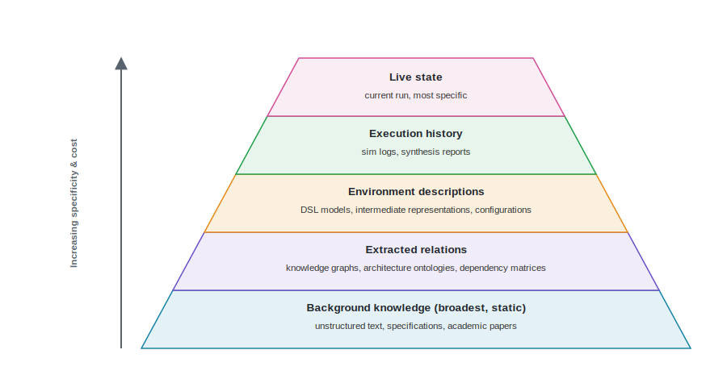
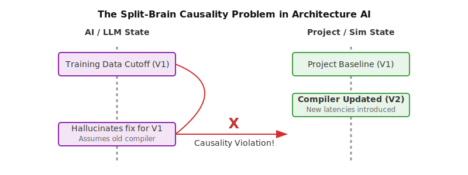

# Data Representations and World Models {#sec-data-representations-world-models}

::: {.epigraph}
> *"The limits of my language mean the limits of my world."*
>
> — Ludwig Wittgenstein, *Tractatus Logico-Philosophicus* (1922) [@Wittgenstein1922Tractatus]
:::

::: {.column-margin}
**Author's Note:** The philosopher Ludwig Wittgenstein argued that language constrains what we can conceive. The architectural version is narrower. An AI method can change only the design state exposed to it, and a reviewer can examine only evidence that remains connected to that state. If an architecture description has no way to express a coherence assumption, for example, a generator may mention it but a tool cannot check how the candidate handles it.
:::

::: {.callout-crux}
What must an AI system know and represent so that it can propose a new architecture design, predict its consequences, and help improve it?
:::

@sec-architecture-20-ontology introduced the Architecture Design Loop. To systematically explore design spaces, an AI system requires a formal, explicit representation of architectural knowledge and project state. A representation must do more than store text or an embedding. It has to capture structural constraints, Register Transfer Level (RTL) boundaries, configuration parameters, and fixed physical limits.

An AI system might speak fluently about computer architecture yet fail to act on a current design. Consider an AI system given our Lighthouse prompt to design a low-power, 64-bit RISC-V compute subsystem for an XR platform. The model may possess generalized knowledge of RISC-V instruction sets, branch prediction algorithms, and out-of-order execution pipelines. Without an explicit representation of the project state, however, it remains oblivious to the active constraints. It does not know that the architect recently updated the target eye-tracking workload trace, restricted the L2 cache capacity to meet the XR headset's thermal budget, or fixed the memory bandwidth to satisfy an area envelope. Demonstrating fluency in generating RISC-V concepts does not grant an AI the context to satisfy physical constraints.

General architectural knowledge is meaningless without the explicit bounds of the current design. To propose a viable change, an AI system, acting purely as an explorer, must fuse its learned statistical priors with the concrete, versioned constraints of the specific project. The system must represent the design problem, express a legal architectural action, and predict its consequences.

We must build verifiable frameworks where the representation tracks what the AI consumes and returns. The AI accelerates the search legwork, but the human architect remains the final judge, running the evaluation harness of trusted EDA tools that validate a candidate against physical silicon constraints such as PPA, thermal budgets, and DRC rules.

::: {.callout-learning-objectives}
After reading this chapter, you can:

- Distinguish general architectural principles from the explicit constraints of a specific project.
- Balance the speed and accuracy of different simulators to determine what an AI model can reliably learn.
- Maintain an exact history of design iterations, including fixed boundaries and rejected candidates.
- Separate rapid AI estimations from the authoritative EDA tool results that verify them.
:::

## Architectural Knowledge

Before exploring where architectural knowledge comes from, we must define what it is. Architectural knowledge in this setting is the ability to do architectural research: constructing baselines, orchestrating the right tools, and interpreting the fidelity and limits of those tools. Along the transparency gradient introduced in @sec-architecture-20-ontology, this knowledge grows harder to codify as design moves from explicit software code down to the tacit judgments of physical design. To design something new, an AI method must make those tacit constraints explicit enough for a tool to check. It draws on two classes of information: learned architectural knowledge and the current project state.

Recent literature highlights that AI models do not inherently "know" how to build a chip [@ThakurEtAl2023AutoChip; @PrakashEtAl2025QuArch]. Instead, their parameters encode recurring, general relationships among workloads, hardware mechanisms, tools, and design choices. These statistical priors explain why spatial dataflow dependencies, SRAM capacities, and MAC array dimensions interact the way they do. They enable the system to recognize that widening the multiply-accumulate (MAC) array in the Lighthouse subsystem's vector-capable accelerator block requires proportionally larger SRAM capacities to sustain utilization, or that a larger MAC grid increases the penalty of underutilized edge workloads.

Current project state serves a completely different purpose. It identifies the specific design version under active evaluation. It names the exact workload, software versions, mutable fields, fixed constraints, assumptions, prior observations, and unresolved conditions for a single study.

An AI method needs both. General knowledge cannot reveal that the project lead just restricted the die area to meet a new thermal target. Conversely, a list of current project constraints is useless without the architectural knowledge required to propose a pipeline modification that respects them. A method must separate the general rules it has learned from the explicit facts of the design version it is currently attempting to change.

### Sources and Datasets

Architectural knowledge comes from many sources. Papers, manuals, specifications, code, RTL, traces, workloads, tool outputs, failed candidates, review decisions, and field observations are not interchangeable examples. What an AI model can learn, or what an evaluation can establish, depends directly on the structure of the dataset.

Architectural data differs from the text corpora that train most ML models, one reason hardware evaluation is harder than software (@sec-architecture-20-ontology). First, hardware design demands structural correctness. A single misplaced wire or incorrect parameter can break an entire chip, whereas software can often be unit-tested function by function. Second, execution is ground truth. An architecture representation remains a hypothesis until a simulator or physical synthesis verifies it, and that feedback arrives slowly next to instant software compilation.

Finally, architectural parameters are tightly coupled. Changing a single buffer size cascades into power, timing, and area. The design space is not a smooth gradient; it is punctuated by hard cliffs, such as unroutable netlists. Textual generation alone fails here. An AI system must be tied to the physical constraints, such as SRAM limits and routing dependencies, so it does not propose impossible chips.

Because architectural tasks range from semantic reasoning to precise tool execution, the capability an AI develops is bounded by the geometry of its training data:

| **Dataset Structure** | **Information Geometry** | **Capability Ceiling** |
| :--- | :--- | :--- |
| **Document Corpus** | Flat text, ungrounded | **Passive Reader:** Conceptual fluency without execution capability. |
| **Q&A Pairs** | Targeted recall | **Isolated Reasoner:** Localized technical reasoning and formula calculation. |
| **Tool-Use Trace** | Sequential commands | **Syntax Clerk:** Invoking API endpoints without understanding physical consequences. |
| **State-Action-Consequence** | Full physical feedback loop | **Predictive Agent:** Understanding *why* mutations fail routing or thermal limits. |

: **Dataset Structures and their Capability Ceilings.** The format of the data dictates whether an AI can act as an agent or merely as a textbook. {#tbl-dataset-capability tbl-colwidths="[25,30,45]"}

As shown in @tbl-dataset-capability, a flat document corpus like conference papers can instill general conceptual fluency, but it cannot teach a model how to act. For that, the model must consume tool-use traces that demonstrate exact API syntax and sequence execution. Moving beyond syntax to optimization requires full state-action-consequence simulation logs. These logs explicitly map a proposed architectural mutation to its downstream physical costs, allowing the model to learn not just *how* to invoke a tool, but *why* certain designs fail routing or violate thermal limits.

The QuArch benchmark [@PrakashEtAl2025QuArch] begins bridging this gap by forcing models to calculate quantitative tradeoffs rather than just defining terms. However, AI acts only as a searcher; architectural exploration requires datasets that move beyond factual recall. To be useful to a hardware team, the training data must force the model to confront the architect's reality: PPA (Power, Performance, Area), STA (Static Timing Analysis), and DRC rules. If a model does not learn the physics of placement and congestion from its data, it cannot be steered by the architect, and its generated RTL will remain a theoretical exercise rather than a tape-out candidate that passes the evaluation harness.

A question-and-answer format has a strict boundary. It tests the knowledge layer but cannot reconstruct a project execution history or executable tool state. To capture an architect's knowledge, ML models cannot just look at positive examples, such as the final winning design. They must see the failed synthesis runs, the unroutable netlists, and the rejected thermal profiles. Negative examples are critical for ML to learn the boundaries of the design space. Without negative data, a model might memorize what worked in one context without understanding why designs fail or how to correct them.

The value of preserving failures, not only winning designs, is widely recognized in architecture practice. As AI-assisted architecture methods move beyond simple question-and-answer tasks, they will need datasets shaped around active design capabilities. The field currently lacks public, standardized collections of source-linked tool-use examples, versioned state-action-consequence execution histories, and negative or rejected candidates. Datasets that encode these negative outcomes ground the AI in the physical realities of routing congestion and thermal limits, transforming it from a fluent text generator into a rigorous tool that helps the human architect navigate the hard cliffs of the physical design space.

### Weighing Data Sample Costs

In traditional machine learning, systems rely on large-scale web scraping, crowd-sourced labeling, or passive observation to generate datasets. A single data sample, such as an image or a sentence, is effectively free to acquire. In computer architecture, however, data acquisition is constrained by the cost of simulation. Generating a single, valid data sample requires executing a formal model of a machine.

Understanding the cost of a data sample matters because it dictates what an AI system can learn. A large asymmetry exists between the inference overhead of running an AI model, often measured in milliseconds and fractions of a cent per token, and the cost of evaluating that AI's proposal through an electronic design automation (EDA) tool or RTL simulation, which can consume thousands of compute hours and large licensing fees. If an AI agent needs millions of trials to learn a reinforcement learning policy,[^fn-rl-policy-c04] it cannot use RTL simulation. RTL provides exact cycle-by-cycle behavioral and power numbers, but it is slow and computationally expensive. High-fidelity simulations validate ground truth, but they are too costly to serve as the sole source of training data for data-hungry ML algorithms.

[^fn-rl-policy-c04]: **Policy (reinforcement learning)**: The learned mapping from an observed state to the agent's next action. Training one typically takes millions of trial interactions, which is why evaluation cost decides whether RL is feasible for a given architecture task.

Conversely, low-fidelity generation, such as analytical models or high-level trace-driven simulations, can rapidly generate millions of synthetic data points at a fraction of the cost. However, this cheap data often lacks the nuance of complex microarchitectural interactions, such as deep pipeline stalls, coherence races, or thermal throttling effects. The challenge lies in balancing these extremes, using cheap, low-fidelity synthetic data to broadly map the design space, while reserving expensive, high-fidelity RTL or silicon data for fine-tuning models near optimal or boundary conditions. Mapping broadly with cheap approximations and spending the expensive oracle only near optimal or boundary conditions is the basis of active learning and multi-fidelity Bayesian optimization [@Settles2009ActiveLearning; @KandasamyEtAl2017MultiFidelityBO], and the tiered structure it produces is the standard multifidelity framing.

This dynamic means the spectrum of simulation fidelity dictates the volume and variance of the available dataset. Much like a memory hierarchy pairs fast, expensive SRAM with slow, cheap disk storage, the architectural data fidelity pyramid pairs scarce ground-truth silicon data with abundant analytical approximations (@fig-data-fidelity-pyramid).

{#fig-data-fidelity-pyramid fig-alt="The architectural data fidelity pyramid drawn as tiers. High-fidelity data at the apex is expensive and scarce, while low-fidelity data at the base is cheap and abundant." width="100%"}

Read the pyramid from base to apex. The wide base holds cheap, high-volume data from analytical and trace-driven models, useful for mapping the design space broadly but coarse in detail. Each higher tier, cycle-accurate simulation, RTL and gate-level runs, FPGA emulation, and physical silicon, adds fidelity as the cost of a sample climbs and the volume available shrinks. The apex holds the ground-truth silicon data an architect needs to confirm a design, but far too little of it to train on. @tbl-synthetic-data-costs gives the cost of generating one sample at each tier.

| **Simulator or Model Type** | **Fidelity Level** | **Speed or Throughput** | **Cost of a Data Sample** | **ML Principle Equivalent** |
| --- | --- | --- | --- | --- |
| Analytical or Mathematical | Low (Equations, steady-state) | Millions of samples/sec | ~$0 (Compute-bound, trivial) | Simple synthetic priors, rule-based generation |
| Trace-Driven | Medium (Instruction streams) | Thousands of samples/sec | Low | Heuristic-based procedural generation |
| Cycle-Accurate Simulation | High (Microarchitecture state) | 10s - 100s of samples/sec | Medium (High CPU hours) | High-fidelity synthetic rendering |
| RTL Simulation | Very High (Logic gates, precise) | Fractions of a sample/sec | Very High (Days of compute) | Human-annotated expert data |
| Emulation (FPGA) | High (Functional, cycle-accurate) | Real-time (Millions/sec)* | High (Hardware boards, compile time) | Real-world behavioral data |
| Physical Silicon (ASIC) | Ground Truth (Physical, Timing, Power) | Real-time (Millions/sec)* | Astronomical ($10M+ NRE, Setup) | Real-world deployment data |

: **Data generation cost rises sharply with fidelity.** Silicon and emulation run at high sample rates, but setup cost, bitstream compilation time, and non-recurring engineering (NRE) make acquiring the first sample expensive. {#tbl-synthetic-data-costs tbl-colwidths="[20,20,20,20,20]"}

### Knowledge Ingestion

Once we understand the cost and structure of architectural data, we must consider how an AI agent consumes it. As shown in @tbl-ingestion-timescales, an AI system does not ingest all information in the same way because the knowledge it needs operates on different timescales.

| **Ingestion Method** | **Timescale / Volatility** | **Compute Cost** | **Architectural Purpose** |
| :--- | :--- | :--- | :--- |
| **Pretraining** | Static / Slow | High | Embeds universal laws of physics, ISA semantics, and statistical priors. |
| **Fine-Tuning** | Periodic / Versioned | Medium | Shapes interaction syntax, API formatting, and tool orchestration rules. |
| **Retrieval (RAG)** | Dynamic / Query-time | Low | Fetches volatile technical context, manuals, and reference designs. |
| **In-Context** | Transient / Immediate | Low | Holds immediate project constraints, failing paths, and current state. |
| **Explicit Updates** | Persistent / Stepped | High | Revises the durable project state via costly, high-fidelity simulation. |

: **Knowledge Ingestion by Timescale and Cost.** An agent must separate slow-moving domain priors from fast-moving project constraints. {#tbl-ingestion-timescales tbl-colwidths="[20,25,15,40]"}

For an architect, this separation of timescales is a safety property, not just a machine learning implementation detail. If an AI attempted to learn daily project updates the same way it learns basic physics, the compute cost would be prohibitive. Instead, knowledge is stratified.

At the slowest timescale, pretraining and domain adaptation embed the fundamental laws of hardware design and statistical priors into the model's weights. This parametric memory is broad but static; it knows how a pipeline works in theory, but because updating these weights is computationally expensive, it cannot track the daily constraints of a live project.

Instead, the system relies on instruction fine-tuning to shape how the model acts. Fine-tuning teaches the agent how to interact with EDA tools, format API calls, and orchestrate workflows. It does not teach the model the current state of your chip; it teaches it how to hold the tools.

To bridge the gap between static weights and live projects, the system uses dynamic retrieval[^fn-rag-c04] to fetch versioned manuals, ISA definitions, and reference designs at query time. These retrieved facts are then combined with in-context conditioning, the transient working memory that holds the immediate area constraints, failing timing paths, and workload settings of the current inference step.

[^fn-rag-c04]: **Retrieval-Augmented Generation (RAG)**: The practice of fetching relevant documents from an external index at query time and inserting them into the model's context, so answers can draw on material the model was never trained on rather than on parametric memory alone.

Finally, as the agent proposes architectural changes and receives tool feedback, it makes explicit updates to the persistent project state, leaving a durable execution history.

Stratifying knowledge into these distinct timescales tethers the AI's generalized statistical reasoning to the physical reality of the current project state.

## Representations and Encodings

Information appears in various forms, and it is imprecise to collapse them all into the single term *representation*. An AI system uses different objects to store different kinds of knowledge. @tbl-knowledge-objects compares what these objects preserve, what they lose, and what authority they have in an architecture study.

| **Object** | **How Produced or Updated** | **What It Preserves** | **What It Loses** | **Authority in Design** |
| --- | --- | --- | --- | --- |
| **Model parameters** | Pretraining, fine-tuning. | Learned statistical regularities, general architectural concepts. | Source links, exact provenance, dynamic project state. | General capability and reasoning; not an authoritative project record. |
| **Embeddings** | Derived from source items via an embedding model. | Semantic similarity for clustering and retrieval. | Exact text or structured relationships if unmapped. | Supports search; not an authoritative record. |
| **Retrieved context** | Selected from an index at query time. | Source-linked technical context or examples relevant to the query. | Broad context outside the retrieved chunk. | Transiently informs the model; authority belongs to the underlying source. |
| **In-context working set** | Assembled dynamically for one inference. | Instructions, state, retrieved context, and examples needed right now. | Discarded after the inference; no persistence. | The immediate payload; not a durable record. |
| **Explicit design state** | Authorized edits to the project configuration. | The persistent current version, mutable fields, constraints, and workloads. | The history of how the state was reached (unless linked). | The authoritative, ground-truth project version available for action. |
| **Execution history** | Appended after evaluations and decisions. | The linked history of states, actions, predictions, observations, and failures. | Context not explicitly recorded in the log. | Authoritative record of the search and evaluation process. |
| **Cost model or surrogate** | Fast predictive mapping over state and action. | Estimates of an architectural consequence such as cycles, power, or area. | Exact high-fidelity truth (it is an estimate). | Predicts consequences; does not replace the tool observation. |

: **Representations preserve different things.** Parameters, embeddings, transient context, explicit state, execution histories, and predictive models have different provenance, freshness, and authority. {#tbl-knowledge-objects tbl-colwidths="[18,20,20,20,22]"}

Consider evaluating a new execution pipeline for our RISC-V XR subsystem across these objects. Domain relationships explaining instruction-level parallelism and power efficiency live in the **model parameters**. The RISC-V Instruction Set Manual detailing pipeline behaviors can be converted to **embeddings** and supplied as **retrieved context**.

The current fetch width, eye-tracking workload trace, and queue sizes live in the **explicit design state**. Earlier candidate runs and their simulator scores live in the **execution history**. A **cost model** uses the current state and a proposed pipeline change to predict instructions per cycle (IPC) and thermal impact. Finally, the **in-context working set** assembles the instructions, the explicit state, the execution history, and the retrieved manual to generate the next action.

### Industry-Standard Representations

When transitioning from abstract reasoning to concrete execution, what does the AI actually output to the toolchain? Generating abstract pseudo-code is insufficient. Generating raw SystemVerilog, while common, is brittle; it requires exact, rigid syntax and is susceptible to hallucinated wires and logic flaws that break synthesis.

To bridge this gap, agents increasingly rely on Intermediate Representations (IRs) like CIRCT [@CIRCT] and FIRRTL. These IRs shift the verification burden from slow, late-stage simulation to fast, upfront compilation. Instead of waiting hours for an EDA tool to fail on a mismatched bit-width or an unassigned wire, a typed, composable IR acts as a safe-by-construction API that catches illegal mutations instantly. Constraining the AI to emit structurally valid IR rather than raw text bounds the agent's action space, so expensive compute cycles go to meaningful semantic tradeoffs rather than debugging trivial syntax hallucinations.

The representation problem extends beyond logic to physical realization. Power and timing bounds are codified in syntax-heavy constraints like UPF (Unified Power Format) and SDC (Synopsys Design Constraints). An agent must parse and generate these formats to operate within a realistic physical envelope, transforming an abstract concept into a manufacturable netlist (@tbl-representation-formats).

| **Format** | **Generative Brittleness** | **Verification Burden** |
| --- | --- | --- |
| SystemVerilog | High (susceptible to syntax/wiring hallucinations) | High (requires full linting and simulation) |
| FIRRTL / CIRCT | Low (typed, safe-by-construction IR) | Medium (structural correctness enforced by compiler) |
| UPF / SDC | High (complex, interdependent constraints) | High (requires EDA tool validation) |

: **Representation Formats by Brittleness and Burden.** {#tbl-representation-formats tbl-colwidths="[20,40,40]"}

### Hardware Encoding

Beneath these high-level knowledge objects lies the physical reality of how an AI system encodes hardware. General-purpose large language models (LLMs) rely on 1D sequence tokenizers (like Byte-Pair Encoding[^fn-bpe-c04]) optimized for natural language. When applied naively to hardware description languages like Verilog or Chisel, these tokenizers chop signal names and structural code into meaningless fragments, destroying the implicit connectivity of the design.

[^fn-bpe-c04]: **Byte-Pair Encoding (BPE)**: A tokenization scheme that builds a subword vocabulary by repeatedly merging the most frequent character pairs in a corpus. It compresses natural language well, but it splits hardware identifiers and structural syntax at statistically convenient rather than semantically meaningful boundaries.

To reason about hardware natively, an AI system must move beyond text sequences to structural embeddings. Instead of reading Verilog as a string, a specialized encoder parses the RTL into an Abstract Syntax Tree (AST) or a Data Flow Graph (DFG). For placed netlists and floorplans, Graph Neural Networks (GNNs) are a better fit than sequence models. A GNN represents macros and standard cells as nodes and wires as edges, inherently capturing physical locality, fan-out, and combinational depth, properties that a 1D sequence model must struggle to infer through attention mechanisms.

Beyond graphs, bridging the semantic gap requires multi-modal representations. Visual Language Models (VLMs) and spatial encodings move past text tokens, letting agents reason directly over 2D floorplans and physical layouts. This allows the AI searcher to comprehend density, congestion, and spatial topologies visually. This shift from 1D sequence tokenization to graph embeddings and multi-modal spatial awareness is the core data representation problem in AI-assisted architecture.

## Design State, Not Text

For an AI to *work* on a design, it does not just generate text. It mutates a constrained state machine.

An architecture representation provides three related views of this design problem:

- **Current-state view:** The authoritative explicit design state. It identifies the exact design version, the workload, the mutable fields available for change, and the fixed constraints. It must also track the hardware/software contract. Architecture is a co-design problem; if the AI mutates the hardware state, the representation must explicitly track the required update to the software stack, such as the ISA, memory consistency model, and Control and Status Register (CSR) changes that a new vector instruction forces. A hardware mutation is invalid if the representation lacks compiler coherence and cannot map a software workload to the new topology.
- **Execution history view:** The linked history of proposed actions, anticipated effects, model predictions, tool observations, failed runs, rejected alternatives, and decisions that produced the current version.
- **Context view:** The assumptions, uncertainty, cost, fidelity, provenance, tool versions, and other conditions needed to interpret the state and execution history.

@fig-execution-history shows how these views connect over time. Begin at design state V1. The design trace identifies a proposed action and the consequence the architect or AI method anticipates.

Evaluation produces an observation with its cost, fidelity, and provenance. If the decision owner accepts the change, the decision advances the design to V2. A rejected action remains attached to V1 with the observation and decision that stopped it. The rejected branch does not disappear just because it did not produce the next version.

{#fig-execution-history width="85%" fig-alt="Two-iteration simulation log diagram. From design state version one, a proposed action and anticipated effect lead to a tool observation tagged with cost, fidelity, and provenance and then to a decision that either produces design state version two or retains the rejected candidate with its failure record."}

The representation connects information that final artifacts often separate. It does not need to be one monolithic file. It may span a configuration schema, workload manifest, candidate table, run log, and version-control history, provided those artifacts refer to the same design versions and proposed changes.

### State Mutation and Tradeoffs

An explicit design state must distinguish the fields that an AI method may mutate from the invariants and constraints that remain fixed to preserve system intent.

If an AI method is tasked with optimizing against a Lighthouse comparison, the representation might declare that the SRAM capacity and MAC array dimensions are mutable. The peak power limit and the target workload mix are fixed constraints. If these boundaries are not explicit, an AI method might propose a candidate that achieves high performance by silently violating a power constraint or altering the workload mix, invalidating the comparison.

Within these boundaries, we must explicitly distinguish two types of legal moves. The first is *parametric tuning*, such as resizing a buffer, changing queue depths, or adjusting cache associativity. This represents a continuous or bounded discrete search where the pipeline topology remains unchanged, and it requires only a simple scalar or JSON schema to govern the action space.

The second type is *structural mutation*. This involves topological changes, such as adding a new pipeline stage, swapping a mesh interconnect for a ring, or inserting a bespoke accelerator block. Governing this action space is far more complex. Structural mutation requires a graph-based representation (such as an AST or a netlist graph) to enforce physical connectivity, validate interface protocols, and maintain coherence rules during the transformation.

Regardless of the mutation type, the state space is large. The number of reachable configurations grows combinatorially and quickly exceeds any space that could be searched exhaustively. Without explicit constraints on the search, an optimizer wanders through useless regions of that space.

Because search spaces are vast and evaluations are expensive, the representation must also record the tradeoffs and failures discovered along the way. Architecture projects often retain the accepted design and discard the work that did not advance. Discarding this negative evidence hinders future optimization. When an execution history contains only winners, an AI method or reviewer cannot see which assumptions, tools, workloads, or regions of the design space were already ruled out.

Consider compiler regression tests. When a compiler bug is discovered, it is codified into a regression test. Architecture projects should preserve rejected candidates for the same reason. If a proposed pipeline configuration is rejected because it introduces unacceptable area overhead, that failure should leave a design trace identifying the candidate, the area condition it violated, and the context (tool version, physical constraints).

@tbl-negative-traces gives examples of negative knowledge.

| **Failed Run or Rejected Alternative** | **What It Records** | **How It Changes Later Work** |
| --- | --- | --- |
| Synthesis or timing violation | Constraints, process, parameters, failing setup/hold paths. | Exclude this macro or parameter combination. |
| Unroutable or PDN failing netlist | Placement, density, pin layout, congestion map, IR drop. | Add congestion-aware spacing or reshape the action space. |
| Proxy win that fails fidelity | A cheap metric improves, but a higher-fidelity check overturns the apparent improvement. | Calibrate proxies and require sensitivity checks. |
| Tool failure or crash | Simulator, synthesis, compiler, or harness cannot complete. | Separate design failure from environment failure. |
| Coverage gap | Workload, input, scenario, or architecture class was not represented. | Mark the evidence boundary before committing. |
| Rejected design rationale | An architect or reviewer rejects a candidate for risk, maintainability, schedule, or integration. | Preserve the reason for later work and review. |

: **Rejected work remains useful when its conditions are recorded.** Failed builds, invalid candidates, missed constraints, and rejected alternatives can prevent repeated mistakes without turning one local failure into a universal rule. {#tbl-negative-traces tbl-colwidths="[26,32,32]"}

An old failure does not automatically rule out a new candidate. The workload, tool version, or surrounding design may have changed. The AI method can surface the earlier record, and the architect determines whether the conditions that caused the failure still apply.

### Legacy Compatibility

When an AI explores the combinatorial space of architectural mutations, it drifts toward the structures that are most efficient in isolation. A mathematically optimal design is still useless if it breaks the software ecosystem it has to run inside. The world model has to carry backward compatibility as an explicit part of the environment it reasons about.

Design does not happen in a vacuum. It sits beneath billions of lines of existing code. A generative model might propose a memory interleaving scheme that improves average-case latency by 15%, yet if the scheme quietly violates the memory consistency models that legacy software assumes, it breaks every multithreaded operating-system kernel running on it. A non-standard interrupt controller might save area while violating POSIX contracts, forcing rewrites across millions of lines of legacy OS drivers.

These boundaries are hard architectural constraints, not suggestions. A useful world model cannot optimize for IPC (Instructions Per Cycle) or PPA (Power, Performance, Area) alone. It has to stay bounded by the backward-compatibility contracts, ISA semantics, and memory consistency models that define the environment the chip will inhabit. Strip those constraints out of the representation and the AI will propose optimized but unbootable silicon.

## Consequence Prediction

To choose the next change, an AI method needs an estimate of what that change may do. Predictive design-space exploration has long used analytical models, learned surrogates, and regression modeling to predict configuration performance without running full simulations [@LeeBrooks2006RegressionModeling]. More recent learned cost models predict throughput or performance directly from a structural representation of the program, as in AutoTVM's learned tensor-program cost model and the Halide learned autoscheduler. What these predictors consume is a learned graph or structural representation of the design, the same move that later lets the AlphaChip placement agent operate on a chip graph.

> **Performance model or simulator:** Estimates what a proposed change may do or evaluates it against a declared constraint. It may be a simulator, learned surrogate, analytical predictor, rule system, or constraint model. A fast, low-fidelity version used to screen many candidates before an expensive run is a *cost model* or *surrogate*.
>
> **Architecture world model:** In artificial intelligence, a world model predicts the next *state* of an environment so an agent can roll out and plan several steps without acting in the real environment. Architecture design-space exploration rarely needs that full generality. Once the architect fixes a mutation, the next design state is applied deterministically, so the uncertain quantity is the *consequence* of the change, not the state that follows it. The object in routine use is therefore a learned cost model or surrogate. A genuine architecture world model, one that predicts a next design state well enough to plan a multi-step sequence of changes, is a stronger and far less developed target that this chapter marks but does not assume.

Whether the predictor is a cost model or something closer to a world model, what matters next is what it has actually learned. A common flaw in many early predictive surrogates is that they fall into the correlative trap. A black-box surrogate might learn a correlation (for example, that higher chip area often equals higher power) through curve-fitting on its training data, without understanding the underlying physics or capacitance equations.

To overcome this, an AI requires a mechanistic or causal world model. Such a model explicitly encodes structural causality; it knows that adding a cache level forces an increase in access latency due to wire physics and multiplexing, not just because the two variables co-occurred in a dataset.

Causal structure is what lets a model generalize more credibly to novel, unsimulated architectures. Correlative models tend to collapse outside their training distribution when the optimizer pushes them into Out-of-Distribution (OOD) spaces, generating confident but physically impossible predictions.

Because high-fidelity RTL simulation is too slow for exhaustive exploration, an AI method needs an intermediate predictor. A learned cost model or surrogate serves this role by running a fast, low-fidelity prediction (such as an analytical model or learned surrogate) before committing to a slow, expensive simulation.

A learned cost model performs this estimation job. Given the current constrained design state and a proposed mutation, it emits a predicted consequence (such as cycle count or power). This prediction is *not* a tool observation. It is an estimate that carries epistemic and aleatoric uncertainty.[^fn-uncertainty-types-c04]

[^fn-uncertainty-types-c04]: **Epistemic and aleatoric uncertainty**: Epistemic uncertainty comes from a lack of training data near the candidate and shrinks as more observations arrive. Aleatoric uncertainty is inherent noise in the system itself, such as run-to-run variation from tool seeds, and no amount of additional data removes it.

A later simulator execution tests the prediction and returns a high-fidelity observation. Detecting when a candidate has left the calibrated region is the job of uncertainty quantification,[^fn-uncertainty-quantification-c04] through deep ensembles, Gaussian-process predictive variance, or conformal prediction [@AngelopoulosBates2021Conformal]. The execution history must keep the AI's prediction and the simulator's observation distinct to catch these OOD failures. Predicting one consequence reliably is already hard. Predicting a next design state faithfully enough to plan several moves ahead remains largely out of reach, so this chapter treats it as a target rather than a tool.

[^fn-uncertainty-quantification-c04]: **Uncertainty quantification (UQ)**: The ML practice of attaching a confidence estimate to a model's prediction, through ensembles of independently trained models, the predictive variance of a Gaussian process, or conformal prediction's calibrated intervals. A prediction without a UQ signal gives no warning when the model leaves the region it was calibrated on.

::: {.callout-war-story title="When the proxy stopped tracking what it stood for"}
**The claim.** Google Flu Trends estimated influenza prevalence from the volume of flu-related search queries, a fast proxy for the slower ground truth the CDC assembled from clinical reports. For several seasons the proxy tracked the CDC figures closely enough to look like a real-time replacement for them [@LazerEtAl2014GoogleFlu].

**The gap.** The proxy held only while the behavior it measured stayed the same. It drifted persistently high, and by the 2013 season it estimated more than double the proportion of influenza-like illness the CDC actually reported. Two forces opened the gap. The search signal was trusted as a substitute for measurement rather than a complement to it, and Google's own changes to search, which suggested related queries to users, drove up flu-related searches and shifted the very input distribution the model relied on.

**The lesson.** A surrogate is trustworthy only in the region and under the conditions it was calibrated on, and a system that keeps acting on it can move those conditions itself. A learned cost model carries the same exposure. Its predicted consequence is an estimate, and an optimizer searching for the best-scoring candidate pushes it toward the untested corners where that estimate is least reliable. The safeguard is to keep the prediction distinct from the tool observation that later tests it, and to detect when a candidate has left the calibrated region before an automated loop commits to it.
:::

@fig-architecture-world-model separates the model prediction from the tool observation. The proposal records an anticipated effect. The represented state and action feed a performance model or simulator that returns a prediction; the same state and action feed a declared tool path that returns an observation with its cost, fidelity, and provenance.

{#fig-architecture-world-model width="85%" fig-alt="Diagram showing represented state and a proposed action feeding a performance model and a separate declared tool path. The model returns a prediction, the tool path returns an observation, and both enter a simulation log that retains provenance, failures, and the decision."}

A learned cost model gives a concrete example. Fit to earlier cycle-accurate results, it maps a represented workload trace and a proposed pipeline configuration to a predicted performance metric far faster than rerunning the simulator, which remains the ground-truth observation that later tests the prediction. @tbl-executed-study-world-model shows exactly what such a predictor consumes and what its predictions leave out.

| **Cost-Model Field** | **Illustrative Prediction** |
| --- | --- |
| **Represented state** | Frozen eye-tracking workload trace, defined L2 cache capacity bounds, base integer instruction set, and fixed memory bandwidth. |
| **Action under evaluation** | Propose issue width and reorder buffer size within a declared area budget. |
| **Anticipated effect** | The proposed nonbaseline pipeline configuration aims to lower the execution cycle count relative to the baseline while remaining under the XR platform's thermal limit. |
| **Predicted consequence** | The cost model predicts total cycles, power consumption, and average pipeline utilization for that workload-pipeline pair. |
| **Scope and limits** | One simulator version, static memory configuration, and specific workload slice. |
| **Unsupported consequence** | Full-chip energy, timing paths, compiler effects, RTL feasibility, physical design, and performance outside the frozen trace. |

: **An illustrative cost model predicts the effect of a proposed action.** It maps the represented workload and proposed pipeline configuration to performance predictions, while the record states which consequences remain outside its scope. {#tbl-executed-study-world-model tbl-colwidths="[24,66]"}

@tbl-synthetic-data-costs weighed the cost of generating training data at each fidelity. @tbl-sample-cost-regimes turns to the other side of that trade, what a single observation from each feedback source reveals and what a later method or reviewer must record to reuse it. Read each row from the time and resources an observation takes, through what it can reveal, to the record needed for reuse.

| **Feedback Source** | **Latency or Cost Intuition** | **What It Reveals** | **Record for Reuse** |
| --- | --- | --- | --- |
| Analytical model or mapper | Milliseconds to seconds; low direct cost; results depend heavily on model assumptions. | Supports pruning and sensitivity checks within the model's scope. | Model assumptions, workload slice, constraints, and proxy-validity notes. |
| Trace, profile, or replay | Seconds to hours depending on capture and replay setup. | Reveals workload behavior under a stated capture or replay policy. | Trace version, sampling policy, software stack, and filtering choices. |
| Cycle-level simulation | Minutes to days depending on model detail and target workload. | Returns a simulated observation scoped by abstraction, calibration, and unsupported states. | Simulator version, configuration, seeds, workload revision, and calibration notes. |
| RTL, gate-level, or EDA feedback | Hours to days for synthesis and timing closure; weeks or months for full-chip gate-level simulation. | Supplies scarce, multiobjective implementation observations. | Tool versions, constraints, process assumptions, waived warnings, and rejected candidates. |
| FPGA, emulation, or prototype | High setup and shared-resource cost; high throughput once mapped. | Higher speed changes observability and debugging semantics as well as wall-clock time. | Mapping constraints, observability limits, debug hooks, and queue/resource state. |
| Post-silicon bring-up or validation | Weeks to months and high acquisition cost. | Real hardware reveals integration, timing, power, reliability, and validation failures that earlier evidence missed. | Hardware stepping, firmware or microcode version, test context, failure mode, waiver, and owner. |
| Field or fleet telemetry | Months to years; deployment changes can complicate interpretation. | Real deployment shows workload drift, cohort effects, incidents, rollback triggers, and user-visible regressions. | Population, deployment version, sampling policy, privacy filter, incident context, and decision owner. |

: **Cost, fidelity, and scope change across evaluation paths.** The representation records the resources, assumptions, and context needed for a reviewer to judge what each observation can support. {#tbl-sample-cost-regimes tbl-colwidths="[20,24,24,22]"}

Regardless of the fidelity of the prediction or the cost model used, the division of labor stays fixed. The AI's predicted consequence is a search heuristic for pruning the design space. Before any architectural claim is accepted, the candidate must be validated against physical constraints such as routing congestion, PPA, and STA, and the human architect judges what that evidence supports.

## Knowledge Drift and Semantic Handoffs

A tool result has several possible destinations. It may append an execution history, support a new design state, enter a retrieval index, refit a surrogate, or motivate foundation-model fine-tuning. These updates are different engineering decisions. A result does not automatically become evidence, training data, or an architecture decision.

Because these updates happen on different schedules, architecture knowledge ages out of alignment. A current retrieval index may point to an old corpus. A current design may use a new workload, while its execution history contains results from an earlier compiler version. The machine learning field has recognized that purely correlative models fail to understand causality; they learn the co-occurrence of words without building a causal physical model of the world [@Pearl2018BookOfWhy]. When an AI uses stale manuals to modify a current design, it relies on outdated correlations and proposes changes that violate the physical constraints of the new version (@fig-split-brain-causality).

{#fig-split-brain-causality width="100%" fig-alt="State Inconsistency: When the AI retrieves stale manuals or training data while the project state advances, it hallucinates fixes that violate current constraints."}

To prevent this split-brain problem, the environment must track tool versions, workload revisions, and document timestamps so that the AI's retrieved context and the current project state align before committing to a costly synthesis run. Preserving context across time is only part of the problem. The representation must also maintain cross-layer consistency. When an AI's high-level microarchitectural intent (e.g., 'add a stride prefetcher') is lowered to RTL, semantic preservation becomes difficult. If a timing failure occurs in the physical layout, the AI faces a hard mapping problem. How does it trace a congested routing wire back to its high-level architectural representation? The representation must explicitly map high-level constructs down to low-level implementations to prevent disjointed state. Versions and cross-layer provenance expose these relationships, even if they do not automatically resolve them.

Architecture projects also suffer from widespread missing state. Papers, open-source tools, and benchmarks usually preserve endpoints (a winning design) but rarely preserve the path to that endpoint (simulator settings, excluded workloads, rejected candidates).

@tbl-representation-debt identifies what standard artifacts contribute and what they routinely omit.

| **Artifact** | **What It Enables** | **What It Often Hides** | **Failure Mode** |
| --- | --- | --- | --- |
| Paper or plot | Claim, result, and comparison. | Tool flags, failed candidates, tuning history. | Reproduce only the reported result, not the design process. |
| Workload trace | Concrete input behavior and measurements. | Coverage, versioning, sampling policy, privacy filters. | Optimize for an unrepresentative slice. |
| Simulator config | Model settings. | Defaults, unsupported states, calibration limits. | Trust a number outside its valid scope. |
| RTL or EDA report | Implementation-facing feedback. | Process assumptions, constraints, waived warnings. | Accept an artifact that cannot close. |
| Cross-Layer Mapping | Vertical traceability from architecture to layout. | The intermediate transformations and optimizations applied by compilers. | Cannot trace a physical timing failure back to its microarchitectural cause. |
| Review notes | Architect and reviewer judgment and rationale. | Unstated assumptions and discarded alternatives. | Lose why a decision was made. |
| Rejected candidate | Search boundary and negative evidence. | Why it failed and at what fidelity. | Rediscover known dead ends. |

: **Architecture artifacts become reusable when their context is recorded.** Each artifact should include enough provenance, assumptions, constraints, and validity information for a method to use it and for a reviewer to trace the result. {#tbl-representation-debt tbl-colwidths="[22,27,25,18]"}

Private context creates an access boundary. Reinforcement learning has been reported to place production macros at expert quality, though the replication and competitiveness of those results remain disputed. Even on the strongest claims, the results depend on proprietary production designs and pretraining context that outside researchers cannot access (@fig-alphachip-placement). This creates tension around data provenance and IP security. Hardware companies cannot afford to leak their proprietary RTL or design constraints to public LLM APIs. The pressure pushes toward localized, on-premise small language models (SLMs) that interact with internal EDA tools without exposing a company's proprietary designs.

{#fig-alphachip-placement width="85%" fig-alt="A loop diagram in which a placement policy places one macro at a time onto a chip floorplan grid; an evaluation of density, congestion, and total wirelength returns to the policy as reward, and the loop repeats until the floorplan is complete."}

Private data was not the only requirement. The results also depended on how the placement problem was presented to the agent. The project represented the chip as a graph, with macros and standard cells as nodes and the connecting wires as edges, and combined that graph with a grid-based canvas so the agent operated within physical adjacency rules. Without this translation from RTL to a structural graph, the agent would have had no legal action space to explore.

The lesson generalizes beyond placement. A representation that exposes structure, not just text, is what gives an AI method a legal space to search. Whether that representation and its data can be shown to outsiders is the next question.

Internal and public claims rest on different inspectable knowledge boundaries. Private evidence can support an internal decision, but a public claim must stop where outside inspection stops. The organization making the decision should retain the complete record under appropriate access controls and state what outside readers can verify.

Even when reinforcement learning models successfully navigate proprietary IP and complex layout graphs, they remain bounded search heuristics. An agent like AlphaChip proposes a floorplan based on intermediate rewards, but it cannot override the signoff tools. The human architect must still execute the final evaluation harness to verify that the generated layout meets all DRC, STA, and thermal constraints, retaining final authority over the physical design.

To move from knowledge to execution, an AI system must construct a minimum semantic package. This *handoff triad* consists of:

1. **Current represented state:** The exact design, workload, constraints, and mutable fields.
2. **Proposed semantic action:** The candidate change and anticipated effect.
3. **Bounded predicted consequence:** The cost model's prediction, its validity scope, and its uncertainty.

The package is deliberately minimal. Anything less leaves the tool environment guessing at state it cannot see, and anything more buries the one action and prediction a reviewer must evaluate. Every knowledge object this chapter has examined, from statistical priors to negative traces, matters only insofar as it sharpens what this triad carries into the next tool call.

## Open Research Questions

Building world models for silicon design turns on three open data problems: assembling the datasets, embedding logical and spatial structure together, and representing the negative evidence of failed designs.

**Theme 1: Datasets for Hardware World Models.** A world model can only learn from data the field mostly keeps proprietary, including the rejected candidates that never get published.

- How do we assemble and curate public, standardized datasets that pair working microarchitectures with their rejected candidates and failed synthesis runs, rather than preserving only the winning designs?
- What benchmark design measures an agent's ability to navigate a full EDA flow from RTL through signoff, rather than zero-shot RTL syntax fluency?

**Theme 2: Multi-Modal State Embedding.** A design is at once a logical graph and a physical layout, and no single representation yet holds both without losing one.

- How can a single learned representation jointly encode a design's logical structure (its RTL graph) and its 2D physical layout without losing the structural fidelity of either?
- What training objectives align a textual RTL description with its graph-based netlist so the two modalities index the same design state?

**Theme 3: Modeling Negative Evidence.** Knowing a design failed is as useful as knowing one worked, but representing that failure so an agent generalizes from it is unsolved.

- How should a representation encode a rejected candidate so an agent generalizes from one DRC or timing failure to the infeasible region around it, without treating a local failure as a universal rule?
- How can an agent update its infeasible-region model online from incoming rejected candidates, so it stops re-proposing dead ends already ruled out within a single study?

## Conclusion

::: {.callout-design-principle title="State Consistency over Textual Artifacts"}
Architecture cannot be safely manipulated as plain text. Every proposed change must mutate a constrained state representation that jointly links structural boundaries, behavioral traces, and physical limits. A constraint that a representation cannot express is one that an agent will silently violate.
:::

The Architecture Design Loop runs on data. Before an AI method can design a viable next-generation system, it must bridge the gap between general statistical priors and the explicit constraints of a current project. An effective AI method does more than recall facts. It passes legal configurations through cost models for prediction and on to execution.

The path forward requires explicit management of how knowledge enters and updates the system. Architectural knowledge comes from heterogeneous sources, and the structure of the dataset, especially the inclusion of negative examples and failed synthesis runs, dictates what a model can learn about the boundaries of the design space. Pretraining, fine-tuning, and retrieval change different objects on different timescales. Because parameters, embeddings, retrieved context, explicit design state, and execution histories each have distinct authority, provenance, and freshness, we must maintain strict boundaries between them.

A learned cost model maps the represented state and a semantic action to a bounded predicted consequence. That prediction is an estimate, distinct from the high-fidelity tool observation that later tests it. Keeping observations, design failures, and decisions as separate, dated records is what lets the next change start from current state rather than a stale one, and lets a reviewer tell a prediction from ground truth.

::: {.callout-carry-forward}
- **Carry forward:** The system must package the current design state, the proposed semantic action, and the predicted consequence into a connected semantic handoff.
- **Reader test:** Can you identify what the model learned, what it retrieved, which current state it used, what the cost model predicted, and which knowledge object a future observation could update?
- **Up next:** The representation records the design state, proposed actions, and predictions. @sec-architecture-environments-tool-interfaces explains how the tool environment translates those semantic proposals into executable actions and returns interpretable observations.
:::
