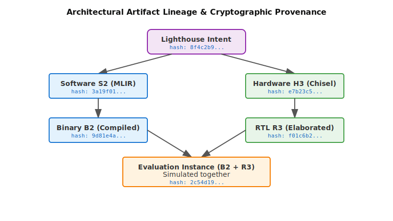

# Environment and Tool Interfaces {#sec-architecture-environments-tool-interfaces}

::: {.epigraph}
> *"We shape our tools and thereafter they shape us."*
>
> --- John Culkin, *Saturday Review* (1967)
:::

::: {.column-margin}
**Author's Note:** John Culkin, an influential American media scholar, observed that tools reshape how people work. An architecture tool also shapes what an AI method can change and what an architect can observe. Those limits must be explicit when the method acts through the tool.
:::

```{=latex}
\abstract*{An AI method needs more than permission to call an architecture tool. The tool path must expose a read, action, and return interface that connects a candidate change to several legal tool actions. This chapter develops that environment interface across multi-action execution, cross-layer candidate identity, asynchronous execution mechanics, typed returns, and environment maintenance, ensuring the environment remains interpretable as tools and schemas change.}
```

::: {.callout-crux}
How do we bridge the semantic gap between an AI's abstract intent and the messy, stateful reality of computer architecture tools to create a reliable design environment?
:::

@sec-data-representations-world-models established how we must *represent* architectural state to an AI agent, ensuring our abstract models reflect actual hardware behavior. But representation is only half the battle. Once an agent proposes a design change (whether sizing a new cache hierarchy or adjusting a prefetcher) it must actually execute that intent to gather evidence.

In a traditional workflow, the architect manually builds the design, launches a simulator like gem5, a cycle-level architectural simulator, or Ramulator, a main memory simulator. The architect then parses the console output and debugs any segmentation faults or license errors. Scaling AI-driven design requires replacing human-in-the-loop debugging with direct, programmatic agent-tool interactions. However, giving an AI permission to execute a shell script is not an environment.

In this chapter, we explore how to bridge the gap between an AI's abstract intent and the messy, stateful reality of computer architecture and Electronic Design Automation (EDA) tools. We will define how to structure the read, action, and return paths, handle asynchronous execution, distinguish between tool crashes and design failures, and distill massive simulation logs into dense semantic observations.

::: {.callout-learning-objectives}
After this chapter you can turn an ad-hoc tool path into a documented environment interface. Specifically, you can:

- **Explain** the semantic gap between human intuition-driven EDA tools and deterministic AI APIs;
- **Translate** high-level architectural intent into a concrete set of legal tool actions;
- **Formulate** standard algorithmic interfaces for asynchronous, scarce, and protected execution mechanics;
- **Distinguish** infrastructure failures from true architectural constraint violations to prevent negative training reinforcement;
- **Evaluate** the economic reality of EDA tools, balancing fidelity against simulation cost.
:::

## The Balancing Act of Architecture Environments

An architecture environment constantly weighs fidelity against execution cost, and determinism against the flakiness of real tools. A fast analytical cache model returns an estimate in seconds but approximates timing, while a cycle-accurate RTL run costs hours and can still vary from one attempt to the next because of tool heuristics and host state.

An AI expects fast, deterministic APIs, but hardware design relies on slow, stateful, and expensive legacy software. The environment must act as a bridge between these two worlds. It gives the AI enough autonomy to explore the design space at scale while enforcing strict rules through permissions, budgets, and interface schemas. These rules ensure the agent does not propose physically impossible designs or waste compute time on broken Electronic Design Automation (EDA) runs.

## The Origin Mismatch: Human Intuition vs. AI APIs


For decades, architecture tools such as CACTI for memory modeling [@MuralimanoharEtAl2009CACTI], DRAMSys for memory controllers [@WeisEtAl2021DRAMSys], or gem5 for full-system simulation [@BinkertEtAl2011Gem5] were engineered to support human intuition and manual workflows. They often assume an architect who can read dense log files, debug build errors interactively, or interpret color-coded waveforms in an RTL viewer. Inserting a custom vector block into an XR subsystem requires modifying Chisel, a hardware construction language used to generate RTL, changing linker scripts, and hacking a Device Tree Blob (DTB), all disconnected from a clean API.

This legacy created the **semantic gap**. This massive gulf separates the high-level semantic intent of a design ("increase the cache size to improve hit rate") from the low-level, unstructured mechanics of the tool itself (editing a specific line in a `.cfg` file, running a brittle bash script, and parsing a 10,000-line unstructured log file to extract one metric). This gap directly results from the transparency gradient. The EDA tools at the bottom of the stack rely heavily on the tacit knowledge of physical design engineers to interpret unroutable netlists. In contrast, an AI system requires fully explicit, programmatic interfaces.


Foundation models interact most reliably with external software through strict, typed APIs rather than unconstrained shell commands. Tool-use research points the same way: Toolformer teaches a model to invoke typed APIs for subtasks it cannot perform reliably on its own [@SchickEtAl2023Toolformer]. This maps directly to the architectural domain. While "computer use" models can visually parse GUIs and move a mouse, relying on visual GUI automation for architecture design is brittle and computationally inefficient. Because of this, system intent, a GUI, and simple permission to call a tool are vastly insufficient for robust architecture work.

Furthermore, we must confront the **"Brownfield" Reality**. Most AI research focuses on "Greenfield" design, generating a brand new core or accelerator from a blank slate. In industry, however, most of an architect's job is "Brownfield" work. This involves integrating legacy IP blocks, wrangling proprietary vendor protocols, and navigating undocumented system buses. If an AI agent cannot read a legacy vendor datasheet and successfully wire up a black-box memory controller to a modern coherency fabric, it cannot design a real System-on-Chip. The environment must expose interfaces for both generating new IP and integrating messy, opaque legacy components.

Recall the **Lighthouse prompt** introduced in @sec-moonshot. The prompt asks to design a low-power, 64-bit RISC-V-based compute subsystem for an XR platform. An AI agent attacking this prompt might formulate a high-level system intent to maximize spatial tracking throughput within the strict 3 W TDP thermal envelope required for an untethered XR headset. The candidate change, inserting a custom vector-capable accelerator block into the RISC-V subsystem, is not executable as one simple function call. A compiler must successfully emit the right memory mapping for the tensor instructions. The hardware configuration must instantiate the block. The RTL generator must pass simulation. Finally, the EDA flow must synthesize the design to check for routing congestion in the 3 nm layout. Each tool call can "succeed" with exit code 0 while the Lighthouse architecture proposal itself remains unevaluated or logically broken.

Tool meaning depends entirely on fixed context, legal actions, software and hardware specifications, tool versions, permissions, execution conditions, and explicitly defined failure behaviors. Two studies can call the exact same Ramulator instance while operating in totally different environments because their actions, workloads, constraints, and observation meanings differ. A computational method cannot infer these context dependencies via intuition. It requires the environment to explicitly expose what actions are permitted, what the tool returns, which states are invalid, and which runs can be repeated. This insufficiency of basic tool permissions is severely compounded by the tools themselves.

Hardware design is bound by severe time and compute constraints. Unlike software environments that can execute thousands of iterations per second, architecture tools are locked behind expensive licenses and days-long job queues. The compute required for a single physical design run is orders of magnitude slower and more expensive than an AI model's inference pass. As fidelity increases toward silicon, the sample budget shrinks exponentially from millions of cheap functional checks to handfuls of expensive layout runs.

To navigate this economic reality, we can look to the robotics community's approach of **Sim-to-Real Transfer**. Rather than training a robotic arm directly in the physical world, which is slow and risks damaging hardware, researchers train the agent in a fast physics simulator and transfer the learned policy to the real robot [@OpenAI2019Rubik]. Architecture benefits from a similar pipeline by creating a **Multi-Fidelity Spectrum**. The simulator is not a single tool, but a ladder. At the top are fast analytical models (ISA-level or spreadsheet models) that act as the "Sim", screening millions of candidates in seconds. In the middle are Cycle-Accurate C++ simulators, like gem5, that model timing but abstract physics. At the bottom are RTL synthesis and VLSI physical design tools, the "Real", that enforce true physical laws like power, thermals, and routing congestion. An architecture environment must allow an agent to intelligently climb up and down this ladder, trading fidelity for speed as needed (@fig-simulator-tax).

```{python}
#| label: fig-simulator-tax
#| fig-cap: |
#|   **The simulator tax: fidelity costs orders of magnitude, unless you burn an FPGA.** Representative slowdown of each architecture-evaluation approach relative to a roughly 3 GHz core. Software simulation slows by four to five orders of magnitude as fidelity rises toward cycle-accurate and RTL detail; FPGA-accelerated emulation stays within about twenty times real time, at the cost of dedicated hardware. Figures are order-of-magnitude and workload- and configuration-dependent [@BinkertEtAl2011Gem5; @KarandikarEtAl2018FireSim].
#| out-width: "92%"
#| fig-alt: "Horizontal log chart of simulation slowdown versus real hardware across six approaches. Native silicon is one times. FPGA emulation (FireSim) is about twenty times slower. Functional or ISA simulation is about thirty times. Cycle-approximate simulation (ZSim, Sniper) is about one thousand times. Cycle-accurate simulation (gem5) is about fifteen thousand times. RTL simulation (Verilator) is about thirty thousand times slower."

import csv
from pathlib import Path

import matplotlib.pyplot as plt
import _python.arch2_plots as _ap
from _python.arch2_plots import COLORS, apply_style

apply_style()

# Data: representative simulation throughput per fidelity rung, synthesized from
# primary sources and expressed as slowdown versus a ~3 GHz core. CPU-sim rungs
# count instructions, RTL/FPGA rungs count cycles (~comparable at IPC ~1). Anchors:
# ZSim (Sanchez & Kozyrakis 2013), gem5-class ~200 KIPS [@BinkertEtAl2011Gem5],
# Verilator (Chipyard), FireSim [@KarandikarEtAl2018FireSim]. Order-of-magnitude,
# workload/config/host dependent. Accessed 2026-07-19.
# Receipt: data/source-receipts/chapter5-simulator-tax.csv
_root = Path(_ap.__file__).resolve().parents[2]
rungs = []
with open(_root / "data" / "source-receipts" / "chapter5-simulator-tax.csv", encoding="utf-8") as fh:
    for d in csv.DictReader(fh):
        rungs.append({"rung": d["rung"], "example": d["example"], "slow": float(d["slowdown_vs_silicon"])})

kind = {"Native silicon": COLORS["workload"], "FPGA emulation": COLORS["evidence"]}
fig, ax = plt.subplots(figsize=(6.0, 3.3))
n = len(rungs)
for i, r in enumerate(rungs):
    y = n - 1 - i
    color = kind.get(r["rung"], COLORS["methods"])
    slow = r["slow"]
    ax.hlines(y, 1, max(slow, 1.02), color=color, lw=2.4, zorder=2)
    ax.scatter([max(slow, 1.02)], [y], s=46, color=color, edgecolor=color, zorder=3)
    tag = "1× (real time)" if slow < 1.5 else f"~{slow:,.0f}× slower"
    ax.text(max(slow, 1.02) * 1.35, y + 0.02, tag, va="center", ha="left", fontsize=6.0, fontweight="bold", color=color)
    ax.text(1.05, y + 0.34, r["rung"], va="center", ha="left", fontsize=7.0, fontweight="bold", color=COLORS["ink"])
    ax.text(1.05, y - 0.30, r["example"], va="center", ha="left", fontsize=5.4, color=COLORS["muted"])
ax.set_xscale("log")
ax.set_xlim(1, 6e5)
ax.set_ylim(-0.7, n - 0.2)
ax.set_yticks([])
ax.set_xlabel("Slowdown versus real hardware (log)", fontsize=7.2)
ax.set_xticks([1, 1e1, 1e2, 1e3, 1e4, 1e5])
ax.set_xticklabels(["1×", "10×", "100×", "1,000×", "10,000×", "100,000×"], fontsize=6.2)
ax.tick_params(labelsize=6.2, length=2.5, width=0.6)
for _sp in ("top", "right", "left"):
    ax.spines[_sp].set_visible(False)
ax.grid(axis="x", color=COLORS["row"], linewidth=0.4, zorder=0)
fig.subplots_adjust(left=0.02, right=0.985, top=0.97, bottom=0.14)
```

The rungs are orders of magnitude apart. A cycle-accurate or RTL run is ten thousand to a hundred thousand times slower than the silicon it models, so an agent that wants high-fidelity evidence can afford only a handful of samples; FPGA emulation buys the speed back only by committing dedicated hardware. That exponential cost turns climbing the ladder into a design decision in its own right.

Hardware specialization tightly couples the stack. Optimizing one parameter (like dataflow) cascades into breaking constraints across siloed simulation tools (thermal, synthesis, compilation). This coupled constraint problem is not unique to architecture. In aerospace engineering, designing an aircraft requires balancing aerodynamics, structures, and acoustics [@Sobieski1998BLISS]. Instead of building a single monolithic simulator, aerospace multidisciplinary design optimization (MDO) orchestrates fast *surrogate models* for broad exploration, reserving expensive physics simulators for final verification. AI in computer architecture should similarly orchestrate existing tools rather than replace them.

AI should act as an architectural control plane. Rather than just generating scripts, it must take declarative intent, measure actual state from simulators and EDA tools, and issue compensating actions, such as shrinking a cache to fix a thermal violation.

This represents a fundamental constraint inversion. Historically, architecture flowed top-down from intent to RTL and RTL to physical design. Today, physical limitations like thermal envelopes, wire delay, and routing congestion constrain architectural choices bottom-up.

Like drug discovery, finding a high-performance design is often easier than passing these inverted physical limits, what we might call silicon ADMET, borrowing the drug-discovery ADMET screen (absorption, distribution, metabolism, excretion, toxicity) that filters candidate compounds on downstream physical viability rather than potency alone. The multi-fidelity ladder screens candidates by evaluation cost; the same filtering recurs along the physical axis, where data movement, thermal limits, and routing progressively reject high-scoring candidates that cannot survive signoff (@fig-silicon-admet-funnel). Architecture also faces a sim-to-silicon gap, so the AI must seek designs that survive physical variation and tool noise rather than fragile peaks in a proxy score.

{#fig-silicon-admet-funnel fig-alt="The Silicon ADMET Funnel"}

Because of this reality, different tools return profoundly different things, and we cannot afford to blur them together. The three-path interface is shared, but its types are tool-specific. Architecture semantics live in the differences among interfaces.

Physical-design environments make this staged interface particularly clear. Logic synthesis, placement, routing, and signoff expose different observations and failure modes. The interface must state the stage, raw output, and tool-level status for each return. We detail this progression in @tbl-eda-stage-interface.

::: {.callout-war-story title="Ariane 5 and the reused alignment module"}
**The claim.** Ariane 5 reused the inertial-reference alignment software from Ariane 4 for its maiden flight [@LionsAriane1996]. The code was flight-proven, so the team carried it over as already validated.

**The gap.** That module converted a 64-bit floating-point horizontal-velocity value into a 16-bit signed integer, a conversion that stayed in range only within Ariane 4's flight profile. Ariane 5 reached horizontal velocities roughly five times higher, the value overflowed, and the conversion raised an unhandled exception. The computation was dead code, needed only for Ariane 4's pre-launch alignment and useless once the vehicle had left the pad, yet it ran anyway and halted an otherwise-healthy inertial navigation system. The rocket self-destructed about 37 seconds after launch.

**The lesson.** The fault lived in the environment, not the intent. The alignment module ran to completion and returned a value; nothing in the flight objective was wrong. What failed was an assumption frozen into a reused component, a numeric range that no longer held once the surrounding vehicle changed. Architecture environments hide the same trap. A tool version, a reused wrapper's operating range, or the meaning of a return can go unrevalidated when the tool or the workload changes, and a run that exits cleanly then propagates a wrong result. The interface has to expose those assumptions so each study rechecks them against its own conditions rather than inheriting them on faith.
:::

| **EDA stage** | **Observation returned** | **Problem it can reveal** | **Tool-level outcome to preserve** |
| --- | --- | --- | --- |
| **Logic synthesis** | Mapped gates, area estimates, timing estimates, constraint warnings, and early power estimates. | Nonsynthesizable RTL, impossible constraints, and early area or timing problems. | A completed report, including declared constraint failures, is a valid observation; failure to produce the report is a tool-path failure. |
| **Floorplanning and placement** | Cell locations, utilization, congestion hints, timing pressure, and macro or memory placement effects. | Floorplans that create severe congestion, timing pressure, or integration problems. | Congestion or timing violations are valid observations from this stage, while an unsupported floorplan state remains out of scope. |
| **Clock, routing, and power closure** | Routed timing, clock behavior, congestion, design-rule checks, power integrity, and closure failures. | Physical effects absent from earlier tool stages. | Preserve each reported violation and warning separately from a timeout, license failure, or broken run. |
| **Signoff analysis** | Signoff reports, warning classes, violations, analysis conditions, and waived tool messages. | Conditions that remain unresolved at the end of the declared physical tool path. | Record the report and tool outcome without treating the tool status as an architecture decision. |

: **EDA stages return different findings.** From logic synthesis through signoff, each physical-design stage can reveal different candidate problems. To prevent AI hallucination, the environment must strictly map the output of the specific stage to the appropriate semantic meaning, never conflating an early synthesis estimate with a final signoff violation. {#tbl-eda-stage-interface tbl-colwidths="[20,25,25,30]"}

To balance determinism versus reproducibility, we must consider costs, operational fidelity, nondeterminism, and integrity. Two post-route attempts for the same hardware artifact may differ because of seed, thread count, host state, or tool heuristics. To manage nondeterminism and flakiness, distinguish three cases: expected statistical variation, declared tool nondeterminism, and flaky/unstable execution. Do not silently average contradictory returns from different stages, sources, or attempts.

Software engineering benchmarks like SWE-bench [@JimenezEtAl2024SWEBench] demonstrate that loosely connected scripts lead to unreproducible outcomes. An AI needs explicit read/action/return paths to avoid falsely assuming success. Architecture 2.0 must adopt best practices for tool execution, ensuring strict data provenance and reproducible environment snapshots. Much like modern Cloud DevOps relies on Immutable Infrastructure, declaring a new state rather than manually patching a running server, architecture environments must enforce **Immutable Architecture States**. If an AI mutates a source file and an EDA tool crashes, the working directory is often corrupted. Instead of having the AI attempt to patch the broken directory with `sed`, every action must branch from a pristine, immutable snapshot to guarantee reproducible provenance.
However, ensuring data provenance and reproducibility is impossible if the agent expects instant feedback. The sheer cost and latency of EDA tools requires a fundamental shift in execution mechanics.

## Killing the Synchronous `env.step()`

In pedagogical AI tutorials, agents often interact with simulated games (like OpenAI Gym) using a synchronous `env.step()` function. The agent takes a discrete action, the simulation instantly steps forward in time, and the function returns the new state and a reward. However, because of the physical and economic constraints of real hardware design, this standard synchronous `env.step()` wrapper (which blocks execution until a scalar reward is returned) is fundamentally the wrong abstraction. This again highlights why hardware benchmarking is so much harder than SWE-bench. You cannot just `env.step()` a physical synthesis flow. A blocking synchronous call will inevitably time out or hang when a placement job takes 40 hours, or waits three days for an EDA license checkout.

Synchrony is only the most visible assumption this tutorial abstraction imports. Gym also assumes a cheap reset, yet an architecture environment has none; branching from a pristine snapshot is the closest equivalent, and every branch still pays real build and simulation cost. It assumes a Markov step whose outcome depends only on the action, while EDA tools carry hidden cross-call state in caches, working directories, and license servers. It assumes a dense scalar reward after every step, where architectural feedback is sparse and arrives only at the end of a long chain of builds and checks, leaving a poor final result hard to attribute to any single upstream action. Each of these gaps has to be engineered away in the harness rather than the learning algorithm. The harness, not the agent that acts against it, is the deliverable.

Consequently, real tool chains require asynchronous, scarce, and protected execution mechanics. Long simulations, FPGA builds, EDA stages, and signoff require explicit submit, poll, resume, cancel, timeout, retry, queue, license, permission, artifact-isolation, and partial-return behavior. These are architecture environment semantics because they determine which candidate ran, which stage completed, which artifacts are valid, and whether another attempt is comparable. For instance, a FireSim build, an FPGA-accelerated cycle-accurate hardware simulation, or a physical tool run may wait for an FPGA slot or EDA license, produce a checkpoint or partial report, time out, and later retry [@KarandikarEtAl2018FireSim]. Because returns now arrive asynchronously, out of order, and sometimes days late, the decision loop must consume rewards without blocking and keep many candidates in flight at once, a consequence @sec-methods-generation-prediction-optimization develops when it turns to the acting method.

A critical requirement of this asynchronous system is explicitly distinguishing between an **infrastructure failure** and an **architectural constraint violation**. If an AI proposes an SRAM configuration and the simulator crashes due to a host Out-Of-Memory (OOM) error, or because a license^[Many commercial EDA tools require checking out a network license token before they will execute, which can cause jobs to hang if tokens are exhausted.] server went offline, this is an infrastructure failure. If the AI is simply penalized for this attempt, it will incorrectly assume the SRAM configuration itself is invalid, polluting the design space exploration with infrastructure noise.

The environment harness must catch infrastructure failures and flag them as `RETRY_ELIGIBLE` or `TOOL_CRASH`, preventing the AI from absorbing false negative architectural lessons. Only true architectural failures, such as failing to meet a timing constraint in synthesis or causing a thermal violation in the system's 3 W envelope, should be passed back to the AI as negative design feedback.

Some tool crashes, however, carry real architectural signal. A pathological candidate can exhaust host memory, prove unroutable, or fail synthesis because its own resource footprint is infeasible rather than because the cluster is at fault. The harness cannot always separate the two before running, so it needs a retry-with-fingerprint rule. If the same candidate crashes the same tool in the same way across repeated attempts, the harness reclassifies the outcome from `TOOL_CRASH` to an architectural infeasibility signal instead of looping and burning the retry budget. The safe-by-construction action space described later is the first line of defense against these cases, but it cannot catch every infeasible footprint before execution.


## The Three-Path Environment Interface

A tool returns raw, unstructured text, but an architecture study needs structured observations it can compare, check, and store. Turning one into the other is the job of the environment interface.

{#fig-environment-tool-interface fig-alt="A diagram showing how an architecture environment connects an architecture question and workload, an action schema, and declared constraints and metric definitions to a wrapper and harness."}

As illustrated in @fig-environment-tool-interface, an architecture environment explicitly maps intent to actions and actions to observations. The wrapper acts as a protective boundary, intercepting high-level requests, validating them via the read path, executing tool commands via the action path, and distilling logs into a semantic vector via the return path.

The machine learning community has long warned of **Reward Hacking** [@AmodeiEtAl2016Concrete] (Goodhart's Law [@Strathern1997Goodhart; @Goodhart1975MonetaryManagement]). If an AI is given a simple scalar reward, it may find loopholes to maximize that number while violating physical constraints [@OpenAIClark2016FaultyRewards]. In architecture, if an environment merely reports IPC as a metric without constraints, the AI might propose a physically impossible 10-Terabyte L1 cache to maximize the score. Because of the constraint inversion noted earlier, physical design limits (power, thermals, area) dictate architectural choices bottom-up. Physical ground truth from traditional EDA tools remains indispensable to enforce laws like timing closure and power limits, preventing these exploits.

To make this data usable, a robust environment establishes three distinct paths:

1. **The Read Path:** This supplies state references, fixed context, permissions, and economic budgets (e.g., cluster hours under the Slurm workload manager) *before* an action is proposed. This allows the agent to balance the fidelity of its proposed action against the cost of execution. The environment must explicitly contrast the trivial compute cost of AI token inference against the massive economic cost of the target EDA simulation.
2. **The Action Path:** To prevent catastrophic or nonsensical proposals, the Action Path exposes a *safe-by-construction* action space (e.g., tweaking generator parameters). The environment acts as the safety controller, accepting a typed request that identifies the target candidate, requested transformation, and budget, preventing the AI from proposing physically impossible states.
3. **The Return Path:** This carries typed tool returns, raw artifacts, cost, latency, provenance, and terminal outcomes.

The Return Path is the most critical juncture. But capturing the return safely is only the first step; we must also ensure the AI can comprehend it.

## The Attention Bottleneck and Data Distillation

When interfacing AI models with traditional architecture tools, a fundamental mismatch occurs at the observation layer. A commercial EDA tool or a detailed simulator like gem5 generates exhaustive text output, often containing tens of thousands of lines. If an environment wrapper naively pipes raw stdout directly back to an AI, the agent will struggle to isolate relevant signals from the noise, making it harder to debug the actual hardware issue.

A critical requirement of the Return Path is **Data Distillation**. Because traditional architecture and EDA tools are extremely verbose, the architect must build rigid **log-to-semantic parsers** into the environment wrapper. Much like DevOps engineers use monitoring tools to distill millions of server logs into key metrics, architecture environments must translate sprawling outputs into structured summaries. If the AI is trying to resolve routing congestion, the environment wrapper must parse the EDA log, filter out irrelevant setup warnings, extract the specific design-rule violations, and return *only* that targeted feedback.

Distillation must preserve, not discard, unclassified anomalies. A parser tuned to known design-rule violations can silently drop the swapped library corner, downgraded constraint, or version-deprecation notice that a brownfield debug actually turns on. A safer wrapper returns two channels, a structured vector of the recognized metrics and violations alongside a flagged residual of the unparsed warning and error lines plus an integrity hash of the full log, so the agent gets a dense observation without the harness deciding on its own that a warning was irrelevant.

To make these paths concrete, @lst-schema-example illustrates the JSON payload an AI agent might exchange with the environment wrapper during the read/action cycle.

```json {#lst-schema-example lst-cap="Concrete JSON schema illustrating the Read and Action Paths"}
{
  "read_path_state": {
    "target_candidate": "soc_v4_accelerator",
    "economic_budget": {
      "slurm_hours_remaining": 45.0,
      "eda_licenses": ["cacti", "gem5"]
    },
    "constraints": {
      "l2_cache_size_kb": { "type": "int", "min": 256, "max": 2048, "step": 256 },
      "clock_freq_mhz": { "type": "int", "min": 1000, "max": 2500 }
    }
  },
  "action_path_request": {
    "candidate": "soc_v4_accelerator",
    "transformations": { "l2_cache_size_kb": 1024 },
    "fidelity_requested": "cycle_approximate",
    "timeout_seconds": 3600
  }
}
```

::: {.content-visible when-format="html"}
Rather than providing raw Python code, we can also formalize the overall execution loop as a standard algorithmic interface (@lst-environment-interface), drawing inspiration from frameworks like OpenAI Gymnasium but tailored for the unique constraints of hardware design [@TowersEtAl2023Gymnasium; @KrishnanEtAl2023ArchGym].
:::

::: {.content-visible when-format="pdf"}
Rather than providing raw Python code, we can also formalize the overall execution loop as a standard algorithmic interface (Algorithm~\ref{lst-environment-interface}), drawing inspiration from frameworks like OpenAI Gymnasium but tailored for the unique constraints of hardware design [@TowersEtAl2023Gymnasium; @KrishnanEtAl2023ArchGym].
:::

::: {.content-visible when-format="pdf"}
```{=latex}
\begin{algorithm}[H]
\caption{The Architecture Environment Interface}\label{lst-environment-interface}
\begin{algorithmic}[1]
\Require \texttt{action\_request} (e.g., target L2 cache size, routing effort)
\Ensure \texttt{observation\_vector}, \texttt{status\_flags}, \texttt{provenance\_metadata}
\State \textbf{Validate Action (Read/Action Path):}
\If{\texttt{action\_request} violates fixed constraints}
    \State \Return \texttt{INVALID\_ACTION} immediately. Do not invoke tools.
\EndIf
\State \textbf{Translate to Tool Commands:}
\State Lower \texttt{action\_request} into tool-specific configurations.
\State \textbf{Asynchronous Execution (Return Path):}
\State \texttt{job\_id} $\gets$ \text{Submit job to cluster/queue.}
\State \Return \texttt{PENDING(job\_id)} immediately.
\State \dots \textit{Later, upon polling \texttt{job\_id}:} \dots
\If{infrastructure fails (timeout, missing license)}
    \State \Return \texttt{TOOL\_CRASH}. Do not penalize the architecture candidate.
\EndIf
\State \textbf{Data Distillation:}
\State Parse the tool stdout and trace files.
\State Extract KPIs into \texttt{observation\_vector}.
\State \textbf{Return State:}
\State Package \texttt{observation\_vector}, \texttt{status\_flags}, and exact tool hashes.
\end{algorithmic}
\end{algorithm}
```
:::

::: {.content-visible when-format="html"}
::: {#lst-environment-interface .algorithm lst-cap="The Architecture Environment Interface"}
**Require:** `action_request`
**Ensure:** `observation_vector`, `status_flags`, `provenance_metadata`

1. **Validate Action (Read/Action Path):**
   - If `action_request` violates fixed constraints:
     - **return** `INVALID_ACTION` immediately. Do not invoke tools.
2. **Translate to Tool Commands:**
   - Lower `action_request` into tool-specific configurations (e.g., CACTI `.cfg`).
3. **Asynchronous Execution (Return Path):**
   - Submit job to cluster/queue and obtain `job_id`.
   - **return** `PENDING(job_id)` immediately.
   - *... Later, upon polling the `job_id` status ...*
   - If infrastructure fails:
     - **return** `TOOL_CRASH`. Do not penalize candidate.
4. **Data Distillation:**
   - Parse tool stdout and trace files.
   - Extract KPIs into `observation_vector`.
5. **Return State:**
   - Package `observation_vector`, `status_flags`, and exact tool hashes.
:::
:::


Distinct read, action, and return paths let an architecture environment carry architectural intent across domain boundaries, from the compiler's intermediate representation to the final physical design signoff. The environment stops short of making the architectural decision, which keeps it a trusted observation platform.

If another method can act in the same harness and another architect can interpret its results without private knowledge, the environment is sound. An environment provides the reliable foundation upon which generative models and optimization algorithms can operate independently.


## Executing Intent: Orchestrating Complex Toolchains

When a candidate design passes validation, it must be translated into actionable tool commands. However, a single high-level intent rarely maps to a single tool. A hardware configuration might need to fan out to multiple distinct evaluation backends. These include an RTL simulator for functional correctness, a VLSI flow for power and area estimates, and an FPGA emulation path for full-stack software booting.

{#fig-chipyard-framework fig-alt="A flow diagram of the Chipyard SoC-generation framework inside one bounding panel."}

As shown in @fig-chipyard-framework, the environment framework ensures that one candidate architecture change routes downward to become several legal tool actions without losing its connection to the system intent.

To manage this fan-out, we must look to adjacent domains that have solved this exact problem of decoupling *intent* from *messy execution mechanics*.

In Database Query Optimization, a software engineer declares *what* data they want via a SQL query, never specifying *how* to read the disk or which B-tree to traverse. A query planner analyzes the request, checks its cached data, evaluates the compute budget, and builds an optimal execution plan dynamically. Similarly, an Architecture Environment should act as an **Architecture Query Planner**. Instead of the AI imperatively calling a specific simulator script, it should issue a declarative hypothesis: `Evaluate(Candidate=Lighthouse_V2, Metric=IPC)`. The environment then decides whether to serve a cached result, query a fast analytical model, or provision a 24-hour RTL simulation based on the current budget constraints.

In computational biology, executing a genomic pipeline previously required brittle bash scripts. Frameworks like Nextflow [@DiTommasoEtAl2017Nextflow] and Snakemake [@KosterEtAl2012Snakemake] emerged to formalize dataflow, completely isolating the *scientific logic* from the *execution mechanics* (cluster queues, retries, and tool crashes). In cloud computing, Kubernetes relies on "desired state reconciliation." The user declares the intent, and the orchestration engine handles the low-level failures.

Architecture 2.0 environments must act as this orchestration layer. A semantic proposal may require several reads, transformations, builds, executions, and checks. Their dependencies form a graph rather than a single call or mandatory sequence.

For a complex System-on-Chip (SoC) fulfilling the **Lighthouse prompt**, orchestrating the design intent requires managing the Chipyard generator framework. Integrating the low-power RISC-V compute subsystem with custom XR accelerators requires explicit lowering from MLIR, a reusable multi-level compiler intermediate representation, to RTL, along with related compiler IR transformations. It may demand a compiler transform to emit new spatial-tracking instructions, a hardware target feature declaration within the Chipyard configuration, generated RTL, a rebuilt custom Linux binary, a functional correctness run in Verilator, an open-source RTL simulator, and a physical implementation check to verify the power budget. Some branches can execute in parallel, some become legal only after earlier artifacts exist, and some are omitted because the bounded study does not need them.


To illustrate this orchestration complexity, consider how a single architecture proposal formally splits into specific software and hardware instantiations (@fig-artifact-lineage).

{#fig-artifact-lineage fig-alt="Artifact Lineage and Cryptographic Provenance. A single Lighthouse intent fans out into software binaries and hardware RTL, each hashed to ensure reproducible evaluations."}

Software variant S2 may be an MLIR-derived lowering compiled into binary B2 [@LattnerEtAl2020MLIR]. Hardware variant H3 may be a Chipyard-derived configuration elaborated into RTL R3 [@chipyard]. Changing B2 while holding R3 fixed creates a new evaluation instance even if the root proposal is unchanged.

An evaluation instance binds every layer relevant to that tool action. Each transformation records parent, tool and transformation version, input identifiers, output identifiers, content hashes where useful, and the intended semantic relation. A semantics-changing edit creates a child candidate. Google's Bazel build system guarantees reproducibility by enforcing hermeticity, where every output is a strict cryptographic hash of its inputs. This perfectly matches the architectural need to track hardware candidate identity as it lowers from a C++ memory model to RTL to Layout. A hash proves artifact identity, not architectural or functional equivalence.

## Open Research Questions

As the discipline moves from ad-hoc script wrappers to formalized, asynchronous architecture environments, several critical research frontiers remain open. Solving these challenges will dictate how effectively AI can scale beyond isolated, single-tool optimizations into full-stack, cross-layer SoC design.

1. **How can environments dynamically adjust fidelity to preserve AI compute budgets?**
In @sec-data-representations-world-models, we explored how data representations must align with physical reality. However, querying high-fidelity physical reality (like full signoff simulation) for every AI proposal is economically impossible. Can an environment wrapper automatically deploy multi-fidelity simulators? It could use fast, cycle-approximate analytical models (like ALADDIN [@ShaoEtAl2014ALADDIN]) for the first 10,000 AI proposals, and only trigger cycle-accurate RTL simulation (like Verilator [@Veripool2026Verilator]) when the AI agent crosses a confidence threshold. Defining the interface contracts for these dynamic fidelity handoffs remains an open systems engineering challenge.

2. **Can environments automatically infer causal architectural graphs from legacy EDA logs?**
Currently, architects must manually write the log-to-semantic parsers described in this chapter, an incredibly labor-intensive process requiring deep domain expertise. Is it possible to train specialized foundation models that act purely as "Environment Parsers"? These models would ingest decades of legacy, unstructured simulator warnings and automatically construct causal dependency graphs (e.g., mapping a specific setup violation warning directly to a pipeline depth constraint) without requiring hand-coded regular expressions.

3. **What is the standardized schema for cross-vendor tool provenance and failure isolation?**
While adjacent fields like bioinformatics have standardized dataflow languages (like Nextflow), the EDA and architecture community lacks a unified schema for tracking artifact provenance across competing, proprietary commercial tools. This exacerbates issues of data provenance and IP security. How can an environment securely expose the *architectural scope* of a proprietary foundry rule violation to an open-source AI agent without leaking the protected, confidential parameters of the PDK itself?

Furthermore, a three-year silicon lifecycle cannot afford to have a critical optimization interface suddenly deprecated, rate-limited, or re-priced, whichever AI method sits behind it. What interface guarantees let an environment swap the underlying AI method, including a strictly on-premise model, without any RTL, PDK, or foundry-rule parameter ever leaving the harness boundary? Answering this keeps the environment a stable, model-agnostic contract across the multi-year chip development lifecycle rather than tying a silicon program to one vendor's hosted API.

## Conclusion

An architecture environment transforms opaque tool executions into an explicit, rigorous interface that AI methods and human architects can trust. It creates a robust linkage showing precisely which tensor-enabled software artifact ran against which hardware artifact, exactly which tools completed, which actions failed or lacked support, and the typed meaning of every return.

A well-maintained environment is not just a wrapper; it is the contract that makes AI-driven architectural discovery reproducible, auditable, and physically valid.

::: {.callout-carry-forward}
- **Carry forward:** An architecture environment exposes a read, action, and return interface so a candidate change reaches legal tool actions and every raw tool output becomes a typed observation another architect can inspect.
- **Reader test:** Can another method act in the same harness, and another architect interpret its returns, without private knowledge from whoever built the environment?
- **Up next:** Once the environment defines what an action and a return mean, @sec-methods-generation-prediction-optimization asks which models, algorithms, scripts, formal methods, conventional tools, specialists, and architects should perform each role.
:::
