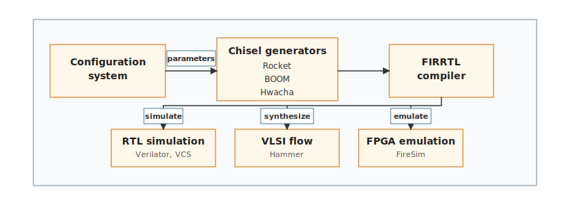

# Making Architecture Tools Usable by AI {#sec-architecture-environments-tool-interfaces}

::: {.epigraph}
> *"We shape our tools and thereafter they shape us."*
>
> --- John Culkin, *Saturday Review* (1967)
:::

::: {.column-margin}
**Author's Note:** John Culkin, an influential American media scholar, observed that tools reshape how people work. An architecture tool also shapes what an AI method can change and what an architect can observe. Those limits must be explicit when the method acts through the tool.
:::

```{=latex}
\abstract*{An AI method needs more than permission to call an architecture tool. The tool path must expose a read, action, and return interface that connects a candidate change to several legal tool actions. This chapter develops that environment interface across multi-action execution, cross-layer candidate identity, asynchronous execution mechanics, typed returns, and environment maintenance, ensuring the environment remains interpretable as tools and schemas change.}
```

::: {.callout-crux}
How do we bridge the semantic gap between an AI's abstract intent and the messy, stateful reality of computer architecture tools to create a reliable design environment?
:::

?@sec-data-representations-world-models established how we must *represent* architectural state to an AI agent, ensuring the mathematical world models align with physical reality. But representation is only half the battle. Once an agent formulates an intent---whether proposing a new cache hierarchy or adjusting a prefetcher---it must actually execute that intent to gather evidence.

In a traditional workflow, the architect manually builds the design, launches a simulator like gem5 or Ramulator, parses the console output, and debugs any segmentation faults or license errors. As we transition to Architecture 2.0, this manual intervention becomes a critical bottleneck. If we are to leverage the speed and scale of generative AI or reinforcement learning, the agents must interact with the tools directly. However, simply giving an AI permission to execute a shell script is not an environment.

In this chapter, we explore how to bridge the gap between an AI's abstract intent and the messy, stateful reality of computer architecture and Electronic Design Automation (EDA) tools. We will define how to structure the read, action, and return paths, handle asynchronous execution, distinguish between tool crashes and design failures, and distill massive simulation logs into dense semantic observations.

::: {.callout-learning-objectives}
After this chapter, you will be able to turn an ad-hoc tool path into a documented environment interface. You will learn to connect proposals to legal actions across simulators and EDA tools, bind artifacts, handle asynchronous mechanics, distill massive log outputs, and maintain the environment over time.
:::

## The Origin Mismatch: Human Intuition vs. AI APIs

The fundamental friction in AI-assisted hardware design stems from an origin mismatch. Decades of EDA and architecture tools (like CACTI, DRAMSys, or gem5) were painstakingly engineered for human intuition. They assume a human architect sitting at a workstation, interacting through Graphical User Interfaces (GUIs), interpreting color-coded waveforms, and entering commands into an interactive shell.

An autonomous AI, however, expects stateless, deterministic APIs. While recent advances in "computer use" models allow AI to visually parse GUIs and literally move a mouse to click buttons, relying on visual GUI automation for architecture design is incredibly brittle and computationally inefficient. A pixel-based interaction model cannot guarantee the mathematical rigor and reproducibility required to tape out a multi-million dollar SoC. Because of this, system intent, a GUI, and permission to call a tool are vastly insufficient for robust architecture work.

Consider the **XR Lighthouse** example introduced in ?@sec-moonshot. The high-level system intent is to maximize XRBench throughput within a strict 3 W TDP thermal envelope. The candidate change---inserting a specialized Tensor Core accelerator block---is not executable as one simple function call. A compiler must successfully emit the right memory mapping for the tensor instructions; the hardware configuration must instantiate the block; the RTL generator must pass simulation; and the EDA flow must synthesize it to check for routing congestion in the 3 nm layout. Each tool call can "succeed" (exit code 0) while the architecture proposal itself remains unevaluated or logically broken.

Tool meaning depends entirely on fixed context, legal actions, software and hardware specifications, tool versions, permissions, execution conditions, and explicitly defined failure behaviors. Two studies can call the exact same Ramulator instance while operating in totally different environments because their actions, workloads, constraints, and observation meanings differ. A computational method cannot infer these context dependencies via intuition; it requires the environment to explicitly expose what actions are permitted, what the tool returns, which states are invalid, and which runs can be repeated.

Because of the physical and economic constraints of real hardware design, the standard synchronous `env.step()` wrapper---which blocks execution until a scalar reward is returned---is fundamentally the wrong abstraction. A blocking synchronous call will inevitably time out or hang when a placement job takes 40 hours, or waits three days for an EDA license checkout. Instead, real tool chains require asynchronous, scarce, and protected execution mechanics. Long simulations, FPGA builds, EDA stages, and signoff require explicit submit, poll, resume, cancel, timeout, retry, queue, license, permission, artifact-isolation, and partial-return behavior. These are architecture environment semantics because they determine which candidate ran, which stage completed, which artifacts are valid, and whether another attempt is comparable. For instance, a FireSim build or physical tool run may wait for an FPGA slot or EDA license, produce a checkpoint or partial report, time out, and later retry [@KarandikarEtAl2018FireSim].

A critical requirement of this asynchronous system is explicitly distinguishing between an **infrastructure failure** and an **architectural constraint violation**. If an AI proposes an SRAM configuration and the simulator crashes due to an Out-Of-Memory (OOM) error on the host server, or because a FlexLM license server went offline, this is an infrastructure failure. If the AI is merely fed a scalar reward of `-1` for this attempt, the AI will incorrectly learn that the SRAM configuration is architecturally invalid. It will update its weights or policy to avoid that configuration, polluting the design space exploration with infrastructure noise. The environment harness must catch infrastructure failures and flag them as `RETRY_ELIGIBLE` or `TOOL_CRASH`, preventing the AI from absorbing false negative architectural lessons. Only true architectural failures---such as failing to meet a timing constraint in synthesis, or causing a thermal violation in the system's 3 W envelope---should be passed back to the AI as negative design feedback.

Hardware design is bound by a harsh economic reality. Architecture tools are locked behind expensive licenses, and a single high-fidelity simulation or physical design run may sit in a Slurm queue for days before executing. The compute required for a single physical design signoff can be *orders of magnitude* slower and more expensive than an AI model's inference pass. As fidelity increases toward silicon, the sample budget shrinks exponentially from millions of cheap functional checks to handfuls of expensive layout runs. Because of this reality, different tools return profoundly different things, and we cannot afford to blur them together. Physical-design environments make this staged interface particularly clear. Logic synthesis, placement, routing, and signoff expose different observations and failure modes. The interface must state the stage, raw output, and tool-level status for each return (@tbl-eda-stage-interface).

| **EDA stage** | **Observation returned** | **Problem it can reveal** | **Tool-level outcome to preserve** |
| --- | --- | --- | --- |
| **Logic synthesis** | Mapped gates, area estimates, timing estimates, constraint warnings, and early power estimates. | Nonsynthesizable RTL, impossible constraints, and early area or timing problems. | A completed report, including declared constraint failures, is a valid observation; failure to produce the report is a tool-path failure. |
| **Floorplanning and placement** | Cell locations, utilization, congestion hints, timing pressure, and macro or memory placement effects. | Floorplans that create severe congestion, timing pressure, or integration problems. | Congestion or timing violations are valid observations from this stage, while an unsupported floorplan state remains out of scope. |
| **Clock, routing, and power closure** | Routed timing, clock behavior, congestion, design-rule checks, power integrity, and closure failures. | Physical effects absent from earlier tool stages. | Preserve each reported violation and warning separately from a timeout, license failure, or broken run. |
| **Signoff analysis** | Signoff reports, warning classes, violations, analysis conditions, and waived tool messages. | Conditions that remain unresolved at the end of the declared physical tool path. | Record the report and tool outcome without treating the tool status as an architecture decision. |

: **EDA stages return different findings.** From logic synthesis through signoff, each physical-design stage can reveal different candidate problems. To prevent AI hallucination, the environment must strictly map the output of the specific stage to the appropriate semantic meaning, never conflating an early synthesis estimate with a final signoff violation. {#tbl-eda-stage-interface tbl-colwidths="[20,25,25,30]"}


## The Semantic Gap: From Unstructured Logs to Observations

When confronted with the massive semantic gap between an AI agent and legacy architecture tools, a critical philosophical question arises: do we throw all the traditional simulation and EDA data overboard and train AI models purely end-to-end?

The answer is a definitive *no*. We do not throw the traditional data overboard, because that data represents the unbreakable laws of physics---timing closure, thermal limits, memory bandwidth, and physical routing congestion. Without this data, an AI is just a stochastic hallucination engine. The physical ground truth provided by traditional tools remains indispensable.

What *must* change is the ***interface*** and the ***role of the data***. To make this data usable, a robust environment achieves translation by establishing three distinct paths that cross its boundary before, during, and after execution, as shown in @fig-environment-tool-interface.

```{python}
#| label: fig-environment-tool-interface
#| fig-cap: |
#|   **The Architecture Environment Interface.** An architecture environment connects a system intent to legal actions and translates raw tool outputs into semantic observations. The wrapper checks the request, calls the tool, and parses the result, while the harness records the run and its provenance.
#| out-width: "100%"
#| fig-alt: "A diagram showing how an architecture environment connects an architecture question and workload, an action schema, and declared constraints and metric definitions to a wrapper and harness. Four tool-path outcomes remain separate: invalid action before execution, valid observation returned including a declared constraint failure, execution or tool-path failure, and unsupported or out-of-scope observation."
#| echo: false

# To compile to PDF/HTML using quarto, we include the image via markdown or IPython.display.
# Here we just use a markdown image since it's a static svg.
```
{#fig-environment-tool-interface fig-alt="A diagram showing how an architecture environment connects an architecture question and workload, an action schema, and declared constraints and metric definitions to a wrapper and harness."}

1. **The Read Path:** This supplies the state references, fixed context, source pointers, permissions, resource availability, tool versions, and current job state needed *before* an action is proposed. For example, before an agent proposes a new L2 cache size, the read path provides the maximum die area budget and the legal step sizes for the SRAM arrays.
2. **The Action Path:** This accepts a typed request that identifies the target candidate, requested transformation, legal parameters, preconditions, and budget. It prevents the AI from proposing physically impossible states (like a 3.14MB cache) before wasting simulation time.
3. **The Return Path:** This carries typed tool returns, raw artifacts, cost, latency, declared operational fidelity, provenance, lifecycle state, terminal outcome, and return-content kind.

Rather than providing raw Python code, we formalize this interaction as a standard algorithmic interface (@lst-environment-interface), drawing inspiration from frameworks like OpenAI Gymnasium but tailored for the unique constraints of hardware design [@TowersEtAl2023Gymnasium; @KrishnanEtAl2023ArchGym].

```{#lst-environment-interface .pseudo lst-cap="The Architecture Environment Interface"}
Input: action_request (e.g., target L2 cache size, routing effort)
Output: observation_vector, status_flags, provenance_metadata

1. Validate Action (Read/Action Path):
   - Check if action_request violates fundamental fixed constraints.
   - If invalid: Return INVALID_ACTION immediately. Do not invoke tools.
2. Translate to Tool Commands:
   - Lower action_request into tool-specific configurations (e.g., CACTI .cfg files).
3. Asynchronous Execution (Return Path):
   - Submit job to cluster/queue.
   - Handle timeouts, missing FlexLM licenses, or cluster preemption.
   - If infrastructure fails: Return TOOL_CRASH. Do not penalize the candidate.
4. Data Distillation:
   - Parse the 10,000-line tool stdout and gigabyte trace files.
   - Extract KPIs into a dense observation_vector (e.g., [latency_ns, power_w]).
5. Return State:
   - Package observation_vector, status_flags (e.g., TIMING_MET), and tool hashes.
```

When interfacing Large Language Models (LLMs) with traditional architecture environments, a fundamental impedance mismatch occurs at the observation layer. A commercial EDA synthesis tool or a detailed cycle-accurate simulator like gem5 generates exhaustive text output---often tens of thousands of lines detailing every thread initialization, library load, and hierarchical setup path.

If an environment wrapper naively pipes this raw stdout directly back to an LLM as an observation, the agent suffers from an attention bottleneck. Even with modern models boasting million-token context windows, flooding the prompt with gigabytes of raw trace data leads to "lost in the middle" attention failures. The model becomes overwhelmed by irrelevant diagnostic noise, causing it to hallucinate causal relationships or completely miss the single critical line indicating a routing congestion failure. To solve this, the environment must take responsibility for semantic translation before the AI ever sees the data.

A critical requirement of the Return Path is **Data Distillation**. Traditional architecture and EDA tools are excessively verbose. If we pipe these raw logs directly into the context window of a Large Language Model, the model will suffer from "lost in the middle" attention failures, drowning in the textual noise and hallucinating fixes based on spurious correlations. Instead, the architect must build rigid log-to-semantic parsers into the environment wrapper. Much like DevOps engineers use monitoring tools to distill millions of server logs into a single red or green dashboard light, architecture environments must translate sprawling, human-targeted outputs into a single, unified mathematical observation vector. If the AI is trying to solve routing congestion for the XR Lighthouse subsystem, the environment wrapper must parse the EDA log, ignore the 9,900 irrelevant setup warnings, extract the 10 specific design-rule violations (DRCs), format them into a structured JSON or tensor representation, and return *only* that dense semantic observation to the AI.

By demanding distinct read, action, and return paths, the environment guarantees that architectural intent survives across domain boundaries---from the compiler's intermediate representation to the final physical design signoff. It deliberately stops short of making the final architectural decision, preserving its objectivity as a trusted observation platform. If another method can act in the same harness and another architect can interpret its results without private knowledge, the environment is sound. An environment provides the reliable foundation upon which generative models and optimization algorithms can operate independently.


## Executing Intent: Cloud and Bioinformatics Analogies

How does one candidate architecture change become several legal tool actions without losing its connection to the system intent? We must look to adjacent domains that have solved this exact problem of decoupling *intent* from *messy execution mechanics*.

In computational biology, executing a genomic pipeline previously required brittle bash scripts. Frameworks like Nextflow and Snakemake emerged to formalize dataflow, completely isolating the *scientific logic* from the *execution mechanics* (cluster queues, retries, and tool crashes). In cloud computing, Kubernetes relies on "desired state reconciliation"---the user declares the intent, and the orchestration engine handles the low-level failures.

Architecture 2.0 environments must act as this orchestration layer. A semantic proposal may require several reads, transformations, builds, executions, and checks. Their dependencies form a graph rather than a single call or mandatory sequence.

For the **XR Lighthouse** subsystem, adding a new Tensor Core accelerator unit requires explicit MLIR-to-RTL lowering and compiler IR transformations. It may demand a compiler transform to emit new instructions, a hardware target feature declaration, a hardware configuration change, generated RTL, a rebuilt binary, a correctness run, a simulator run, and one implementation check. Some branches can execute in parallel, some become legal only after earlier artifacts exist, and some are omitted because the bounded study does not need them.

Software variant S2 may be an MLIR-derived lowering compiled into binary B2 [@LattnerEtAl2020MLIR]. Hardware variant H3 may be a Chipyard-derived configuration elaborated into RTL R3 [@chipyard]. Changing B2 while holding R3 fixed creates a new evaluation instance even if the root proposal is unchanged.

An evaluation instance binds every layer relevant to that tool action. Each transformation records parent, tool and transformation version, input identifiers, output identifiers, content hashes where useful, and the intended semantic relation. A semantics-changing edit creates a child candidate. Google's Bazel build system guarantees reproducibility by enforcing hermeticity---every output is a strict cryptographic hash of its inputs. This perfectly matches the architectural need to track hardware candidate identity as it lowers from a C++ memory model to RTL to Layout. A hash proves artifact identity, not architectural or functional equivalence.

Integrated frameworks, such as Chipyard (@fig-chipyard-framework), demonstrate how a single configuration system can feed multiple evaluation paths systematically.

{#fig-chipyard-framework fig-alt="A flow diagram of the Chipyard SoC-generation framework inside one bounding panel. A configuration system on the left passes parameters to a Chisel generators box listing Rocket, BOOM, and Hwacha, which feeds a FIRRTL compiler on the right. From the compiler, a fan-out routes downward to three backend boxes: RTL simulation with Verilator and VCS, a VLSI flow with Hammer, and FPGA emulation with FireSim."}

By leveraging these structured abstractions, an AI system can propose high-level architectural intent while the environment orchestration layer handles the complex, multi-stage execution reality required by modern Electronic Design Automation.

As the discipline moves from ad-hoc script wrappers to formalized, asynchronous architecture environments, solving these challenges will dictate how effectively AI can scale beyond isolated, single-tool optimizations into full-stack, cross-layer SoC design. An architecture environment transforms opaque tool executions into an explicit, rigorous interface that AI methods and human architects can trust. It creates a robust linkage showing precisely which tensor-enabled software artifact ran against which hardware artifact, exactly which tools completed, which actions failed or lacked support, and the typed meaning of every return.
