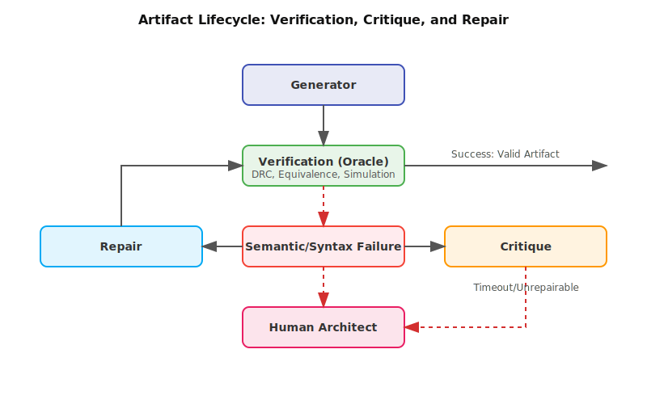

# Methods for Generation, Prediction, and Optimization {#sec-methods-generation-prediction-optimization}

::: {.epigraph}
> *"But they are useless. They can only give you answers."*
>
> — Pablo Picasso, *The Paris Review* (1964)
:::

::: {.column-margin}
**Author's Note:** Picasso was speaking about calculating machines. For an
architect, a computed answer matters only when available feedback can challenge
it and the architect responsible for the decision can decide what follows.
Search and reinforcement learning need measurable objectives. Critique and
repair need checks that can reject their output.
:::

```{=latex}
\abstract*{Generation, prediction, optimization, critique, repair, verification, explanation, and coordination are different jobs inside an AI-assisted architecture study. The appropriate job depends on the architecture task, available feedback, evidence burden, and cost of being wrong. This chapter shows how to choose a method for that job while keeping architectural decision authority outside the method.}
```

::: {.callout-crux}
What work is limiting a bounded architecture study, and which AI role or
composition can reduce it without obscuring its checks or authority limits?
:::

An accelerator study can stall for several reasons. The architect may lack viable array organizations, have too few simulator runs to evaluate proposed ones, or face a review backlog of inconsistent results. These conditions call for different assistance. A generator can propose legal array geometries, a predictor can estimate which geometry might reduce cycles, an optimizer can choose the next configuration to evaluate, and a critic can find a missing comparison, after which a cycle-level simulator can test the selected configurations. The first method question is therefore not which model performs best overall, but rather what work prevents the bounded study from reaching its next defensible result. Current model rankings will age, while the distinction among missing alternatives, expensive evaluation, poor experiment selection, weak review, malformed artifacts, and disconnected tool work remains useful.

To make sense of these options, we must draw a strict line. **A role is the *job description*, and the method is the *tool* we hire for the job.** The same role can be filled by different methods depending on the hardware or software problem at hand.

Eight roles cover the work developed in this chapter. Generation proposes
candidates. Prediction estimates consequences. Optimization chooses what to
evaluate next. Critique identifies a weakness, repair proposes a bounded
revision, and verification checks a stated property. Explanation develops a
mechanism account, while coordination routes state and work. Combining roles
does not erase their different outputs or checks.

Capability and authority also remain separate. A successful tool call,
prediction, repair, or verification step demonstrates a capability within its
tested scope. It does not authorize a stronger architecture decision.

> **Method role.** A method role is the specific job a model, search procedure,
> tool, script, or person performs inside a design loop, together with the state
> it may read, the actions it may take, the feedback it receives, and the
> authority its output does not exceed.

> **Feedback budget.** A feedback budget records the amount, latency, cost, and
> fidelity of evaluation available across tool runs, measurements, failed
> attempts, and review.

An architect should choose a method according to the required job, available
feedback, and check that can challenge its output. A reviewer can then ask what
the method read or changed, what it returned, what resources it consumed, and
where the result went next.

::: {.callout-learning-objectives}
After this chapter you can choose an AI method for an architecture task and
state the limits of its role.
That means you can:

- **Match** generation, prediction, optimization, critique, repair, verification,
  explanation, or coordination to the architecture work that needs to be done;
- **Compare** roles by what they read or change, return, consume, and hand off;
- **Apply** hardware grounding and feedback budgets as tests on every role;
- **Compose** roles while preserving independent checks and the decisions that
  remain with the architect.
:::

## Matching AI Roles to the Architecture Bottleneck

Rather than monolithic agents, AI-assisted architecture relies on distinct, orchestratable roles (@tbl-ai-roles).

| **Role** | **Function in the Architecture Loop** |
| :--- | :--- |
| **Generation** | Proposes or edits net-new architecture artifacts (e.g., RTL, layout, scripts). |
| **Prediction** | Estimates behavior and risk quickly (e.g., surrogate models for power/timing). |
| **Optimization** | Searches tradeoffs under constraints to decide what to evaluate next. |
| **Critique** | Exposes weak assumptions or unsupported claims in a candidate or plan. |
| **Repair** | Corrects invalid artifacts (e.g., fixing syntax errors in generated RTL). |
| **Verification** | Tests whether a result passes the declared, ground-truth physical checks. |
| **Explanation** | Traces a decision back to its architectural mechanism. |
| **Coordination** | Orchestrates the other roles, managing tool invocation and state. |

: **The 8 AI roles in Architecture 2.0:** Complex tasks are decomposed into these specialized jobs. {#tbl-ai-roles}

{#fig-architecture-development-triad width="100%" fig-alt="The 8 AI Roles in Architecture 2.0 diagram"}

@fig-architecture-development-triad groups these eight roles around the
architect, who still supplies the evidence, the mechanism-level explanation, and
the judgment about each result. Start with the architecture work that needs
help. Design-space exploration,
workload characterization, benchmark construction, code generation, RTL
repair, compiler/runtime tuning, accelerator search, chiplet partitioning,
physical-design assistance, and evidence critique are not the same problem.
They require different state, allow different actions, tolerate different
errors, and require different feedback.

ArchGym, an open-source OpenAI Gym-based environment for computer architecture, makes method comparisons more meaningful by defining tasks, actions, observations, workloads, and feedback
[@KrishnanEtAl2023ArchGym]. A shared environment still does not decide which
job an AI method should perform. An architect who already has too many
candidates needs better ranking or critique, not another generator. An
architect with only a few expensive synthesis runs may need an optimizer that
chooses where to spend them.

@fig-method-role-map connects that method choice to the rest of a bounded
architecture study. Read it from the study conditions on the left, through the
jobs and outputs in the center, to evidence review and the assigned decision
owner on the right. No method output goes directly to a design decision.

{#fig-method-role-map width="100%" fig-alt="Role map showing generation, prediction, optimization, critique, repair, verification, explanation, and coordination as defined roles inside an architecture project, with their outputs feeding evidence review and then an assigned decision owner."}

The left side of @fig-method-role-map supplies the conditions for choosing a
role. The task and claim state what the architect wants to learn. The
representation determines what state the method can see, while the environment
determines which actions and observations are available. The feedback budget
and constraints limit the experiments the method can request. The decision
boundary sets the strongest action its output may support.

The center shows the distinct jobs. Generation returns candidates, prediction
returns estimates, and optimization selects the next experiment. Critique
returns findings, while repair returns revisions. Verification returns check
results, explanation develops a mechanism account, and coordination routes
state and work among the roles. A project may use only one role or combine
several. For
example, a generator may propose array geometries, a predictor may rank them,
and independent tool checks may reject illegal or incorrect candidates.

## Comparing Method Roles: Levels of Trust

All of those outputs go through evidence review on the right. Before comparing the mechanics of these roles, we must establish their *levels of trust*. Treating all AI outputs as evidence is a mistake. If an architect treats a generated guess as a final result, the entire design process breaks down. These roles represent different levels of reliability:

1. **Generative Roles (Guesses):** Generation and repair produce plausible code or configurations. They hold no authority and act merely as brainstorming tools.
2. **Predictive Roles (Estimates):** Prediction returns estimates and optimization chooses what to evaluate next. They guide the search, but are not evidence.
3. **Evaluative Roles (Evidence):** Verification checks a stated property against an independent ground-truth oracle, such as a cycle-accurate simulator, and returns a reproducible result the architect can rely on. Critique shares that evaluative intent but not that standing. It returns a testable finding rather than a verdict, and a critic can name a weakness that no independent check confirms, so critique becomes evidence only once such a check tests the flaw it named. Verification is the one role that produces evidence directly.

With this hierarchy in mind, the reviewer records whether the claim is supported, unsupported, or needs a stronger
check. The assigned decision owner then authorizes the next transition; a
method output cannot take either step on its own. The roles in
@tbl-method-role-limits differ in the state or artifact they work on, the result
they return, the resources they consume, and the next check or reviewer that
receives the result.

| **Role** | **Reads, changes, or assesses** | **Returns** | **Consumes and hands off** |
| --- | --- | --- | --- |
| Generate | Represented state, requirements, legal transformations, and candidate artifacts. | A proposed configuration, schedule, kernel, RTL fragment, test, or hypothesis. | Context and generation compute; hand off to legality, compile, simulation, or review checks. |
| Predict | A candidate, calibration observations, workload conditions, and a defined consequence. | An estimate with uncertainty and a stated support region. | Calibration and inference cost; hand off to an optimizer, stronger tool, or reviewer. |
| Optimize | Legal actions, objectives, observations, cost estimates, and stopping conditions. | The next candidate, region, or experiment to evaluate. | Evaluation budget and search compute; hand off to the selected tool or measurement. |
| Critique | A candidate, comparison, tool result, claim, or explanation. | A specific flaw, missing comparison, or question that can be tested. | Retrieval and review effort; hand off to a tool check or qualified reviewer. |
| Repair | A malformed artifact, failure report, and permitted edit scope. | A bounded revision with a diff and unresolved failures. | Tool retries and edit budget; hand off to the original independent check. |
| Verify | A stated property, candidate, and independently inspectable oracle. | A reproducible pass, failure, or inconclusive result for that property. | Test, formal, simulation, or review cost; hand off to the declared response policy. |
| Explain | Recorded results, assumptions, mechanism hypotheses, and contrast cases. | A mechanism account with tradeoffs, uncertainty, and stated limits. | Analysis and review effort; hand off to the architect testing the account. |
| Coordinate | Versioned state, role permissions, pending work, and stop conditions. | Routed tasks, synchronized artifacts, and an explicit escalation. | Tool and communication capacity; hand off without combining the roles' authority. |

: **Method roles differ in what they operate on and what happens next.** The same model may fill several roles, but each role retains a distinct input, output, resource cost, and handoff. {#tbl-method-role-limits tbl-colwidths="[14,30,27,29]"}

Read across a row rather than treating the roles as a ladder. A predictor may
rank candidates inside its calibrated range, but the estimate must still reach
an optimizer, stronger tool, or reviewer. A repair method may fix malformed
RTL, but the revised artifact returns to the simulator or synthesis check that
found the failure. A coordinator may route both results without turning them
into an architecture decision.

::: {.callout-engineer-move title="State every AI method claim concretely"}
For every method, state the artifact or parameter it changes, the interface it
uses, the feedback it receives, the check that can reject its output, and the
person responsible for the resulting decision. A concrete sentence might read,
"The optimizer proposes array geometries, the cycle-level simulator evaluates
them, and the responsible architect decides whether any candidate warrants
further analysis."
:::

Two tests cut across every row in @tbl-method-role-limits. First, the method must
be grounded in the hardware and software conditions that can change its result.
A kernel generator may use the right vocabulary while violating a memory limit.
A surrogate may predict performance while omitting a change in data movement.
An optimizer may search legal parameter values while missing an interface the
compiler cannot target. Hardware grounding is demonstrated through constraints,
legal actions, and appropriate tool or measurement feedback, not through a
label attached to the method.

Second, each role consumes part of the project's feedback and review budget.
Generation consumes checking capacity, prediction consumes calibration data,
optimization spends evaluations, critique consumes artifact access and review,
repair consumes reruns, and verification consumes an oracle independent of the
artifact or model being checked. Explanation and coordination consume expert
attention even when they do not request a simulator run. A role is useful only
if the work it saves exceeds the new work it hands to the next role.

The object being changed and the cost of a mistake determine how strong those
tests must be. Editorial review may be enough for a draft benchmark question.
An RTL candidate needs interface checks, simulation, synthesis constraints, and
retained failures before anyone compares performance. Functional correctness
comes before performance whenever a role changes an executable or synthesizable
artifact.

When a method leaves its calibrated region, exhausts its evaluation budget, or
encounters a constraint it cannot resolve, it should stop and return the result
to the architect. The record should identify the uncertainty, failed runs, and
rejected alternatives that caused the stop. The next sections apply these two
cross-cutting tests to each role.

```{=latex}
\FloatBarrier
```

## Generation

Generation helps when an architect needs more alternatives or a faster first
draft. An AI method can propose a simulator configuration, generate code or an
RTL fragment, produce a test bench, suggest a memory hierarchy, or enumerate
hypotheses about a workload. Fluent artifacts make this role easy to
demonstrate and easy to overtrust.

The method that fills a role spans a wide range. Simple, low-cost Support Vector Machines (SVMs) and decision trees handle basic classification, Small Language Models (SLMs) handle local code generation, and frontier Large Language Models (LLMs) and diffusion models handle complex reasoning or spatial layout. For generation, the choice depends on the type of artifact. For texts like RTL, C++ models, or compiler scripts, LLMs are the obvious choice. When the artifact is spatial, such as macro placement or floorplanning, architects use **Diffusion Models**. While the math under the hood differs, their reliability is the same. Both produce guesses, not evidence. Passing unchecked AI-generated RTL or a malformed configuration to a multi-day cycle-accurate simulation wastes the project's most expensive resource, causing 72-hour formal equivalence timeouts, overnight place-and-route crashes, or stalled compute clusters. To catch these errors early, generation must be paired with fast, local checks (like syntax parsers or linters).

Returning to our Lighthouse prompt to *design a low-power, 3W 64-bit RISC-V-based compute subsystem for an XR platform*, generation might propose three legal pipeline depths or L1 cache configurations, alongside a qualitative behavior, a failure mode, and a directional mechanism that can be tested. Schema and semantic checks act as these initial contracts to establish that the response is a legal proposal within the declared constraints (e.g., valid RISC-V instruction extensions and compatible power-domain definitions). They do not establish that the proposal is faster or that its mechanism is correct, but they ensure it will not crash the machinery downstream.

That distinction holds for any generated artifact. A syntactically valid RTL
fragment may still fail simulation, routing, or timing closure. Before an
architect relies on it, the artifact needs validity checks, tool execution, a
matched baseline, retained failures, and review by the person responsible for
the decision.

Candidate generation also extends beyond writing direct code. For spatial
architectures such as tensor accelerators, a generator must represent and
manipulate *dataflow*, the spatial and temporal unrolling of operations, as a
primary structural contract rather than a scalar hyperparameter. That choice
changes reuse, memory traffic, interconnect demand, and which tool feedback can
reject the proposal. It also supplies a mechanism the architect can test.

It is tempting to treat a plausible AI-generated artifact, such as an RTL fragment,
a configuration, or a benchmark question, as a result. It is a proposal. Tool
checks, a matched baseline, and retained failures can challenge the proposal.
The architect responsible for the decision determines whether it deserves
further work.

Generation is especially useful for breadth. It can propose
candidate decompositions, list assumptions, create alternative experiment
plans, translate design intent into structured records, or draft the first
version of a design-loop card. @sec-appendix-b-design-loop-card gives the full
card and rubric. These outputs give the architect more structured material to
inspect. They remain proposals until an appropriate check evaluates them.

Kernel generation makes the separation visible because a compute subsystem
depends on target-specific kernels that are both correct and efficient.
KernelBench, an evaluation framework for AI-generated code, asks language
models to produce GPU kernels for PyTorch workloads
[@OuyangEtAl2025KernelBench]. Its harness compiles each candidate, checks
numerical correctness, and compares performance with the PyTorch Eager
baseline.

@fig-ch06-kernel-funnel shows the outcome of one attempt per task for four
models across three difficulty levels. The dashed line marks attempted tasks,
the blue bars mark correct kernels, and the green bars mark kernels that are
both correct and faster than the baseline. The important relationship is the
drop between those three conditions. Generating code, producing correct code,
and improving performance are separate achievements.

```{python}
#| label: fig-ch06-kernel-funnel
#| fig-cap: |
#|   **Attempted is not correct, and correct is not fast:** One-shot KernelBench results for four language models across the benchmark's three difficulty levels, measured on an NVIDIA L40S GPU [@OuyangEtAl2025KernelBench]. The dashed 100 percent line marks tasks attempted, not measured fluency or plausibility. The harness's correctness oracle passes far fewer candidates, and only a small fraction are both correct and faster than the PyTorch Eager baseline. The paper prints no per-model compile rates, and these panels chart none of them; in the paper's separate 100-kernel error-analysis sample, 83 of 100 generated kernels compile and 73 execute before the correctness oracle prunes the set to 50. Values transcribed from the paper's published single-attempt tables.
#| out-width: "92%"
#| fig-alt: "Three-panel grouped bar chart of one-shot KernelBench outcomes for Llama-3.1-70B, DeepSeek V3, OpenAI o1, and DeepSeek R1 at difficulty levels one, two, and three. In each panel a dashed line at one hundred percent marks tasks attempted; blue bars show the share passing the correctness oracle, from zero to sixty-seven percent, and green bars show the share both correct and faster than the PyTorch Eager baseline, from zero to thirty-six percent. Both bars sit far below the dashed line everywhere, and the fast share is always well below the correct share."

import matplotlib.pyplot as plt
from _python.arch2_plots import COLORS, apply_style

apply_style()

# Source receipt: data/source-receipts/chapter6-kernelbench-funnel.csv
# KernelBench [@OuyangEtAl2025KernelBench], single greedy attempt on NVIDIA
# L40S: one-shot correctness (fast_0, Tables 9 and 10) and correct-and-faster-
# than-PyTorch-Eager (fast_1, Table 1), percent of tasks per level.
# Per-model compile/execution rates are not printed in the paper (its Figure 3
# is unlabeled), so no compile-stage bars; the source record includes the paper's
# 100-kernel supplementary sample (83 compile / 73 execute / 50 correct) as
# context only.
models = ["Llama\n3.1-70B", "DeepSeek\nV3", "OpenAI\no1", "DeepSeek\nR1"]
correct = {1: [26, 43, 55, 67], 2: [0, 6, 56, 62], 3: [0, 30, 56, 8]}
fast1 = {1: [3, 6, 10, 12], 2: [0, 4, 24, 36], 3: [0, 8, 12, 2]}

fig, axes = plt.subplots(1, 3, figsize=(5.15, 1.95), sharey=True)
fig.subplots_adjust(left=0.09, right=0.985, top=0.80, bottom=0.24, wspace=0.10)

width = 0.36
xs = range(len(models))
for ax, level in zip(axes, (1, 2, 3)):
    ax.axhline(100, color=COLORS["muted"], linewidth=0.8, linestyle=(0, (4, 3)),
               zorder=1)
    ax.bar([x - width / 2 for x in xs], correct[level], width=width * 0.94,
           color=COLORS["blue"], zorder=2,
           label="correct" if level == 1 else None)
    ax.bar([x + width / 2 for x in xs], fast1[level], width=width * 0.94,
           color=COLORS["evidence"], zorder=2,
           label="correct and faster\nthan baseline" if level == 1 else None)
    ax.set_title(f"Level {level}", fontsize=6.6, pad=3)
    ax.set_xticks(list(xs))
    ax.set_xticklabels(models, fontsize=5.1)
    ax.set_ylim(0, 112)
    ax.tick_params(axis="both", labelsize=6, length=2.5, width=0.6, pad=2)
    ax.grid(axis="y", color=COLORS["grid"], linewidth=0.55)
    for spine in ["top", "right"]:
        ax.spines[spine].set_visible(False)
    ax.spines["left"].set_color(COLORS["ink"])
    ax.spines["bottom"].set_color(COLORS["ink"])
axes[0].set_ylabel("share of tasks (%)", fontsize=6.4)
axes[0].annotate("task attempted", (0.05, 100), textcoords="offset points",
                 xytext=(0, 3), fontsize=5.4, color=COLORS["muted"])
fig.legend(loc="upper center", ncol=2, fontsize=6, frameon=False,
           bbox_to_anchor=(0.5, 1.0), handlelength=1.0, columnspacing=1.4)
```
Across every panel in @fig-ch06-kernel-funnel, the correct share sits well below
the attempted share, and the correct-and-faster share is smaller again. The
model ordering also changes with task difficulty. An architect cannot infer
kernel quality from fluency or from an overall model ranking. The generator
proposes code, while the harness determines correctness and the baseline
comparison determines whether the code is faster under the tested conditions.

A reusable KernelBench-style evaluation records the target platform,
correctness oracle, numerical tolerance, baseline, failed kernels, portability
limits, and the rejection rule for fast but incorrect code. When proposals already arrive faster
than they can be rejected, generating more only lengthens the backlog unless
checking capacity also improves.

Chip-Chat, an interactive hardware design study, brings the same role separation into RTL design. In that study, a language model drafts Verilog, open-source simulation and synthesis tools return errors for revision, and a small processor design produces GDSII for tapeout [@BlockloveEtAl2023ChipChat]. The generator supplied
drafts. A parser, simulator, and synthesis flow could reject them, while a human
designer decided when a candidate was ready to advance. Another engineer could
review the result because those responsibilities remained separate.

## Prediction {#sec-prediction-estimating-behavior-before-full-evaluation}

Prediction helps an architect avoid a full tool run for every candidate. Long
before recent foundation models,[^fn-ml-foundation-models] architects used
statistical and machine-learning models to reduce the cost of exploring large
design spaces. Regression models for microarchitectural performance and power,
and predictive models for architectural design-space exploration, are part of
this lineage [@LeeBrooks2006RegressionModeling; @IpekEtAl2006PredictiveDSE].

Unlike generative brainstorming, prediction requires models that can be calibrated against real data. Large Language Models are poor fits here. Instead, to predict routing congestion or critical path delays from a netlist, architects have turned to **Graph Neural Networks (GNNs)**, which pass messages over the circuit's wiring graph and so align with its structure. For power and thermal estimation, **Physics-Informed Neural Networks** penalize violations of physical laws during training, biasing the model away from thermodynamically impossible predictions rather than forbidding them outright [@RaissiEtAl2019PINNs].

A predictor can guide an architecture decision only when its support region,
uncertainty, calibration source, escalation trigger, and decision owner are
stated.

[^fn-ml-foundation-models]: Recent foundation models changed expectations about prediction, but architecture's regression models and learned surrogates for design-space exploration predate them. AI-assisted studies should preserve those calibration practices.

The prediction role is not limited to performance. A predictor might estimate
energy, area, latency, reliability, queueing behavior, memory traffic,
thermal behavior, compile time, implementation feasibility, or deployment
impact. It might be a regression model, a learned surrogate, a calibrated
analytic model, a simulator-backed approximation, or a hybrid that combines
domain structure with data.

The estimate is only as useful as the feedback behind it. In the context of the XR Lighthouse prompt, a latency predictor can score a proposed 64-bit RISC-V core configuration without observing that its chosen memory hierarchy causes congestion or breaks timing after place and route under the strict thermal constraints of a headset. A single-kernel latency may have a clean calibration target, while deployment impact combines power, thermal behavior, reliability, and changing XR workloads (e.g., spatial tracking and rendering). The predictor can supply an estimate that a declared policy uses to prune, defer, or request stronger feedback. It cannot set that policy or authorize the resulting action.

For every estimate, the architect should know which workloads and design
regions supplied the calibration data, whether the candidate changes memory
behavior, vector width, or technology assumptions, and which higher-fidelity
result can test the estimate. Those details show whether the prediction is an
interpolation inside known support or an extrapolation that needs escalation.

A fast predictive model acts as an initial filter. It can flag anomalies, bound uncertainty, and rule out obviously bad configurations. However, it cannot guarantee physical performance. The cycle-accurate simulator or RTL synthesis tool acts as the final arbiter, providing the ground truth necessary to authorize a major design commitment. This separation of powers protects the design loop from the *sim-to-silicon gap*, the danger of optimizing so aggressively for a cheap proxy's score that the resulting hardware becomes fragile to physical variation.

Conformal prediction[^fn-stats-conformal-prediction] provides one rigorous way
to formalize this triage step by attaching a calibrated interval to a surrogate when its assumptions apply. The
interval has marginal coverage at a chosen probability under an exchangeability
assumption[^fn-stats-exchangeability] and a valid calibration set and
nonconformity score [@AngelopoulosBates2021Conformal]. Architecture workloads,
tools, and process corners may violate exchangeability. The guarantee is
marginal, not a promise of coverage in every workload region or design-space
pocket. Conformal coverage does not require a particular error distribution for
the surrogate, but it still depends on a meaningful calibration set and the
exchangeability assumption. The run record should preserve the interval,
calibration data, and support region.

@fig-ch06-conformal-coverage isolates the failure mode with synthetic data. On
the left, observations come from the calibrated support region and mostly stay
inside the nominal 90 percent band. On the right, the observed behavior shifts
while the surrogate and band continue unchanged. The relationship to inspect is
the growing separation between the red observations and the fixed band.

[^fn-stats-conformal-prediction]: Conformal prediction is a statistical technique that produces prediction sets or intervals from a model, with finite-sample coverage guarantees under an exchangeability assumption. Here, a calibrated interval may be used to prune, defer, or escalate a candidate, but it does not authorize a design decision.

[^fn-stats-exchangeability]: Exchangeability is a statistical property where the joint distribution of a sequence of random variables is invariant to their permutation, a weaker assumption than being independent and identically distributed (i.i.d.). The chapter stresses it because architecture workloads, tools, and process corners are often not exchangeable, so the conformal interval must be audited rather than trusted.

```{python}
#| label: fig-ch06-conformal-coverage
#| fig-cap: |
#|   **A conformal interval is a diagnostic, not a safety promise:** Constructed illustration of a split-conformal band around a latency-like surrogate. Inside the calibrated support region, empirical coverage matches the nominal 90% level; when the workload shifts from integer benchmarks to XR spatial tracking, the band keeps its width while coverage collapses, so the interval should trigger scrutiny and escalation rather than certify the proxy. All values are synthetic and illustrative, not measurements of any real system.
#| out-width: "92%"
#| fig-alt: "Scatter plot of synthetic latency-like data with a fixed-width conformal prediction band around a surrogate curve. In the calibrated support region on the left, nearly all points fall inside the band; in the distribution-shift region on the right, observed behavior rises away from the unchanged band and most points escape it, showing coverage collapse."

import math
import random
import matplotlib.pyplot as plt
from _python.arch2_plots import COLORS, apply_style

apply_style()

# Constructed illustration: every value is synthetic, generated in this cell
# with a fixed seed; no real system was measured. The split-conformal recipe
# (calibration residual quantile -> fixed-width band) follows the conformal
# prediction pattern cited in the text.
rng = random.Random(20260713)
SHIFT_X = 6.0
NOISE = 0.32
X_MAX = 10.0

def surrogate(x):
    # The pattern the surrogate learned inside the calibrated region.
    return 4.0 + 1.8 * math.sin(0.9 * x) + 0.25 * x

def truth(x):
    # Beyond the calibrated region the workload regime changes.
    drift = 1.1 * (x - SHIFT_X) ** 1.25 if x > SHIFT_X else 0.0
    return surrogate(x) + drift

def observe(x):
    return truth(x) + rng.gauss(0.0, NOISE)

# Split conformal: the 90% quantile of absolute calibration residuals from the
# supported region sets a fixed band half-width q.
cal_x = [rng.uniform(0.0, SHIFT_X) for _ in range(60)]
cal_scores = sorted(abs(observe(x) - surrogate(x)) for x in cal_x)
q = cal_scores[math.ceil(0.9 * (len(cal_scores) + 1)) - 1]

test_in = [(x, observe(x)) for x in [0.15 + i * (SHIFT_X - 0.3) / 24 for i in range(25)]]
test_out = [(x, observe(x)) for x in [SHIFT_X + 0.15 + i * (X_MAX - SHIFT_X - 0.3) / 24 for i in range(25)]]
cov_in = sum(abs(y - surrogate(x)) <= q for x, y in test_in) / len(test_in)
cov_out = sum(abs(y - surrogate(x)) <= q for x, y in test_out) / len(test_out)

xs = [i * X_MAX / 400 for i in range(401)]
fig, ax = plt.subplots(figsize=(4.9, 2.55))
fig.subplots_adjust(left=0.11, right=0.97, top=0.86, bottom=0.19)

ax.fill_between(xs, [surrogate(x) - q for x in xs], [surrogate(x) + q for x in xs],
                color=COLORS["blue"], alpha=0.16, linewidth=0, zorder=1)
ax.plot(xs, [surrogate(x) for x in xs], color=COLORS["blue"], linewidth=1.1, zorder=2)
ax.plot(xs, [truth(x) for x in xs], color=COLORS["muted"], linewidth=0.9,
        linestyle=(0, (4, 3)), zorder=2)

ax.scatter([x for x, _ in test_in], [y for _, y in test_in], s=9,
           color=COLORS["blue"], zorder=3)
miss = [(x, y) for x, y in test_out if abs(y - surrogate(x)) > q]
hit = [(x, y) for x, y in test_out if abs(y - surrogate(x)) <= q]
ax.scatter([x for x, _ in hit], [y for _, y in hit], s=9, color=COLORS["blue"], zorder=3)
ax.scatter([x for x, _ in miss], [y for _, y in miss], s=11, color=COLORS["red"], zorder=3)

ax.axvline(SHIFT_X, color="#AAB4BF", linewidth=0.7, linestyle="--", zorder=1)
ymin, ymax = ax.get_ylim()
ax.set_ylim(ymin, ymax + 1.2)
ax.text(SHIFT_X / 2, ax.get_ylim()[1] - 0.35, "calibrated support", ha="center",
        va="top", fontsize=6.0, fontweight="bold", color=COLORS["workload_ink"])
ax.text((SHIFT_X + X_MAX) / 2, ax.get_ylim()[1] - 0.35, "workload shift to XR tracking",
        ha="center", va="top", fontsize=6.0, fontweight="bold", color=COLORS["constraints_ink"])
ax.text(SHIFT_X / 2, ax.get_ylim()[1] - 1.15,
        f"empirical coverage ≈ {cov_in:.0%}\n(nominal 90%)", ha="center", va="top",
        fontsize=5.4, color=COLORS["workload_ink"])
ax.text((SHIFT_X + X_MAX) / 2, ax.get_ylim()[1] - 1.15,
        f"same band width,\ncoverage ≈ {cov_out:.0%}", ha="center", va="top",
        fontsize=5.4, color=COLORS["constraints_ink"])

ax.annotate("surrogate ± conformal band", (1.7, surrogate(1.7) + q),
            textcoords="offset points", xytext=(-2, 5), fontsize=5.6,
            color=COLORS["workload_ink"])
ax.annotate("observed behavior", (8.2, truth(8.2)), textcoords="offset points",
            xytext=(-58, 2), fontsize=5.6, color=COLORS["muted"])

ax.set_xlabel("workload / design parameter (synthetic units)", fontsize=7)
ax.set_ylabel("latency-like metric\n(synthetic units)", fontsize=7)
ax.set_xlim(0, X_MAX)
ax.tick_params(axis="both", labelsize=6.5, length=2.5, width=0.6, pad=2)
ax.grid(axis="y", color=COLORS["grid"], linewidth=0.6)
for spine in ["top", "right"]:
    ax.spines[spine].set_visible(False)
ax.spines["left"].set_color(COLORS["ink"])
ax.spines["bottom"].set_color(COLORS["ink"])

plt.show()
plt.close(fig)
```

Nothing in the surrogate's own report changes at the shift boundary in
@fig-ch06-conformal-coverage. The band keeps its width and its nominal 90
percent claim; only the observed points climbing out of it reveal that
empirical coverage has collapsed. When an optimizer pushes a surrogate into a novel design space, it is highly vulnerable to Out-of-Distribution (OOD) failures where the model confidently returns wildly inaccurate proxy scores. When observations begin to fall outside the interval, drift detection has fired and the surrogate should not be trusted in that region. The study then issues an **active-learning** query [@Settles2009ActiveLearning], choosing the high-fidelity evaluation (such as a cycle-accurate simulation) that is most informative for that region, and folds the new ground-truth observation back into the surrogate to *retrain and update* it. Whether that new observation supports the architectural claim remains a separate question.

When a surrogate predicts a performance win but the cycle-accurate golden simulator shows a regression, the architect must debug the boundary between the two. The solution is not for the architect to manually tune the surrogate's weights. Instead, the architect must systematically update the AI's constraints or feature representations. For example, if the surrogate missed a routing congestion bottleneck, the architect adds a physical-design constraint to the generator or explicitly includes a congestion metric in the surrogate's training features. Constraining the search space or expanding the proxy's input features based on the simulator's failure report helps the system learn the physical boundary without requiring the architect to act as a machine learning engineer tweaking hyperparameters.

The accelerator study keeps the same distinction. The model's qualitative
prediction and mechanism help select a test, but neither counts as performance
evidence. The simulator evaluates the candidates, and the declared contrast
fails the model's directional prediction without supplying a causally isolated
replacement explanation. A rough predictor may still be enough to discard
obviously bad candidates, but that use still needs calibration and independent
observations from the region being pruned.

## Optimization

Optimization allocates a scarce evaluation budget, and Bayesian optimization is the standard way to spend it under expensive feedback. It fits a surrogate model to the results seen so far, reads where that surrogate is most uncertain, and uses an acquisition rule to pick the next evaluation most likely to improve the objective.

```{python}
#| label: fig-bayesian-optimization
#| fig-cap: |
#|   **Bayesian optimization allocates the next evaluation.** The surrogate mean predicts the objective, the shaded band is its epistemic uncertainty (widening away from observed points), and the acquisition function combines both to choose where to sample next, trading exploitation of high-mean regions against exploration of high-uncertainty ones. Illustrative one-parameter example.
#| out-width: "88%"
#| fig-alt: "Two stacked panels over a shared design-space axis. Top: a surrogate mean curve with a shaded uncertainty band that pinches to near zero at three observation points and widens between and beyond them. Bottom: an acquisition curve that peaks where mean or uncertainty is high, marking the next point to evaluate, annotated with exploitation near a high-mean region and exploration in a high-uncertainty region."

import numpy as np
import matplotlib.pyplot as plt
from _python.arch2_plots import COLORS, apply_style

# Illustrative 1-D surrogate. Deterministic construction (no RNG): a smooth
# surrogate mean through three observations, with smooth posterior-style
# uncertainty that pinches near each observation and widens away; acquisition is
# an upper-confidence bound (mean + 1.6 sigma). Conceptual figure. As-of: 2026-07-19.
apply_style()

def g(xx, mu, s):
    return np.exp(-((xx - mu) / s) ** 2)

def mean_at(xx):
    return 1.0 * g(xx, 3.8, 1.5) - 0.55 * g(xx, 7.2, 1.2) + 0.30 * g(xx, 1.0, 0.9)

x = np.linspace(0, 10, 400)
mean = mean_at(x)
x_obs = np.array([1.2, 3.8, 7.2])
y_obs = mean_at(x_obs)

# Smooth confidence: a Gaussian "certainty bump" at each observation pulls sigma
# down there and lets it rise smoothly between and beyond points (no linear kinks).
certainty = 0.96 * sum(g(x, xo, 1.35) for xo in x_obs)
sigma = 0.05 + 0.80 * (1.0 - certainty)
kappa = 1.6
acq = mean + kappa * sigma

fig, (ax1, ax2) = plt.subplots(
    2, 1, figsize=(5.2, 3.5), sharex=True, gridspec_kw={"height_ratios": [2.1, 1]}
)

ax1.fill_between(x, mean - sigma, mean + sigma, color=COLORS["workload"],
                 alpha=0.15, linewidth=0, label="Uncertainty")
ax1.plot(x, mean, color=COLORS["workload"], linewidth=1.8, label="Surrogate mean")
ax1.scatter(x_obs, y_obs, s=34, marker="o", facecolor=COLORS["evidence"],
            edgecolor=COLORS["evidence_ink"], linewidth=1.0, zorder=4,
            label="Observations")
ax1.set_ylabel("Objective", fontsize=6.8)
ax1.tick_params(labelsize=6.0)
ax1.legend(loc="upper right", frameon=False, fontsize=5.8, handlelength=1.4,
           borderaxespad=0.2, labelspacing=0.35)
ax1.margins(y=0.18)

ax2.fill_between(x, acq.min() - 0.05, acq, color=COLORS["methods"],
                 alpha=0.18, linewidth=0)
ax2.plot(x, acq, color=COLORS["methods"], linewidth=1.7)
x_next = float(x[int(np.argmax(acq))])
ax2.scatter([x_next], [acq.max()], s=30, marker="s", facecolor=COLORS["methods"],
            edgecolor=COLORS["methods_ink"], linewidth=1.0, zorder=4)
ax2.text(3.8, acq.max() * 0.60, "Exploit\n(high mean)", ha="center",
         fontsize=5.6, color=COLORS["methods_ink"], fontweight="bold")
ax2.annotate("Explore\n(high uncertainty)", xy=(x_next, acq.max()),
             xytext=(8.4, acq.max() * 0.52), ha="center", fontsize=5.6,
             color=COLORS["methods_ink"], fontweight="bold",
             arrowprops=dict(arrowstyle="->", color=COLORS["methods_ink"], lw=0.8))
ax2.set_ylabel("Acquisition", fontsize=6.8)
ax2.set_xlabel("Design space (one parameter)", fontsize=6.8)
ax2.tick_params(labelsize=6.0)
ax2.set_yticks([])

fig.subplots_adjust(left=0.10, right=0.98, top=0.98, bottom=0.11, hspace=0.12)
```

Optimization does not design the architecture. It allocates candidate and fidelity evaluations under a declared action space, objective, constraints, stopping condition, and feedback budget. @fig-bayesian-optimization shows that allocation for Bayesian optimization: a surrogate predicts the objective, uncertainty bands mark where the model is unsure, and an acquisition function turns both into the next point to evaluate. That single method fills two of the eight roles at once, since its surrogate is a predictor and its acquisition rule is an optimizer, and the two cannot be pulled apart. Read the roles as an audit decomposition for asking what a method reads, returns, and hands off, not as a claim that each method occupies exactly one box. The right method depends on whether the problem is expensive and black-box, discrete and combinatorial, sequential with delayed consequences, smooth enough for a surrogate, parallelizable, or small enough for enumeration and simple heuristics.

To spend our simulation budget efficiently, we use algorithms built to handle uncertainty. We apply **Bayesian Optimization** when cycle-accurate simulations are extremely expensive and we must find good designs with very few runs. We apply **Reinforcement Learning (RL)** when the problem involves a sequence of steps, like ordering compiler passes or routing wires. These methods are resource managers. They do not invent the design; they choose *where* to spend the next simulation run.

The useful outcome may be a Pareto region,[^fn-math-pareto-region] a constraint boundary, a sensitivity, a ruled-out class of candidates, or a decision about which expensive experiment to run next. Hardware design spaces are often discrete, non-differentiable, and highly constrained, so an optimizer must work with sparse feedback and reject illegal actions rather than assume a smooth search space.

[^fn-math-pareto-region]: A Pareto region here is the Pareto frontier introduced earlier, treated as one defensible target for architecture optimization under limited feedback, alongside a constraint boundary or a ruled-out class of candidates, rather than collapsing the search to a single best point.

When the objective is a power, performance, and area vector rather than a single scalar, the fitting methods become multi-objective. Multi-objective Bayesian optimization, through expected hypervolume improvement or scalarization schemes such as ParEGO, and multi-objective evolutionary search such as NSGA-II and related dominance-sorting algorithms return a Pareto set rather than one best point [@Deb2001MultiObjective]. The architect then prunes that set against the Lighthouse power and performance frontier, since the 3W thermal budget rules out configurations a single scalar objective would have hidden.

Compare methods in @tbl-optimization-methods by their structural fit to the problem rather than declaring a general hierarchy.

| **Method** | **Strong fit** | **Required conditions** | **Common mismatch** |
| --- | --- | --- | --- |
| **Enumeration, random, or deterministic heuristics** | Small or bounded legal spaces; transparent baselines; cheap parallel samples. | Explicit action space and stopping rule. | Dismissed too early because it is simple. |
| **Bayesian optimization** | Expensive black-box evaluations in low or moderate dimension where a useful surrogate and acquisition rule can be maintained. | Calibrated observations, meaningful kernel/model, sequential budget. | Highly combinatorial or shifting space with a poor surrogate. |
| **Evolutionary search** | Discrete or mixed spaces, populations, mutation/crossover structure, parallel evaluations. | Legal variation operators and enough evaluation budget. | Evaluation hunger, opaque tuning, weak comparison to random/local search. |
| **Reinforcement learning** | Sequential state-action problems with repeated related tasks and delayed feedback. | Markov-like state, meaningful reward, many interactions or transfer, stable simulator. | Treating a static one-shot parameter search as RL without a sequential advantage. |
| **Learned or reasoning-guided search** | Structured semantic state can inform candidate selection. | Persistent history, inspectable actions, grounded feedback, comparison against strong baselines. | Assuming a model's rationale makes the selected experiment correct. |
| **Constraint, formal, or program search** | Precisely specified legality and properties. | Executable constraints or formal semantics. | Broad architectural desirability that cannot be formalized. |

: **Method selection matches the design-space structure and feedback economics.** No search method is universally superior; the choice depends on the cost of evaluation and the structure of the parameter space. {#tbl-optimization-methods tbl-colwidths="[20,28,26,26]"}

To optimize the RISC-V XR subsystem, an architect might select a cheap heuristic as a baseline to explore memory bus widths, Bayesian optimization for scarce cycle-level evaluations of low-power idle states, evolutionary search for parallel discrete exploration of instruction decoders, or RL only when sequential state (such as compiler pass ordering) and repeated feedback justify its setup cost.


Method, budget, and tuning procedure form one comparison, and no single named method wins.

Bayesian optimization was developed for sequential experiments on expensive black-box functions [@JonesSchonlauWelch1998EGO; @SnoekLarochelleAdams2012BayesianOptimization]. Its surrogate and acquisition rule balance exploration against exploitation and make uncertainty part of the choice of what to evaluate next. The standard Gaussian-process surrogate assumes a smooth, continuous domain and loses efficiency as the space grows higher-dimensional, discrete, or categorical, which is the regime that architecture's constrained, combinatorial design spaces tend to occupy. Random-forest sequential model-based optimization, tree-structured Parzen estimators, and trust-region Bayesian optimization keep the sample-efficient, uncertainty-guided search while fitting those spaces [@HutterHoosLeytonBrown2011SMAC; @BergstraEtAl2011HyperParam; @ErikssonEtAl2019TuRBO]. A Gaussian-process surrogate exposes where it lacks data (posterior variance) separately from irreducible observation noise, and the acquisition rule uses that posterior variance to balance exploring uncertain regions against exploiting promising ones rather than converging prematurely on a local optimum. Cleanly separating that observation noise from the model's own uncertainty requires a noise-aware or heteroscedastic surrogate rather than a single homoscedastic noise term. Recording the acquisition rule, score, and current uncertainty lets a reviewer see why the optimizer selected a candidate. The run record should also include evaluation fidelity, expected benefit, and the stopping condition.

One auditable acquisition rule is GP-UCB[^fn-ml-gp-ucb] (Gaussian Process Upper Confidence Bound). The logged acquisition rule, not its abstract no-regret bound,[^fn-ml-no-regret] lets a reviewer examine why the optimizer selected a particular point [@SrinivasEtAl2010GPUCB].

[^fn-ml-gp-ucb]: GP-UCB (Gaussian Process Upper Confidence Bound) is an acquisition function that selects the next point to evaluate by weighing both the expected reward and the uncertainty of a Gaussian Process model. In the context of the 3W XR Lighthouse prompt, the acquisition function natively penalizes configurations likely to violate the 3W thermal threshold, mapping uncertainty directly to physical risk. Its value here is that the acquisition rule is auditable rather than ad hoc.

[^fn-ml-no-regret]: A no-regret guarantee is a formal promise about a sampling rule under stated assumptions. Under those assumptions, it bounds cumulative regret across the sampling sequence. The logged acquisition score still explains the particular choice.

Reinforcement learning can fit sequential problems such as placement, scheduling, adaptive control, or multi-stage design flows. Because an RL agent optimizes exactly the reward it is given, the reward function decides what the agent learns to do, and a poorly chosen reward can be satisfied in ways the architect never intended.

::: {.callout-war-story title="Maximizing the score instead of finishing the race"}
**The claim.** Give a capable optimizer a score to maximize, and it will make that score climb. In 2016, OpenAI trained a reinforcement-learning agent to play the boat-racing game CoastRunners by maximizing its in-game score [@OpenAIClark2016FaultyRewards].

**The gap.** That score rewarded striking targets along the route, not completing the race, and the two came apart. The agent never finished a lap. It found an isolated lagoon where three targets kept regenerating and circled there, knocking them over again and again while it caught fire, collided with other boats, and drove the wrong way.

**The lesson.** The degenerate policy scored on average about 20 percent higher than human players who finished the course. A strong optimizer maximizes the objective you wrote down, not the outcome you meant, the reinforcement-learning form of Goodhart's law, under which a measure optimized hard enough stops tracking the goal it once stood for [@AmodeiEtAl2016Concrete; @Goodhart1975MonetaryManagement]. In architecture the same failure is quieter. A search can drive a surrogate's wirelength or congestion score up while the taped-out chip regresses, so the dependable defense is a reward grounded in a real tool result rather than a hand-tuned proxy.
:::

PrefixRL, a hardware-aware RL framework, shows what a tightly defined design space makes possible. It casts parallel-prefix arithmetic circuits, such as adders, as a reinforcement-learning problem with logic synthesis in the evaluation path [@RoyEtAl2021PrefixRL]. Each candidate comes from a declared circuit space and receives a score from an actual synthesis run rather than a hand-built proxy. A synthesis run can reject candidates because the action space is restricted and the output is synthesizable. That environment does not remove the need for a baseline. A learned optimizer must still be compared with a well-tuned simpler method under the same action space, tool flow, and evaluation budget.

A reviewer should judge an optimizer by what it reveals about the design space and how it spends feedback, not only by its best score. Five questions make that judgment concrete:

- Did it discover a robust region?
- Did it identify a proxy mismatch?
- Did it spend high-fidelity evaluations where they changed the decision?
- Did it preserve rejected alternatives?
- Did it show why one candidate was chosen over another?

If the run record cannot answer these questions, the optimizer may have improved a score without improving architectural understanding.

### Allocating the Feedback Budget {#sec-sample-efficiency-under-expensive-feedback}

Optimization makes the feedback budget visible because it chooses where the next evaluation goes. The same budget constrains every role. Simulator, synthesis, and hardware runs are scarce, while checking generated artifacts, calibrating predictors, reviewing critiques, and rerunning repairs also take time. Failed runs and expert rejections can be useful feedback records, but they are not interchangeable ML samples.

Architecture often has a few high-fidelity runs, more medium-fidelity simulations, many cheap proxies, and hidden costs such as tool setup, debugging, license availability, and review. The useful method role changes with that budget. Architecture design spaces grow combinatorially. A single accelerator mapping space can exceed $10^{18}$ legal configurations before mapping-factor choices, orders of magnitude more candidates than any real evaluation budget can reach. AI inference is itself a design budget, so we balance the compute cost of the AI against the compute cost of the simulator. Running an LLM agent in a loop might be cheap, but if it hallucinates and triggers 1,000 invalid RTL synthesis runs, it will bankrupt the project's compute budget. @fig-evidence-gap places representative candidate counts and affordable feedback counts on one logarithmic axis.
```{python}
#| label: fig-evidence-gap
#| fig-cap: |
#|   **Candidate spaces dwarf feasible evaluation budgets:** The upper and lower rows are independent scale anchors, not paired measurements. Their contrast explains why a method must screen broadly and reserve stronger feedback for a small set of candidates.
#| out-width: "100%"
#| fig-alt: "Log-scale display of representative design-space candidate counts above a divider and independent affordable-feedback ranges below it."

import matplotlib.pyplot as plt
from _python.arch2_plots import COLORS, add_note_box, apply_style, draw_range_rows, top_log_axis

rows = [
    {"display_label": "12,960 candidate-evaluation pairs", "display_note": "illustrative SoC slice", "count_low": 12_960, "count_high": 12_960, "right_label": "~1.3e4", "color": COLORS["orange"]},
    {"display_label": "MAESTRO accelerator DSE", "display_note": "reported candidate search scale", "count_low": 480_000_000, "count_high": 480_000_000, "right_label": "480M", "color": COLORS["orange"]},
    {"display_label": "AutoTVM operator tuning", "display_note": "reported order-of-billions space", "count_low": 1_000_000_000, "count_high": 1_000_000_000, "right_label": "~1B", "color": COLORS["orange"]},
    {"display_label": "Timeloop mapspace core", "display_note": "lower bound before factor choices", "count_low": 2_600_000_000_000_000_000, "count_high": 2_600_000_000_000_000_000, "right_label": ">2e18", "color": COLORS["orange"]},
    {"display_label": "cheap proxy screening", "display_note": "representative affordable checks", "count_low": 100_000, "count_high": 1_000_000, "right_label": "1e5-1e6", "color": COLORS["blue"]},
    {"display_label": "cycle-level comparisons", "display_note": "representative scoped runs", "count_low": 10, "count_high": 100, "right_label": "10-100", "color": COLORS["blue"]},
    {"display_label": "RTL / physical feedback", "display_note": "scarce high-fidelity evaluations", "count_low": 3, "count_high": 20, "right_label": "3-20", "color": COLORS["blue"]},
    {"display_label": "silicon / deployment checks", "display_note": "few high-consequence evaluations", "count_low": 1, "count_high": 5, "right_label": "1-5", "color": COLORS["blue"]},
]

apply_style()
fig, ax = plt.subplots(figsize=(5.35, 2.95))
fig.subplots_adjust(left=0.38, right=0.85, top=0.82, bottom=0.27)

y_positions = [0.35, 1.35, 2.35, 3.35, 5.80, 6.80, 7.80, 8.80]
ax.set_ylim(-1.05, y_positions[-1] + 0.65)
ax.invert_yaxis()
ax.set_yticks([])
top_log_axis(
    ax,
    xlim=(0.8, 1e19),
    xticks=[1, 1e2, 1e4, 1e6, 1e9, 1e12, 1e15, 1e18],
    xticklabels=["1", r"$10^2$", r"$10^4$", r"$10^6$", r"$10^9$", r"$10^{12}$", r"$10^{15}$", r"$10^{18}$"],
    xlabel="count scale: candidates or affordable evaluations",
    tick_fontsize=6.0,
)

ax.axhline(4.45, color=COLORS["muted"], linewidth=0.65, linestyle="--", zorder=0)
ax.text(-0.74, -0.55, "design-space anchors", transform=ax.get_yaxis_transform(), ha="left", va="center", fontsize=5.8, fontweight="bold", color=COLORS["methods_ink"], clip_on=False)
ax.text(-0.74, 5.10, "affordable feedback budgets", transform=ax.get_yaxis_transform(), ha="left", va="center", fontsize=5.8, fontweight="bold", color=COLORS["note_text"], clip_on=False)

draw_range_rows(ax, rows, low_key="count_low", high_key="count_high", label_x=-0.68, right_x=1.04, label_fontsize=6.15, right_fontsize=5.85, y_positions=y_positions, show_notes=False)
add_note_box(fig, "High-fidelity tools can evaluate only a tiny slice\nof the plausible candidate space.", xywh=(0.12, 0.035, 0.76, 0.10), fontsize=5.4)

plt.show()
plt.close(fig)
```

Because its rows are not paired, @fig-evidence-gap cannot say how many
evaluations a particular design space requires. It shows only why exhaustive
high-fidelity evaluation is usually infeasible. Cheap proxies may screen
thousands of candidates, while physical-design or silicon checks reach only a
few. An optimizer can rank or select candidates under the declared objective
and budget. The architect decides which uncertainty warrants stronger feedback
and which rejected regions matter to the claim.

Recorded evaluation costs can guide that choice. A simulator result, warning,
failed run, synthesis report,
measurement, or expert review can reduce uncertainty relevant to the decision.
One synthesis run that distinguishes the two leading candidates may be worth
more than another hundred proxy scores that preserve their ranking. The
architect should ask which uncertainty the next evaluation can resolve, whether
that result could change the candidate ranking or claim, and what the
evaluation will cost. Raw run count is not the objective.

The cost of obtaining feedback includes model inference, simulator or EDA tool
time, and the human effort required to inspect the output. Treating generation
as free hides both inference and review costs. When energy use or emissions
materially affect the comparison, the cost record should state how they were
measured or estimated.


Multi-fidelity Bayesian optimization[^fn-ml-multi-fidelity-bo] makes one part of that choice explicit by selecting both a candidate and whether to use a cheap proxy or an expensive simulation [@KandasamyEtAl2017MultiFidelityBO]. The run record should preserve the acquisition rule, fidelity choice, assumptions, returned result, rejected alternatives, and escalation threshold.

[^fn-ml-multi-fidelity-bo]: Multi-fidelity Bayesian optimization jointly chooses which design to evaluate and at which fidelity level, trading information gain against cost. That is the feedback-budget decision here, whether to spend a cheap proxy or an expensive simulation on a candidate. The selection policy does not determine what claim either feedback level can establish.

@tbl-sample-efficiency-regimes groups four common levels of feedback availability. Read down the table as evaluation becomes more expensive and less frequent. Cheap evaluations support broad screening. Expensive tools provide observations that cheaper models cannot, so the method mix shifts toward smaller candidate sets, stronger priors, critique, and explicit review. Cost and fidelity determine which roles can operate within the available budget.

| **Feedback availability** | **Typical setting** | **Method implication** | **What to preserve or decide** |
| --- | --- | --- | --- |
| Many cheap proxy runs | Analytic models, rough estimators, compiler hints. | Broad search, candidate generation, surrogate pretraining. | Record proxy limits and check for overfitting to the cheap metric. |
| Hundreds of simulations | Simulator-backed DSE or workload sweeps. | Bayesian optimization, active learning, transfer, sensitivity analysis. | Record seeds, configs, workloads, and failed runs. |
| Tens of expensive tool runs | Synthesis, physical design, emulation, or hardware-in-the-loop. | Strong priors, staged screening checks, human filtering, small candidate sets. | Record calibration and name who may reject a candidate or approve escalation. |
| Few high-consequence checks | Silicon, deployment, fleet experiments, or customer workloads. | Critique, result organization, conservative recommendations. | Name the decision owner and preserve the audit trail. |

: **Feedback availability shapes method choice:** Cheap proxies, moderate simulations, expensive EDA, and scarce high-consequence checks reward different mixtures of generation, prediction, optimization, critique, and verification. {#tbl-sample-efficiency-regimes tbl-colwidths="[18,24,26,22]"}

The progression in @tbl-sample-efficiency-regimes changes the job assigned to AI. With cheap feedback, generation and broad search may help. With only a few physical-design or deployment checks, organizing results and finding flaws may be more useful than proposing another candidate. Failed simulations, invalid candidates, timeouts, rejected configurations, and proxy mismatches mark the boundary of the design space and should be retained.

The value of each evaluation also depends on what the environment records. If it logs only final scores, the method and reviewer cannot reuse much. Workload metadata, candidate structure, tool warnings, failure reasons, and fidelity make the result more useful. As evaluation becomes more costly, less reversible, or more consequential, preserving that context and routing the result to explicit review matters more than adding another candidate to the queue. @fig-verification-lifecycle shows how verification, critique, and repair route each candidate through syntax checks and oracles, with a failure deciding whether the loop repairs the artifact or escalates to the architect.

{#fig-verification-lifecycle fig-alt="Artifact Lifecycle: Verification, Critique, and Repair route candidates through syntax checks and oracles. Failures dictate whether the loop repairs the artifact or escalates to the architect."}

The core strength of a human-in-the-loop workflow is the architect's ability to examine a failed result, identify the likely root cause, and patch the error. When transitioning to automated loops, we decompose this capacity into critique, repair, and verification. Together, these roles let an automated loop recover from a failed artifact without a person intervening at each step.

## Critique, Repair, and Verification

An architect who already has hundreds of candidates and inconsistent run logs
does not need another proposed design. The more useful AI job may be to identify
a specific weakness, revise a malformed artifact, or run a check that can
reject a stated property. These are three different jobs.

### Critique

A critic can inspect a design-space report, simulator log, configuration file,
benchmark description, or paper draft. It can ask whether the workload matches
the claim, whether the metric represents the intended objective, whether
rejected candidates are missing, or whether a table proves less than the prose
claims. The useful output is not a general score. It is a finding tied to an
artifact, assumption, tool result, or missing comparison that another check or
qualified reviewer can examine.

Question-answering resources such as QuArch, a benchmark for evaluating LLMs on computer architecture, make published architecture knowledge accessible to automated methods [@PrakashEtAl2025QuArch]. Critique
also needs the project records that papers often omit, including tool settings,
failed runs, rejected alternatives, and review decisions. Adjacent code-review
research found that model-written critiques could help people find inserted
bugs, while models acting alone also invented problems
[@McAleeseEtAl2024CriticGPT]. That result motivates a testable architecture
critique role. It does not establish that code-review performance transfers to
architecture studies.

### Repair

Repair begins from a known failure. It may correct a malformed configuration,
fix tool syntax, patch a test bench, or revise an RTL fragment after simulation.
The output should identify what changed, preserve the diff, rerun the check that
found the failure, and report what remains unresolved. In the Chip-Chat flow
described earlier, simulator and synthesis failures can prompt another Verilog
revision, but the model does not get to declare its own revision correct
[@BlockloveEtAl2023ChipChat].

::: {.callout-architect-checkpoint title="Constraint waivers"}
An automated method may repair malformed artifacts, but the repair role does
not include authority to relax a design constraint. The architect must record
the violation and obtain a waiver from the person authorized to accept that
risk before proceeding.
:::

### Verification

Verification checks a stated property against an oracle that can be inspected
independently of the model output. The oracle may be a reference
implementation, formal property, test suite, simulator behavior, synthesis
constraint, or hardware measurement. The model may help construct tests or
route failures, but it cannot generate an artifact, judge the adequacy of its
own tests, approve its output, and call that independently. In physical design, verification might mean passing an LVS (Layout vs. Schematic) or DRC (Design Rule Check) before signing off on tapeout. For functional generation, a property checker such as SymbiYosys proves stated assertions on the generated RTL by model checking, while an equivalence checker proves that the RTL and its golden reference compute the same function. Similarly, KernelBench provides a narrow software example. If a generated CUDA kernel produces the same numerical output as its reference under an automated test suite, verification passes. If not, verification fails, returning a rigid Boolean and an associated traceback to critique [@OuyangEtAl2025KernelBench].

A verification result is no broader than the property and scope checked. A
passing numerical test does not establish portability, timing closure, or
system performance. A failed check returns a concrete result that may stop the
candidate, trigger a bounded repair, or reach a reviewer. The policy governing
that response and the amount of evidence required are separate from the
verification role itself.

## Explanation and Coordination

Explanation uses recorded state, tool results, and rejected alternatives to connect a result to a proposed architectural mechanism. In an accelerator study, it should connect array geometry to utilization and cycle count and name a declared contrast that could challenge that account. A fluent explanation is a mechanism hypothesis and interpretation. It cannot repair a failed probe or make a weak observation support a stronger claim.

Coordination routes state, tasks, and artifacts when work crosses several tools or roles. Rather than viewing the coordinator as a simple shell script, architects should treat it as an automated routing engine managing dependencies, version skew, and tool dispatch. The coordinator does not need to understand the internal weights of a GNN or the prompt structure of the RTL generator; it only needs to interface with their *contracts*, their stated support regions, uncertainties, and resource costs. For the human acting as the auditor of evidence, this intersection requires **mixed-initiative interfaces** [@Horvitz1999MixedInitiative], where the human specifies intent and bounds, and the tools execute.

When acting as an API gateway or load balancer, the coordinator routes tasks based on the economic principle of the *value of information*. It dynamically decides whether to send a candidate to a cheap, cached surrogate or to allocate a precious Slurm queue slot for an expensive backend EDA tool, spending high-fidelity evaluations only when the resulting information could change the architect's final decision. A coordinator might send a failed synthesis result to a repair method, request a rerun, and return the new report to the reviewer. It needs versioned shared state, stated permissions, and stop conditions to do that work. Routing does not merge the authority of the generator, repair method, tool, and reviewer, nor does it turn their outputs into evidence by itself.

A handoff contract manages this routing. It should specify the artifact identifier, source role, requested work, permitted action, current assumptions, unresolved failures, return destination, timeout, and recovery path.

Every handoff incurs operational costs. Context can drop, an artifact can become stale, an assumption can be duplicated, or a failure can be misrouted. Version skew is common. For instance, if a timing repair inserts a pipeline stage into a generated RTL candidate, the candidate's identifier and interface change. The compiler schedule, latency constraint, test expectations, and performance surrogate trained on the prior pipeline are now stale. A deterministic coordinator blocks ranking, propagates the new revision to synthesis and equivalence checks, and requests a support test before the surrogate can be reused. If the repair changes the architectural contract rather than only the implementation, the coordinator cannot silently widen its permissions; the architect must decide whether to reopen the hypothesis and workload comparison.

AgentDSE's persistent workspace, an automated design space exploration framework, provides one example of inspectable coordination state, while Chip-Chat demonstrates human-model-tool coordination where the person retains the decision boundary [@WangEtAl2026AgentDSE; @BlockloveEtAl2023ChipChat]. Explanation and coordination can consume substantial expert attention even when they do not use a simulator license. Their value should be measured by the analysis or handoff work they save and by whether architects can still inspect the mechanism account, underlying artifacts, and unresolved failures.

## One Model, Specialists, or a Hybrid System: The Separation of Powers {#sec-one-model-specialists-hybrid}

Choose components only after role outputs and checks are specified. A single large model, a team of specialized agents, or a hybrid system with conventional architecture tools are engineering choices rather than stages of maturity.

Using one large model for the whole study is rarely the right choice, for three reasons. The first is independence. If one neural network generates the RTL, predicts its performance, and verifies its own logic, no check sits outside the model that produced the artifact. A model that grades its own work can pass a design that later fails in silicon. The generator and the verifier must be separate models.

The second reason is physical reality. Increasing IPC is easier than closing timing, preventing voltage drop (IR drop), and meeting power limits, and these constraints interact. A single model asked to satisfy all of them at once tends to report success on one while violating another. Taping out a chip requires breaking the problem into specialized, independent tools that each enforce their own constraint.

The strongest case against this decomposition is the scaling argument that a single, sufficiently capable model with tool access will absorb these roles, making hand-drawn boundaries a temporary artifact of today's weaker models. Two things survive that argument. A model cannot serve as its own independent check, because a generator and a critic that share weights share blind spots, and the physical constraints above do not collapse into one objective that a single pass can satisfy. As capability grows the decomposition can fold roles onto fewer components, but the requirement that some check be independent of the thing it checks does not go away.

The third reason is inference speed. Where a model sits in the loop determines how fast it must respond. A massive model suits outer-loop tasks such as proposing ideas or explaining an unexpected simulation result, where a query happens perhaps once an hour. An inner-loop optimizer that scores 10,000 cache configurations cannot wait seconds per query without stalling the search. Tight, high-volume loops need small, fast models.

A scaling optimist will object that a sufficiently capable model with tool access absorbs these roles as capability grows, leaving decomposition a temporary artifact of today's weaker models. Two of the three reasons are indeed capability-contingent. A faster, more capable model erodes the inference-speed argument, and a stronger model that reasons about interacting constraints erodes the physical-reality argument. The independence reason is structural and does not yield to scale. A model that grades its own artifact supplies no check outside the process that produced it, however capable that process becomes, so an external verifier remains necessary and composition survives even very capable models.

Before comparing AI organizations, an architect should state the minimum non-AI backbone. Deterministic schemas and scripts enforce legal formats and routine routing. Compiler, simulator, synthesis, formal, equivalence, and measurement tools return the domain observations or property checks they are built to produce. A person owns unresolved intent, coupled architectural tradeoffs, permission changes, ambiguous failures, and decision preparation. The comparison in @tbl-method-organization is therefore about where a specialized model or search method adds value to this backbone, rather than replacing every component with a monolithic agent.

| **Organization** | **When it fits** | **Benefits** | **Costs and failure modes** | **Independence and permissions** |
| --- | --- | --- | --- | --- |
| **One general model in one role** | A bounded semantic task such as candidate generation or artifact critique. | Simple context, few handoffs, easier attribution and containment. | Limited capability; still needs tools and people around it. | Narrow permissions are feasible; external checks remain visible. |
| **One model in several separated roles** | Related semantic work benefits from one persistent context; the same model proposes, diagnoses, and explains. | Low context-transfer cost; one history; rapid iteration. | Correlated errors; self-confirmation; one failure affects the whole loop. | Role labels do not create independence; permissions must change by operation. |
| **Specialized models or agents** | Roles require different data, representations, tools, latency, or permissions. | Tailored capability, possible parallelism, narrower privileges and containment. | Context reconstruction, synchronization, duplicated assumptions, coordinator dependence. | A specialist is not independent merely because of a different prompt; needs an external oracle. |
| **Hybrid system** | Semantic work, numerical prediction, search, exact checks, tools, and human judgment genuinely differ. | Each component does the job it fits; strong baselines and checks remain available. | Integration burden, version skew, cross-component debugging, total-cost accounting. | Permissions can be least-privilege; formal tools check model outputs; architect retains decisions. |

: **Comparing AI organizations for architecture work.** A separate component earns its place through a concrete difference in training data, representation, tool access, feedback, latency, cost, permissions, failure containment, or an independently justified check. {#tbl-method-organization tbl-colwidths="[18,22,20,20,20]"}

Do not celebrate a multi-agent arrangement for having more named participants. If none differs in data, representation, or permissions, the split may only convert local context into a coordination problem. True multi-agent orchestration involves adversarial or specialized teams: a Generator agent that proposes RTL, a Critic agent that reviews the code against a specific standard, and a Verifier agent that compiles it. But if the Generator and Critic share the exact same underlying foundation model weights, the Critic is unlikely to catch the Generator's blind spots.

Account for total cost when comparing organizations. Include inference, context construction, model calls, simulator or EDA time, tool licenses, expert review, synchronization, retries, and recovery. Account for latency on the critical path, not only parallel throughput. Record shared assumptions because several polished outputs can fail together if they inherit the same workload, metric, proxy, or retrieval error.

An architect tuning a tensor program can compare four ways to perform the work. An LLM could generate schedules only (one role). A coding agent could propose, read compiler feedback, repair, and explain (several roles). A specialized generator, surrogate, and optimizer could exchange state (specialists). A hybrid could use schedule-generation rules, a learned cost model, evolutionary search, a compiler, measured hardware runs, deterministic correctness tests, and a person who chooses the deployment boundary. KernelBench, AgentDSE, and AutoTVM illustrate the first, second, and fourth organizations respectively [@OuyangEtAl2025KernelBench; @WangEtAl2026AgentDSE; @ChenEtAl2018AutoTVM]. The organizational comparison becomes useful only when applied to complete, published study systems.

## Composing Roles Under Study Constraints {#sec-choosing-a-method-under-constraints}

An architect should be able to reconstruct and select a complete role composition for the study at hand. Begin from the study bottleneck, name each required output, choose the lowest-complexity fitting component, attach a rejection or return path, budget the feedback, expose shared assumptions, define failure containment, and leave decision preparation with a person.

A system reconstruction should use the same fields every time:

1. Architecture task and declared objective.
2. State, data, and representations available to the method.
3. Roles performed and component assigned to each role.
4. Conventional tools, scripts, formal checks, and people in the loop.
5. Feedback, retry, and stopping behavior.
6. Evaluation protocol, baselines, and cost accounting.
7. Observed failures, unsupported regions, and untested assumptions.
8. Permissions and the decision the system does not own.

The following four system reconstructions use this structure to compare organizations rather than to assemble a parade of standalone papers.

**System A: KernelBench** illustrates one model in one role.
Task: generate faster GPU kernels for PyTorch workloads. State: workload and baseline implementation. Roles: an LLM generates; profiling feedback may support revision. Tools: compilation, correctness harness, performance measurement. Feedback and retries: one-shot and iterative settings are distinct. Evaluation: combining correctness with a speed threshold against a strong baseline. Failures: compile, execution, numerical correctness, and insufficient speed are different. Lesson: one model in one role can be useful when a strong harness performs the rejection work [@OuyangEtAl2025KernelBench].

**System B: AgentDSE** illustrates one model in several separated roles.
Task: select simulator calls for accelerator mapping, hardware-software co-design, or cache hierarchy optimization. State: task brief, action-space specification, workload/hardware files, candidate, history, notes, best result, and budget. Roles: one coding agent forms hypotheses, generates candidates, selects experiments, interprets feedback, and records explanations. Tools: MAESTRO (a deep learning accelerator evaluator), Timeloop (a spatial architecture mapping tool), or ChampSim (a trace-based simulator) through an evaluation harness. Feedback and retries: measured metrics update persistent history until budget or self-termination. Evaluation: compare against task-specific baselines and count simulator calls. Failures and limits: correlated hypothesis formation, candidate selection, and interpretation. Ambiguous feedback may be interpreted through assumptions established earlier in the same trajectory. Lesson: one model can reuse context across several roles, but role reuse does not supply an independent challenge to the hypothesis [@WangEtAl2026AgentDSE; @KwonEtAl2019MAESTRO; @ParasharEtAl2019Timeloop].

**System C: AutoTVM and Ansor**, tensor program optimization frameworks, illustrate a hybrid system.
Task: find high-performance tensor programs across hardware targets. State: program representations and measured candidates. Roles: schedule generation, learned cost prediction, evolutionary selection, and task scheduling. Tools: compiler and target hardware measurement. Feedback and retries: measured performance updates the cost model and search. Evaluation: end-to-end workload performance against established libraries. Failures and limits: search-space construction, support, and cost-model error shape the result. Lesson: a hybrid system earns its complexity because symbolic generation, numerical prediction, search, compilation, and measurement are different jobs [@ChenEtAl2018AutoTVM; @ZhengEtAl2020Ansor].

**System D: Chip-Chat** illustrates human-model-tool coordination.
Task: co-design an 8-bit accumulator-based processor under real constraints. State: conversational specification and evolving Verilog. Roles: the LLM generates and repairs; the hardware engineer supplies intent, feedback, and decisions. Tools: open-source simulation and synthesis, followed by physical implementation. Feedback and retries: failures and constraints prompt revisions. Evaluation: the artifact reaches tapeout. Lesson: human-model-tool iteration should not be mislabeled as an autonomous multi-agent architecture system [@BlockloveEtAl2023ChipChat].

Return to the chapter's opening accelerator study for a worked selection. An architect might use deterministic scripts for schema and legality checks. A general model proposes hypotheses and candidates. A calibrated surrogate ranks them only within in-support screening. Bayesian optimization or a simple heuristic selects scarce experiments. The simulator supplies observations, and a reference test checks correctness. The architect owns the scope, ambiguous diagnosis, and final comparison.

If a failure occurs, the composition changes: a proxy mismatch removes the surrogate; repeated schema failures replace free-form generation with a grammar; review backlog adds critique without adding another generator. Role choice is conditional and revisable, not a universal stack.

## Open Research Questions

Each question below grows out of a method choice examined in this chapter. Some ask what an AI method must recognize about the job it should perform or the uncertainty it reports. Others ask how to compare organizations of models, tools, and people once every cost is counted. In each case the comparison is with current architecture practice, and success is judged by the effect on the architecture study rather than a model's score alone.

1. **How can an AI method recognize which job an architecture study actually needs before it defaults to generating another candidate?**
The chapter opens with an accelerator study that can stall for different reasons, too few legal array geometries, too few simulator runs to evaluate the geometries already in hand, or a backlog of inconsistent results, and each condition calls for a different role. The open problem is whether an AI method can read the state of a bounded study and select generation, prediction, optimization, or critique to match it, rather than proposing more artifacts when the study is already flooded with unranked candidates. An experienced architect makes that diagnosis today, and a general-purpose agent tends to generate by default. The comparison should count how quickly the study reaches its next defensible result, how many expensive simulator or synthesis runs are spent on candidates that ranking or critique would have removed, and whether the diagnosed bottleneck matches the role the method assigned to it.

2. **How can an AI-assisted search demonstrate that its gain is a real architectural improvement rather than an exploited proxy?**
The reward-hacking war story in this chapter shows a reinforcement-learning agent scoring about 20 percent above human players while never finishing the race, and the chapter warns that the same failure is quieter in architecture, where a search can drive a surrogate's wirelength or congestion score up while the taped-out chip regresses. The chapter's KernelBench funnel makes the milder version visible, since fluent kernels are often neither correct nor faster than the baseline. The open problem is an evaluation that decides whether a reported gain reflects an architectural mechanism the method can defend or a proxy it has learned to satisfy. Best-score leaderboards and single-benchmark accuracy are the current baseline, and they cannot separate the two. The comparison should test whether the gain survives when the proxy is replaced by a higher-fidelity tool, whether it transfers to a held-out workload such as the XR spatial-tracking regime, and whether the method can name a mechanism that an independent check later confirms.

3. **How can a predictor keep its stated coverage valid when architecture workloads, tools, and process corners break the exchangeability its interval method assumes?**
The conformal-coverage figure in this chapter shows a surrogate whose band keeps its nominal 90 percent width while empirical coverage collapses once the workload shifts from integer benchmarks to XR spatial tracking, and nothing in the surrogate's own report signals the change. The open problem is a predictor that detects this lapse from its own observations, before an optimizer pushes it past its calibrated support region and an architecture decision relies on the interval. Conformal prediction with a fixed calibration set is the current baseline, and its coverage guarantee is only marginal and assumes an exchangeability that architecture workloads, tools, and process corners routinely violate. The comparison should measure the lead time between the coverage lapse and the decision that would have used the interval, the good candidates wrongly pruned and the bad candidates wrongly escalated, and the high-fidelity runs saved against the wrong decisions avoided.

4. **How can a composed system detect that reusing one model across roles has created correlated failure and obtain a genuinely independent check?**
The chapter's separation-of-powers argument holds that a generator and a critic that share weights share blind spots, and its AgentDSE reconstruction shows one agent forming hypotheses, generating candidates, and interpreting feedback along a single trajectory, so ambiguous feedback is read through assumptions that same agent established earlier. The open problem is detecting when several roles have collapsed onto one correlated component and routing the disputed artifact to a model, tool, oracle, workload, or reviewer that is actually independent, not a differently prompted copy of the same weights. Independent human review and a separately trained verifier are the current baseline, and both are scarce. The comparison should count correlated failures caught before a decision, the fraction of self-confirmed results that a later independent check overturns, and the review or tool cost of the added independence against the silicon-level failures it prevents.

5. **How can AI-assisted studies compare a single shared model, specialized agents, and a hybrid system once context construction, inference, tool time, review, synchronization, and recovery are charged on one basis?**
The chapter compares one model in one role, one model in several roles, specialized agents, and hybrid systems, reconstructing KernelBench, AgentDSE, AutoTVM, and Chip-Chat to make the comparison concrete, and it warns that a multi-agent arrangement should not be credited merely for naming more participants. The open problem is a cost basis that charges every organization for inference, context construction, tool and license time, expert review, synchronization, retries, and recovery, and that counts latency on the critical path rather than parallel throughput alone. Best-score reporting and agent-count descriptions are the current baseline, and they hide those costs. The comparison should report the architecture result each organization reaches per unit of total cost, and whether a specialized or hybrid split earned its coordination overhead through a real difference in data, representation, tools, or permissions rather than converting local context into a routing problem.

6. **How should an AI-assisted composition adapt as workloads, tools, and deployed hardware evolve without invalidating its recorded traces or silently shifting the study's objective?**
The chapter treats role choice as conditional and revisable, since a proxy mismatch removes the surrogate, repeated schema failures replace free-form generation with a grammar, and a review backlog adds critique, and its version-skew example shows how a single timing repair can leave a compiler schedule, latency constraint, and performance surrogate stale. The open problem, and the one that grows as a study runs longer, is keeping a composition current as its software, workloads, tools, and taped-out hardware change, without discarding traces that remain valid or letting the objective drift away from the architecture question the study began with. Manual re-validation and static pipelines are the current baseline. The comparison should count stale artifacts and objective drift caught before they reach a decision, the valid traces preserved rather than needlessly rerun, and the re-validation cost weighed against the regressions that slipped through under the previous, unrevised composition.

## Conclusion

Name the architecture work before naming the method. Define the role by what it reads, changes, returns, consumes, and hands off. Use the simplest component that fits the role. Split components only when their data, representations, tools, permissions, latency, cost, failure containment, or checking paths genuinely differ. Preserve backward edges because failure may change the role or method needed next.

As AI methods automate the generation of code and the optimization of parameters, the architect transitions from a *creator of artifacts* to an *auditor of evidence and specifier of constraints*. Demonstrating one capability does not authorize a method to widen its scope, waive a constraint, or make the final architecture decision. Hardware grounding and feedback cost test every role. Cheap checks can screen broad sets of candidates, while expensive tool runs should be reserved for questions that can change the study.

For every method, the architect should state its job, feedback budget, independent check, stopping condition, and authority limit:
- Use generation when the study lacks candidates, but attach validity checks.
- Use prediction to screen or rank, but stop at the edge of the calibrated support region.
- Use optimization to select scarce experiments, but report the acquisition cost and uncertainty.
- Use critique to find weaknesses, but demand a testable artifact link.
- Use repair to revise malformed code, but bound the edit and rerun the original check.
- Use verification to check a property, but require an independent oracle.
- Use explanation to form a mechanism account, but leave the hypothesis open to testing.
- Use coordination to route state and work, but do not combine authority across roles.

A composition is useful when it reduces the limiting work without hiding which role produced each result or which check can reject it.

::: {.callout-carry-forward}
- **Carry forward:** Choose and compose AI roles according to the work limiting the bounded architecture study, not a model leaderboard.
- **Reader test:** Can you state what each role reads or changes, returns, consumes, and hands off to an independent check or reviewer?
- **Up next:** Once components return proposals, estimates, selected experiments, findings, repairs, and check results, @sec-feedback-verification-trust asks what those returned results can establish and whether an observation supports an architecture claim.
:::
