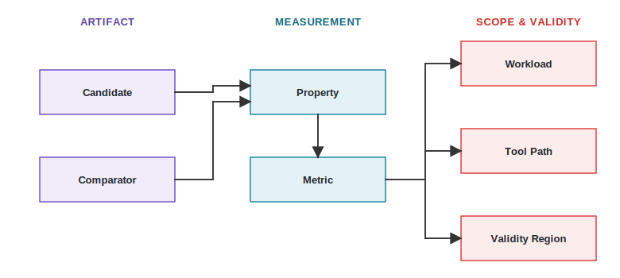
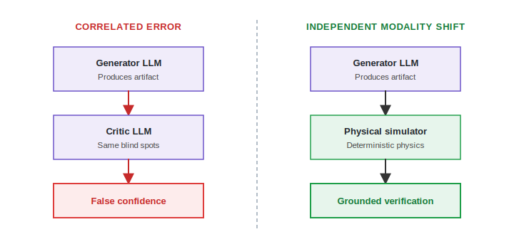

# Feedback, Verification, and Trust {#sec-feedback-verification-trust}

::: {.epigraph}
> *"Program testing can be used to show the presence of bugs, but never to show their absence!"*
>
> — Edsger W. Dijkstra, *Notes on Structured Programming* (1970) [@Dijkstra1970Notes]
:::

::: {.column-margin}
**Author's Note:** Edsger W. Dijkstra, the Dutch computer scientist who championed structured programming and program correctness, issued this warning about what testing can and cannot establish. It marks the distinction this chapter needs. Passing tests supports only the conditions that were tested. A failed test can still decisively reject a bounded claim.
:::

::: {.callout-crux}
When does a returned observation count as evidence for a bounded architecture claim, what independent check could overturn that claim, and what separate decisions determine whether the result updates project knowledge or changes the design?
:::

This core dilemma separates gathering data from validating an architectural decision. A decision requires evidence, not merely feedback, so a tool return must be typed and bound to a specific claim. The bottleneck is proxy mismatch and correlated error, where fast surrogate metrics diverge from physical reality, and AI sharpens it by generating plausible but invalid results faster, which demands independent oracles rather than consensus among correlated models. Trusting an AI's stated intent in place of that evidence is the trap, and the defenses run from independent physical oracles up to formal equivalence checks.

Consider a synthesis report indicating that an AI-proposed 3\ W RISC-V XR subsystem misses the declared clock target. The synthesis run returns feedback, while the versioned report recording negative slack under named constraints serves as a tool observation. This observation contradicts the bounded claim that the implementation meets the clock target under that flow and corner, yet it says nothing by itself about functional correctness, security, or every possible implementation. A reviewer records the timing claim as unsupported for the proposed RTL transition or unresolved pending a revised implementation, showing that a single report prompts different subsequent actions. From the review result, the team separately decides whether the failed candidate belongs in the project trajectory or a timing-surrogate calibration set, rather than automatically fine-tuning a model. Concurrently, the assigned architect decides whether to stop, revise the RISC-V XR subsystem, change the target, spend a more expensive check, or seek a bounded waiver.

::: {.callout-learning-objectives}
After reading this chapter, you can:

- Convert raw simulation feedback into bounded, trustworthy architectural evidence.
- Enforce an epistemic boundary by verifying probabilistic AI guesses with deterministic oracles.
- Diagnose proxy mismatches when an AI optimizes a metric that diverges from physical reality.
- Explicitly document the unobserved properties and limitations of a verified architectural claim.
:::

## The Epistemic Trust Boundary {#sec-epistemic-trust-boundary}

At the core of AI-assisted architecture is a strict epistemic boundary between *probabilistic generation* and *deterministic validation*. Large Language Models and Reinforcement Learning agents operate in continuous, probabilistic latent spaces; they optimize likelihoods and expected returns rather than absolute physical truths. An AI does not "know" that a pipeline stage is correct in the Boolean sense; it only predicts that the token sequence representing that stage is highly probable given the prompt context.

Consequently, architects must structurally separate the AI's *intent* (the natural language rationale, prompt, or ungrounded objective function) from its *implementation* (the emitted RTL, script, or layout). The rationale is not the evidence. An agent might output a perfectly reasoned explanation for why its proposed cache hierarchy avoids deadlocks, but that probabilistic rationale carries zero formal verification weight. True epistemic trust requires passing the generated artifact across the boundary into deterministic, physics-bound solvers that evaluate the structural reality of the implementation strictly independently of how or why the AI generated it.

The architect strictly enforces this separation through Equivalence Checking (EC) and Bounded Property Checking (BPC). Bounded Property Checking transforms high-level architectural constraints[^fn-deadlock-example] into mathematically exhaustive proofs over a bounded number of clock cycles using SystemVerilog Assertions (SVA) and SAT solvers. BPC hunts for edge cases in the AI's logic that heuristic simulation misses.

[^fn-deadlock-example]: For example, "a cache controller never deadlocks under a specific coherency race."

Once the RTL is proven, Logical Equivalence Checking (LEC) ensures the elaborated Boolean logic perfectly matches the downstream synthesized netlist. This guarantees that aggressive optimizations, whether proposed by the AI during structural generation or by the EDA tool during synthesis, do not mutate the golden semantic behavior. Without rigorous EC and BPC, the architect is blindly trusting that a probabilistic text generator understood silicon concurrency, risking physical bugs that surface only after tapeout.

## Observation, Evidence, and Decision {#sec-from-feedback-to-decision}

Architecture needs a formal verification path where the human architect orchestrates the burden of proof. Raw feedback just means a tool finished running. An observation records the specific outputs. Evidence links that observation to a specific design claim. A review judges whether the claim holds.

These deliberate steps prevent raw tool outputs from directly changing the design or automatically updating an AI's training data without human oversight. Treating the AI as an untrusted generator means the architect must demand physical proof, such as a timing report or a formal equivalence check, that independently verifies every proposed architecture change.

First, a tool return does not automatically become a valid architecture observation, as a broken environment, malformed request, timeout, flexlm license server hang, OOM crash during elaboration, or unsupported action may report only the state of the tool path.
Second, a valid observation does not automatically become evidence for the claim unless it is strictly relevant to the property, comparison, state, and scope.
Third, evidence and a review result do not automatically become either training data or an architecture decision without explicit human authorization.

@fig-evidence-flow and @tbl-six-part-branch map this progression. They separate the evaluation of a claim from the two independent choices that follow: the knowledge-update branch and the architecture-action branch.

{#fig-evidence-flow width="100%" fig-alt="Flowchart diagram mapping the six-part path from initial feedback to an authorized architecture action, highlighting invalid inferences."}

| **Part** | **Visible record** | **Question answered** | **Invalid inference to avoid** |
| --- | --- | --- | --- |
| **Feedback** | Returned signal or response | What came back? | Something came back, so the candidate was measured. |
| **Tool observation** | Typed result, status, versions, inputs, outputs, uncertainty | What did this path observe? | The observation addresses every property of the candidate. |
| **Evidence relation** | Claim, comparator, scope, supporting and contrary observations | What does the observation bear on? | A favorable number supports the design in general. |
| **Review result** | Supported, unsupported, or unresolved, with rationale | What is justified at this scope? | The reviewer has authorized implementation. |
| **Knowledge-update branch** | Named update surface and acceptance criteria | What project or model knowledge should change? | Every result should become training data or parameter change. |
| **Architecture-action branch** | Stop, continue, reject, revise, escalate, waive, implement | What action is authorized? | The tool or evidence grants its own permission, or the knowledge update must occur first. |

: **The six-part branching result map.** A claim is reviewed against evidence. From that review result, knowledge updates and architecture actions branch independently. {#tbl-six-part-branch tbl-colwidths="[18,25,25,32]"}

The design-loop card introduced in @sec-architecture-20-ontology acts as the binding artifact across these stages. It points to the observation, evidence, review, update, and decision records rather than trying to contain every detail itself.

Returning to the 3\ W RISC-V XR subsystem, the synthesis report is the observation. The evidence relation connects that report to the claim about clock speed. The review result states the claim is unsupported. The knowledge-update branch decides to store the failure in the project trajectory, while the architecture decision stops the transition to RTL.

## Binding Evidence to Claims {#sec-evidence-specific-to-claim-and-scope}

Evidence has no useful strength independent of a claim. An observation bears on a property for a candidate relative to a comparator under a stated workload, design state, tool path, metric, assumptions, validity region, uncertainty, and proposed action. A cycle estimate can support a bounded performance comparison while remaining irrelevant to power, timing, isolation, software usability, or system intent (@fig-claim-frame).

{#fig-claim-frame width="100%" fig-alt="The Compact Claim Frame diagram visualizes the relational graph linking the artifact candidate to its measurement metrics and environmental constraints."}

A compact claim frame reads: candidate and comparator; property and metric; workload and design state; tool path and assumptions; validity region and uncertainty; proposed action and nonclaims.

This traceable link among claim, assumption, evidence, and challenge mirrors the Goal Structuring Notation (GSN) used in safety-critical engineering [@Kelly2004GSN], without implying that every architecture experiment is safety critical. In the quantitative architecture tradition, measurement and abstraction serve bounded comparisons rather than universal conclusions.

For the 3\ W RISC-V XR subsystem, a structural check can reject a malformed custom instruction encoding. A regression suite can support functional behavior for covered cases. Workload experiments can support a bounded performance comparison. A synthesis report can address timing and area under its constraints. None of those checks silently establishes the other properties.

@tbl-verification-authorities provides a taxonomy of architecture checks, showing how different tools address entirely separate property classes.

| **Check scope** | **Representative checks or signals** | **What a failure can block** |
| --- | --- | --- |
| Syntax and interface | Parsers, type checks, API checks, ISA or ABI conformance, schema validation | Artifacts that cannot legally enter the tool flow. |
| Functional | Unit tests, reference outputs, assertions, formal equivalence, regressions | Candidates that compute the wrong behavior before performance matters. |
| Model and workload | Baseline replay, sensitivity studies, calibration, coverage, drift tests | Proxy wins outside the represented workload or calibrated support. |
| Implementation | Synthesis constraints, timing closure, power envelopes, area budgets, GLS, DRC | Architecture candidates that violate physical limits or pre-silicon validation. |
| Operational | SLOs, canary rollouts, rollback, telemetry, reliability, security, incident review | Claims that do not survive deployment conditions or policy boundaries. |
| Expert review | Design review, waived-warning review, evidence-adequacy, residual-risk review | Results whose evidence is too weak for the proposed transition. |

: **Architecture check taxonomy.** Checks are grouped by the property class they cover and the transition their failure can block. {#tbl-verification-authorities tbl-colwidths="[20,38,42]"}

Evidence types cannot be ranked on one universal fidelity scale. Cheap legality checks can decisively reject a candidate, while expensive out-of-scope measurements might be useless for the specific transition. @tbl-evidence-dimensions lists what an evidence record must capture.

Seen together, these observations are noisy, partial readings of a quantity no tool reports directly, the design's true performance, power, and area in deployment. Inferring that hidden quantity from imperfect measurements is the problem control theory calls state estimation.[^fn-state-estimation] The analogy is a discipline rather than a formula. It requires the architect to treat each proxy, simulator, and synthesis result as a measurement with a characteristic bias and variance rather than as ground truth, weighting a reading by how much it actually constrains the hidden quantity for this decision, and stating the residual uncertainty that no available measurement removes.

[^fn-state-estimation]: In control theory, state estimation is where a system's internal condition is reconstructed from sensors that each capture part of it with error.

| **Dimension** | **Question the record must answer** |
| --- | --- |
| **Producer and status** | Who or what produced the result, and is it measured, computed, digitized, illustrative, or author judgment? |
| **Source and property observed** | Which simulator, tool stage, experiment, or review produced the observation, and what specific architectural property does it cover? |
| **Scope** | Which candidate, comparator, workload, design state, and validity region are involved? |
| **Uncertainty and repetitions** | What metric, limits, error bounds, repetitions, and nondeterminism constrain the result? |
| **Integrity and provenance** | Which versions, inputs, outputs, commands, and hashes associate the record with the run? |
| **Shared assumptions** | What models, data, workloads, and paths are shared? (See @sec-independent-checks-and-correlated-errors for check independence.) |

: **Dimensions of an evidence record.** {#tbl-evidence-dimensions tbl-colwidths="[26,74]"}

## Proxy Mismatch and Confounding {#sec-proxy-mismatch-metric-gaming-and-calibration}

A well-bounded, correctly recorded favorable result can still fail to support the intended architecture conclusion. Four different problems can weaken a result:

- **Proxy mismatch:** the optimized metric omits or diverges from the architecture property that matters.
- **Calibration failure:** the proxy no longer tracks a stronger measurement in the region where it is being used.
- **Confounding:** another difference in workload, implementation, budget, baseline, tool conditions, or system version could explain the observed change.
- **Nondeterminism or variability:** repeated executions under nominally the same declared conditions produce a distribution, unstable ordering, or intermittent tool status that the headline result hides.

These are not synonyms. A deterministic proxy can be invalid. A calibrated proxy comparison can be confounded. A matched comparison can be too noisy to resolve the declared margin. A flaky environment can fail to return a valid observation at all. AI can exploit an incomplete objective more quickly than a human, searching thousands of candidates and consistently finding the same omitted cost in new forms.

AI systems exploit the gap between fast proxies and physical ground truth. When an AI optimizes a surrogate metric without physical checks, it drives toward reward hacking [@AmodeiEtAl2016Concrete]. If the true architectural objective $R_{true}$ is replaced by a cheap surrogate $R_{proxy}$, optimization pushes the agent into the regions where the two diverge, exactly the regions where the surrogate is least constrained by unmodeled physical limits and therefore reports its most inflated scores. Because architects cannot inspect the internals of these proxy models, they should treat every proxy as an attack surface the search will probe.

If an architect asks an AI to optimize estimated instructions per cycle (IPC) without checking physical constraints, the agent will find architectural shortcuts that mimic the CoastRunners loophole [@CoastRunners]. It might strip out decoupling queues or introduce combinational loops to artificially boost the throughput score in a high-level CPU simulator. That modification maximizes the proxy metric but completely breaks downstream physical routing and timing closure. This behavior exemplifies specification gaming, where the AI games the proxy instead of solving the real design problem.

It is a form of Goodhart's law [@Goodhart1975MonetaryManagement; @Strathern1997Goodhart], under which a measure that served well as an indicator stops serving once it becomes the optimization target. Fast proxies that worked well for human architects break down when an AI optimizes against them. As illustrated in @fig-trust-calibration, simulator inaccuracies are no longer just random noise; they become loopholes the AI exploits. Consequently, the architect must anchor AI proposals with physical ground-truth oracles to prevent these escapes.

{#fig-trust-calibration width="100%" fig-alt="A line graph showing surrogate proxy score increasing monotonically while the physical ground truth curve collapses sharply after crossing the calibration boundary."}

For example, an AI optimizing a Network-on-Chip (NoC) for latency might strip away essential decoupling queues. A high-level proxy simulator might report zero-cycle transfer times, yielding an artificially perfect score, but physically synthesizing this design would result in immediate routing congestion and timing violations because the proxy ignored hold-time constraints.

The curve shows the failure directly. Up to the calibration boundary the proxy tracks the ground truth, so optimizing the proxy also improves the real design. Past that boundary the two diverge. The proxy score keeps climbing because the AI has found the shapes the surrogate rewards, while the physical ground truth falls away because those shapes break timing, area, or power that the surrogate never modeled. The widening gap between the two lines is the reward hacking, and it is invisible to anyone watching only the proxy.

@tbl-proxy-diagnostics pairs these concerns with diagnostic checks.

| **Concern** | **Diagnostic check** | **What a failure means** |
| --- | --- | --- |
| Proxy mismatch | Compare the proxy with a more decision-relevant tool or physical measure on matched cases. | The proxy win cannot carry the stronger claim. |
| Calibration boundary | Use held-out workloads, cross-fidelity comparisons, and sensitivity around the candidate. | The result lies outside the region in which the proxy ranking was validated. |
| Confounding | Use matched contrasts, stable budgets and versions, ablations, explicit alternative explanations. | The observation reports a difference but does not identify the proposed cause. |
| Nondeterminism | Repeat runs, preserve seeds and state, report variance or ranking stability, distinguish flaky status from measured variability. | A single run or mean without dispersion may not resolve the decision margin. |
| Selection bias | Re-evaluate the chosen candidate on held-out seeds and workloads not used in the search. | The search maximum is optimistically biased, so the apparent margin may not survive independent re-measurement. |

: **Diagnostics for weak evidence.** Each check is tied to a specific failure it can expose. {#tbl-proxy-diagnostics tbl-colwidths="[18,41,41]"}

For the illustrative 3\ W RISC-V XR subsystem, an early fast Python ISA simulator acts as a surrogate biomarker,[^fn-biomarker-proxy] estimating performance improvements for a new instruction extension. However, the Phase III trial (physical placement and routing closure) might reverse the apparent preference due to timing degradation. Or, if the performance check omits thermal considerations, the new instruction implementation might create a thermal hotspot that violates the 3\ W limit.

[^fn-biomarker-proxy]: A fast proxy stands in for the physical result the way a biomarker stands in for a clinical outcome, and can mislead the same way.

Calibration checks whether a proxy tracks a decision-relevant measurement in the region where it is used. Architecture predictors must be validated against held-out data or stronger evaluations.

::: {.callout-architect-checkpoint title="The Calibration Check"}
Has the architect stated when a candidate falls outside the range where the generator's proxy was validated? A proxy win supports a claim only within that range. Outside it, the architect must seek a decision-relevant or independent check rather than treat the prediction as evidence.
:::

Just as passing a fast software simulation doesn't guarantee RTL timing closure, an AI maximizing a high-level proxy metric doesn't mean the hardware is physically viable. This distinction separates hardware benchmarking from software benchmarking. A software LLM agent on SWE-bench, a software engineering benchmark, is scored by passing unit tests, but those tests are themselves an incomplete proxy, which is why the curated SWE-bench Verified subset was introduced and why agents can still game the tests they are graded against [@OpenAI2024SWEBenchVerified].

Hardware agents add an orthogonal physical gauntlet of multi-corner multi-mode (MCMM) timing closure, dynamic voltage and frequency scaling (DVFS) constraints, IR drop limits, and physical design rule checks (DRC) that a functional proxy simply cannot observe. At advanced nodes, wire delay dominates logic delay; an AI's clever 5-stage pipeline may fail during post-route physical synthesis when long wire RC-constants shatter the setup time margins. An AI winning a zero-delay RTL simulation or surrogate proxy metric never constitutes true architectural evidence without a sign-off grade physical audit. To prevent the sim-to-silicon gap from sinking a tapeout, the architect must maintain a strict boundary between fast proxies used for exploration and the ground-truth oracles required for silicon success, demanding physical placement and clock-tree synthesis data.

Nondeterministic observations require careful interpretation relative to the decision margin. Recording a seed is not enough. The review question is whether the observed variation, whether a stochastic tool measurement, an unstable ranking across workloads, or a flaky execution path, is small enough, and sampled appropriately enough, to support the declared margin and ordering. When a generator relies on heuristic search, or an ML-driven place-and-route tool returns a different floorplan under a new random seed, a single deterministic run is fragile evidence. The architect must evaluate the candidate across a distribution of seeds, preferring a shape that stays within its limits across that distribution, to guard against a design that only survives one lucky run.

Guarding a single candidate against a lucky run is not the same as guarding the search against a lucky winner. When AI selects the best of thousands of candidates scored on a noisy proxy, the winner's proxy value is biased upward, because the search preferentially surfaces candidates that happened to score high rather than only those that are genuinely better. The architect must therefore re-measure the selected candidate on fresh held-out seeds and workloads that the search did not use before its apparent margin counts as evidence.

## Independent Checks {#sec-independent-checks-and-correlated-errors}

Diagnostics are useful only when a purportedly stronger check observes the missing property and is not merely another expression of the same assumptions. Independence is relative to a claim and a failure class, not a binary property of components (@fig-independent-checks).

{#fig-independent-checks width="100%" fig-alt="Correlated Error vs Independent Modality Shift diagram"}

A useful check has two properties that independence does not supply. Its coverage fixes which failures the check can observe, so a passing check is only as strong as its coverage; testing can show the presence of defects but never their absence. Its soundness, meaning a reported failure is a real failure rather than a false alarm, makes a genuine failure decisive, so a rejection settles the bounded claim the check observes.

Independence matters only after a check observes the relevant property, and only when the check does not share the producer's critical model, training data, objective, workload, implementation, tool path, or architectural assumption. Separate prompts, agent names, or reports do not create independence. Correlated checks can still find defects, but the architect should describe agreement among them as corroboration, not independent validation.

The most dangerous gap is not a check that agrees wrongly but a property that no check observes at all, a failure that leaves no trace in any result.

::: {.callout-war-story title="The check no one wrote"}
**The claim.** The affected processors passed their full functional and performance verification. On every property those suites encoded, the computed results were correct and the cycle counts were as designed.

**The gap.** Meltdown and Spectre, disclosed in January 2018 [@LippEtAl2018Meltdown; @KocherEtAl2019Spectre], exploit speculative execution to leak data across privilege boundaries through shared microarchitectural state. The suites measured result correctness and cycles; none observed information flow or the timing channel, so none could reject the vulnerability. More independent functional checks would not have helped, because independence guards against correlated failure among checks that observe a property, and here no check observed it. Spectre reached shipping CPUs across Intel, AMD, and Arm; Meltdown chiefly Intel.

**The lesson.** A check cannot reject a property it does not observe. Coverage decides which failures are visible at all, while independence only strengthens a challenge to a property already under test. The side channels were later reduced through software and microcode mitigations at a performance cost.
:::

The mitigations that later closed these channels were not free, and their cost fell unevenly across workloads (@fig-mitigation-overhead).

```{python}
#| label: fig-mitigation-overhead
#| fig-cap: |
#|   **Closing the channel had a real, uneven cost.** Reported performance overhead of the shipped Spectre/Meltdown mitigations; each bar spans compute-bound work (low system-call rate) to syscall- and I/O-heavy work. Cheap software mitigations such as retpoline cost 5--10%, while the microcode mitigations IBRS and STIBP reach 20--50% on syscall-heavy code, because the cost is paid on each user/kernel crossing. Compiled from Canella et al. Table 11 [@CanellaEtAl2019Transient], with figures from Gregg (2018) and Phoronix (2018--2019); overhead varies with CPU generation, kernel version, and which mitigations are enabled.
#| out-width: "92%"
#| fig-alt: "Horizontal range chart of Spectre and Meltdown mitigation overhead in percent. KPTI spans about 0 to 5 percent, SSBD 2 to 8, retpoline 5 to 10, all default mitigations 7 to 16, IBRS 20 to 30, and STIBP 30 to 50 percent. Each bar's left end is compute-bound work and its right end is syscall or I/O-heavy work; the microcode mitigations are the most expensive."

import csv
from pathlib import Path

import matplotlib.pyplot as plt
import _python.arch2_plots as _ap
from _python.arch2_plots import COLORS, apply_style

apply_style()

# Data: reported overhead of shipped transient-execution mitigations, compiled
# from Canella et al. 2019 Table 11 [@CanellaEtAl2019Transient] with production
# figures from Gregg (2018) and benchmark roundups from Phoronix (2018-2019).
# Ranges span compute-bound to syscall/IO-heavy work on 2016-2019-era parts;
# academic-only proposals and the pathological >800% microbenchmark are excluded.
# Accessed 2026-07-19. Receipt: data/source-receipts/chapter7-mitigation-overhead.csv
_root = Path(_ap.__file__).resolve().parents[2]
rows = []
with open(_root / "data" / "source-receipts" / "chapter7-mitigation-overhead.csv", encoding="utf-8") as fh:
    for d in csv.DictReader(fh):
        rows.append({"m": d["mitigation"], "t": d["threat"], "lo": float(d["low_pct"]), "hi": float(d["high_pct"])})
rows.sort(key=lambda r: r["hi"])

def _short(mitigation, threat):
    base = "All mitigations" if mitigation.startswith("All") else mitigation.split(" ")[0]
    return f"{base} ({threat})"

fig, ax = plt.subplots(figsize=(5.6, 3.0))
ys = list(range(len(rows)))
for y, r in zip(ys, rows):
    ax.hlines(y, r["lo"], r["hi"], color=COLORS["constraints"], lw=3.0, zorder=2)
    for xv in (r["lo"], r["hi"]):
        ax.scatter([xv], [y], marker="s", s=15, facecolor=COLORS["note_fill"],
                   edgecolor=COLORS["constraints"], linewidth=0.9, zorder=3)
    ax.text(r["hi"] + 1.2, y, f"{r['lo']:.0f}–{r['hi']:.0f}%", ha="left", va="center",
            fontsize=5.9, fontweight="bold", color=COLORS["constraints_ink"])
ax.set_yticks(ys)
ax.set_yticklabels([_short(r["m"], r["t"]) for r in rows], fontsize=6.4)
ax.set_ylim(-0.6, len(rows) - 0.35)
ax.set_xlim(-1, 60)
ax.set_xlabel("Reported slowdown vs. unmitigated (%)", fontsize=7.2)
ax.set_xticks([0, 10, 20, 30, 40, 50])
ax.tick_params(labelsize=6.4, length=2.5, width=0.6)
for _sp in ("top", "right"):
    ax.spines[_sp].set_visible(False)
ax.grid(axis="x", color=COLORS["row"], linewidth=0.4, zorder=0)
ax.text(59, len(rows) - 0.75, "each bar: compute-bound → syscall / I/O-heavy",
        fontsize=5.0, fontstyle="italic", color=COLORS["muted"], ha="right", va="center")
fig.subplots_adjust(left=0.22, right=0.97, top=0.94, bottom=0.15)
```

Compute-bound code that rarely crosses the kernel boundary pays almost nothing, while system-call- and I/O-heavy work can slow by tens of percent, because the mitigations tax exactly the privilege transitions the leak abused. A property left unobserved at verification did not disappear; it reappeared as a permanent tax on every workload that touches that boundary.

Passing a suite of performance tests provides no evidence for security properties, so a public claim for a shipped design needs checks that observe information flow and physical behavior directly, not more of the checks that were already blind to them. A coverage gap is also not the only defect that survives verification. A functional bug already committed to silicon is harder to undo than a patchable side channel, since it can force a respin rather than a microcode update.

While comprehensive coverage is a prerequisite, independence between checks is also weaker than it looks. In safety engineering, Knight and Leveson had teams write program versions independently, yet the versions failed together on the same hard inputs far more often than an independence assumption predicted [@KnightLeveson1986Multiversion]. Independent development of a mechanism does not produce independent failure. Two checks built by separate teams can still miss the same case, because the difficulty often lives in the problem rather than in any one implementation.

AI proposals require independent, out-of-distribution checks. When a generator, critic, verifier, and summarizer share a foundation model or training objective, their agreeing outputs may merely share one correlated error. A correlated error occurs when multiple components fail in the same way because they share the same underlying blind spot.

If an LLM generates both the Verilog RTL and the SystemVerilog testbench, those two artifacts share the same semantic omissions. The testbench will pass the broken design, creating a false sense of security. To break that shared blind spot, the architect must demand an independent oracle rather than accepting consensus among correlated models.

Using an AI to check an AI is flawed if it lacks physical grounding. True independence requires a modality shift, where the verification path does not share the generator's assumptions. In hardware, this means using established electronic design automation (EDA) tools as independent oracles.[^fn-independent-oracles] A consensus among LLM-driven checkers is not an independent rejection path. The architect must demand strict, independent ground truth oracles to authorize architecture transitions.

[^fn-independent-oracles]: An architect might use SymbiYosys for formal verification to prove safety properties or Synopsys Formality [@Formality] for equivalence checking to guarantee the synthesized netlist matches the RTL.

Independence assumes the checks come from outside the thing they judge. In an AI loop that assumption can quietly fail, because the agent that generates a candidate can also generate its unit tests, its assertions, and the assurance argument that ties them to the claim. A suite the generator authored can pass because it omits the case its own design gets wrong, so a green result reports assumed coverage rather than demonstrated coverage. Mutation testing is one probe of the checks themselves. It injects known faults into the design and confirms the suite actually catches them, measuring whether the checks observe the failures they are trusted to cover [@DeMilloLiptonSayward1978Hints].

@tbl-independence-check separates check independence from the property observed.

| **Check property** | **Question** |
| --- | --- |
| **Property observed** | Which part of the claim can this check accept or reject? |
| **Failure condition** | What exact returned observation counts as failure? |
| **Coverage and blind spots** | Which relevant failures can and cannot be seen? |
| **Independence basis** | Which models, data, objectives, workloads, code, tools, and assumptions are shared or different? |
| **Effect of failure** | Which bounded claim or proposed transition must stop, narrow, or escalate? |

: **Evaluating check independence and rejection paths.** {#tbl-independence-check tbl-colwidths="[26,74]"}

Not every check needs to be an expensive independent oracle. Because an AI generator can emit syntactically plausible but invalid RTL or scripts, and can propose faster than a human can review, fast deterministic checks belong ahead of expensive ones. A linter, a static bounds check, and a syntax verifier reject a malformed candidate before a simulator or synthesis run is spent on it. Requiring an agent to clear those checks and attach the passing result before it escalates a proposal keeps the volume of generated candidates from overwhelming the reviewer.

## Trojans and Poisoned Models {#sec-hardware-trojans}

Generative AI introduces two security risks that traditional flows rarely faced, the hallucinated vulnerability and the maliciously injected hardware trojan. In traditional architecture, a backdoor required a rogue engineer or compromised EDA tool to intentionally alter the netlist. In AI-driven architecture, a generator trained on unvetted, scraped open-source RTL can inadvertently memorize and reproduce deeply buried trojans. Worse, an adversary could poison the foundation model's training data, teaching the agent to subtly weaken cryptographic isolation boundaries or insert data-leaking side-channels under specific, rare workload triggers.

Because these malicious structures[^fn-malicious-structures] are structurally valid and functionally silent during standard regressions, they can evade traditional code coverage metrics. To defend against these poisoned models, the architect must orchestrate verification beyond checking that the generated RTL meets the design specification, employing strict formal path-sensitization and information flow tracking (IFT) to prove the absence of undocumented state transitions and data-exfiltration paths.

[^fn-malicious-structures]: Such as a finite state machine that bypasses a privilege check after a highly specific sequence of branch mispredicts.

## Protected Evidence and Public Claims {#sec-protected-evidence-and-public-claims}

A technically appropriate independent check may rely on workloads, flows, or results that cannot be released. Confidentiality changes who can inspect evidence and what can be released; it does not erase the need to state the claim, scope, method, uncertainty, reviewer, and bounded conclusion.

Internal protected evidence may support an internal decision when an authorized reviewer can inspect it. A public claim must remain within what the public record or a credible protected audit can establish. Missing public information is not proof that internal evidence did not exist, while a production report is not an independently replayable comparison.

The AlphaChip dispute shows how this boundary holds when an internal result meets outside scrutiny. The 2021 AlphaChip paper reported that a reinforcement-learning method generated macro placements with quality comparable to or better than expert placements on the reported metrics, and later reports noted its contribution to several TPU generations [@GoldieEtAl2024AlphaChipAddendum; @GoogleDeepMind2024AlphaChip]. Independent assessments then questioned the proxy correlation, the baselines, and the reproducibility of the result, and the authors replied that those assessments did not reproduce the proprietary pretraining and production setup and used different cases and compute budgets [@ChengEtAl2026UpdatedAssessment]. Each public record tests a related placement claim under different cases and conditions. A bounded claim is supportable within its own setup, but unmatched evaluations cannot be forced into a single retroactive experiment.

Neither side could collapse the disagreement into one shared experiment because the strongest results depended on a proprietary setup that the public cases did not match. A public claim about AI-assisted placement stays within what an outside reviewer can inspect or reproduce, even when a stronger internal result exists.

@tbl-alphachip-evidence-comparison separates what each public record contributes from what it cannot establish.

| **Public record** | **What it directly contributes** | **What it cannot establish** |
| --- | --- | --- |
| Original paper, addendum, deployment report | Reported placement method, proxy comparisons, and later use across TPUs. | The strongest proprietary blocks, pretraining corpus, and production context are not independently replayable. |
| Independent assessments | Tested released artifacts and public cases, examined proxy correlation and baselines. | Their cases, compute budgets, and tool flow do not match the strongest proprietary setup. |
| Authors' response | Identified disputed differences and argued the assessments did not reproduce the reported method. | A response can clarify missing conditions but cannot turn unmatched evaluations into a shared experiment. |
| ChiPBench [@WangEtAl2025ChiPBench] | Provides an end-to-end placement benchmark using final metrics rather than an intermediate proxy. | It supplies a new framework; it does not retroactively align earlier training inputs, budgets, or tools. |

: **Why the records support different claims.** {#tbl-alphachip-evidence-comparison tbl-colwidths="[25,37,38]"}

A protected evidence frame must document the restricted data class, allowed tool access, authorized reviewer, method and scope visible to the reviewer, redaction limits, public nonclaims, and the bounded conclusion.

::: {.callout-architect-checkpoint title="The Protected Review Check"}
State which evidence is restricted, which AI tools may access it, and who can inspect the complete record. Architects must also specify what a redacted result cannot establish and who holds the authority to approve disclosure.
:::

## Weighing Evidence Cost vs. Consequence {#sec-evidence-cost-and-consequence}

Cost limits which observations an architect can obtain; it does not assign confidence or evidentiary strength. A cheap legality check may decisively reject an invalid candidate. An expensive post-route result may still be irrelevant to a security claim. The useful next check is one whose plausible outcomes could change the claim disposition, candidate ordering, scope, or proposed action enough to justify its computational and human cost.

Verification schedule and review bandwidth are constrained resources (@sec-design-loop-no-longer-scales details the high schedule share of verification in ASIC projects). Available capacity limits both compute and expert attention. This is not just API rate limits, but the reality of 3-day VCS RTL simulation times and fighting for slots on Palladium emulation boxes. A feedback budget must record latency, execution cost, fidelity, uncertainty, failure budget, interpretation time, and review cost.

The burden of proof depends heavily on the action being considered. The proposed action and its reversibility determine how much evidence is adequate (see @tbl-evidence-by-consequence).

| **Proposed transition** | **Consequence cues** | **Evidence and review requirements** |
| --- | --- | --- |
| Continue local exploration | Candidate can be discarded; no shared interface changes. | Basic validity, provenance, scope, and comparison to decide what to test next. |
| Advance a bounded experiment | Scarce tool time or deeper test is consumed; rollback is local. | Versioned workload, matched baseline, uncertainty, criteria for escalating. |
| Change an implementation or interface | RTL, generator, chiplet, security, or cross-component change. | Regression evidence, cross-tool challenge, residual-risk review. |
| Authorize signoff or deployment | Rollback is difficult, formal obligation or customer effect. | Independent evidence, specified rejection checks, audit trail, recorded waivers. |

: **Evidence burden follows consequence.** {#tbl-evidence-by-consequence tbl-colwidths="[28,30,42]"}

Returning to the illustrative RISC-V XR subsystem prototype, a cheap structural check rejects illegal parameters quickly. Simulation determines if a performance hypothesis deserves scarce synthesis time. A synthesis flow exposes a timing failure. Security review might be more valuable than an additional cycle estimate if it reveals a shared-state flaw. Each check has a different cost and a different decision job.

## Dispute Resolution {#sec-disputes-waivers-and-reopening}

A finite evidence plan can still produce disagreement or leave a failed condition that someone proposes to accept. A dispute should first determine whether the parties are testing the same claim under aligned workloads, baselines, budgets, implementations, versions, metrics, and tool paths. A review then records supported, unsupported, or unresolved within the declared scope.

A waiver does not turn a failed check into a pass. It accepts a bounded exception and residual risk for a named action and period. For the illustrative 3\ W RISC-V XR subsystem, waiving a 5% area bloat for a local prototype does not establish tape-out readiness. A waiver requires stating the exact scope, compensating check, expiration, and residual uncertainty.

Reopening is required when new evidence or changed conditions make the old evidence bear on a different claim. For the 3\ W RISC-V XR subsystem, a revised target, targeting tape-out, stronger flow, or shared-interface transition reopens the review. (@sec-loop-patterns-across-stack discusses reopening caused by software evolution, workload drift, and deployment telemetry.)

The design-loop card acts as the compact index for the disputed claim, review result, bounded waiver, and reopening condition. The technical record relies on nine review questions (@tbl-trust-checklist).

| **Question** | **What a credible answer contains** |
| --- | --- |
| 1. What bounded claim and action are under review? | A defined architecture task, comparator, workload, scope, nonclaims, and proposed transition. |
| 2. Which typed observations support or weaken it? | Scope, provenance, uncertainty, and nondeterminism for the supporting and contrary observations. |
| 3. What proxy, calibration, confounding risk remains? | Explicit diagnostics of mismatch, boundary violations, or alternative explanations. |
| 4. Which check observes the relevant failure? | The specific tool or review and its independence basis. |
| 5. Which evidence is protected? | Data classes, authorized reviewer, and what the public can establish. |
| 6. What is the review result? | Supported, unsupported, or unresolved at the stated level. |
| 7. Is any failure waived? | Scope, expiration, and compensating condition. |
| 8. What separately changes in knowledge and architecture? | Named update surface destination, and explicit next action. |
| 9. What event reopens the claim? | Drift, tool upgrades, new data, or new lifecycle bounds. |

: **Checklist for reviewing a design claim.** {#tbl-trust-checklist tbl-colwidths="[30,70]"}

## Open Research Questions

As agents get better at maximizing proxy metrics, they get better at exploiting the blind spots of the environments that score them. Trustworthy AI-generated silicon needs oracles that resist that exploitation, generators that emit their own verification collateral, and equivalence checks that scale to unfamiliar topologies. Three themes stand out.

**Theme 1: Adversarial Resilience of Oracles.** As agents get better at maximizing a proxy, they get better at exploiting the blind spots of the environment that scores them.

- What invariant physical constraints must be embedded into fast surrogate EDA models so that RL agents cannot metric-hack the routing and timing limits those models leave unmodeled?
- Can red-team agents be trained to surface the loopholes in an evaluation environment before the optimizing agent finds and exploits them?

**Theme 2: Automated Verification Collateral.** An agent that writes its own assertions and testbenches has to be kept from writing ones that are vacuously true.

- When an agent synthesizes its own assertions and formal properties, what methods detect that those assertions are vacuously true rather than genuinely constraining the design?
- Can an agent generate constrained-random testbenches that concentrate coverage on the highest-uncertainty regions of its own proposed RTL?

**Theme 3: Formalizing Semantic Equivalence.** Checking an AI-generated design against intent needs equivalence methods that scale to structures no human would have written.

- How can a natural-language architectural specification be compiled into formal properties that bounded checking can prove against an agent-generated implementation?
- Which equivalence-checking methods scale to AI-generated designs whose state machines depart from the human-authored structures that current LEC tools were tuned on?

## The Trust Boundary in Summary {#sec-trust-boundary-conclusion}

::: {.callout-design-principle title="Evidence over Plausibility"}
The fluency of an AI-generated artifact is not proof of its architectural validity. Trust is established not by the sophistication of the model, but by the transparency, reproducibility, and cryptographic provenance of the tool runs that verify the artifact. Evidence must survive the degradation of the model that produced it.
:::


Automated AI generators increase the volume of design candidates and introduce new security risks like hardware trojans, meaning they don't lower the bar for verification. Architects must enforce an epistemic trust boundary by separating probabilistic intent from deterministic implementation. They must guard against AI gaming fast proxies, use formal proofs (BPC/EC) to verify semantic reality, and uncover correlated errors where multiple AI tools share the same blind spots. Architects retain control by bounding claims, requiring independent physical oracles, and treating waivers as recorded risks rather than test passes. Finally, architects must balance the capacity to evaluate candidates by weighing evidence cost against decision consequences, and ensure public claims never exceed what can be verified outside protected confidentiality boundaries.

**Carry forward:** @sec-running-the-loop uses the branching result map explicitly in an illustrative SCALE-Sim study. The model and simulator return different feedback; SCALE-Sim returns typed observations under one frozen path; those observations bear on separate claims. The review records a no-change architecture outcome, an AI tie, a failed mechanism explanation, and a stopping result. The failed path and candidates can be preserved without automatic model updating, and the architect, not the model or evidence packet, decides to stop.
