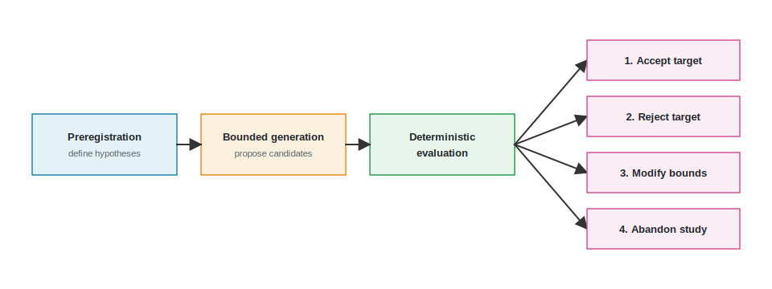
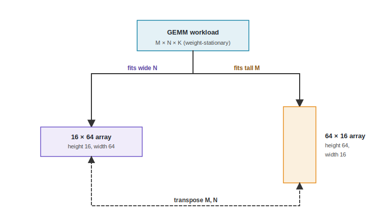

# Running the Loop {#sec-running-the-loop}

::: {.epigraph}
> *"In theory, there is no difference between theory and practice. But, in practice, there is."*
>
> — widely circulated aphorism
:::

::: {.column-margin}
**Author's Note:** The aphorism fits this study, which compares a model proposal against a fixed aspect-ratio heuristic in a physical simulator. The model's explanation fails a declared distinguishing contrast. It proves useful precisely because the recorded results are less exciting than the initial hypothesis.
:::


::: {.callout-crux}
What must an architect fix, execute, and preserve so that one bounded AI-assisted study reaches no conclusion stronger than its recorded results?
:::

This crux addresses baseline shopping, a practical trap in AI-assisted architecture. Generative AI accelerates the creation of architectural candidates, but because simulators are highly configurable and models are highly sensitive to phrasing, it is easy to subconsciously baseline shop by tweaking simulator parameters after the fact to validate a plausible AI candidate. It is equally easy to prompt shop by silently discarding dozens of failed prompts until one produces the desired architecture. In a real EDA environment, the penalty for guessing wrong is severe. Waiting eight hours for a physical routing failure consumes vastly more calendar time and limited FlexLM license checkouts than waiting ten milliseconds for a Python syntax error. This trial-and-error hides massive physical costs, and the design loop must be strictly bounded to prevent them.

Before any model or simulator output is known, the architect fixes the workload, legal array shapes, simulator configuration, comparison budget, rejection criteria, and decision owner. Fixing these choices prevents post-result goalpost moving and enforces discipline without claiming the choices were intrinsically optimal, serving as the baseline search strategy that an AI generative proposer must beat (@sec-methods-generation-prediction-optimization).

## The Control Case Experiment

The experiment below is deliberately modest, yet it anchors back to our Lighthouse prompt from @sec-moonshot to design a 3\ W, 64-bit RISC-V-based compute subsystem for an XR platform. We specifically zoom in on the XR platform's spatial tracking (SLAM) subsystem, which relies heavily on dense matrix multiplication. One recorded model call proposes three legal systolic-array datapath shapes for a compact three-layer SLAM matrix-multiplication workload. A fixed aspect-ratio heuristic proposes three shapes under the same four-call simulator budget. SCALE-Sim 3.0.0 evaluates both arms under one frozen configuration [@RajEtAl2025ScaleSimV3], and a declared workload contrast then tests the model's mechanism prediction. While its scope excludes model benchmarking, full-chip XR evaluation, and tapeout, it illustrates how a bounded architectural question is rigorously executed. It evaluates whether a no-change architecture result, an equal-call tie, and an unsupported mechanism explanation can be reported cleanly without being recast as an AI success.

The experiment still reaches a reviewable result, although no nonbaseline shape clears the declared decision margin. The model and fixed heuristic arms tie, and the model's directional prediction fails its contrast. The recorded status-quo recommendation is to retain the 32 by 32 baseline for the five unique evaluated shapes and stop this bounded search. For context, an illustrative system might use specific square or rectangular datapath dimensions (e.g., 256 by 256) optimized for its target workloads; our 32 by 32 baseline similarly serves as a fixed reference point rather than a claim of global optimality among all fifteen legal shapes. Another reader can inspect the proposal and rerun the recorded simulator computation without mistaking that replay for independent validation of the workload, score, or simulator.

Most of this procedure is familiar architecture work where an architect defines the comparison, validates tool inputs, measures candidates, tests an explanation, and decides whether the evidence warrants a change. AI participation adds a proposal and explanation whose scope, output, budget, provenance, and authority must be carefully controlled. This integration neither changes what SCALE-Sim measured nor grants the model authority to decide what happens next.

::: {.callout-learning-objectives}
After this chapter you can run and review a bounded AI-assisted architecture
study. That means you can:

- **Separate** the architecture outcome, AI contribution, mechanism explanation,
  and stopping decision;
- **Lock** simulation parameters via scientific preregistration to prevent baseline shopping;
- **Validate** structured output, bound repair, and preserve rejected alternatives;
- **Challenge** a proposed mechanism with a declared distinguishing contrast; and
- **Distinguish** replay of the recorded computation from independent reproduction and validation.
:::


## Four Separate Judgments

A candidate ranking does not answer every question in an AI-assisted architecture study, so this experiment produces four distinct judgments from different parts of the record.

- The **architecture outcome** asks whether any evaluated nonbaseline shape clears the local decision margin over 32 by 32.
- The **AI contribution** asks whether the recorded model arm finds a better score than the fixed aspect-ratio heuristic under the same simulator-call budget.
- The **mechanism explanation** asks whether the model's directional prediction survives its declared distinguishing contrast.
- The **stopping decision** asks whether another evaluation is warranted under the predeclared rule and current project scope.

These judgments can disagree, meaning a model might propose a competitive candidate without beating the heuristic, or a tied candidate could leave the status quo in place. A useful candidate might arrive with a failed explanation, and a bounded study can stop even though most of the legal design space remains unevaluated. The executed comparison below reports all four outcomes without inappropriately combining them into a single claim that the model or the complete discipline succeeded.

## Define the Decision and State the Claims Before Running {#sec-executed-scale-study}

The architecture question is deliberately narrow to test a precise hypothesis without overextending the methodology.

> Under the declared local rule, does any candidate selected by the recorded
> model or fixed aspect-ratio heuristic warrant follow-up over the 32 by 32
> baseline, and does the model's directional prediction survive its declared
> contrast?

The workload contains three GEMM layers extracted from the XR platform's spatial tracking (SLAM) pipeline, serving as a compact test slice rather than a claim about a full XR application. Only the datapath's array dimensions vary, while dataflow, SRAM capacity (the on-chip SRAM scratchpad), interface bandwidth, layout, simulator version, workload, deadline, and scoring rule remain fixed. This narrowness isolates the effect of proposal source and array shape by holding most of the environment still.

## Separate Outcomes from AI Claims

The preregistration keeps the architecture-outcome and AI-contribution claims
separate. This deliberate decoupling enforces one rule. The AI proposes candidates, and the deterministic simulator evaluates them. The model must never be allowed to grade its own homework. This ensures that a "successful" model invocation (one that generates valid JSON or a plausible explanation) is not automatically conflated with a successful architectural design. @fig-bounded-study-workflow lays out the full study in four stages, from preregistering the decision, through bounded candidate generation and deterministic simulation, to the four separate judgments that follow.

{#fig-bounded-study-workflow width="100%" fig-alt="Bounded Study Workflow diagram"}

**Architecture-outcome claim.** At least one evaluated nonbaseline shape
selected by either arm improves the local decision score over the 32 by 32
baseline by at least 1 percent for the frozen workload and simulator
configuration. The outcome is no change if none of those evaluated shapes
clears that decision margin.

**AI-contribution claim.** With four SCALE-Sim evaluations per arm, including
the same mandatory baseline, the recorded model arm finds a score at least 1
percent lower than the fixed aspect-ratio heuristic arm. A difference within 1
percent is a tie. A worse model result is adverse. Equal simulator calls do not
equalize model inference, human setup, prior knowledge encoded in the heuristic,
or total labor. One model call cannot establish a population-level result about
a model family, even if it wins.

These two outcome claims were fixed before proposal generation. The mechanism
hypothesis follows a different sequence. The architect fixed a mirrored-shape
test on the original and M/N-transposed workloads, then required the model to
supply its directional prediction before any simulation.

The local score is

$$
S = \frac{\text{total cycles}}
         {\text{average layer utilization}/100},
$$

with lower values preferred. This is a predeclared selection rule for this
study, not a universal measure of accelerator quality or a physical
measurement. Reporting cycles and utilization separately keeps the composite
score from hiding the two ingredients it combines, though it cannot reveal an
axis the score leaves out, such as memory traffic.

A fair comparison requires the evaluation budget, workload, simulator settings,
rejection criteria, and decision boundary to be frozen before either arm
produces results. @tbl-executed-study-protocol records those rules.

| **Element** | **Frozen rule** |
| --- | --- |
| Workloads | One three-layer GEMM slice, plus a versioned copy with M and N exchanged for the mechanism test. |
| Legal shapes | Rows and columns each in {8, 16, 32, 64, 128}; product no greater than 1,024 processing elements. These rules admit fifteen shapes. |
| Environment | SCALE-Sim 3.0.0, GEMM interface, weight-stationary dataflow, 128 KiB per SRAM, and 64 interface words per cycle. |
| Baseline and rejection criteria | Insert 32 by 32 into both arms; reject shapes above 1,024 processing elements or runs above 90,000 cycles. |
| Proposal arms | Three model proposals and three candidates from a fixed aggregate-aspect-ratio heuristic. |
| Evaluation budget | Four SCALE-Sim evaluations per arm after inserting the baseline; no post-result replacement. |
| Model repair | At most one complete repair response after reported schema or legality errors; invalid proposals consume the initial call. |
| Decision margin | At least 1 percent on the lower-is-better local score; differences inside the margin are ties. |
| Mechanism probe | Four shared runs comparing 16 by 64 and 64 by 16 on the original and M/N-transposed workloads. |
| Decision boundary | The recorded result may motivate a clearly scoped follow-up experiment or stopping. It cannot authorize RTL, tapeout, or a system intent decision. |

: **The comparison was fixed before evaluation.** Both proposal arms use the same workload, SCALE-Sim configuration, rejection criteria, baseline, and four-evaluation budget. {#tbl-executed-study-protocol tbl-colwidths="[22,68]"}

The workload, legal shapes, environment, and rejection criteria fix the
architecture comparison. The proposal and evaluation budgets prevent either
arm from receiving extra candidates after results appear. The repair and
decision rules fix how invalid model output and small score differences will be
treated. The mechanism contrast challenges the generated explanation, while
the final row leaves approval outside both the model and simulator.

Predeclaring these choices prevents the study from silently replacing a
candidate, metric, or stopping rule after seeing the results. When using AI, it is tempting to move the goalposts to justify the tool, tweaking a workload or changing a score just enough to make the AI's candidate look like a winner. Preregistration does not make that impossible, but it forces any such change into the open, where it can be checked against the rule fixed before results appeared.

Preregistration does not intrinsically justify the
three-layer workload, local score, 32 by 32 baseline, 1 percent decision margin,
90,000-cycle cutoff, SCALE-Sim abstraction, or four-call budget. Each remains
an architecture choice that would need a rationale and sensitivity analysis
before a broader decision relied on it.

## Design State and Mechanism Hypothesis

As established in @sec-data-representations-world-models, general knowledge is meaningless without explicit project constraints. The representation for this study is small, serving as a specific record rather than a general world model of the accelerator. The fifteen legal shapes, baseline, mutable array dimensions, fixed simulator conditions, local score, and workload matrices form the explicit design state. The candidate representation changes only the datapath's `ArrayHeight` and `ArrayWidth`, while the weight-stationary dataflow, SRAM capacity, interface bandwidth, layout, workload, and simulator version remain fixed.

That representation is useful only if a candidate change can be connected to a predicted consequence. The model proposed three shape deltas and predicted that a wider 16 by 64 array would better match the workload's N dimensions than its mirrored 64 by 16 alternative, further asserting that exchanging M and N in the workload would reverse the winner. The AI's ability to predict a directional outcome relies on its learned statistical priors, which must be tested against the simulator acting as the execution world model. The proposal therefore emitted both a design-state change and a testable consequence hypothesis that the simulator could challenge.

{#fig-array-mapping fig-alt="A systolic array with GEMM M and N labels on its height and width, and a second panel showing the workload after M and N are exchanged, illustrating that the mapping to array height and width does not simply invert."}

The record omits one important part of that connection. It names GEMM M, N, and
K dimensions and fixes SCALE-Sim's weight-stationary mode, but it does not state
how those dimensions map onto `ArrayHeight` and `ArrayWidth` under the selected
mapping (see @fig-array-mapping). @fig-array-mapping shows why that gap matters,
since under weight-stationary mapping the GEMM axes bind to array height and
width through the loaded weight tile, so exchanging M and N does not simply swap
the two array dimensions and width does not cleanly correspond to the N-side
effect. The explanation assumes that array width corresponds to the relevant
N-side effect. That premise was not grounded in the retained study context.
The transposition still distinguishes the model's exact directional prediction,
but it is not a causally isolated test of orientation. This mismatch is an open
follow-up, not permission to invent a replacement explanation after the result.
A stronger follow-up would pin the mapping semantics and choose contrasts that
isolate them.

## Fix the Environment and Method Roles

@tbl-practitioner-path summarizes the completed design loop. The card is an
index into the retained record rather than a substitute for it.

| **Card field** | **Completed study record** |
| --- | --- |
| Decision | Determine whether any selected nonbaseline shape warrants follow-up over 32 by 32 under the local rule, and stop with the status quo if none clears the decision margin. |
| State and scope | The preregistration fixes the workload, baseline, fifteen legal shapes, mutable fields, non-goals, and decision boundary. The completed comparison evaluates five unique shapes selected under those rules. |
| Representation | The model prompt, output schema, original workload, and transposed workload encode the available design state and consequence hypothesis. Mapping semantics between GEMM axes and array dimensions remain unspecified. |
| Roles and actions | The model proposes and explains. The fixed aspect-ratio heuristic proposes. Validation scripts check structure and legality. SCALE-Sim evaluates. The architect judges the four claims and retains approval authority. |
| Budget and checks | Each proposal arm receives four simulator calls including the baseline. Four additional calls run the declared contrast. Schema, legality, 90,000-cycle, and decision-margin checks are fixed, with no post-result replacement. |
| Evidence | The complete model response, all evaluations, and study result preserve proposals, measurements, claim dispositions, and the stopping status. |
| Decision status | The bounded search stops with 32 by 32 as the status quo for the five evaluated shapes. The architecture action remains `awaiting_author_confirmation`, and no optimality claim follows. |

: **Completed design-loop card for the bounded study.** The card points to the files that define the state, roles, checks, evidence, and decision status. {#tbl-practitioner-path tbl-colwidths="[21,69]"}

The role separation in @tbl-practitioner-path matters because while the model and fixed heuristic select candidates, neither produces the measured score or approves an architecture change. The validator may reject malformed or illegal output but cannot decide whether the workload or objective is appropriate. SCALE-Sim calculates the recorded quantities without establishing its own fidelity, leaving the architect to own those judgments and the final stopping decision.

## Record the Model Call and an Environment Failure

The model received the architecture question, legal dimension set, processing-element budget, workload matrix dimensions, fixed environment assumptions, mandatory baseline, output schema, scoring definition, and evidence boundary, but it did not receive the fixed heuristic's candidates or simulator results. Its response had to name three candidates, predict qualitative behavior, state an anticipated failure mode, and propose a directional mechanism with a testable failure condition.

The first attempt to invoke the runtime never reached inference because the response-format service rejected two constant-string properties in the JSON Schema whose types were unspecified. This meant no model output or usage was produced, so the schema-only correction and both hashes were added as a preregistration amendment before inference.

Following the tool interface principles from @sec-architecture-environments-tool-interfaces, this schema error is classified as an infrastructure failure, which can be repaired cheaply, rather than a valid architectural constraint violation like an unroutable netlist. Toolchain failures must be isolated from architectural evaluations. While this schema error was simple API friction, real hardware environments involve undocumented EDA tool segfaults, FlexLM license server timeouts, or simulation deadlocks. Fixing a broken schema or an environment timeout is a necessary infrastructure repair, not a concession to the model or a change in the evaluation protocol.

::: {.callout-war-story title="The illusion of zero-shot success"}
**The claim.** An AI model generates a highly optimized architecture design on the first try, claiming zero-shot capability in a published paper.

**The gap.** The publication omitted the fifty prior manual iterations where the architect tweaked the prompt, added constraints, and fixed syntax errors. This prompt shopping hides the true human-in-the-loop cost, framing a heavily curated result as autonomous intelligence.

**The lesson.** Bounded studies must record all inference attempts, repairs, and environment failures. The true cost of a candidate includes the discarded prompts and failed runs that led to it.
:::

The subsequent call returned a schema-valid response. Since semantic validation found three unique legal candidates, no repair call was made. The complete response is retained, not only the candidate coordinates or a prose summary. The runtime exposed only part of the provenance needed to identify the call, so @tbl-model-provenance records the supplied values and marks the rest as unavailable instead of inferring them.

| **Provenance field** | **Recorded value** |
| --- | --- |
| Provider and interface | OpenAI through Codex CLI 0.144.4, noninteractive ephemeral execution, read-only empty workspace. |
| Requested and accepted model alias | gpt-5.4; provider revision or digest was not exposed. |
| Time | 2026-07-14 18:21:51--18:22:24 UTC; 32.90 seconds wall time. |
| Settings | Medium reasoning effort; temperature, top-p, and seed were not exposed or available through the runtime. |
| Usage | 13,223 input tokens, including 1,920 cached; 1,446 output tokens, including 516 reasoning tokens. |
| Cost | Currency cost was not reported, so none is inferred. |
| Interaction | One valid proposal call, no repair call, and no observed tool calls. Prompt, schema, output, and provenance hashes are recorded. |
| Privacy | No credential, session identifier, or private configuration is stored. |

: **Recorded and unavailable model settings.** The record reports values supplied by the runtime and marks the remaining settings as unavailable. {#tbl-model-provenance tbl-colwidths="[27,63]"}

Two limits matter when interpreting this record. First, the valid proposal used one call and no repair, meaning later candidate replacement cannot explain the outcome. Second, the requested alias is not a pinned model identity because the provider did not expose a model revision, digest, seed, temperature, or top-p. The response hash pins the retained output rather than the hosted generator. The record therefore verifies what happened in this call but cannot recreate the generation exactly, although the SCALE-Sim runs remain replayable from their retained inputs.

The model proposed 16 by 64, 8 by 128, and 32 by 16. The fixed aspect-ratio
heuristic ranked legal shapes by processing-element count, then by closeness to
the workload's aggregate N-to-M aspect ratio, with a deterministic tie break.
It proposed 16 by 64, 8 by 128, and 64 by 16. The two arms therefore selected
two of the same nonbaseline shapes. Including the shared 32 by 32 baseline, the
union contains five unique evaluated shapes from the fifteen legal shapes. This
overlap matters because the shared choices cannot be attributed uniquely to the
model. The arms agree on two of their three proposals and differ in only one,
where the model's 32 by 16 and the heuristic's 64 by 16 are each dominated. With
only fifteen legal shapes and two competent proposers converging this closely,
the comparison had little power to separate them from the start. A tie was the
likely outcome before either arm ran, so it reports low resolving power between
the two proposers rather than measured parity, whatever the model's quality.

## Run the Same Comparison and Report Every Selected Candidate

Every proposed candidate passed the processing-element and cycle-limit checks,
so this run does not exercise the invalid-candidate repair path, the
illegal-shape rejection, or the 90,000-cycle cutoff. Those three declared
control checks are asserted as protections but never fire on this single worked
example, which therefore demonstrates them only in the passing direction.
Showing them reject an illegal or over-cycle candidate would require a trace
this bounded run does not contain. Several legal
alternatives were dominated under the declared score, and no nonbaseline shape
cleared the decision margin. @tbl-ai-study-results reports all eight arm
evaluations.

| **Arm** | **Shape and source** | **Cycles** | **Average layer utilization** | **Local score** | **Result within arm** |
| --- | --- | ---: | ---: | ---: | --- |
| Model | 32 by 32 baseline | 13,917 | 41.196% | 33,782.40 | Tied best |
| Model | 16 by 64 proposal | 13,917 | 41.196% | 33,782.40 | Tied best |
| Model | 8 by 128 proposal | 19,405 | 29.704% | 65,327.45 | Dominated |
| Model | 32 by 16 proposal | 25,277 | 45.438% | 55,629.61 | Dominated |
| Heuristic | 32 by 32 baseline | 13,917 | 41.196% | 33,782.40 | Tied best |
| Heuristic | 16 by 64 proposal | 13,917 | 41.196% | 33,782.40 | Tied best |
| Heuristic | 8 by 128 proposal | 19,405 | 29.704% | 65,327.45 | Dominated |
| Heuristic | 64 by 16 proposal | 17,757 | 32.294% | 54,985.25 | Dominated |

: **The model and fixed heuristic arms tie under equal simulator-call budgets.** Neither finds a nonbaseline candidate that clears the predeclared 1 percent decision margin over 32 by 32. Values are computed by SCALE-Sim, not measured on silicon. {#tbl-ai-study-results tbl-colwidths="[12,23,11,18,14,22]"}

The 16 by 64 candidate exactly matches the baseline's cycles, average layer utilization, and local score. Calling it the new winner would improperly convert a tie into an improvement by changing the rule after seeing the output. The tie also hides a difference the score never registers. At identical cycles and utilization, the 16 by 64 shape issues 409,726 DRAM writes against the baseline's 204,863, twice as many, and about 1.6 times the DRAM accesses. Because the local score combines only cycles and utilization, it reads the two shapes as equal while their off-chip write traffic differs by a factor of two. This is a classic case of proxy mismatch as described in @sec-feedback-verification-trust. The composite score gamed the system by ignoring memory traffic. In a physical chip, doubling DRAM traffic blows up the energy budget and requires wider physical interfaces, necessitating independent oracles like power analysis tools beyond a simple cycle simulator. Retaining 32 by 32 is therefore the conservative call on the energy-relevant memory axis, not a dominating one, since the baseline reads SRAM more often than 16 by 64 does. The 32 by 16 shape has higher average layer utilization than the baseline but takes far more cycles, so the composite rule ranks it worse. The 8 by 128 shape loses on both ingredients, though a reader who dislikes the composite score can still see the raw quantities and challenge the rule without rerunning the study.
@fig-ai-study-result places the two conclusions side by side. In the left panel,
the comparison is whether either arm moves below the baseline. In the right
panel, the test is whether the mirrored shapes exchange positions after the
workload transformation.

```{python}
#| label: fig-ai-study-result
#| fig-cap: |
#|   **Results of the equal-simulator-call study and declared contrast.** The left panel reports every candidate score under equal four-run simulator budgets. The 32 by 32 baseline and 16 by 64 shape tie in both arms; lower is better. The right panel tests the model's directional prediction. The predicted winner reversal after transposing M and N does not occur. All values are read directly from the recorded study result and were computed by SCALE-Sim 3.0.0, not measured on silicon.
#| out-width: "100%"
#| fig-alt: "Two-panel study result. Horizontal bars show all model and fixed heuristic candidate scores, with the baseline and 16 by 64 tied at the lowest score in both arms. A paired-line plot shows 16 by 64 beating 64 by 16 on both the original and transposed workloads, contrary to the predicted reversal."

import json
from pathlib import Path

import matplotlib.pyplot as plt
from _python.arch2_plots import COLORS, apply_style

apply_style()

result_path = Path("../labs/examples/ai_systolic_array_study/recorded/reference/study_results.json")
result = json.loads(result_path.read_text(encoding="utf-8"))

arm_runs = [r for r in result["evaluations"] if r["arm"] in {"model", "conventional"}]
probe_runs = [r for r in result["evaluations"] if r["arm"] == "mechanism_probe"]

shape_labels = {
    "model_baseline_32x32": "M  32×32 baseline",
    "ai_wide_16x64": "M  16×64",
    "ai_extreme_8x128": "M  8×128",
    "ai_compact_32x16": "M  32×16",
    "conventional_baseline_32x32": "C  32×32 baseline",
    "heuristic_16x64": "C  16×64",
    "heuristic_8x128": "C  8×128",
    "heuristic_64x16": "C  64×16",
}

fig, (ax1, ax2) = plt.subplots(1, 2, figsize=(5.6, 2.65), gridspec_kw={"width_ratios": [1.35, 1]})
fig.subplots_adjust(left=0.22, right=0.985, top=0.82, bottom=0.18, wspace=0.42)

labels = [shape_labels[r["candidate_id"]] for r in arm_runs]
scores = [r["decision_score"] / 1000 for r in arm_runs]
colors = [COLORS["blue"] if r["arm"] == "model" else COLORS["green"] for r in arm_runs]
y = list(range(len(arm_runs)))
ax1.barh(y, scores, color=colors, height=0.66)
ax1.set_yticks(y, labels)
ax1.invert_yaxis()
ax1.set_xlabel("local score (thousands; lower is better)", fontsize=6.5)
ax1.set_title("Equal-call candidate evaluation", fontsize=7, pad=5)
for yi, score in zip(y, scores):
    ax1.text(score + 0.8, yi, f"{score:.1f}", va="center", fontsize=5.5, color=COLORS["ink"])
ax1.set_xlim(0, max(scores) * 1.18)

probe = {}
for run in probe_runs:
    workload = "transposed" if "transposed" in run["candidate_id"] else "original"
    shape = f'{run["array_rows"]}×{run["array_cols"]}'
    probe[(shape, workload)] = run["decision_score"] / 1000

x = [0, 1]
for shape, color, marker in [("16×64", COLORS["blue"], "o"), ("64×16", COLORS["orange"], "s")]:
    values = [probe[(shape, "original")], probe[(shape, "transposed")]]
    ax2.plot(x, values, marker=marker, markersize=4.2, linewidth=1.5, color=color, label=shape)
    for xi, value in zip(x, values):
        ax2.text(xi, value + 1.1, f"{value:.1f}", ha="center", fontsize=5.5, color=color)

ax2.set_xticks(x, ["original", "M/N transposed"])
ax2.set_ylabel("local score (thousands)", fontsize=6.5)
ax2.set_title("Mechanism probe: no reversal", fontsize=7, pad=5)
ax2.set_ylim(18, 61)
ax2.legend(frameon=False, fontsize=6, loc="upper right")

for ax in (ax1, ax2):
    ax.tick_params(axis="both", labelsize=5.9, length=2.5, width=0.6, pad=2)
    ax.grid(axis="x" if ax is ax1 else "y", color=COLORS["grid"], linewidth=0.55, zorder=0)
    for spine in ["top", "right"]:
        ax.spines[spine].set_visible(False)
    ax.spines["left"].set_color(COLORS["ink"])
    ax.spines["bottom"].set_color(COLORS["ink"])

plt.show()
```

In the left panel, the 32 by 32 baseline and 16 by 64 candidate have the same
shortest bar in both arms. No nonbaseline shape moves below the baseline. In the
right panel, 16 by 64 remains below 64 by 16 after M and N are exchanged. The
gap narrows, but the lines do not cross. The first panel shows why no change is
warranted for the five evaluated shapes and why the two proposal arms tie on
simulator score. It does not establish that 32 by 32 is optimal across all
fifteen legal shapes or that the two methods consumed equal total effort. The
second panel weakens the exact directional explanation. Together, the panels
warrant stopping this bounded search rather than declaring a new winner or
inventing an explanation after the fact.

## Testing the Mechanism With a Matched Contrast

The model predicted that 16 by 64 would beat its mirrored 64 by 16 shape on the
original workload because the wider array would align better with the supplied
N dimensions. It also predicted that exchanging M and N would reverse the
winner. This is a testable prediction because it names a direction and a
failure condition.

On the original workload, 16 by 64 wins by 38.56 percent, with scores of
33,782.40 and 54,985.25. After transposition, it still wins by 7.57 percent,
23,530.65 to 25,458.11. The predicted reversal does not occur.

The directional prediction therefore fails its declared contrast. This result weakens that exact explanation, but the study did not causally match every mapping effect because the retained context does not specify how GEMM axes map to array height and width in the selected weight-stationary mode. The result neither shows that orientation is irrelevant nor supplies a replacement explanation, meaning a follow-up must pin those semantics and declare a new contrast before looking for another mechanism.

## Judge the Claims and Decide Whether to Stop

The four conclusions in @tbl-study-claim-dispositions answer distinctly different questions.

| **Claim** | **Observed evidence** | **Conclusion** | **Outside this conclusion** |
| --- | --- | --- | --- |
| Architecture outcome | Best evaluated nonbaseline ties the baseline; improvement is 0.0%. | No change under the 1 percent decision margin for the five evaluated shapes. | No claim about the ten unevaluated legal shapes, another workload, or another objective. |
| AI contribution | Best scores tie at four simulator calls per arm; two nonbaseline selections overlap. | Tie on the recorded simulator score. | No advantage in total effort and no broader claim about a model family. |
| Mechanism explanation | 16 by 64 wins on both workloads. | The directional prediction fails its declared contrast. | No causally isolated replacement explanation, especially without pinned mapping semantics. |
| Stopping decision | No selected candidate clears the decision margin, and post-result replacement is prohibited. | Stop the bounded search and keep 32 by 32 as the status quo for the evaluated set. | No claim that 32 by 32 is optimal among all fifteen legal shapes. |

: **The four judgments have different conclusions.** The architecture outcome, AI contribution, mechanism explanation, and stopping decision remain separate. {#tbl-study-claim-dispositions tbl-colwidths="[19,31,18,32]"}

The first row asks whether any new shape warrants a change under the local
score. The second asks whether the model found an advantage over the heuristic
under the same simulator-call budget. The third tests only the model's
explanation. The fourth records what the architect does next. Each conclusion
follows from different evidence.

The frozen protocol permits no post-result replacement, and no candidate clears the decision margin, so this bounded search stops here. The evidence warrants retaining 32 by 32 as the status quo for the five evaluated shapes because a nonbaseline tie does not justify change when the preregistration names no compensating benefit. Further evaluation is warranted only if a broader architecture decision needs more evidence, perhaps from a broader workload, another dataflow, pinned mapping semantics, a calibrated memory model, or implementation-adjacent constraints. The present evidence does not authorize RTL, tapeout, or a system intent decision.

This chapter walks through a complete execution from a question to a decision recommendation. The
machine-readable result records the proposed action as
`awaiting_author_confirmation`. That status separates the completed bounded
search from the architecture action that the named decision owner may approve.

## Package the Study for Review and Replay {#sec-ai-study-archive}

The retained replay package contains the frozen context, complete model
response, public-safe provenance, exact simulator inputs, raw summary reports,
parsed results, hashes, tests, and replay code. This study carries no proprietary PDK data or RTL, so making the package public-safe required only removing local pathnames. In a production setting, the same step would also strip confidential inputs before release, so a reviewer can check provenance without exposing protected material. The package is pinned to a single recorded commit rather than a mutable branch.
@tbl-study-archive maps each retained artifact to the review question it can
answer.

| **Artifact** | **What it lets a reviewer check** |
| --- | --- |
| Preregistration | Whether claims, candidates per arm, rejection criteria, score, decision margin, repair limit, contrast, and decision boundary predate inference and simulation. |
| Model prompt, schema, and full response | What context the model saw, which authority it lacked, and whether the printed proposals and prediction match the retained response. |
| Provenance record | Requested model alias, interface, timestamps, exposed settings, usage, response hash, pre-inference error, and unavailable identity fields. |
| Fixed aspect-ratio heuristic | Whether its ordering was deterministic and fixed before model or simulator output. |
| Reference evaluations and execution provenance | Exact topology, layout, SCALE-Sim configuration, raw run locations, parsed metrics, rejection results, and conclusions for all twelve evaluations. |
| Reference manifest and replay | Whether retained files match their hashes and a network-free rerun regenerates every stable input, report, metric, and result. |

: **Files and commands available for review.** These artifacts do not establish that the simulator is accurate or the workload representative. They preserve the declared run so that reviewers can examine those assumptions. {#tbl-study-archive tbl-colwidths="[26,64]"}

These artifacts support verification across three distinct levels of scrutiny, as categorized in @tbl-verification-levels.

| **Verification Level** | **Action** | **What It Establishes** |
| --- | --- | --- |
| Replay | Rerunning the exact same simulator logs with the same deterministic inputs. | Proves the execution is honest and the math adds up. |
| Reproduction | Rerunning the AI agent with the same prompt and seed. | Highlights model drift, API changes, and non-determinism. |
| Independent validation | A different team building a different model or testbench to evaluate the same architectural claim in RTL. | Proves the architectural mechanism holds in physical reality, using independent oracles. |

: **Three levels of verification.** True architectural trust requires independent validation, while replay guarantees only that the study faithfully executed its own declared loop. {#tbl-verification-levels tbl-colwidths="[22,38,40]"}

The preregistration and model artifacts show what was fixed before inference.
The raw reports and parsed results show what SCALE-Sim returned. The manifest
and replay code connect the reported numbers back to the retained files. The
pinned commit identifies one immutable repository state instead of a mutable
branch name. Together, those records let another architect check the declared
computation without implying that SCALE-Sim is accurate enough for a different
claim or that the workload represents the full system intent.

Offline replay needs no network account or model credential. It verifies the
reference, reruns all twelve evaluations, and compares their stable inputs,
summary reports, metrics, and hashes. Large deterministic access traces are
regenerated rather than archived.

An optional provider-neutral live adapter writes to a separate output directory
and checks the requested model alias. That check does not recover the exact
provider revision or digest used for the recorded call. The adapter halts if the
runtime or credential is unavailable, the response is invalid, or a proposed
geometry is illegal. It never changes the recorded reference results. Commands
and failure details remain in the companion rather than the printed chapter.

Replay confirms the recorded computation under the retained code, inputs, and
environment. It is not an independent reproduction because it shares the same
runner, simulator, workload, score, and assumptions. It does not validate
SCALE-Sim against measurements from fabricated silicon, establish workload
representativeness, justify the local score or thresholds, resolve the missing
mapping semantics, or predict the output of another model call. Those are new
claims requiring new evidence.

## Open Research Questions

Each question below grows out of a difficulty this bounded study exposed. The equal-call tie, the failed mechanism contrast, the memory axis the local score never registered, and the model call that cannot be replayed exactly each point to a problem one well-run study cannot settle. Every question asks what an AI system must expose, match, detect, or leave to the architect, and judges success by the effect on an architecture decision rather than on a model score. In each case the comparison is with how architects run bounded studies today.

1. **Can AI change an architecture decision more often than a strong heuristic once every scarce resource, not simulator calls alone, is matched?**

   This study equalized simulator calls between the recorded model arm and the fixed aspect-ratio heuristic, and the two arms tied while agreeing on two of their three shapes among only fifteen legal ones. Matching simulator calls controlled one scarce resource and left model inference, prompt iteration, repair calls, human setup, and the prior knowledge already encoded in the heuristic unmatched, and two competent proposers that nearly coincide leave little power to separate them. The open problem is to identify which resources actually bound a real study, whether simulator hours, license checkouts, or engineer time, to match those rather than a single convenient one, and to build a proposer comparison with enough resolution to separate a model from a strong hand-tuned heuristic on a small legal space. Expert triage and a fixed heuristic under an equal-call rule are the baseline to beat, and success should be measured by decision-relevant candidates found per unit of the truly scarce resource and by how often the model changes a retained decision that the heuristic would not.

2. **Can AI detect that a declared objective leaves out an axis that should change the architecture decision?**

   The local score here combined only cycles and average layer utilization, so it read the 16 by 64 shape and the 32 by 32 baseline as equal even though 16 by 64 issued twice the off-chip DRAM writes. Retaining the baseline was the conservative call on an energy-relevant memory axis the score never registered, and an architect caught the gap only by reading the raw quantities the composite score hid. The open problem is whether an AI system can flag, before a bounded study commits to a metric, that the declared objective omits a decision-relevant axis such as off-chip traffic or energy, and say so rather than optimize the proxy it was handed. Reviewing the objective by hand and running a sensitivity analysis are the current defense, and progress should be measured by how often a flagged axis actually reverses or qualifies the retained decision and how often the proxy score and a fuller objective disagree on the same candidates.

3. **What must an AI system reveal about a proposed mechanism so that a contrast can isolate it from competing effects?**

   The model predicted that 16 by 64 would beat its mirrored 64 by 16 shape because a wider array aligns with the workload's N dimension, and that exchanging M and N would reverse the winner. The declared contrast ran, the reversal did not occur, and the prediction failed, yet the explanation rested on an unstated premise that array width corresponds to the N-side effect, and the record never fixed how the GEMM M, N, and K dimensions bind to array height and width under weight-stationary mapping. The transpose therefore weakened the exact prediction without causally isolating orientation. The open problem is what an AI proposal must make explicit about the representational premises its mechanism depends on, and what contrast a study must run to separate that mechanism from competing effects such as memory traffic, so that a passed or failed prediction supports a causal reading rather than a coincidence. Expert-designed ablations and the single distinguishing contrast used here are the baseline, and success is measured by how many confounds the contrast holds fixed and whether a falsified prediction rules out the named cause instead of an unmodeled interaction.

4. **Which of a study's architecture claims survive when the AI generator behind a proposal cannot be replayed exactly?**

   Here the SCALE-Sim runs replay exactly from their retained inputs, but the model call does not, because a response hash pins the archived output while the provider exposed no model revision, digest, seed, temperature, or top-p behind the requested alias. Replay confirmed the recorded computation without being an independent reproduction of the generator. The open problem is to establish which architecture claims genuinely depend on re-invoking the same model, how to characterize the spread across repeated calls when the generator cannot be pinned, and whether a proposal method can be made independently reproducible even when the hosted model behind it cannot. Deterministic-simulator replay with output hashing, as done here, and version pinning borrowed from software artifact evaluation are the current practice, and the measure is how many retained decisions still hold when the generator is re-run and drifts, and how much a claim rests on the specific hosted model rather than on the preregistered protocol around it.

5. **Can AI tell an architect when another AI proposal is worth less than fixing the workload, score, or fidelity?**

   This search stopped with 32 by 32 as the status quo after five of fifteen shapes, yet the chapter noted that the unpinned mapping semantics, the memory axis outside the local score, the simulator's abstraction, and the ten unevaluated shapes might each matter more than another point in the same space. Because AI makes another proposal and another simulator run cheap, it is easy to keep sampling the same narrow question instead of improving the setup. The open problem is whether an AI system can estimate the value of another proposal or run against the value of redirecting budget toward a broader workload, a different dataflow, pinned mapping semantics, or a calibrated memory model, and advise stopping or switching accordingly. Fixed-budget rules and expert stopping judgment, together with the stopping rules used in established design-space search, are the baseline, and the measure is how often continuing the same search changes the final decision compared with how often changing the workload, score, or fidelity does, judged against the fuller objective the local score left out.

6. **How can the evaluation of an AI architecture agent be standardized so it measures architecture capability across model generations rather than one study's quirks?**

   This chapter judged a single study by hand, separating the architecture outcome, the AI contribution, the mechanism explanation, and the stopping decision, and it stressed that one model call cannot establish a population-level result about a model family. The wider open problem is to evaluate the agent itself across many bounded studies rather than one, so the evaluation reflects its effect on real architecture decisions and stays meaningful as the underlying model changes rather than rewarding one generation's habits on one workload. The hand-run four-judgment review used here and general-purpose agent benchmarks are the starting baseline, and the measure is whether such an evaluation predicts an agent's effect on retained architecture decisions and holds its ranking of agents steady across successive model generations.

## Conclusion

This bounded integration study ends with a tie against the baseline, where the model and fixed aspect-ratio heuristic selected five unique datapath shapes from fifteen legal shapes. Because no evaluated nonbaseline shape cleared the 1 percent decision margin over 32 by 32, the record retains the 32 by 32 baseline. This no-change outcome carries weight because the decision rule was fixed before execution, not because any candidate was exposed as flawed; the nonbaseline shapes tied or were dominated, and none was ruled out as defective.

More importantly, this study demonstrates how to evaluate AI fairly. The declared contrast tested the model's directional prediction, which failed to produce the anticipated reversal. Because the simulator environment, scoring rules, prompt structure, and decision margins were locked before execution, any post-hoc rationalization or baseline shopping would be visible against the recorded rule rather than silent. Architecture must treat AI as a candidate generator and leave the simulator as the final judge. Reporting a null result cleanly, without recasting an equal-call tie or a contradicted directional prediction as an AI success, is the discipline this chapter set out to demonstrate. One small experiment does not validate the complete Architecture 2.0 discipline, but it shows that an adopted proposal can be tied to measured performance rather than to a persuasive model output.

::: {.callout-carry-forward}
- **Carry forward:** Keep the architecture outcome, AI contribution, mechanism explanation, and stopping decision separate, and preserve every evaluated candidate even when the result is no change, an equal-call tie, a contradicted directional prediction, or an unsupported mechanism explanation.
- **Reader test:** Can another architect distinguish replay of the fixed computation from independent reproduction, identify the missing mapping semantics, and explain why stopping does not imply optimality?
- **Up next:** @sec-evaluating-agentic-architect introduces the formal metrics and philosophy required to evaluate the AI agent itself across these loops.
:::
