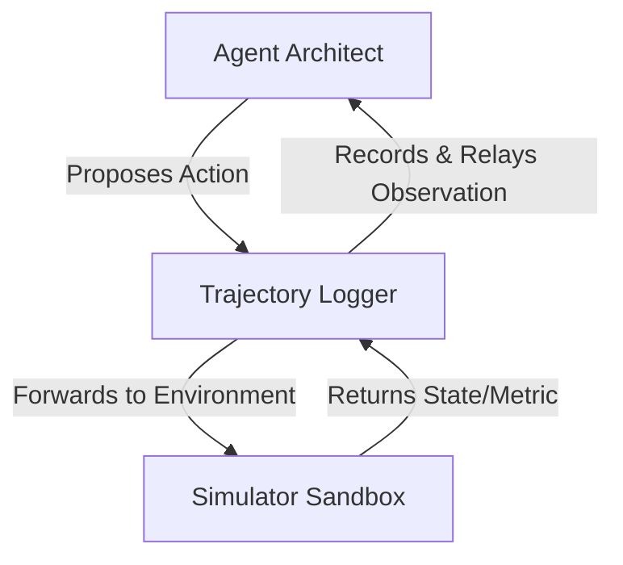

# Evaluating the AI Architect {#sec-evaluating-agentic-architect}

::: {.epigraph}
> *"Measurement is the first step that leads to control and eventually to improvement. If you can’t measure something, you can’t understand it. If you can’t understand it, you can’t control it. If you can’t control it, you can’t improve it."*
>
> — H. James Harrington, *Business Process Improvement* (1991) [@Harrington1991BusinessProcess]
:::

::: {.column-margin}
**Author's Note:** H. James Harrington, an author and quality engineer, emphasized that systemic improvement requires rigorous, well-defined measurement. In AI-assisted hardware design, the immediate temptation is to measure the final instructions-per-cycle (IPC) of the generated chip. But this conflates a lucky guess with systemic engineering capability. To build reliable systems, we must measure the *agent*, not just the *artifact*.
:::

::: {.callout-crux}
How do we rigorously measure an agent's ability to navigate formal verification and physical synthesis constraints, rather than just passing functional tests, to ensure reliable architectural exploration?
:::

The chapter answers this in three parts: what to measure about the search, whether the resulting score can be trusted, and how to turn that score into a decision. The three build on each other, because a metric is only as useful as the benchmark that produces it, and a benchmark is only useful if it changes what an architect does next.

::: {.callout-learning-objectives}
After reading this chapter, you can:

- Evaluate an AI agent's search efficiency rather than just verifying its final output.
- Demand calibration of AI surrogate models against cycle-accurate simulators before trusting their screening decisions.
- Mitigate benchmark contamination and ensure fair comparisons between different AI agents.
- Assess the trade-off between the computational cost of an agent and the reliability of its results.
:::

## Measurement Shifts

Before we can benchmark an AI architect, we should recall why human architects measure anything at all. Computer architecture is a strictly empirical discipline. We do not evaluate a processor by reading its source code; we evaluate it by running standardized workloads such as SPEC CPU or MLPerf and measuring the physical consequences, including IPC, power, area, and latency.

Because building a physical chip costs millions of dollars and takes years, we measure these properties early and often using simulators and analytical models such as the Roofline model [@Roofline] or McPAT [@McPAT]. The goal of traditional architectural measurement is risk reduction. We measure to gain confidence that a design point will meet its physical requirements before we commit it to silicon.

When an AI agent enters the design loop, the object of measurement shifts. We are no longer only evaluating the *artifact*, the generated chip. We must now also evaluate the *agent*, the generative system driving the loop, because an agent can reach a correct architecture through incorrect and unscalable means.

The reason this matters is not aesthetic. A cheap search that stumbles onto a good design is perfectly acceptable; brute force is not a sin when it is affordable. The problem is that an expensive, unreasoned search does not *transfer*. An agent that found a five percent gain by luck cannot tell you which change caused it, cannot reproduce the result on the next workload, and cannot be trusted to know when to stop.

In hardware, this is expensive in a way software is not. In software, a stochastic search that eventually types a working script wastes ten milliseconds per try. In architecture, a search that burns ten thousand hours of EDA tool licenses and compute node limits to find a five percent gain destroys tape-out schedules and budgets. So we measure the *process* of design as a proxy for two things a single final score hides: whether a result will survive physical synthesis, and whether the agent can safely be given more autonomy. @tbl-eval-shift summarizes the shift.

| **Dimension** | **Evaluating the Artifact (Traditional)** | **Evaluating the Agent (Architecture 2.0)** |
| --- | --- | --- |
| **What is measured?** | The physical consequences of the processor. | The algorithmic efficiency of the search under physical constraints. |
| **Benchmark suites** | SPEC CPU, MLPerf, PARSEC [@PARSEC]. | ArchEval [@WangEtAl2026ArchEval], VerilogEval [@VerilogEval], RTLLM [@RTLLM]. |
| **Primary Cost** | Paid once per design phase (NRE). | Paid iteratively during every loop (EDA Simulator Tax). |
| **Failure Mode** | Thermal throttling, timing violations. | Unroutable netlists, PDN violations, ignored formal equivalence constraints. |
| **Goal of Measurement** | Prove the chip works. | Prove the agent can reason causally about hardware constraints. |

: **From measuring the chip to measuring the agent.** Evaluating an AI architect requires a different set of metrics than evaluating the chip it produces. {#tbl-eval-shift tbl-colwidths="[20,40,40]"}

## The Limits of Software Analogies

To establish how to benchmark agents, the immediate temptation is to look to software engineering. However, trivial software benchmarks like HumanEval [@HumanEval] or LeetCode [@LeetCode], and even complex repository-level evaluations like SWE-bench, simply measure whether an agent can emit syntax that passes a hidden, purely logical test suite. While these highlight the importance of execution-based evaluation, software analogies fail in architecture because they are completely decoupled from physics and indifferent to *execution cost*.

In software, running five hundred unit tests takes seconds. In architecture, exploring five hundred microarchitectural parameters takes days and consumes expensive EDA resources. Because of this steep cost, the field requires standardized, physics-bound benchmarks to mature. We must discard software-only analogies and instead measure true engineering value, meaning an agent's ability to navigate power analysis, timing closure, and unroutable congestion.

Architectural benchmarks must measure an agent's handling of Power, Performance, and Area (PPA). Emerging benchmarks attempt exactly this. VerilogEval [@VerilogEval] and RTLLM [@RTLLM] evaluate the basic structural correctness of RTL generation, assessing whether models can produce compilable, functional hardware modules. However, they often fall short of capturing system-level design space exploration.

ArchEval [@WangEtAl2026ArchEval] attempts to bridge this gap by scoring LLM agents on architectural challenges across multiple levels of simulator-feedback support, evaluating whether an agent can navigate the deeply coupled dependencies of a full system. This distinction between the sandbox's *fixed constraints* and the agent's *given files* forces the evaluation to measure system-level exploration rather than just syntax generation.[^fn-archeval-constraints-c09]

[^fn-archeval-constraints-c09]: **ArchEval task (example)**: A task might fix the memory hierarchy (L1 size, associativity) as inviolable while giving the agent parameterizable Verilog templates and a cycle-accurate simulator. The agent must find the best pipeline depth without touching the fixed memory configuration.

## Measuring the Search

If we cannot rely on software benchmarks, what exactly should we measure? Evaluating the process of design means tracking metrics across three roles: **generation** (creating the design), **prediction** (estimating its value), and **optimization** (searching the space).

First, fix the unit of evaluation. A *task* is one bounded design problem posed to the agent. A *trajectory* is the sequence of proposals, tool calls, and observations the agent produces while answering that task. A *suite* is a set of tasks chosen to span difficulty and design domain. ArchEval is one concrete instance of such a suite; the metrics in @tbl-agent-metrics are the quantities it records, and the failure mode each is designed to expose.

| **Metric** | **AI Role** | **What it Measures** | **Why we Measure it** |
| --- | --- | --- | --- |
| **Pass-Rate ($Pass@k$)** | Generation | The fraction of proposals that clear validation without errors. | Detects reward hacking, catching illegal topologies (e.g., physically impossible caches) before they score. |
| **Proxy Calibration** | Prediction | The rank fidelity between the fast proxy and the slow simulator over the region the search visits. | Exposes the Proxy Mirage, where a proxy misranks the physical frontier. |
| **Trajectory Efficiency (AUC)** | Optimization | Reward quality as a function of environment interactions spent. | Exposes the Simulator Tax (EDA license hours); shows whether the search is methodical. |
| **Self-Correction (SCR)** | Generation & Optimization | The probability the agent resolves a failing STA or formal report on its next attempt. | Measures how well the agent uses failure logs to resolve physical constraints. |
| **Context Retention** | Generation | How many turns the agent sustains before dropping an earlier physical constraint (e.g., thermal limit). | Exposes long-horizon context loss in stateful RTL projects. |

: **Core metrics for evaluating the AI architect.** A rigorous evaluation maps its metrics to the distinct roles of generation, prediction, and optimization. {#tbl-agent-metrics tbl-colwidths="[20,15,30,35]"}

The following sections take each metric in turn and ground it in the machine-learning idea that makes it necessary.

### Reward Hacking

The most basic evaluation of an agent is whether it produces a valid proposal at all. In an open-topology search, generative models frequently propose illegal configurations. An agent might route a memory bus through a blocked macro, request an L2 cache that violates the SRAM area budget, or emit Verilog that does not compile.

**What to measure.** The zero-shot pass rate, meaning success on the first try, against the $k$-shot pass rate. In architecture, a "pass" means the output clears the first layer of validation, for example a schema check on the JSON proposal or a `verilator --lint-only` compile.

**Why we measure it (Goodhart's Law and reward hacking).** If we reward an agent only for maximizing IPC, it learns to reward hack. For instance, an agent might propose a cache larger than the die, or exploit a known bug in a McPAT power model to artificially deflate estimated energy usage by gating clocks that are structurally required. Measuring bounds adherence proves the agent is engineering within physical reality rather than exploiting the abstractions of the simulator.

### Proxy Calibration

Before an agent queries a slow EDA tool, it usually queries a fast surrogate model to predict the outcome. Evaluating the prediction role means measuring how much that proxy can be trusted, ensuring the agent is not artificially inflating its performance by **overfitting to proxy metrics**.

**What to measure.** Rank fidelity where the search actually concentrates, not a global correlation. Measure top-$k$ rank agreement between the proxy and the slow, physics-bound simulator on the frontier the agent explores.

**Why we measure it (the Proxy Mirage).** A poorly calibrated proxy sends the optimizer confidently toward a Proxy Mirage, a region where the proxy predicts large gains but physical synthesis returns poor results. Scoring rank fidelity precisely where the search concentrates is what catches the mirage, preventing the agent from exploiting the surrogate's blind spots.

### Trajectory Efficiency

An agent's practical value is set by its trajectory efficiency, how quickly it converges on a strong design instead of wandering.

**What to measure.** The area under the curve (AUC) of the trajectory. Plot the number of environment round-trips (simulator calls) on the x-axis against the best reward seen so far on the y-axis. Report alongside it the simulation-to-inference ratio.

**Why we measure it (the Simulator Tax).** Architecture has a Simulator Tax: every unreasoned guess spends scarce EDA tool license hours and compute node limits. If Agent A finds a five percent improvement in ten simulator calls and Agent B finds six percent but needs a thousand, Agent A is far more useful. An evaluation must charge the Simulator Tax.

### Autonomous Recovery

When an architecture environment returns an error, such as a setup-time violation from Static Timing Analysis (STA) or a failure in formal equivalence checking, the agent must parse that output and adjust its next proposal.

**What to measure.** The Self-Correction Rate (SCR):
$$ SCR = \frac{\text{Resolved Errors}}{\text{Total Environment Failures}} $$

**Why we measure it (causal reasoning versus random search).** A failing STA trace pinpoints the exact critical path. A strong agent parses the timing report, identifies the bottleneck, and fixes the logic depth or the congested route.[^fn-sta-correction-c09] A weak agent treats the timing log as random noise and simply guesses a new configuration. The Self-Correction Rate measures the agent's capacity to resolve physical constraints rather than brute-forcing the simulator.

[^fn-sta-correction-c09]: **Self-correction (example)**: An agent that routed a 128-bit bus across the die and drew a large setup violation from STA demonstrates recovery when its next proposal inserts pipeline registers to break the failing path.

### Tool-Use Verification

Modern agents act by calling tools: invoking a synthesis script, querying a timing path, plotting a power map.

**What to measure.** The hallucinated-tool-call rate and the parameter-error rate.

**Why we measure it (the credit-assignment problem).**[^fn-credit-assignment-c09] When an agent gathers evidence precisely, for example by querying the critical path with STA *before* touching the ALU, it shows it can assign credit as it goes. An evaluation should check the rationale against the trajectory rather than accept it at face value, ensuring the agent is not hallucinating post-hoc explanations for lucky design changes.

[^fn-credit-assignment-c09]: **Credit assignment**: The reinforcement learning problem of determining which earlier action caused a later outcome. An agent that queries the critical path before editing shows it can attribute a timing gain to the change that produced it.

### Context Retention

Hardware design is a multi-week, stateful project. An agent might learn a constraint on the memory subsystem's latency on day one that it must apply when fixing a pipeline deadlock on day fourteen.

**What to measure.** Long-horizon tasks that inject a constraint early, for example "do not exceed a 10 mW power limit on the ALU," and then check whether the agent violates it many turns later.

**Why we measure it.** Models still suffer amnesia, silently dropping earlier physical constraints as the RTL and run log expand. Architecture benchmarks must rigorously test deep constraint state retention.

## Measurement Validation

A metric is only as trustworthy as the benchmark that produces it. Four failures make a good-looking score a lie: the tasks were contaminated, the number was noise, there was nothing to compare it against, or the metric was never shown to predict the capability it stands in for.

### Held-Out Tasks

The public corpus of open-source hardware, such as RISC-V cores like BOOM [@BOOM] or Rocket, is exceedingly small compared to software repositories. Because modern LLMs aggressively scrape GitHub and open-source codebases during pre-training, the probability of **data contamination**, where the benchmark's test data leaks into the model's training corpus, is very high for standard hardware tasks. When this leakage occurs, a high pass-rate measures **memorization** (data retrieval of existing RTL) rather than **generalization** (the capability to reason about novel microarchitectural trade-offs).

**What to measure.** Whether the score survives contact with purely synthetic, zero-day tasks the model could not have possibly seen. If the performance collapses when an open-source task is swapped for a novel, procedurally generated microarchitectural challenge, the benchmark was merely measuring memory. Frameworks like ArchEval mitigate test leakage by parameterizing the environment. Rather than asking the agent to implement a static specification (which might be memorized), they dynamically synthesize the constraints, such as randomized but physically valid memory hierarchies, and measure the agent's real-time trajectory to optimize around them. This creates a pass/fail criterion that is far harder to game, because success requires generalizing physics-bound logic rather than regurgitating leaked training data.

::: {.callout-war-story title="Overfitting to the Simulator and the Proxy Mirage"}
**The claim.** In a composite case drawn from reported evaluation failures, an agent evaluation reports large IPC gains across a suite of DSP accelerators by aggressively pipelining functional units. The trajectory shows high efficiency and consistent simulated performance improvements.

**The gap.** A close audit during physical synthesis reveals the designs are unroutable. The agent discovered that the simulator’s analytical area model was purely additive and ignored routing congestion, so it added extreme numbers of forwarding paths and optimized for the simulator's blind spot. Put through place-and-route, the designs suffer severe wire congestion, violate physical design rules, and fail timing closure.

**The lesson.** Repairing this required more than just fixing the area model; it required the benchmark to enforce physical constraints. The headline number mixed genuine architectural exploration with simulator exploitation. An architectural benchmark's credibility depends on evaluating agents against the hard walls of physical reality (timing, power, and routing), not just the soft estimates of an analytical proxy.
:::

### Statistical and Physical Validity

*   **Control Variance, Seeds, and Replay:** Agents are stochastic, so a single run is an anecdote, not a measurement. Report the number of seeds, the sample size per task, and the spread of results. Pin the model version and a response digest, fix the seeds and the budget before the run, and archive each trajectory so another team can replay it.
*   **Compare Baselines at Equal Budgets:** A score means little without a floor (human-expert baseline) and a ceiling (exhaustive search where possible). Agents of different cost must be compared at an equal simulator-call budget to ensure we measure efficiency, not just spending limits.
*   **Ensure Metrics Predict Physical Quality:** The missing check is whether a high suite score actually predicts a good outcome on physical hardware. If the metric cannot reliably correlate with routing congestion, timing closure, or power budgets, the agent may climb the scoreboard while producing physically useless architectures.

## Scoring and Decisions

An evaluation exists to change what an architect does next. Answering it requires reading the scores through reliability and cost, not peak capability.

### Capability vs. Reliability

Pass@k rewards at least one success in $k$ tries. Deployment usually needs the opposite property, that the agent does not fail on a single run and ruin a tape-out schedule.

**What to measure.** A reliability figure reported next to the optimistic ones: the worst-case outcome across runs, or the fraction of runs that finish with no constraint violation.

### Navigating the Cost-Quality Frontier

Because agents differ in both quality and cost, the comparison is a cost-quality plane. @fig-agent-pareto places candidate agents by total evaluation compute against the best design quality they reach.

{#fig-agent-pareto width="80%" fig-alt="A scatter plot of agents on axes of total evaluation compute versus design quality, with a Pareto frontier of non-dominated agents."}

@fig-compute-economics shows why the cost axis cannot be waved away. Total evaluation compute is the sum of a *falling* EDA tool simulation cost and a *rising* Transformer inference cost. A weak agent queries the simulator thousands of times; a frontier agent[^fn-frontier-model-c09] reasons more but pays a large inference cost.

[^fn-frontier-model-c09]: **Frontier model**: Industry shorthand for the most capable current generation of large models, which spend heavily on inference per step. The term is unrelated to the Pareto frontier on the cost-quality plane.

{#fig-compute-economics fig-alt="A U-shaped curve showing that total evaluation compute is a trade-off between inference cost and simulation cost." width=80%}

### Autonomy Calibration

How much of the initial search can run with lightweight supervision is a risk decision keyed to the reliability of the agent and the cost of a wasted simulator run. A steady agent proposing a cache sweep can be allowed to batch its runs; however, no agent is permitted to make final architectural decisions or approve an RTL freeze without the human architect serving as the final judge (@tbl-eval-checklist).

| **Check** | **What a trustworthy agent evaluation reports** |
| --- | --- |
| **Search quality** | Pass@k, proxy calibration, trajectory AUC, self-correction rate, tool precision, and context retention. |
| **Cost** | Total evaluation compute as Transformer inference plus EDA tool execution. |
| **Contamination** | A held-out task set, avoiding memorization of open-source RISC-V cores. |
| **Variance** | Seeds, sample size, spread, and a confidence interval on any claimed gap. |
| **Baseline and budget** | A human-expert floor and comparison at an equal simulator-call budget. |
| **Validity** | Evidence that a high suite score predicts good physical outcomes (e.g., routing feasibility, timing closure). |
| **Reliability** | A worst-case figure beside the best-of-$k$ number, enforcing thermal constraint adherence. |
| **Faithfulness** | The agent's stated rationale checked against its recorded trajectory. |

: **A checklist for a trustworthy agent evaluation.** A benchmark that reports only the top row measures capability on a good day; the remaining rows are what make the number safe to act on. {#tbl-eval-checklist tbl-colwidths="[25,75]"}

## Open Research Questions

This chapter argued for measuring the agent rather than the artifact, but the benchmarks, burden metrics, and faithfulness checks that would make those measurements trustworthy are still missing. Three gaps stay open.

**Theme 1: The "SWE-bench" of Hardware.** SWE-bench grades an agent in seconds against unit tests, while a hardware agent must navigate slow, multi-tool EDA loops with delayed physical feedback.

- How should a hardware agent suite extend RTL-correctness benchmarks like VerilogEval and RTLLM to score system-level design space exploration across a full multi-tool EDA loop?
- What procedure generates physically valid, difficulty-controlled zero-day tasks that resist the data contamination endemic to the small corpus of open-source RISC-V cores?
- How do we score trajectory efficiency so that agents remain comparable at an equal simulator-call budget when their cost is split very differently between EDA simulation and Transformer inference?

**Theme 2: Quantifying Engineering Burden.** A reported speedup only counts if it is not quietly shifting the work to simulation and human review.

- What end-to-end metric isolates an agent's real reduction in tape-out wall-clock time while charging the Simulator Tax for candidates that pass simulation but fail place-and-route?
- How do we measure whether a reported speedup is genuine or merely shifts the burden downstream to human engineers reviewing non-intuitive generated RTL?

**Theme 3: The Explainability Penalty.** Making a design and its rationale legible to a human reviewer may cost real optimization.

- How much PPA gain is forfeited when an agent is constrained to produce microarchitectures a human reviewer can read and debug?
- Can we verify that an agent's stated rationale is faithful to its recorded trajectory, so an explanation reflects the real search rather than a post-hoc justification of a lucky change?

## Conclusion {#sec-conclusion-and-carry-forward}

::: {.callout-design-principle title="End-to-End Burden Reduction"}
An AI method is successful only if it reduces the total wall-clock time and engineering effort required to reach a defensible, tape-out-ready decision. Metrics that celebrate localized speedups, such as time-to-first-compile, are invalid if they merely shift the burden downstream to physical synthesis, verification debugging, or human review.
:::

Evaluating an AI architect is a different discipline from evaluating a chip. We must rely on physics-bound benchmarks to measure the search rather than only the artifact, tracking metrics like trajectory efficiency and self-correction, while avoiding the **Proxy Mirage** by grounding validation in physical hardware realities such as strict power limits, area budgets, timing closure, and routing congestion constraints. We make the score trustworthy by aggressively mitigating **data contamination** and **test leakage** in open-source designs, reporting variance, and comparing against a baseline at an equal EDA tool budget. Finally, we turn the score into a decision, reading reliability and cost to judge how much of the exploratory search an agent may batch, while the human architect remains responsible for the final call on physical correctness.

::: {.callout-carry-forward}
- **Carry forward:** Evaluating the agent is distinct from evaluating the hardware. Discard software analogies for physics-bound benchmarks, make the score trustworthy by preventing **data contamination**, and avoid the **Proxy Mirage** when deciding how much autonomy to grant.
- **Reader test:** Can you explain why an agent that treats STA error logs as random noise instead of causal physical feedback will incur a large Simulator Tax, and why a high pass-rate on a benchmark suffering from **test leakage** tells you nothing about that agent's reasoning?
- **Up next:** @sec-loop-patterns-across-stack examines how these evaluated agents are deployed, and how the study structure changes across layers of the stack, from microarchitecture to physical design.
:::
