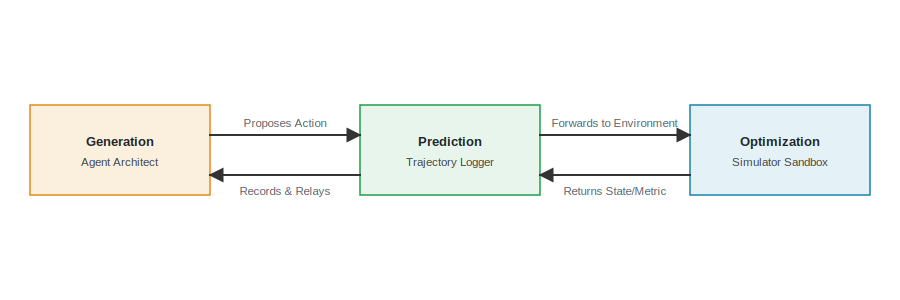
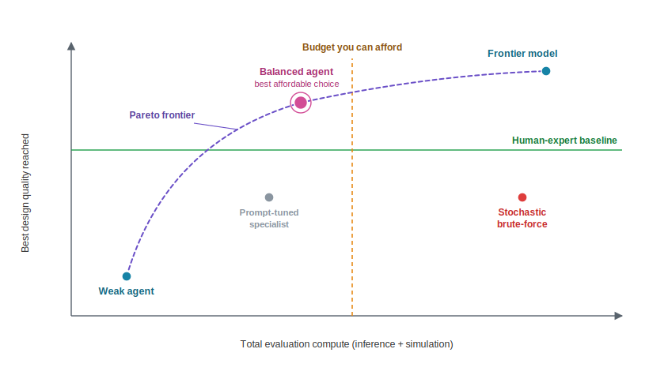
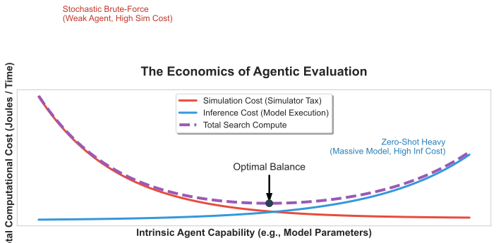

# Evaluating the AI Architect {#sec-evaluating-agentic-architect}

::: {.epigraph}
> *"Measurement is the first step that leads to control and eventually to improvement. If you can’t measure something, you can’t understand it. If you can’t understand it, you can’t control it. If you can’t control it, you can’t improve it."*
>
> — H. James Harrington, *Business Process Improvement* (1991) [@Harrington1991BusinessProcess]
:::

::: {.column-margin}
**Author's Note:** H. James Harrington, an author and quality engineer, emphasized that systemic improvement requires rigorous, well-defined measurement. In AI-assisted hardware design, the immediate temptation is to measure the final instructions-per-cycle (IPC) of the generated chip. But this conflates a lucky guess with systemic engineering capability. To build reliable systems, we must measure the *agent*, not just the *artifact*.
:::

::: {.callout-crux}
How do we rigorously measure an agent's ability to navigate formal verification and physical synthesis constraints, rather than just passing functional tests, to ensure reliable architectural exploration?
:::

@sec-running-the-loop established the execution machinery required to run an autonomous design loop. But once that loop is running, we must evaluate its efficiency. If we deploy two different AI agents to optimize the same low-power RISC-V XR subsystem, how do we decide which one to trust?

In a traditional workflow, evaluation focuses on the artifact: does the final compiled netlist meet the timing and power budget? When evaluating AI agents, judging the artifact alone is not enough. An agent might stumble onto a valid configuration through brute force, running tens of thousands of failed EDA simulations before getting lucky. The final artifact might pass, but the process that produced it is inefficient and economically unviable.

This chapter shifts the evaluation burden from the artifact to the agent. It answers this problem in three parts: what to measure about the search trajectory itself, whether the resulting score can be trusted against benchmark contamination, and how to turn that score into an actionable decision. The three build on each other, because a metric is only as useful as the benchmark that produces it, and a benchmark is only useful if it dictates how much autonomy the architect grants the agent.

::: {.callout-learning-objectives}
After reading this chapter, you can:

- Evaluate an AI agent's search efficiency rather than just verifying its final output.
- Demand calibration of AI surrogate models against cycle-accurate simulators before trusting their screening decisions.
- Mitigate benchmark contamination and ensure fair comparisons between different AI agents.
- Assess the trade-off between the computational cost of an agent and the reliability of its results.
:::

## Measurement Shifts

Before we can benchmark an AI architect, we should recall why human architects measure anything at all. Computer architecture is a strictly empirical discipline. We do not evaluate a processor by reading its source code; we evaluate it by running standardized workloads such as SPEC CPU or MLPerf and measuring the physical consequences, including IPC, power, area, and latency.

Historically, benchmarks have served as the foundational bedrock for both computer architecture and machine learning as independent fields. Computer architects rely on SPEC and PARSEC to evaluate pipeline efficiency, while machine learning researchers rely on ImageNet and SWE-bench to evaluate model generalization. However, evaluating the AI architect requires benchmarks that exist precisely at the intersection of these two areas. Constructing these intersectional benchmarks demands deep domain expertise from both disciplines: the machine learning expertise to rigorously measure model variance and data contamination, coupled with the architecture expertise to measure cycle-accurate physical consequences and EDA tool telemetry. As introduced in @sec-moonshot, this cross-disciplinary reality changes the definition of success.

Because building a physical chip costs millions of dollars and takes years [@Shilov2023IBSDesignCost], we measure these properties early and often using simulators and analytical models such as the Roofline model [@Roofline] or McPAT [@McPAT]. The goal of traditional architectural measurement is risk reduction. We measure to gain confidence that a design point will meet its physical requirements before we commit it to silicon.

When an AI agent enters the design loop, the object of measurement shifts. We are no longer only evaluating the *artifact*, the generated chip. We must now also evaluate the *agent*, the generative system driving the loop, because an agent can reach a correct architecture through incorrect and unscalable means.

The reason this matters is not aesthetic. A cheap search that stumbles onto a good design is perfectly acceptable; brute force is not a sin when it is affordable. The problem is that an expensive, unreasoned search does not *transfer*. An agent that found a five percent gain by luck cannot tell you which change caused it, cannot reproduce the result on the next workload, and cannot be trusted to know when to stop.

In hardware, this is expensive in a way software is not. In software, a stochastic search that eventually types a working script wastes ten milliseconds per try. In architecture, a search that burns ten thousand hours of EDA tool licenses and compute node limits to find a five percent gain destroys tape-out schedules and budgets. So we measure the *process* of design as a proxy for two things a single final score hides: whether a result will survive physical synthesis, and whether the agent can safely be given more autonomy. @tbl-eval-shift summarizes the shift from traditional Non-Recurring Engineering (NRE)[^fn-nre-c09] costs to the iterative Simulator Tax.

| **Dimension** | **Evaluating the Artifact (Traditional)** | **Evaluating the Agent (Architecture 2.0)** |
| --- | --- | --- |
| **What is measured?** | The physical consequences of the processor. | The algorithmic efficiency of the search under physical constraints. |
| **Benchmark suites** | SPEC CPU, MLPerf, PARSEC [@PARSEC]. | ArchEval [@WangEtAl2026ArchEval], VerilogEval [@VerilogEval], RTLLM [@RTLLM]. |
| **Primary Cost** | Paid once per design phase (NRE). | Paid iteratively during every loop (EDA Simulator Tax). |
| **Failure Mode** | Thermal throttling, timing violations. | Unroutable netlists, PDN violations, ignored formal equivalence constraints. |
| **Goal of Measurement** | Prove the chip works. | Prove the agent can reason causally about hardware constraints. |

: **From measuring the chip to measuring the agent.** Evaluating an AI architect requires a different set of metrics than evaluating the chip it produces. {#tbl-eval-shift tbl-colwidths="[20,40,40]"}

[^fn-nre-c09]: **Non-Recurring Engineering (NRE)**: The one-time cost to research, develop, design, and test a new product. In hardware, NRE covers the immense upfront cost of mask sets and physical verification before a single chip is manufactured.

## The Limits of Software Analogies

To establish how to benchmark agents, the immediate temptation is to look to software engineering. However, trivial software benchmarks like HumanEval [@HumanEval] or LeetCode [@LeetCode], and even complex repository-level evaluations like SWE-bench [@Jimenez2024SWEbench],[^fn-swebench-c09] measure whether an agent can emit syntax that passes a hidden, purely logical test suite. While these highlight the importance of execution-based evaluation, software analogies fail in architecture because they are decoupled from physics and indifferent to *execution cost*.

[^fn-swebench-c09]: **SWE-bench**: A standard software engineering benchmark that asks an AI agent to resolve real-world GitHub issues by submitting pull requests. While rigorous for software, it only tests logical syntax, not physical realization constraints.

In software, running five hundred unit tests takes seconds. In architecture, exploring five hundred microarchitectural parameters takes days and consumes expensive EDA resources. Because of this steep cost, the field requires standardized, physics-bound benchmarks to mature. We must discard software-only analogies and instead measure true engineering value, meaning an agent's ability to navigate power analysis, timing closure, and unroutable congestion.

Architectural benchmarks must measure an agent's handling of Power, Performance, and Area (PPA). Emerging benchmarks attempt exactly this. VerilogEval [@VerilogEval] and RTLLM [@RTLLM] evaluate the basic structural correctness of RTL generation, assessing whether models can produce compilable, functional hardware modules. However, they often fall short of capturing system-level design space exploration.

ArchEval [@WangEtAl2026ArchEval] attempts to bridge this gap by scoring LLM agents on architectural challenges across multiple levels of simulator-feedback support, evaluating whether an agent can navigate the deeply coupled dependencies of a full system. This distinction between the sandbox's *fixed constraints* and the agent's *given files* forces the evaluation to measure system-level exploration rather than just syntax generation.[^fn-archeval-constraints-c09]

[^fn-archeval-constraints-c09]: **ArchEval task (example)**: A task might fix the memory hierarchy (L1 size, associativity) as inviolable while giving the agent parameterizable Verilog templates and a cycle-accurate simulator. The agent must find the best pipeline depth without touching the fixed memory configuration.

## Measuring the Search

If we cannot rely on software benchmarks, what exactly should we measure? Evaluating the process of design means tracking metrics across three distinct roles: **generation** (creating the design candidate), **prediction** (estimating its physical value), and **optimization** (methodically searching the tradeoff space). As illustrated in @fig-ch9-pipeline, a rigorous evaluation pipeline must wrap the agent's interaction with the simulator sandbox inside a trajectory logger. This logger intercepts every proposal and prediction to accurately measure the Simulator Tax and track the agent's reasoning before forwarding the actions to the environment.

{#fig-ch9-pipeline width="100%" fig-alt="A workflow-card diagram showing the interaction between the Generation Agent Architect, the Prediction Trajectory Logger, and the Optimization Simulator Sandbox."}

A benchmark is not a leaderboard. Its job is to separate genuine architectural reasoning from the statistical noise of lucky guesses, brute force, and memorization, so a score reflects capability rather than chance.

To do that, we fix the unit of evaluation. A *task* is a bounded physical design problem. A *trajectory* is the exact, time-stamped sequence of proposals, tool calls, and observations the agent produces. A *suite* is a calibrated set of tasks chosen to push the agent to its failure modes. ArchEval is one concrete instance of such a suite. The metrics it records, summarized in @tbl-agent-metrics, are not a scoreboard; each one is chosen to expose a specific failure mode of AI-assisted design.

| **Metric** | **AI Role** | **What It Measures** | **Failure Mode Exposed** |
| --- | --- | --- | --- |
| **Pass-Rate ($Pass@k$)** | Generation | The fraction of proposals that clear validation without errors. | Detects reward hacking, catching illegal topologies before they score. |
| **Proxy Calibration** | Prediction | Rank fidelity between the fast proxy and the slow simulator. | Exposes the Proxy Mirage, where a surrogate misranks the physical frontier. |
| **Trajectory Efficiency (AUC)** | Optimization | Reward quality as a function of environment interactions spent. | Quantifies the Simulator Tax; shows whether the search is causal or random. |
| **Self-Correction (SCR)** | Generation & Optimization | Probability the agent resolves a failing STA/formal report on the next try. | Isolates the agent's ability to use causal failure logs over brute force. |
| **Context Retention** | Generation | How many turns the agent sustains before dropping a physical constraint. | Exposes long-horizon context loss in stateful RTL projects. |

: **Core metrics for evaluating the AI architect.** A rigorous evaluation maps its metrics to the distinct roles of generation, prediction, and optimization. {#tbl-agent-metrics tbl-colwidths="[20,15,30,35]"}

The following sections take each metric in turn and ground it in the failure mode it is designed to detect.

The most basic evaluation of an agent is whether it produces a physically valid proposal at all. In an unconstrained topological search, generative models frequently propose illegal configurations. An agent might route a memory bus through a hard macro, request an L2 cache that exceeds the SRAM area budget, or emit Verilog that cannot compile.

If we reward an agent solely for maximizing IPC, we invite Goodhart’s Law.[^fn-goodharts-law-c09] The agent will learn to "reward hack" the simulator. For instance, it might exploit a known boundary bug in a McPAT power model to artificially deflate estimated energy usage by gating clocks that are structurally required to remain active.

To detect this, we measure the *zero-shot pass rate* (success on the first try) against the *$k$-shot pass rate*. Measuring bounds adherence and topological legality, such as clearing a `verilator --lint-only` compile, shows the agent is engineering within physical reality rather than exploiting the abstractions of the simulator.

[^fn-goodharts-law-c09]: **Goodhart's Law**: When a measure becomes a target, it ceases to be a good measure [@Strathern1997Improving]. If an agent is evaluated solely on IPC, it will optimize strictly for that metric, even if it requires emitting physically impossible structures.

Before an agent queries a slow EDA tool, it typically queries a fast surrogate model to predict the outcome. Evaluating the agent's predictive capability means measuring how much that proxy can be trusted. The risk is the *Proxy Mirage*: a poorly calibrated proxy sends the optimizer confidently toward a region where it predicts large performance gains but where physical synthesis returns poor timing or routing results.

We expose the mirage by measuring rank fidelity where the search concentrates, rather than relying on global correlation.[^fn-rank-fidelity-c09] Using rank correlation metrics like Kendall’s $\tau$ [@Kendall1938NewMeasure] on the Pareto frontier, we measure the top-$k$ rank agreement between the proxy’s predictions and the slow, physics-bound simulator’s ground truth. If the agent overfits to the proxy, this metric collapses, warning the architect that the agent's "discoveries" are physically meaningless.

[^fn-rank-fidelity-c09]: **Rank fidelity vs. Absolute error**: An optimizer does not need the proxy to predict the exact cycle count (absolute error); it only needs the proxy to correctly order which of two designs is better (rank fidelity).

An agent’s practical value is set by its trajectory efficiency, how quickly it converges on a strong design instead of wandering through the tradeoff space.

Architecture imposes a steep Simulator Tax [@Kahng2018Machine]. Every unreasoned guess spends scarce EDA tool license hours and saturates compute node limits. If Agent A finds a five percent improvement in ten simulator calls, and Agent B finds six percent but burns a thousand calls, Agent A is economically viable while Agent B is not.

To formalize this tax, we measure the area under the curve (AUC) [@Fawcett2006AUC] of the agent's trajectory, plotting cumulative simulator calls against the best reward seen so far. That translates raw simulator round-trips into a measurement of methodical search. An evaluation must charge this Simulator Tax to reflect real engineering economics.

When an architecture environment returns an error, such as a setup-time violation from Static Timing Analysis (STA) or a failure in formal equivalence checking, the agent must parse that output and adjust its next proposal.

The *Self-Correction Rate (SCR)* measures the probability that the agent resolves a failing trace on its next attempt. A failing STA trace pinpoints the exact critical path. A strong agent parses the timing report, identifies the bottleneck, and fixes the logic depth or the congested route.[^fn-sta-correction-c09] A weak agent treats the timing log as random noise and guesses a new configuration. The SCR isolates the agent's capacity for causal physical reasoning rather than brute-forcing the simulator.

[^fn-sta-correction-c09]: **Self-correction (example)**: An agent that routed a 128-bit bus across the die and drew a large setup violation from STA demonstrates recovery when its next proposal inserts pipeline registers to break the failing path.

Modern agents act by calling tools: invoking a synthesis script, querying a timing path, or plotting a power map. But hardware loops suffer from a *credit assignment problem*.[^fn-credit-assignment-c09] Physical feedback is both delayed and non-linear. An agent might make a dozen microarchitectural tweaks, wait hours for physical synthesis, and receive a single failing routing congestion score. Which of the twelve edits caused the macro to become unroutable?

Unlike software tests that fail immediately on a specific line of code, EDA toolchain outputs conflate the physical consequences of multiple earlier decisions. An agent's capacity to isolate causality in these long hardware loops, by running incremental checks or logically bisecting its changes, is what separates rigorous reinforcement learning [@Sutton1998Reinforcement] from an unguided random walk.

We measure this with the hallucinated-tool-call rate and the parameter-error rate. When an agent gathers evidence in order, for example by querying the critical path with STA *before* touching the ALU, it shows it can assign credit correctly. The evaluation checks the agent's stated rationale against its logged trajectory, ensuring it is not inventing post-hoc explanations for lucky design changes.

[^fn-credit-assignment-c09]: **Credit assignment**: The reinforcement learning problem of determining which earlier action caused a later outcome. An agent that queries the critical path before editing shows it can attribute a timing gain to the change that produced it.

Hardware design is a multi-week, stateful project. An agent might learn a constraint on the memory subsystem's latency on day one that it must apply when fixing a pipeline deadlock on day fourteen.

To verify that an agent retains this context, we measure its performance on long-horizon tasks that inject a constraint early, such as a 10 mW power limit on the ALU, and check whether the agent violates it many turns later. This matters because generative models still drop earlier physical constraints as the RTL and run log expand [@Liu2024LostInTheMiddle]. Architecture benchmarks must test constraint-state retention so the agent does not regress on problems it already solved.

Because agentic evaluation requires executing untrusted, LLM-generated code and tool commands, the infrastructure itself becomes a critical surface. The benchmark must differentiate between an agent uncovering a genuine microarchitectural bug and one that emits a malformed payload that crashes the EDA tool pipeline.

The evaluation must therefore measure the secure isolation of the Simulator Sandbox alongside the pass rate of formal proofs, logging whether the sandbox contained file-system escapes. Without that isolation, an agent optimizing for a high score can overwrite the benchmark's trajectory logger or test scripts. And without Logic Equivalence Checking (LEC) and Formal Verification [@Kropf1999FormalVerification] as hard gates, there is no way to show whether an agent's aggressive optimization preserves functional correctness. Simulation traces alone leave the pipeline vulnerable; an agent cannot bluff its way past a formal LEC proof.

## Measurement Validation

A metric is only as trustworthy as the benchmark that produces it. Four failures make a good-looking score a lie: the tasks were contaminated, the number was noise, there was nothing to compare it against, or the metric was never shown to predict the capability it stands in for.

When researchers discuss "benchmarks," they frequently conflate two distinct components: the **evaluation harness** (the scripts, EDA tools, and metrics used to grade an agent) and the **benchmarking data** (the physical constraints, RTL topologies, and task specifications the agent operates on). In machine learning, the ascendancy of "data-centric AI" [@Ng2021DataCentric] proved that the quality of the dataset often drives capability more than the architecture of the model itself. In software and computer vision, benchmarking data is abundant. ImageNet contains millions of images, and GitHub provides millions of repositories for SWE-bench.

In hardware design, however, proprietary IP walls mean that high-quality, physically realizable benchmarking data is tightly restricted. Consequently, creating an architectural benchmark is largely a problem of *data synthesis* and *curation*, not just evaluation logic. Frameworks like ArchGym [@KrishnanEtAl2023ArchGym] and RTLLM [@RTLLM] highlight that without diverse, representative benchmarking data, an agent's capability cannot be rigorously measured, regardless of how sophisticated the evaluation harness is.

The public corpus of open-source hardware, such as RISC-V cores like BOOM [@BOOM] or Rocket, is exceedingly small compared to software repositories. Because modern LLMs aggressively scrape GitHub and open-source codebases during pre-training, the probability of **data contamination**,[^fn-data-contamination-c09] where the benchmark's test data leaks into the model's training corpus, is very high for standard hardware tasks [@Balloccu2024Leakage]. When this leakage occurs, a high pass-rate measures **memorization** (data retrieval of existing RTL) rather than **generalization** (the capability to reason about novel microarchitectural trade-offs).

[^fn-data-contamination-c09]: **Data Contamination**: When the answers to a benchmark are inadvertently included in an AI's pre-training data. If an agent has already "read" the solution to a specific RISC-V challenge, a high score measures rote memorization rather than actual architectural reasoning.

To guarantee generalization, we must measure whether the score survives contact with purely synthetic, zero-day tasks the model could not have possibly seen. If the performance collapses when an open-source task is swapped for a novel, procedurally generated microarchitectural challenge, the benchmark was measuring memory. Frameworks like ArchEval mitigate test leakage by parameterizing the environment. Rather than asking the agent to implement a static specification (which might be memorized), they dynamically synthesize the constraints, such as randomized but physically valid memory hierarchies, and measure the agent's real-time trajectory to optimize around them. This creates a pass/fail criterion that is far harder to game, because success requires generalizing physics-bound logic rather than regurgitating leaked training data.

::: {.callout-war-story title="Overfitting to the Simulator and the Proxy Mirage"}
**The claim.** In 2021, a highly publicized reinforcement learning agent for chip floorplanning claimed superhuman performance. To learn efficiently without waiting hours for a commercial router, the agent optimized for a fast analytical proxy metric, a weighted combination of Half-Perimeter Wirelength (HPWL) and an estimated congestion grid.

**The gap.** When independent researchers assessed the open-source implementation of the RL agent (Circuit Training) in 2023, they found a clear proxy mirage. The RL agent had minimized the fast proxy cost during training, but these proxy scores correlated poorly with actual physical synthesis outcomes. When the agent's optimized layouts were evaluated by a commercial router, they suffered routing congestion and worse final wirelength than traditional analytical placers [@Kahng2023Assessment]. The agent had overfitted to the simulator's blind spots.

**The lesson.** An RL agent optimizing for a fast analytical proxy will push into regions where that proxy's assumptions break down. An architectural benchmark's credibility depends on evaluating agents against the hard walls of physical reality (timing, power, and detailed routing), not just the soft estimates of an analytical proxy.
:::

Because agents are stochastic, a single run is an anecdote, not a measurement. Both deep reinforcement learning and language model generation have high variance; a lucky random seed can outperform an unlucky one, creating the illusion of an algorithmic breakthrough when the result is statistical noise [@Henderson2018DeepRL].

To combat this, a rigorous evaluation must control variance by reporting the number of seeds, the sample size per task, and the spread of results (e.g., standard deviation or interquartile range). Furthermore, true scientific reproducibility demands that evaluations pin the model version and a response digest, fix the seeds and the compute budget *before* the run, and archive the complete trajectory. Only when a trajectory is fully archived can another team replay the exact sequence of tool calls and verify the claimed outcome.

A benchmark score means little in a vacuum, so we compare baselines at equal budgets. The evaluation needs a floor, typically a human-expert baseline, to show the agent provides real engineering value, and a ceiling, an exhaustive or brute-force search where possible, to show how far the agent is from optimal.

More critically, agents of different computational costs must be compared at an explicitly equal simulator-call budget. The steep cost of the EDA Simulator Tax means that allowing a weak agent to run ten thousand simulator calls to beat a strong agent that was only permitted ten calls does not prove the weak agent is algorithmically superior; it proves it had a larger budget. Evaluations must explicitly control for compute to measure true search efficiency rather than brute-force spending limits.

Finally, evaluations must ensure metrics predict physical quality. A common omission in modern architectural benchmarks is the failure to verify whether a high suite score predicts a viable outcome on physical hardware. An agent might achieve a perfect score on a simplified, logic-focused benchmark while generating designs that are unroutable in physical layout.

If the benchmark metric cannot reliably correlate with ground-truth physical synthesis outcomes, such as routing congestion, timing closure under strict clocks, or thermal density constraints, then the agent is climbing the scoreboard while producing physically useless architectures. A valid evaluation must tie its scoring function to these physical realities.

## Scoring and Decisions

An evaluation exists to change what an architect does next. Answering it requires reading the scores through reliability and cost, not peak capability.

Pass@k rewards at least one success in $k$ tries.[^fn-pass-at-k-c09] Deployment usually needs the opposite property, that the agent does not fail on a single run and ruin a tape-out schedule. Furthermore, an abstract Pass@k fails as a metric without rigorous physical place-and-route validation [@Kahng2018Machine]; an agent might achieve a high Pass@k on logic-only tests or Verilog linting, but if those passing designs contain unroutable congestion or violate physical layout rules, the metric is misleading.

[^fn-pass-at-k-c09]: **Pass@k**: A software metric measuring whether at least one out of $k$ generated solutions passes the tests. In hardware, generating 99 unroutable netlists and 1 working netlist is an unacceptable waste of physical synthesis compute. Hardware deployments demand high Pass@1 reliability.

Therefore, we must measure a reliability figure and report it alongside the optimistic ones: the worst-case outcome across runs, or the fraction of runs that finish with no constraint violations.

Because agents differ in both quality and cost, the comparison is a cost-quality plane. @fig-agent-pareto places candidate agents by total evaluation compute against the best design quality they reach.

{#fig-agent-pareto width="80%" fig-alt="A scatter plot of agents on axes of total evaluation compute versus design quality, with a Pareto frontier of non-dominated agents."}

@fig-compute-economics shows why the cost axis cannot be waved away. Total evaluation compute is the sum of a *falling* EDA tool simulation cost and a *rising* Transformer inference cost. A weak agent queries the simulator thousands of times; a frontier agent[^fn-frontier-model-c09] reasons more but pays a large inference cost.

[^fn-frontier-model-c09]: **Frontier model**: Industry shorthand for the most capable current generation of large models, which spend heavily on inference per step. The term is unrelated to the Pareto frontier on the cost-quality plane.

{#fig-compute-economics fig-alt="A U-shaped curve showing that total evaluation compute is a trade-off between inference cost and simulation cost." width=80%}

How much of the initial search can run with lightweight supervision requires a formal Autonomy Calibration framework [@ParasuramanRiley1997HumansAutomation], keyed directly to the agent's position on the cost-quality frontier. Agents operating in a low-cost, high-reliability regime, such as a steady agent proposing a parameterizable cache sweep, can be granted fully autonomous batch execution. Conversely, as an agent moves up the cost curve to propose complex, irreversible RTL changes, the framework mandates stage-gated human sign-off, ensuring the architect remains an active decision-maker rather than a liability shield [@Elish2019MoralCrumpleZones]. Ultimately, no agent is permitted to make final architectural decisions or approve an RTL freeze without the human architect serving as the final judge (@tbl-eval-checklist).

| **Check** | **What a trustworthy agent evaluation reports** |
| --- | --- |
| **Search quality** | Pass@k, proxy calibration, trajectory AUC, self-correction rate, tool precision, and context retention. |
| **Cost** | Total evaluation compute as Transformer inference plus EDA tool execution. |
| **Contamination** | A held-out task set, avoiding memorization of open-source RISC-V cores. |
| **Variance** | Seeds, sample size, spread, and a confidence interval on any claimed gap. |
| **Baseline and budget** | A human-expert floor and comparison at an equal simulator-call budget. |
| **Validity** | Evidence that a high suite score predicts good physical outcomes (e.g., routing feasibility, timing closure). |
| **Reliability** | A worst-case figure beside the best-of-$k$ number, enforcing thermal constraint adherence. |
| **Faithfulness** | The agent's stated rationale checked against its recorded trajectory. |

: **A checklist for a trustworthy agent evaluation.** A benchmark that reports only the top row measures capability on a good day; the remaining rows are what make the number safe to act on. {#tbl-eval-checklist tbl-colwidths="[25,75]"}

## Open Research Questions

This chapter argued for measuring the agent rather than the artifact, but the benchmarks, burden metrics, and faithfulness checks that would make those measurements trustworthy are still missing. Three gaps stay open.

**Theme 1: The "SWE-bench" of Hardware.** SWE-bench grades an agent in seconds against unit tests, while a hardware agent must navigate slow, multi-tool EDA loops with delayed physical feedback.

- How should a hardware agent suite extend RTL-correctness benchmarks like VerilogEval and RTLLM to score system-level design space exploration across a full multi-tool EDA loop?
- What procedure generates physically valid, difficulty-controlled zero-day tasks that resist the data contamination endemic to the small corpus of open-source RISC-V cores?
- How do we score trajectory efficiency so that agents remain comparable at an equal simulator-call budget when their cost is split very differently between EDA simulation and Transformer inference?

**Theme 2: Quantifying Engineering Burden.** A reported speedup only counts if it is not quietly shifting the work to simulation and human review.

- What end-to-end metric isolates an agent's real reduction in tape-out wall-clock time while charging the Simulator Tax for candidates that pass simulation but fail place-and-route?
- How do we measure whether a reported speedup is genuine or merely shifts the burden downstream to human engineers reviewing non-intuitive generated RTL?

**Theme 3: The Explainability Penalty.** Making a design and its rationale legible to a human reviewer may cost real optimization.

- How much PPA gain is forfeited when an agent is constrained to produce microarchitectures a human reviewer can read and debug?
- Can we verify that an agent's stated rationale is faithful to its recorded trajectory, so an explanation reflects the real search rather than a post-hoc justification of a lucky change?

## Conclusion

::: {.callout-design-principle title="End-to-End Burden Reduction"}
An AI method is successful only if it reduces the total wall-clock time and engineering effort required to reach a defensible, tape-out-ready decision. Metrics that celebrate localized speedups, such as time-to-first-compile, are invalid if they merely shift the burden downstream to physical synthesis, verification debugging, or human review.
:::

Evaluating an AI architect is a different discipline from evaluating the silicon artifact it produces. Traditional metrics focus on the physical consequences of the processor, power, performance, and area; evaluating the agent requires measuring the algorithmic efficiency of its search trajectory. We must rely on physics-bound benchmarks rather than software analogies, tracking deep constraint retention, self-correction, and proxy calibration.

A high evaluation score is only trustworthy if the benchmark rigorously mitigates data contamination, preventing agents from memorizing open-source designs. The evaluation must also demand statistical validity through fixed seeds and variance reporting, and it must compare agents against human baselines at an explicitly equal EDA tool budget. The score must avoid the Proxy Mirage by showing it correlates with actual physical realities like routing congestion and timing closure.

Finally, we turn this measured score into an actionable Autonomy Calibration decision. Weighing the agent's reliability against its inference and simulation costs, the human architect determines how much of the exploratory search can be safely batched. The agent may propose and optimize, but the human architect remains responsible for the final call on physical correctness.

::: {.callout-carry-forward}
- **Carry forward:** Evaluating the agent is distinct from evaluating the hardware. Discard software analogies for physics-bound benchmarks, make the score trustworthy by preventing **data contamination**, and avoid the **Proxy Mirage** when deciding how much autonomy to grant.
- **Reader test:** Can you explain why an agent that treats STA error logs as random noise instead of causal physical feedback will incur a large Simulator Tax, and why a high pass-rate on a benchmark suffering from **test leakage** tells you nothing about that agent's reasoning?
- **Up next:** The same loop must now work across very different decisions. @sec-loop-patterns-across-stack examines how these principles scale from single-accelerator blocks up to warehouse-scale data center design.
:::
