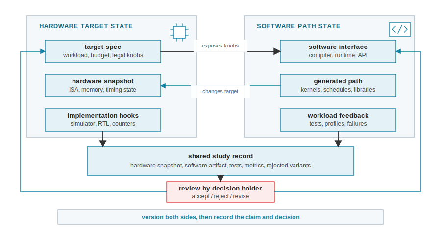
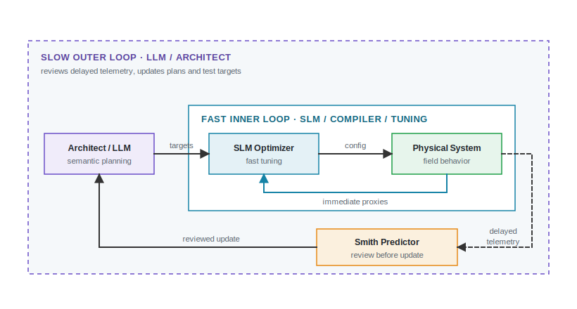
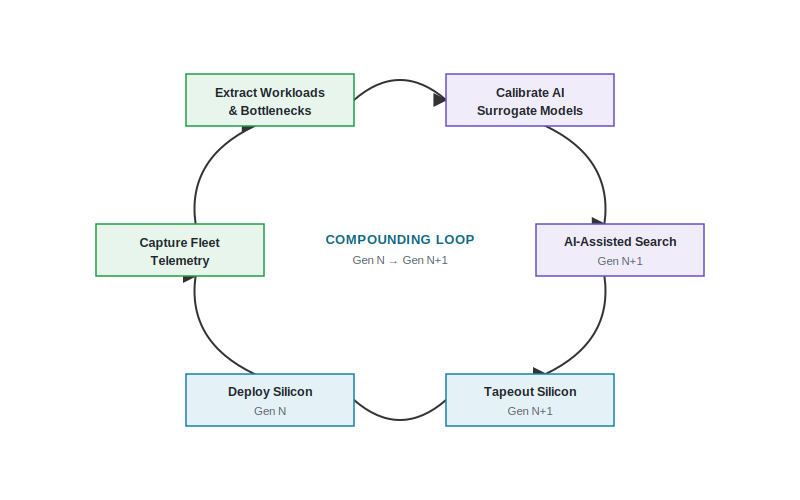
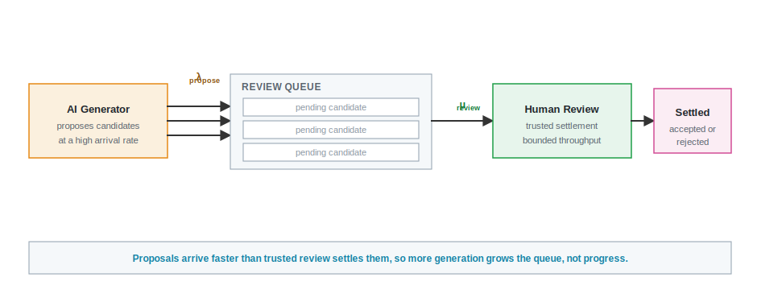

# Loop Patterns Across the Stack {#sec-loop-patterns-across-stack}

::: {.epigraph}
> *"There is no single development, in either technology or management technique, which by itself promises even one order of magnitude improvement in productivity, in reliability, in simplicity."*
>
> — Fred Brooks, *No Silver Bullet* (1986)
:::

::: {.column-margin}
**Author's Note:** Fred Brooks, Turing Award winner and author of *The Mythical Man-Month*, famously warned against hoping for a "silver bullet" in software engineering. His warning applies directly to AI-assisted architecture. Architecture work proceeds with very different feedback budgets, rejection checks, and decision rights, from reversible compiler tuning to silicon-facing RTL and SoC work. No single AI method fits all those conditions.
:::


::: {.callout-crux}
How should an AI-assisted architecture study change its internal representation and search strategy when its next decision is slower to evaluate, spans more interfaces, is harder to reverse, or carries greater consequences?
:::

@sec-running-the-loop provided a bounded control case. A 32-by-32 systolic array candidate was evaluated under deterministic, replayable SCALE-Sim measurements. The candidates were cheap to discard, and the architect stopped the study before implementation because the evidence supported retaining the baseline [@RajEtAl2025ScaleSimV3]. @sec-evaluating-agentic-architect then turned from the chip to the agent that drives such a search. This chapter widens the frame again, from one bounded study to the range of decisions an architect faces across the computing stack, where feedback latency, reversibility, and consequence vary far more than they did in that control case.

If that same proposed array geometry were instead used to alter an RTL interface, the evidence burden and decision rights would change entirely. The simulator returns quickly and candidates are reversible before implementation, but the next RTL transition sharply increases consequence and required check independence.

## Operating Conditions

> **Operating condition.** An operating condition describes one property of the next decision, such as feedback latency, reversibility, interface span, consequence, or check independence. The architect uses the conditions that apply together to decide what an AI method may do, which evidence and checks are needed, how the AI's internal representation must be updated, and whether the result can advance. An operating condition is not a stack layer, a maturity score, or a property of an AI model.

Four recurring combinations of operating conditions organize the cases considered here:

- **Fast and reversible:** workload packets, compilers, kernels, runtimes, and other work with close tests and local rollback.
- **Model-mediated architecture:** exploration of accelerator, memory, interconnect, chiplet, and specialized designs using feedback mainly from proxies, simulators, or staged tools.
- **Cross-interface and deployment:** co-design, migration, and live-system work whose effects cross owners or whose telemetry is noisy and confounded.
- **High consequence:** RTL, physical design, verification, signoff, and other work where rollback is slow, expensive, or impossible after authorization.

These conditions overlap and accumulate. A kernel schedule may have fast feedback during tuning, cross an interface contract when deployed, and become difficult to reverse when hardware is frozen around it. A chiplet study can simultaneously be model-mediated, cross-interface, and high consequence. When several conditions apply, the stricter requirements of each accumulate.

::: {.callout-learning-objectives}
After this chapter you can classify the next decision before deciding what work to automate. That means you can:

- **Compare** what transfers from a bounded architecture study and what must be revalidated when the next decision changes;
- **Separate** design-time estimates, field observations, and improvements caused by continuing software enablement onto three distinct clocks;
- **Decide** whether delayed evidence qualifies for an update surface;
- **Revalidate** evidence, checks, permissions, and capacity limits when work crosses a new decision boundary.
:::

## Start With the Next Architecture Decision

Start with the next architecture decision rather than the AI method. The artifact name does not determine risk or authority. The next decision must be classified by feedback latency, reversibility, interface span, consequence, and check independence. When several conditions apply, the stricter requirements accumulate.

@tbl-loop-patterns compares four recurring combinations. The columns describe conditions, not fixed ranks. Fast feedback does not make the next decision low risk, and silicon-facing work does not forbid useful automation.

| **Operating condition** | **Feedback and reversibility** | **Interface span and check independence** | **Evidence requirements and representation updates** |
| --- | --- | --- | --- |
| Fast and reversible | Tests, traces, profiles, or benchmarks return quickly; a failed local change can usually be discarded or rolled back. | Usually one artifact or software boundary; automatic checks may be close to the producer. | Automate bounded generation and tuning. Fast feedback directly updates the AI's short-term cost models and in-context working sets. |
| Model-mediated architecture | Proxies, simulators, and staged tools are slower or scarcer; candidates are cheap to discard before implementation. | Several architecture assumptions may interact; model and reference checks can share blind spots. | Require stronger evidence before implementation. Delayed simulation telemetry updates surrogate uncertainty bounds and model parameters. |
| Cross-interface and deployment | Feedback spans layers, organizational boundaries, or live cohorts; rollback is guarded and can still impose user or operational cost. | Multiple owners and interfaces; telemetry may be noisy, confounded, private, or only partly independent. | Record cross-layer tradeoffs. Noisy field telemetry updates execution histories and retrieval corpora, not fast-tuning loops. |
| High consequence | Tool feedback is slow and expensive; rollback becomes difficult toward signoff, tapeout, or irreversible deployment. | Independent flows, experts, and formal or physical checks become central; every waiver requires a recorded decision. | Use AI to narrow search or repair bounded artifacts. Severe failures (e.g., routing DRCs) append negative constraints to explicit design states. |

: **Recurring operating conditions.** Feedback latency, reversibility, consequence, interface span, and check independence determine the required evidence and how the AI's internal representation is updated. The rows overlap and are not a maturity ladder.
: **Four recurring combinations of operating conditions and feedback loops.** {#tbl-loop-patterns tbl-colwidths="[18,25,27,22]"}

```{=latex}
\Needspace{11\baselineskip}
```

The contrast is clearest at the endpoints. A local software change can often be executed and rolled back under close tests, while a silicon-facing change needs independent checks, a named waiver holder, and a decision owner before it advances.

The cases that follow should be read through three questions:

- **Physical constraints and rollback costs:** Which constraints apply, what does rollback cost, and what else can be affected if the change fails?
- **Allowed actions and returned feedback:** What may the AI method change, and what tool, trace, log, or measurement does it receive in return?
- **Rejection checks and decision rights:** What can reject the result, where does required review occur, and what are the declared automation limits?

A check can reject only the failures it can observe. Therefore, the checks for any decision must state which failure classes they can observe and which require a different tool or operating context.

Classifying the decision determines what an AI method may execute, what it may only recommend, and which checks can independently reject the result under each condition. The method's role may transfer, but its permission to execute or advance may not.

## Fast Feedback and Local Reversal

This condition covers work whose state can be inspected quickly and whose failed local changes can usually be discarded.

Fast feedback allows aggressive bounded iteration, but speed does not prove workload coverage, correctness, representativeness, or causality. Permission to automate is conditional on workload coverage, correctness oracles, versioned environments, regression scope, and the point at which the artifact enters a wider contract.

### Workloads and Benchmark Coverage

Fast feedback is useful only when executable checks cover the behavior in the claim. The workload specification defines what behavior matters, which software stack is assumed, and which design choices can be justified. The MICA framework established the importance of measured workload characterization to compare benchmark suites and separate inherent workload properties from specific machine artifacts [@HosteEeckhout2007MICA].

An XR accelerator claim needs a strictly constrained formulation to be credible. The 3W RISC-V XR "Lighthouse" prompt (*"Design a 3W, 64-bit RISC-V-based compute subsystem for an XR platform"*) is a concrete example. While a suite like XRBench supplies an architecture anchor [@KwonEtAl2023XRBench], the architect must still define the thermal constraints (3W TDP), the exact spatial tracking (SLAM) matrices, and the rejection bounds. Sending a vague prompt to an AI agent allows it to optimize one fast slice while missing the distribution the real XR subsystem serves. Grounding the theory in a physical constraint forces the generator to respect the system boundary.

Likewise, shared benchmarks need maintained versions and submission practices because workloads drift. The benchmark version, source, coverage claims, known gaps, leakage risks, and conditions where results do not generalize must be recorded.

### Software Tuning and Rollback

Close feedback lets an optimizer search more aggressively. Systems like the AutoTVM and Ansor tensor compilers combine search spaces, cost models, measurements, and scheduling to improve software performance across targets [@ChenEtAl2018AutoTVM; @ZhengEtAl2020Ansor]. This search is useful when generation is limited to artifacts with executable checks and cheap rollback. Because feedback cycles complete in seconds, the telemetry can directly update the AI's short-term cost model and in-context working set without the overhead of maintaining complex multi-fidelity state.

KernelBench, a benchmark for evaluating AI-generated GPU kernels, demonstrates generated GPU kernels validated for correctness and speed against a baseline [@OuyangEtAl2025KernelBench]. Its bounded task keeps the generated artifact, versioned environment, tests, compiler, and measurements close enough to support repeated rejection and local rollback. This immediate feedback ensures the AI's generative priors remain tightly coupled to the actual hardware execution time.

For an AI-generated or tuned GPU kernel, a versioned compiler and test harness can reject compile failures and correctness errors, and the source can be rolled back. However, the architecture claim still fails if the input distribution is narrow, tail latency regresses, or the kernel requires a software path unavailable in the target system.

An AI-generated kernel that wins on one input size may regress another. An AI-proposed runtime policy that improves average latency may worsen tail latency. Even with fast feedback, architects must record workload coverage, who may reject a candidate, and who owns the decision before the change enters a larger system.

## Design-Space Exploration With Proxies and Simulators

When a simulator returns a delayed thermal trace or IPC penalty, the agent does not just see a float. Following the mechanics described in @sec-data-representations-world-models, this telemetry is translated into a 1D tokenized sequence or a structured JSON response. If the trace is truncated to fit the context window, the agent loses the critical temporal data needed to optimize thermal throttling. The fidelity of the proxy metric is therefore strictly bottlenecked by the agent's encoding capacity; if the proxy's failure mode isn't represented in the textual serialization, the agent remains blind to it.

Architecture exploration often evaluates candidate parameters that are cheap to propose, but feedback comes from simulators and staged tools. Feedback is not merely "slower" than software tests; it is a hostile environment. An AI optimizer mediating architecture will encounter 3-day RTL simulation times, toolchain crashes, out-of-memory errors, and silent simulation corruptions. Actions can violate physical constraints, and proxies can fail catastrophically outside their calibrated regions, destroying the optimizer's assumptions.

Model-mediated exploration requires an explicit representation of architecture state, legal actions, and tool observations. Methods may generate candidates, predict behavior, allocate evaluations, or critique assumptions. ArchGym, an open-source environment for architecture, provides an interface for exploration [@KrishnanEtAl2023ArchGym], predictive DSE uses data-driven models to proxy evaluations [@IpekEtAl2006PredictiveDSE], and Apollo allocates expensive evaluations using transfer learning [@yazdanbakhsh2021apollo]. Chiplet exploration adds package-interface contracts like the Universal Chiplet Interconnect Express (UCIe) [@UCIeConsortium2026Spec].

AlphaChip is a concrete instance of model-mediated exploration. Its reinforcement-learning agent was guided by fast wirelength and congestion estimators rather than full routing, because RTL-to-GDS placement is far too slow to supply the millions of feedback cycles a learned policy needs [@MirhoseiniEtAl2021GraphPlacement]. The proxy helps only while it tracks the final routed design. Once it diverges, the agent optimizes a target that does not exist, which is why the architect, not the optimizer, must own proxy calibration.

In @sec-running-the-loop's array study, SCALE-Sim was used to compare array geometries under a frozen workload and software path. A simulator can support a no-change decision for the represented metrics. Moving a candidate toward implementation requires compiler mapping semantics, a memory-system model, end-to-end offload granularity, RTL legality, and later physical checks.

::: {.callout-design-principle title="Proxy Calibration"}
A surrogate model is only as valid as its last correlation with an RTL observation. Update the surrogate's uncertainty bounds whenever delayed telemetry overturns a proxy win. When an optimizer tunes against a fast local proxy, such as a wirelength estimator, ensure the test harness rejects candidates that violate physical constraints downstream (like routing congestion) and use those failures to recalibrate the surrogate.
:::

### Specialization and Executable Software Paths

Historically, architecture gains came from technology scaling, architecture innovation, and optimization. As technology scaling has slowed, specialization has become the main remaining source of large efficiency gains (@fig-hardware-efficiency). A specialization claim still needs an executable software path and an end-to-end interface-cost argument before a proxy win can cross toward implementation.

```{python}
#| label: fig-hardware-efficiency
#| fig-cap: |
#|   **Precision-normalized hardware efficiency rises about 1.5-fold per year, steadier than headline FLOP/s.** Peak energy efficiency of AI accelerators over time, in bit-operations per second per watt [@EpochAI2025AIModels]; the teal frontier traces the best part to date and the dashed line is a fitted trend. Because this metric normalizes for numerical precision, it grows more slowly than raw peak throughput, much of whose recent gain came from lower-precision arithmetic rather than efficiency alone.
#| out-width: "92%"
#| fig-alt: "Log-scale scatter of AI accelerator energy efficiency in bit-operations per second per watt versus release date from 2015 to 2026. A frontier line climbs in steps through the A100, TPU v4, and B200, with a fitted trend of about 1.5-fold per year. The full cloud of accelerators sits below the frontier."

import csv
import datetime
import math
from pathlib import Path

import numpy as np
import matplotlib.pyplot as plt
import _python.arch2_plots as _ap
from _python.arch2_plots import COLORS, apply_style
from _python.labels import place_labels

apply_style()

# Data: Epoch AI ML hardware database [@EpochAI2025AIModels], accelerators with a
# stated release date and precision-normalized energy efficiency (bit-OP/s per
# watt). Values dataset-transcribed; the growth factor is a least-squares fit to
# the efficiency frontier. Accessed 2026-07-19.
# Receipt: data/source-receipts/chapter10-hardware-efficiency.csv
_root = Path(_ap.__file__).resolve().parents[2]

def _yfrac(text):
    for fmt in ("%Y-%m-%d", "%Y-%m", "%Y"):
        try:
            d = datetime.datetime.strptime(text.strip(), fmt)
            return d.year + (d.timetuple().tm_yday - 1) / 365.25
        except ValueError:
            continue
    return None

pts = []
with open(_root / "data" / "source-receipts" / "chapter10-hardware-efficiency.csv", encoding="utf-8") as fh:
    for row in csv.DictReader(fh):
        y = _yfrac(row["release_date"])
        try:
            eff = float(row["energy_efficiency_bitops_per_w"])
        except ValueError:
            continue
        if y and eff > 0 and 2015 <= y <= 2026.7:
            pts.append({"y": y, "eff": eff, "name": row["hardware_name"]})
pts.sort(key=lambda p: p["y"])
best = -1.0
frontier = []
for p in pts:
    if p["eff"] > best:
        best = p["eff"]
        frontier.append(p)
yy = np.array([p["y"] for p in frontier])
ll = np.array([math.log10(p["eff"]) for p in frontier])
slope, intercept = np.polyfit(yy, ll, 1)
growth = 10 ** slope

fig, ax = plt.subplots(figsize=(5.4, 3.3))
ax.scatter([p["y"] for p in pts], [p["eff"] for p in pts], s=10, marker="o",
           facecolors="white", edgecolors=COLORS["grid"], linewidth=0.6, zorder=2, label="AI accelerators")
ax.plot([p["y"] for p in frontier], [p["eff"] for p in frontier], color=COLORS["workload"], lw=1.5, zorder=3)
ax.scatter([p["y"] for p in frontier], [p["eff"] for p in frontier], s=20, marker="o",
           facecolor=COLORS["workload"], edgecolor=COLORS["workload_ink"], linewidth=0.4, zorder=4, label="Efficiency frontier")
xline = np.array([2015.5, 2026.5])
ax.plot(xline, 10 ** (intercept + slope * xline), color=COLORS["constraints"], lw=1.2, ls=(0, (5, 3)), zorder=2)
ax.text(2017.6, 10 ** (intercept + slope * 2019.4) * 1.5, f"~{growth:.1f}× / year", fontsize=6.6,
        fontweight="bold", color=COLORS["constraints_ink"], rotation=17, rotation_mode="anchor")
ax.set_yscale("log")
ax.set_xlim(2015.4, 2026.6)
ax.set_ylim(2e10, 3e13)
ax.set_xlabel("Release date", fontsize=7.2)
ax.set_ylabel("Energy efficiency (bit-OP/s per watt, log)", fontsize=7.2)
ax.set_xticks([2016, 2018, 2020, 2022, 2024, 2026])
ax.tick_params(labelsize=6.4, length=2.5, width=0.6)
for _sp in ("top", "right"):
    ax.spines[_sp].set_visible(False)
ax.grid(True, which="major", axis="y", color=COLORS["row"], linewidth=0.4, zorder=0)
ax.legend(loc="lower right", frameon=False, fontsize=6.0, handletextpad=0.3, labelspacing=0.3)
short = {"NVIDIA A100 SXM4 40 GB": "A100", "NVIDIA H100 SXM5": "H100", "NVIDIA B200": "B200", "Google TPU v4": "TPU v4"}
by_name = {p["name"]: p for p in pts}
items = [(by_name[k]["y"], by_name[k]["eff"], v) for k, v in short.items() if k in by_name]
place_labels(ax, fig, items, fontsize=5.0, color=COLORS["ink"])
fig.subplots_adjust(left=0.12, right=0.97, top=0.98, bottom=0.115)
```

Measured in a precision-normalized way, the best parts gain only about 1.5-fold a year, well below the headline throughput numbers whose growth leans heavily on dropping to lower-precision arithmetic. A specialization win therefore has to survive an end-to-end accounting rather than a proxy peak.

Amdahl's law [@Amdahl1967ValiditySingleProcessor] and the LogCA model [@AltafWood2017LogCA] require an end-to-end perspective. A compact Amdahl-style form that folds interface and software cost into the fraction-based bound is
$$
S_{\mathrm{system}} \le
\frac{1}{(1-f) + f/s + \epsilon_{\mathrm{interface}} + \epsilon_{\mathrm{software}}}.
$$
Here, $f$ is the improvable fraction of baseline time, $s$ is local speedup, and the $\epsilon$ terms are interface and software overheads normalized to the same baseline. The specialization helps only when each invocation amortizes those overheads.

That equation summarizes the tax as a single fraction. A simplified LogCA-style calculation in @fig-logca-breakeven resolves the same tax by offload granularity, a complementary view of the same interface cost rather than the same formula.

```{python}
#| label: fig-logca-breakeven
#| fig-cap: |
#|   **Offload overhead determines the break-even granularity.** In a simplified LogCA-style model [@AltafWood2017LogCA], end-to-end speedup appears only after each offload performs enough work to amortize latency and overhead. A more distant accelerator needs more work per offload to break even.
#| out-width: "100%"
#| fig-alt: "Line plot showing offload speedup curves that rise only after enough work is amortized to overcome interface latency and overhead."

import matplotlib.pyplot as plt
from _python.arch2_plots import COLORS, add_note_box, apply_style

apply_style()

A = 100.0
g = [10 ** (6 * i / 399) for i in range(400)]

curves = [
    {"label": "tightly coupled accelerator", "ovh": 2.0, "color": COLORS["orange"]},
    {"label": "shared-memory SoC block", "ovh": 40.0, "color": COLORS["green"]},
    {"label": "off-chip / discrete module", "ovh": 1500.0, "color": COLORS["red"]},
]

def speedup(gran, ovh):
    return gran / (ovh + gran / A)

fig, ax = plt.subplots(figsize=(5.25, 3.12))
fig.subplots_adjust(left=0.12, right=0.86, top=0.82, bottom=0.28)

ax.axhline(A, color=COLORS["ink"], linewidth=0.8, linestyle=(0, (4, 3)), zorder=1)
ax.text(1.35, A * 1.08, "peak acceleration A", ha="left", va="bottom", fontsize=6.2, color=COLORS["ink"])
ax.axhline(1.0, color=COLORS["muted"], linewidth=0.7, zorder=1)
ax.text(7.5e5, 1.10, "break-even", ha="right", va="bottom", fontsize=6.0, color=COLORS["muted"])

ax.axhspan(0.25, 1.0, color=COLORS["red"], alpha=0.08, zorder=0)
ax.text(1.5, 0.38, "offload loses", ha="left", va="center", fontsize=6.0, color=COLORS["red"], fontstyle="italic")

for c in curves:
    s = [speedup(x, c["ovh"]) for x in g]
    ax.plot(g, s, color=c["color"], linewidth=1.9, zorder=3, label=c["label"])
    g1 = c["ovh"] / (1.0 - 1.0 / A)
    ax.scatter([g1], [1.0], marker="o", s=22, facecolor=COLORS["note_fill"], edgecolor=c["color"], linewidth=1.3, zorder=4, clip_on=False)

ax.set_xscale("log")
ax.set_yscale("log")
ax.set_xlim(1, 1e6)
ax.set_ylim(0.25, 150)
ax.set_xlabel("operation granularity  (work amortized per offload)", fontsize=7)
ax.set_ylabel("end-to-end speedup", fontsize=7)
ax.set_yticks([0.3, 1, 3, 10, 30, 100])
ax.set_yticklabels([r"0.3$\times$", r"1$\times$", r"3$\times$", r"10$\times$", r"30$\times$", r"100$\times$"], fontsize=6.4)
ax.tick_params(axis="both", length=2.5, width=0.6, pad=2, labelsize=6.4)
ax.grid(axis="both", color=COLORS["grid"], linewidth=0.5, zorder=0)

for spine in ["top", "right"]:
    ax.spines[spine].set_visible(False)
ax.spines["left"].set_color(COLORS["ink"])
ax.spines["bottom"].set_color(COLORS["ink"])

legend = fig.legend(loc="upper center", ncol=3, fontsize=6.0, frameon=False,
                    bbox_to_anchor=(0.5, 1.0), handlelength=1.0, columnspacing=1.4)
for text in legend.get_texts():
    text.set_color(COLORS["ink"])

add_note_box(
    fig,
    "Simplified LogCA-style view: the farther the accelerator sits from the host, the larger the granularity needed before offload breaks even.",
    xywh=(0.10, 0.03, 0.80, 0.11),
    fontsize=5.5,
)

plt.show()
plt.close(fig)
```

The three curves place the same accelerator at increasing distance from the host. A tightly coupled accelerator breaks even after only a little work per offload, a shared-memory SoC block needs more, and an off-chip discrete module needs far more before its curve crosses the break-even line and climbs toward the peak-acceleration asymptote. The break-even granularity scales with the interface overhead, so a proxy win measured at a coarse granularity can vanish once the real per-invocation offload cost is charged. That per-invocation tax is what the software path must carry before a specialization claim can cross toward implementation.

The software path connects domain intent to hardware. Programming models, compiler IRs, libraries, runtimes, and generated code form the executable path that makes specialized hardware usable (@fig-codegen-narrow-waist).

{#fig-codegen-narrow-waist width="92%" fig-alt="Narrow-waist diagram showing programming models, compiler representations, libraries, runtimes, and generated code connecting specialized hardware to evidence checks." fig-alt="**The software path to specialized hardware.** Domain-specific architectural claims require executable software paths and evidence about correctness, performance, portability, and maintenance."}

A local kernel result cannot bypass this software path. The hardware/lowering path must be retained so a failure on either side invalidates the paired claim.

::: {.callout-architect-checkpoint title="The Hardware-Interface Authorization Boundary"}
Record which kernel and schedule actions automation may execute or recommend, which hardware interface changes require stronger evidence, and who is authorized to approve them.
:::

The hardware-interface boundary matters because a candidate can look strong in isolation and still collapse once the compiler, data movement, and end-to-end path are accounted for.

An AI-generated block posts a large kernel speedup, but the compiler cannot keep it busy, data movement dominates, and only hand-written code reaches the headline result. Include the interface and software path, then require a compiler-generated end-to-end measurement before promoting the candidate.

## Cross-Interface and Deployment Decisions

When a decision spans hardware, software, runtime, operations, or organizational boundaries, it widens the causal chain. Hardware and software snapshots must be versioned together, local objectives must be checked against system objectives, and deployment requires guarded exposure, rollback triggers, telemetry limits, and named owners.

### Cross-Layer Co-Design

A single-layer optimization can be locally correct and still make the complete system worse. For example, the first-generation TPU's 8-bit datapath was a cross-layer decision co-designed with quantization software, and its serving objective included a 99th-percentile latency bound [@JouppiEtAl2017TPU]. A throughput improvement that violated the latency target was unacceptable.

::: {.callout-architect-checkpoint title="Cross-Layer Ownership"}
Before an optimizer acts, record which layer it may change, which other layer supplies independent feedback, what automation may execute or recommend, and who may approve the cross-layer tradeoff.
:::

Software feedback supports an architectural claim only when the run record ties each code path to the hardware snapshot it targeted. Because software tuning is rapid and reversible while silicon tapeouts are slow and fixed, the two optimization loops run on completely different timescales. If a fast software-tuning AI is accidentally granted the authority to alter a hardware interface without independent checks, it can silently introduce fatal hardware flaws.

This mismatch in timescales also dictates the choice of AI tool. Fast, reversible software loops need low-latency, low-cost search methods (like heuristics, specialized models, or rapid surrogate models) to evaluate thousands of candidates quickly. In contrast, slow, high-consequence hardware decisions justify the latency and cost of more capable reasoning models or thorough formal checks. The architect's methodology must match the cost and capability of the AI to the physical cost of the decision.

@fig-hardware-software-coevolution illustrates how these two different timescales must remain joined by one shared study record without bypassing the hardware layer's slower, more rigorous checks.

{#fig-hardware-software-coevolution width="100%" fig-alt="Two-lane diagram showing hardware and software evolving together." fig-alt="**Recording hardware and software state.** Hardware target state and software path state evolve together through a shared study record, ensuring fast software tuning does not bypass slower hardware checks."}

### Deployment Feedback and Migration

Deployment-facing work evaluates real systems but produces noisy, confounded feedback. The pattern that makes it survivable is guarded progressive exposure with an automatic halt. Release the change to a small cohort, watch a few bounded metrics against a service-level objective, and let a breach trip an automatic rollback before the change reaches the rest of the fleet. A canary bounds the blast radius; it does not prove that the change caused what the metrics show. This delayed deployment telemetry (like silent data corruptions or thermal throttling in the fleet) cannot be fed directly into a fast-tuning AI loop. Instead, it must be appended to the execution history and updated in the retrieval corpus to inform the next silicon generation.

Google's warehouse-scale migration from x86 to Arm illustrates cross-interface conditions [@ChristopherEtAl2025ISAMigration]. The migration involved more than 38,000 commits. A fine-tuned language model classified the commits, revealing that repository activity concentrated in build, deployment, infrastructure, monitoring, and rollback rather than low-level code translation (@fig-isa-migration-effort). Those categories are owned by different teams, so the dominant cost was coordination across team and interface boundaries, not the code translation itself.

```{python}
#| label: fig-isa-migration-effort
#| fig-cap: |
#|   **Recorded repository activity in an ISA migration.** Build, deployment, infrastructure, and supporting tools dominate commit and changed-line counts, overturning the expectation that code translation would dominate. These shares measure commits and changed lines under the paper's model-assisted classification, not effort or difficulty [@ChristopherEtAl2025ISAMigration].
#| out-width: "100%"
#| fig-alt: "Bar chart of repository activity in Google's x86-to-Arm migration showing build and infrastructure dominating over code adaptation."

import matplotlib.pyplot as plt
from _python.arch2_plots import COLORS, add_note_box, apply_style

apply_style()

groups = [
    ("Code adaptation\n& correction", 456, 26032),
    ("Testing", 1121, 50221),
    ("Build, deployment &\ninfra configuration", 33342, 198351),
    ("Supporting processes\n& tools", 2840, 458715),
    ("Uncategorized", 17, 1328),
]
TOTAL_COMMITS = 38156
TOTAL_LOC = 734621

pct_commits = [100.0 * g[1] / TOTAL_COMMITS for g in groups]
pct_loc = [100.0 * g[2] / TOTAL_LOC for g in groups]

def bar_label(pct):
    return f"{pct:.1f}%" if pct >= 0.1 else "<0.1%"

fig, ax = plt.subplots(figsize=(5.25, 2.95))
fig.subplots_adjust(left=0.235, right=0.965, top=0.87, bottom=0.30)

ypos = list(range(len(groups)))
height = 0.34
ax.barh([y - 0.19 for y in ypos], pct_commits, height=height,
        color=COLORS["blue"], zorder=2, label="share of commits")
ax.barh([y + 0.19 for y in ypos], pct_loc, height=height,
        color=COLORS["orange"], zorder=2, label="share of changed lines")

for y, pc, pl in zip(ypos, pct_commits, pct_loc):
    ax.annotate(bar_label(pc), (pc, y - 0.19), textcoords="offset points",
                xytext=(3, 0), va="center", fontsize=5.8, color=COLORS["ink"])
    ax.annotate(bar_label(pl), (pl, y + 0.19), textcoords="offset points",
                xytext=(3, 0), va="center", fontsize=5.8, color=COLORS["ink"])

ax.set_yticks(ypos)
ax.set_yticklabels([g[0] for g in groups], fontsize=6.2)
ax.invert_yaxis()
ax.set_xlim(0, 100)
ax.set_xticks([0, 20, 40, 60, 80, 100])
ax.set_xlabel("share of recorded migration activity (%)", fontsize=7)
ax.tick_params(axis="both", length=2.5, width=0.6, pad=2, labelsize=6.4)
ax.grid(axis="x", color=COLORS["grid"], linewidth=0.55, zorder=0)

for spine in ["top", "right"]:
    ax.spines[spine].set_visible(False)
ax.spines["left"].set_color(COLORS["ink"])
ax.spines["bottom"].set_color(COLORS["ink"])

legend = fig.legend(loc="upper center", ncol=2, fontsize=6.0, frameon=False,
                    bbox_to_anchor=(0.5, 1.0), handlelength=1.0, columnspacing=1.4)
for text in legend.get_texts():
    text.set_color(COLORS["ink"])

add_note_box(
    fig,
    "38,156 commits, ~700K changed lines. The source states the expectation that code translation would dominate only qualitatively, so the chart shows the recorded distribution alone.",
    xywh=(0.10, 0.03, 0.80, 0.11),
    fontsize=5.5,
)

plt.show()
plt.close(fig)
```

The study also evaluated an AI-assisted repair tool on a selected historical benchmark of 245 commits with identifiable build and test targets, demonstrating a passing repair for 30 percent of cases. This is a directional result on a selected set with identifiable targets, not a fleet automation rate or a comparison against a matched conventional baseline. @tbl-isa-migration-loop-card summarizes the migration record.

| **Card field** | **Migration reading** |
| --- | --- |
| **Task** | Move production services across an ISA boundary while preserving build, test, and rollout behavior. |
| **Representation** | Migration commits, build targets, tests, sanitizer findings, service ownership, and evicted production cases. |
| **Environment** | Build-and-test repair loop plus production monitoring on the new target. |
| **Method role** | Propose bounded software repairs and route failed cases toward owners. |
| **Rejection checks and authority** | Build failures, test failures, sanitizer failures, crash loops, slow jobs, and monitor-triggered evictions. |
| **Accountable decision** | Automated repair can clear only the cases its declared checks settle; application owners receive the exceptions. |

: **Records for an ISA migration.** {#tbl-isa-migration-loop-card tbl-colwidths="[24,66]"}

Deployment is where a change finally meets the live system. When an AI method can push cross-interface changes at machine speed, guarded exposure, rollback triggers, a kill switch, and named owners are the only things standing between a routine change and a catastrophic one.

::: {.callout-war-story title="A deployment that could not be reversed in time"}
**The claim.** On August 1, 2012, deploying new order-router (SMARS) code to Knight Capital's production servers looked like a routine change. Seven of the firm's eight servers took the update without incident [@SEC2013KnightCapital].

**The gap.** The eighth server never received the new code, and a repurposed configuration flag reactivated dormant "Power Peg" logic there. With no staged exposure to catch the divergence and no cumulative risk limit to stop it, that one server sent millions of unintended orders into the market, and no fast kill switch existed to halt them.

**The lesson.** The firm lost about \$440 million net in roughly 45 minutes. Guarded progressive exposure would have surfaced the divergent server before it reached full volume, and a kill switch would have stopped the accrual once it began. At machine speed, the halt has to be built in before a change ships, not improvised after it fails.
:::

Deployment feedback includes operational state, SLOs, resource contention, and rollback triggers, and those triggers are what arm the automatic halt. Rollback can reduce risk but does not erase harm already incurred during a canary or deployment.

## RTL, Physical Design, and Difficult-to-Reverse Decisions

High-consequence work includes RTL changes, physical design, timing closure, power analysis, and formal signoff. Feedback is delayed and reversal is slow and expensive. A committed silicon tapeout is a massive capital expense defined by multi-year horizons. AI heuristics that work well in software frequently break down when hitting the physical realities of multi-day placement and routing runs, severe Design Rule Check (DRC) violations, and highly non-linear timing closure loops where physical design feedback is notoriously noisy and non-differentiable.

Because you cannot `git revert` a tapeout, AI-assisted hardware changes require built-in escape hatches (like microcode patches, degraded fallback modes, or fuses) to compensate for unexpected failures once they reach silicon. Consequently, a passing early check in a proxy or simulator can never authorize a difficult-to-reverse physical transition.

The cost of getting this wrong is not hypothetical. In 2011 Intel shipped its 6-series "Cougar Point" chipset with a design fault in the SATA ports that would degrade over time, a defect no firmware update could reach; the company halted shipments, recalled parts, and absorbed about \$700 million to respin the silicon [@Intel2011CougarPoint]. Where Knight Capital lost its \$440 million to software in forty-five minutes, a silicon escape is undone only by months and a new mask set, which is exactly why the escape hatches and independent signoff above have to be in place before commitment rather than after.

AI assistance can narrow search, critique, organize evidence, repair bounded artifacts, or generate tests. A passing early check, however, cannot waive later verification or authorize commitment. Independent checks and named roles retain rejection, waiver, recommendation, and authorization rights.

For example, transforming the @sec-running-the-loop candidate into an RTL generator parameter requires mapping, memory, and interface assumptions. RTL checks can reject functional errors; synthesis can reject timing or area; physical design can reject congestion, power integrity, or thermal feasibility. When these delayed checks return a failure, that delayed telemetry must translate into negative constraints within the AI's internal representation. A Design Rule Check (DRC) failure or a post-route timing violation must be encoded as a forbidden region in the explicit design state, preventing the AI from proposing similar unroutable topologies in the future.

Functional verification is itself a feedback loop, and its central check is a proxy. Coverage metrics, whether functional, code, or formal, record how much of the intended behavior the tests exercised, not whether the design is correct. A passing coverage target cannot bound the failure classes that were never stimulated, so a clean run never means the space is covered, only that the observed cases held. This is the earlier limit again, that a check can reject only the failures it can observe. AI can generate stimulus, close coverage holes, and triage failing runs, but whether signoff coverage is sufficient is a judgment that stays with the named roles that own it.

Public reports indicate learning methods can contribute to physical-implementation search, such as in peer-reviewed synthesis for parallel-prefix circuits [@RoyEtAl2021PrefixRL] and learning-assisted placement [@MirhoseiniEtAl2021GraphPlacement] (whose evidence review was discussed in @sec-feedback-verification-trust). A vendor-reported DSO.ai system has also searched the physical-implementation flow for commercial tapeouts [@Synopsys2023DSOai]. These are bounded learned subflows, not automated tapeout authority. The record must include tool versions, failed candidates, signoff checks, waivers, escalation points, and the named decision owner.

Post-silicon bring-up and validation represent a controlled implementation return after fabrication and before deployment. Those controlled lab measurements inform the architect before fleet deployment introduces new confounding variables.

## Three Feedback Clocks

The operating conditions classified the next decision before it was made, setting what an AI method may do to it. The feedback clocks classify something different, what a result can be claimed after evidence arrives. The two connect through timing. The clock that can confirm a decision often runs far slower than the clock on which the decision was committed, so the stricter operating conditions, high consequence and model-mediated, are exactly the ones whose confirming evidence arrives latest.

Design-time evaluation, in-field evidence, and continuing enablement each answer a different question about the system (@fig-feedback-clocks).

```{python}
#| label: fig-feedback-clocks
#| fig-cap: |
#|   **Three feedback clocks run at different speeds.** In-field evidence, continuing software enablement, and design-time evaluation each observe the system on a different timescale, so their signals must be read separately rather than averaged into a single number.
#| out-width: "92%"
#| fig-alt: "Horizontal range chart on a logarithmic time axis from one millisecond to ten years. In-field evidence spans milliseconds to days, continuing enablement spans months to years, and design-time spans years, drawn as three separate labeled rows with square endpoints."

import matplotlib.pyplot as plt
from _python.arch2_plots import COLORS, apply_style, top_log_axis, row_axis, draw_range_rows

# Representative timescales for the three feedback paths, in seconds (log axis).
# Conceptual figure. As-of: 2026-07-19.
apply_style()

DAY = 8.64e4
MONTH = 2.63e6
YEAR = 3.156e7

rows = [
    {"lo": 1e-3, "hi": DAY, "color": COLORS["evidence"],
     "display_label": "In-field evidence", "display_note": "Fleet telemetry, dynamic adaptation",
     "right_label": "ms to days"},
    {"lo": MONTH, "hi": 2 * YEAR, "color": COLORS["methods"],
     "display_label": "Continuing enablement", "display_note": "Firmware and software tuning",
     "right_label": "months to years"},
    {"lo": YEAR, "hi": 10 * YEAR, "color": COLORS["workload"],
     "display_label": "Design-time", "display_note": "Next-gen architecture program",
     "right_label": "years"},
]

fig, ax = plt.subplots(figsize=(5.25, 2.2))
top_log_axis(
    ax,
    xlim=(3e-4, 6e8),
    xticks=[1e-3, 1, 60, 3600, DAY, MONTH, YEAR, 10 * YEAR],
    xticklabels=["1 ms", "1 s", "1 min", "1 hr", "1 day", "1 mo", "1 yr", "10 yr"],
    xlabel="Timescale (seconds, log)",
)
row_axis(ax, len(rows))
draw_range_rows(
    ax, rows, low_key="lo", high_key="hi",
    label_x=-0.52, right_x=1.02,
    label_fontsize=6.6, note_fontsize=5.4, right_fontsize=6.0,
)
fig.subplots_adjust(left=0.34, right=0.80, top=0.78, bottom=0.06)
```

These observations describe different system states and bear on different decisions. They must never be averaged into one performance number or narrated as one clean causal chain. @tbl-feedback-clocks outlines their characteristics.

| **Feedback path** | **Question it can answer** | **State that must be paired** | **Limit on the claim** |
| --- | --- | --- | --- |
| Design-time evaluation | What may this candidate do under the study's represented workload and assumptions? | Architecture candidate, workload or model, simulator or benchmark, tool configuration, and software path. | A simulator, benchmark, or evaluation supports only the represented mechanisms and measured scope. |
| In-field evidence | What happens for this hardware and software pair under a stated deployment context? | Hardware revision, compiler, runtime, libraries, kernels, model, workload cohort, deployment policy, and observation window. | Telemetry is operationally relevant but often confounded; it can reject an assumption without identifying one clean cause. |
| Continuing software enablement | How does realized behavior change as the software ecosystem learns to use fixed hardware? | The same hardware contract paired with each software, model, workload, and submission version. | A later result cannot be attributed to hardware alone, and one platform's trajectory does not predict another's. |

: **Three feedback paths with different clocks.** {#tbl-feedback-clocks tbl-colwidths="[18,25,30,20]"}

**Design-time evaluation** estimates behavior. The SCALE-Sim observations from @sec-running-the-loop evaluated candidates tied to frozen workload and software assumptions.

**In-field evidence** tests the deployment context. Google and Meta discovered "mercurial" cores that silently returned wrong results after passing manufacturing tests [@HochschildEtAl2021Cores; @DixitEtAl2021SDC]. This observation rejected the sufficiency of earlier test regimes under fleet-scale operation. It showed that deployment can expose failure classes missed by prior checks. Furthermore, in-field evidence frequently reveals the algorithm evolution treadmill. When a specialized accelerator is fabricated and deployed, the neural network architectures it was originally optimized for have often been superseded by entirely new models.

**Continuing enablement** observes later software workloads using a fixed hardware contract. For example, NVIDIA reported single-node training performance improvements of up to 17 percent on the same H100 hardware between MLPerf Training v2.1 preview and v3.0 by identifying software optimizations. BERT improved 17 percent, ResNet-50 by 8.4 percent, 3D U-Net by 8.2 percent, and Mask R-CNN by 6.1 percent [@EassaEryilmaz2023H100MLPerfSoftware]. This is a vendor-reported, workload-specific public continuing-enablement comparison, not a dependable first-year improvement rate.

## Updating Knowledge From Delayed Feedback

Feeding delayed, noisy field telemetry directly into a high-frequency AI optimizer makes it overcorrect and thrash, because the telemetry arrives far too late to guide rapid tuning. The fix is to run the two at different speeds, nesting a fast tuning loop inside a slow review loop (@fig-cascade-control).

{#fig-cascade-control fig-alt="**Handling delayed telemetry.** Nested feedback loops ensure that delayed field telemetry is reviewed rather than fed directly into fast, automated tuning loops, preventing the optimizer from thrashing."}

Fast inner loops handle local software tuning and immediate stabilization using close tests and proxies. Slow outer loops review the delayed field telemetry, updating the architectural assumptions and test targets. The fast tuning loop must only tune against immediate proxies. It should never act directly on delayed telemetry.

### Telemetry Compounds Across Silicon Generations

When telemetry is captured and isolated into calibration datasets, post-silicon results from one generation can recalibrate the surrogate models used to design the next (@fig-hw-flywheel).

{#fig-hw-flywheel width="100%" fig-alt="Six-stage cycle showing post-silicon telemetry from one hardware generation recalibrating the AI surrogate models used to design the next generation."}

In traditional design, telemetry is often used only for debugging or triggering warranty returns. Here, post-silicon telemetry from Generation $N$ is fed back into the surrogate models as ground-truth calibration data. Because the retrained surrogate for Generation $N+1$ reflects the thermal, routing, and workload bottlenecks that limited Generation $N$, it estimates those quantities more accurately within the regions the telemetry covers. The durable advantage is the proprietary fleet data itself. An organization with more GPU compute but no comparable deployment telemetry cannot recalibrate its surrogates the same way. A first tapeout or a new team starts without any prior-generation telemetry at all, so the flywheel is an advantage that accrues over generations rather than a precondition for the first design. Before the fleet exists, surrogates are calibrated from foundry process design kit data and published baselines, and conservative escape hatches such as fuses and microcode patches absorb the residual uncertainty.

Run naively, the flywheel can also lock in the past. Because telemetry records only the workloads Generation $N$ actually served, a surrogate recalibrated on it sharpens on yesterday's traffic and goes blind to workloads that have not yet appeared, reinforcing the design distribution it was trained on and steering Generation $N+1$ toward the previous generation's bottlenecks [@SculleyEtAl2015Hidden]. This is the algorithm evolution treadmill seen from the design side, and that advantage lasts only while the fleet keeps sampling the workloads the next generation will run.

A common failure mode in AI-assisted architecture is treating surrogate models such as power or timing predictors as static artifacts that are trained once and deployed forever. Models decay. As the underlying software compiler is updated, or as the process node shrinks from 5nm to 3nm, the training distribution drifts. Borrowing the practice from MLOps, the architecture loop must recalibrate its surrogates on a schedule rather than treat them as fixed. Every time a candidate reaches true RTL or silicon, that ground-truth data returns to retrain the faster surrogate models used earlier in the funnel, and drift detection becomes a tracked metric in the environment.

Before a recalibrated surrogate is trusted to steer a multi-million-dollar chip design, it can run silently alongside the human-led EDA flow, predicting outcomes without controlling the project. Architects measure its calibration against the ground-truth tools over thousands of commits, and only then authorize it to steer the search.

None of this recalibration is automatic. Delayed evidence does not update knowledge by itself. Attribution is a review step, and every possible update surface requires a separate decision and its own admission test. Automatic LLM fine-tuning is never the default.

Before any update, retain an attribution record including:

- observation time and window;
- hardware product, revision, configuration, and deployment context;
- compiler, runtime, libraries, kernels, firmware, model, and policy versions;
- workload, cohort, traffic mix, benchmark or submission rules, and exclusions;
- telemetry source, evaluation tool, measurement definition, uncertainty, and missing data;
- candidate or system provenance and the earlier claim being revisited;
- variables known to have changed and plausible competing causes;
- control, counterfactual, matched baseline, or explicit absence of one;
- observed failure class and which earlier checks could or could not see it; and
- reviewer disposition, nonclaims, update destination, and decision owner.

Only after competing explanations are recorded can a separate decision admit the observation to a destination.

| Possible destination | Admission question | Legitimate update | Required guardrail |
| --- | --- | --- | --- |
| Project trajectory or run history | Is the observation provenance-relevant even if cause is unresolved? | Append the versioned observation, failure, or later outcome to the relevant candidate or system history. | Never overwrite the earlier state or rewrite an unresolved cause as fact. |
| Retrieval corpus | Is the source stable, attributable, licensed, current, and useful for later architecture questions? | Add or revise a source document and its metadata. | Preserve source version, date, access, supersession, retraction, and scope. |
| Embeddings or search index | Has an admitted corpus item changed? | Regenerate the derivative representation or index entry. | Never treat a vector update as an independent evidence decision; retain the source link and embedding version. |
| Calibration set | Does the example share the target, measurement semantics, and support region of the calibrated tool or surrogate? | Add a reviewed input-output pair for calibration or uncertainty assessment. | Keep final evaluation and holdout data separate; do not leak deployment outcomes into the test used to claim accuracy. |
| Surrogate dataset or model | Is there a valid state-action-consequence pair at the fidelity the surrogate claims to predict? | Add a reviewed labeled example and retrain or recalibrate under a separate protocol. | Tool-path failures and missing observations are not negative performance labels; revalidate on held-out regions and tool versions. |
| Training dataset for a general or specialized model | Is the example curated, licensed, representative, decontaminated, and tied to an explicit training objective? | Admit it to a versioned training set after governance review. | Prevent duplicated, private, unsafe, low-quality, or evaluation-contaminating data from entering the set. |
| Model parameters | Does a separately approved training or adaptation study show benefit without unacceptable regression? | Fine-tune, update, or replace parameters under a versioned training and evaluation plan. | Never update an LLM automatically from field telemetry; require held-out evaluation, rollback, provenance, and authorization. |
| No durable update | Is the observation too confounded, private, unsupported, or out of scope? | Preserve it only in the audit or incident record, or discard it under policy. | "No update" is a valid reviewed result. |

A silent-core event can update the project's fault taxonomy and future test plan, but it does not automatically become a performance-surrogate label. A paired same-hardware H100 benchmark result can update an enablement trajectory and motivate a new software hypothesis, but it does not rewrite the hardware's design-time performance model or trigger automatic fine-tuning.

## Revalidating Evidence at a New Decision Boundary

Study structure can transfer; evidence validity, check coverage, rollback, and permissions do not. The architect must retest the claim's support, the cheaper check's settlement behavior, the AI role and authorization, and the capacity of the trusted review path.

### Transfer Tests at a New Decision Boundary

Before reusing a method or artifact at another decision boundary, ask three questions:

1. **Does the evidence still support the claim?**

   Recheck workload coverage, tool and software versions, interfaces, objective definitions, and known rejected regions.
2. **Can the cheaper check be trusted here?**

   Audit samples of both accepts and rejects against the new reference path.
3. **Did the AI role or decision rights change?**

   A move across an interface may turn an action AI could execute into one it may only recommend. For instance, moving from behavioral simulation (where IPC is the metric) to logic synthesis (where timing paths are the metric) requires the AI's internal representation to shift from throughput cost models to delay and slack surrogates.

A passing test cannot be treated as authorization when the change alters a hardware interface, enters RTL, or supports a signoff decision.

{#fig-review-bottleneck fig-alt="Diagram contrasting a high proposal arrival rate from an AI generator with the lower settlement rate of human verification."}

If proposals arrive faster than reliable evaluation can settle them, more generation grows a queue rather than useful progress. A measurable bottleneck occurs when proposal arrival rate $\lambda_{\mathrm{propose}}$ exceeds trusted settlement rate $\mu_{\mathrm{review}}$ (@fig-review-bottleneck). Just as Amdahl's law bounds parallel scaling by the serial fraction, the human verification step that cannot be automated bounds the end-to-end speedup of AI-assisted design. Proposal supply is not the limit here; trusted evaluation and human review set the pace. Improving throughput requires validating cheaper checks, reducing review cost, and cutting avoidable routing and escalation overhead. For quantitative limits on service-cost speedups, see the service-cost model in @sec-additional-framework-context (@fig-rejection-bound-ceiling).

## Additional Framework Context {#sec-additional-framework-context}

This section collects two supporting results the chapter draws on. The first states the properties a workload domain must have before specialized hardware can pay off; the second gives an analytic bound on how much a cheaper screening check can raise an architect's effective review capacity.

### Properties That Define a Specialization Domain

@fig-domain-specificity-shapes outlines the required properties for a specialization claim. A claim is credible only when a domain shows these properties together, because a domain that satisfies only some of them cannot amortize the design and interface cost that dedicated hardware imposes.

{#fig-domain-specificity-shapes width="100%" fig-alt="Multi-shape diagram showing properties that define a specialization domain." fig-alt="**Properties that define a specialization domain.**"}

### Analytic Review-Capacity Bound

An Amdahl-like service-cost model describes a fixed stream of comparable candidates [@Amdahl1967ValiditySingleProcessor; @AltafWood2017LogCA]. Let $c_{\mathrm{hi}}$ be the mean service cost when every item goes to high-fidelity reference, and $c_{\mathrm{cheap}} < c_{\mathrm{hi}}$ be the mean cost of a cheaper check. Let $f$ be the fraction correctly settled without high-fidelity escalation, and $a$ be the fraction incurring the cheap check. The service-cost speedup is:

$$
S_{\mathrm{review}} = \frac{1}{(1-f) + a \cdot (c_{\mathrm{cheap}}/c_{\mathrm{hi}}) + \epsilon} \le \frac{1}{(1-f) + f \cdot (c_{\mathrm{cheap}}/c_{\mathrm{hi}}) + \epsilon}.
$$

The overhead $\epsilon \ge 0$ covers routing, queueing, audit, and rework.

```{python}
#| label: fig-rejection-bound-ceiling
#| fig-cap: |
#|   **Validated coverage sets the upper bound.** In this service-cost model, a check that correctly settles more cases raises the ceiling.
#| out-width: "100%"
#| fig-alt: "Line plot showing review service-cost speedup."

import matplotlib.pyplot as plt
from _python.arch2_plots import COLORS, add_note_box, apply_style

apply_style()

f_grid = [0.95 * i / 399 for i in range(400)]
ratios = [
    {"label": "cost ratio 0.01", "r": 0.01, "color": COLORS["orange"]},
    {"label": "cost ratio 0.1", "r": 0.1, "color": COLORS["green"]},
    {"label": "cost ratio 0.3", "r": 0.3, "color": COLORS["red"]},
]

def s_review(cov, r, a):
    return 1.0 / ((1.0 - cov) + a * r)

fig, ax = plt.subplots(figsize=(5.25, 3.12))
fig.subplots_adjust(left=0.12, right=0.86, top=0.82, bottom=0.28)

ceiling = [1.0 / (1.0 - x) for x in f_grid]
ax.fill_between(f_grid, ceiling, 30, color=COLORS["grid"], alpha=0.35, zorder=0)
ax.text(0.04, 9.0, "unreachable without more validated coverage", ha="left", va="center", fontsize=6.0, color=COLORS["muted"], fontstyle="italic")
ax.plot(f_grid, ceiling, color=COLORS["ink"], linewidth=0.8, linestyle=(0, (4, 3)), zorder=2)

ax.axhline(1.0, color=COLORS["muted"], linewidth=0.7, zorder=1)
ax.text(0.93, 1.04, "no speedup", ha="right", va="bottom", fontsize=6.0, color=COLORS["muted"])

for c in ratios:
    ax.plot(f_grid, [s_review(x, c["r"], x) for x in f_grid], color=c["color"], linewidth=1.9, zorder=3, label=c["label"])
    ax.plot(f_grid, [s_review(x, c["r"], 1.0) for x in f_grid], color=c["color"], linewidth=1.2, linestyle=(0, (2, 2)), zorder=3)

ax.scatter([0.6], [2.5], marker="o", s=22, facecolor=COLORS["note_fill"], edgecolor=COLORS["ink"], linewidth=1.3, zorder=4)
ax.text(0.58, 2.95, "f = 0.6 caps the speedup at 2.5x", ha="right", va="bottom", fontsize=6.0, color=COLORS["ink"])

ax.set_yscale("log")
ax.set_xlim(0, 0.95)
ax.set_ylim(0.7, 30)
ax.set_xlabel("validated coverage f  (share of cases settled without escalation)", fontsize=7)
ax.set_ylabel("review service-cost speedup", fontsize=7)
ax.set_xticks([0, 0.2, 0.4, 0.6, 0.8])
ax.set_yticks([1, 2, 5, 10, 20])
ax.set_yticklabels(["1x", "2x", "5x", "10x", "20x"], fontsize=6.4)
ax.tick_params(axis="both", length=2.5, width=0.6, pad=2, labelsize=6.4)
ax.grid(axis="both", color=COLORS["grid"], linewidth=0.5, zorder=0)

for spine in ["top", "right"]:
    ax.spines[spine].set_visible(False)
ax.spines["left"].set_color(COLORS["ink"])
ax.spines["bottom"].set_color(COLORS["ink"])

legend = ax.legend(
    loc="lower left",
    bbox_to_anchor=(0.0, 1.02),
    fontsize=6.0,
    frameon=True,
    facecolor="white",
    edgecolor="white",
    framealpha=0.92,
    handlelength=1.6,
    borderpad=0.15,
    labelspacing=0.3,
    ncol=1,
)
for text in legend.get_texts():
    text.set_color(COLORS["ink"])

add_note_box(
    fig,
    "Solid curves route the cheap check only where it settles the case (a = f); dashed color curves screen every candidate (a = 1). The black dashed line is the free-check ceiling 1/(1-f).",
    xywh=(0.10, 0.03, 0.80, 0.11),
    fontsize=5.5,
)

plt.show()
plt.close(fig)
```

@fig-rejection-bound-ceiling reads the bound directly. The x-axis is validated coverage, the fraction of candidates a cheaper check settles correctly without escalating to the high-fidelity reference, and the y-axis is the resulting service-cost speedup. The dashed black line is the ceiling, $1/(1-f)$, and no scheme can beat it, because every case the cheap check cannot settle still pays the full high-fidelity cost. The colored curves show that a cheaper per-check cost buys little once coverage is low. At $f = 0.6$, even a near-free check caps the speedup at about 2.5x, because the remaining 40 percent of cases still route to the expensive reference. What raises the ceiling is not a cheaper check but a check that settles more cases correctly, so validated coverage, not unit cost, is what a review-speedup claim must report.

## Open Research Questions

Each question below grows out of a difficulty examined in this chapter. Some ask what an AI method must detect as the next decision becomes slower to evaluate, spans more interfaces, or grows harder to reverse. Others concern how evidence from the three feedback clocks is attributed, transferred across a decision boundary, and settled by a trusted check. In every case the comparison is with current architecture and deployment practice, and success is judged by the effect on the architecture decision rather than the model's output alone.

1. **Can AI attribute a change in observed behavior to the right cause when design-time, in-field, and continuing-enablement evidence arrive together?**

   This chapter kept the three feedback clocks separate on purpose. Design-time evaluation estimated a candidate under a frozen workload, in-field evidence exposed the mercurial cores that passed manufacturing test yet returned wrong results, and continuing enablement produced a later same-hardware improvement on H100 that belonged to software rather than silicon. The open problem is whether an AI system can combine these streams and still say which change came from hardware, compiler, model, workload, or deployment policy, rather than averaging them into one performance number. The baseline is the manual attribution record and expert review this chapter describes. A method should be judged by how often it credits a software gain to hardware or the reverse, and by how many architecture decisions that misattribution would have sent in the wrong direction.
2. **How can AI recognize when the proxy steering its search has stopped representing the real objective?**

   The chapter showed two ways a guiding proxy fails. AlphaChip's wirelength and congestion estimators help only while they track the final routed design, and once they diverge the agent optimizes a target that does not exist. A local proxy such as core area can also be gamed by a candidate that wins only by pushing cost into memory traffic, the compiler, verification, or SoC integration. The open problem is whether an AI method can detect either failure from inside the loop, before a mis-scored candidate advances, rather than leaving the architect to own proxy calibration after the fact. Current practice fixes the calibrated region by hand and rechecks the proxy against high-fidelity tools on a human schedule. A method should be measured by how many candidates it promotes on a diverged or gamed proxy, the gap between proxy score and end-to-end result at the point of promotion, and how many of those promotions are later reversed at RTL or physical checks.
3. **Can AI decide which parts of a prior study still hold when the next decision crosses a boundary?**

   The chapter argued that study structure transfers but evidence validity, check coverage, rollback, and permissions do not, and it gave transfer tests that ask whether the evidence still supports the claim, whether the cheaper check can be trusted at the new boundary, and whether the AI's decision rights have changed. Turning the earlier systolic-array candidate into an RTL generator parameter is the concrete case, where a simulator result that supported a no-change decision no longer authorizes a silicon-facing transition. The open problem is whether an AI system can flag exactly which earlier results need revalidation when a decision enters RTL or approaches signoff, without forcing every result to be recreated. The baseline is full re-verification or expert judgment applied case by case. Success is measured by revalidation work avoided against invalidations missed, counting any reused result that should have been rechecked and later caused a downstream failure.
4. **Can AI raise the trusted settlement rate instead of only proposing candidates faster?**

   The chapter showed that when proposals arrive faster than a trusted check can settle them, more generation grows a queue rather than useful progress, and that validated coverage, the share of cases a cheaper check settles correctly without escalating to the high-fidelity reference, sets the ceiling on review speedup. The open problem is whether an AI method can lift that ceiling by validating cheaper checks so more cases settle without escalation, and whether search quality can be measured apart from settlement capacity so that a faster loop is not mistaken for a better one. Current practice sends every case to a high-fidelity reference or triages by expert review. A method should report the validated coverage it achieves, the service cost per settled case, the decisions reached per unit of expert time, and the rate at which a cheaper check wrongly settles a case the reference would have rejected.
5. **Can AI safely drive a cross-interface deployment when its telemetry is noisy and confounded?**

   The chapter's deployment cases turn on guarded progressive exposure, a service-level objective that the metrics are watched against, rollback triggers, and a kill switch, and the Knight Capital failure showed what happens when a change reaches full volume with no staged exposure and no automatic halt. The ISA migration added that the dominant cost was coordination across build, deployment, and infrastructure owners rather than code translation. The open problem is whether an AI method can size a canary, set the breach thresholds that arm rollback, and anticipate that cross-owner coordination cost, given telemetry that can reject an assumption without identifying one clean cause. The baseline is human-set canary policy and rollback thresholds configured by the named owners who run the service. Success is measured by blast radius contained, harmful changes halted before they reach the full fleet, false rollbacks triggered, and whether the coordination cost across owners was anticipated rather than discovered late.
6. **How can AI recalibrate its surrogates on fleet telemetry without steering the next generation toward the last one's workloads?**

   The chapter presented the telemetry flywheel as a durable advantage, where post-silicon data from one generation recalibrates the surrogates used to design the next, and then showed its failure mode, that a surrogate sharpened on yesterday's traffic goes blind to workloads that have not yet appeared and pulls the next generation back toward the previous generation's bottlenecks. This is the algorithm evolution treadmill seen from the design side, and it widens the chapter's warning that a local gain can move cost elsewhere, here onto a future generation. The open problem is whether an AI method can recalibrate on collected telemetry while preserving enough coverage of workloads the fleet has not yet served to avoid designing for the past. Current practice retrains on whatever telemetry the fleet happened to collect, falling back to foundry process data and published baselines before a fleet exists. A method should be measured by surrogate accuracy on held-out and not-yet-served workload regions, by generation-over-generation error on workloads that arrive after the design freezes, and by how much a design's efficiency win on served traffic degrades on the traffic that actually appears.

## Conclusion

The next architecture decision determines how an AI-assisted study should operate. Close feedback and local reversal support automated execution under bounded tests. Model-mediated work needs matched baselines, proxy calibration, and new evidence before implementation. Cross-interface work adds versioned interfaces, system objectives, and guarded rollout. Difficult-to-reverse decisions shift AI work toward search narrowing, critique, and evidence organization under independent checks. Transfer to a new boundary requires renewed evidence, check, permission, and settlement-capacity tests.

Evidence arrives on three distinct clocks. Design-time evaluation estimates behavior within a represented study. In-field evidence tests the deployment context. Continuing software enablement changes realized performance on fixed hardware. None substitutes for the other, and delayed evidence does not update knowledge by itself.

::: {.callout-carry-forward}
- **Carry forward:** When the next decision changes, reclassify its operating conditions and revalidate the required evidence, rejection checks, rollback plan, and permissions.
- **Reader test:** For the next transition, can you explain what AI may do, what can reject the result, how rollback works, and which decisions must be assigned before work proceeds?
- **Up next:** Having established what must be revalidated when a decision crosses a boundary, @sec-what-architect-owns examines the responsibility and governance that the architect must retain when delegating work to AI.
:::
