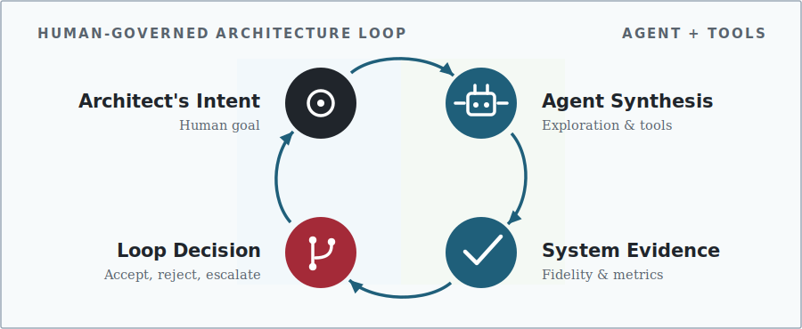
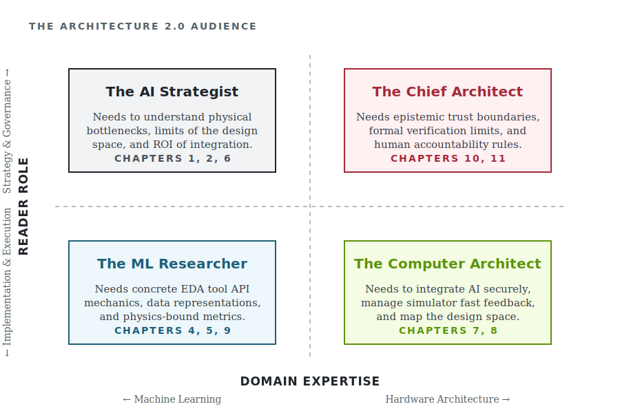

::: {.content-visible when-format="html"}
```{=html}
<span id="arch2-release-metadata" hidden="hidden"></span>

```
:::

# Preface {.unnumbered}

Computer architecture has a new question. For decades the field asked what
machines should be built for new kinds of computation. Just as deep reinforcement learning has demonstrated superhuman performance in physical layout (e.g., AlphaChip) and predictive models have transformed structural biology, capable AI systems now
pose the reverse question of what those systems can do for the practice of
architecture itself. AI's role reaches beyond generating more design candidates.
AI can help translate workload or product intent into an architecture question,
construct and revise alternatives, produce executable artifacts, call design
tools, choose experiments, interpret results, and prepare a recommendation.
Each of those activities can improve architecture work. Each can also hide a bad
assumption, optimize the wrong abstraction, or make a fluent explanation look
more certain than the experiment supports.

> **To harness these new capabilities while mitigating their inherent risks, we define Architecture 2.0 as the engineering discipline of using AI, grounded in
> architectural representations, tools, and experiments, to formulate, explore,
> implement, evaluate, explain, and defend computer architecture decisions.**

While the core subject remains computer architecture, Architecture 2.0 fundamentally changes the unit of work.
It is not an isolated model invocation but a bounded architecture study, and the
architectural claim it makes is what gets reviewed. When the work iterates, the
design loop records the represented state, allowed actions, tool feedback,
evidence, and decision, and those records are what make the study inspectable.
The goal is the same one any good architecture study serves: better
understanding, a better artifact, or a decision that stronger evidence supports.
This loop, shown in the diagram, recurs throughout the book.

::: {.content-visible when-format="pdf"}
{width="100%" fig-alt="Architecture 2.0 loop diagram connecting architect intent, one or more agentic participants, system evidence, and a loop decision that returns to the architect"}
:::

As the loop diagram illustrates, AI is taking on a new role as an agentic participant in the design process. While machine learning has long optimized isolated architectural mechanisms (e.g., branch predictors) and bounded optimization workflows (e.g., ML-driven macro placement), recent advances—such as large language models for hardware description, reinforcement learning for physical design, and Bayesian optimization for complex design-space exploration—can now participate in the higher-level control loop that produces and evaluates a claim about a design. The question is what engineering practice that expanded role requires.
A credible study must connect intent to concrete alternatives, alternatives to
real tools, measurements to architectural mechanisms, and evidence to a
recommendation whose limits are stated.

## What This Book Teaches {.unnumbered}

To prepare the reader to execute such a credible study, this material is built around one main learning objective. Given a new, bounded computer
architecture problem within the reader's domain competence, the reader should be
able to decide whether and where AI assistance is useful, produce checkable study
artifacts, and defend an evidence-bounded recommendation that another architect
can inspect and challenge. These six verbs are ordered, not a menu. The middle stages iterate, but the
dependencies hold throughout. One cannot evaluate what has not been implemented,
or defend what has not been explained.

These six core actions are defined as follows:

- **Formulate:** Translate design intent into a scoped study with a stated
  baseline, design space, objectives, constraints, claims, and non-goals.
- **Explore:** Choose suitable AI or conventional methods, compare meaningful
  alternatives, and preserve why serious candidates failed or were rejected.
- **Implement:** Turn selected alternatives into checkable artifacts by navigating synthesis workflows and lowering through Intermediate Representations (e.g., MLIR, FIRRTL), seamlessly connecting to the simulators, compilers, RTL, EDA tools, and physical constraints (e.g., timing closure, DRC) needed to test the claim.
- **Evaluate:** Assess the architecture claim and the contribution of AI
  assistance using justified fidelity, representative workloads, matched
  baselines, PPA (Power, Performance, Area) metrics, correctness checks, uncertainty quantification, out-of-distribution (OOD) robustness, resistance to reward hacking, and counterevidence.
- **Explain:** Form and test an architectural account of why the result occurred
  through mechanisms such as locality, data movement, contention, parallelism,
  critical paths, or software interfaces.
- **Defend:** Make a recommendation that states its tradeoffs, evidence
  limits, decision ownership, and the conditions that would reverse it.

Within this framework, implementation means enough executable structure to test the study's claim,
not necessarily tapeout-ready hardware. Defense means reasoned engineering
judgment, not certification or a claim of finality.

To anchor these concepts of implementation and defense in practice, one recurring design request, called the Lighthouse prompt (a highly constrained 3 W RISC-V XR subsystem operating at the edge of modern thermal and power limits, representative of strict skin-temperature constraints in untethered AR/VR headsets [@KwonEtAl2023XRBench; @HuzaifaEtAl2021ILLIXR]), gives the material
a common long-term target. @sec-moonshot introduces the request, and later
chapters return to it when it helps explain a particular part of an architecture
study. A later worked study shows what current tools can establish with
executable evidence. Together, the examples distinguish the long-term ambition
from what the current evidence supports.

Pursuing such ambitious design targets with these new tools characterizes Architecture 2.0, yet at its core it remains computer architecture, best understood as the
point where several mature disciplines meet. The subject and the standard of
judgment stay architectural. What is new is that working with a capable but
fallible AI participant forces the field to borrow methods that other
disciplines already built to use powerful, unreliable tools without being misled
by them.

Several traditions supply those methods. Experimental science contributes
falsifiable claims and the preregistration that stops a search from
rationalizing its result after the fact. Statistics and decision science
contribute calibration, uncertainty quantification, sequential experiment
choice, and the winner's-curse caution that governs any search over many
candidates. Systems safety contributes independent challenge, assurance
arguments, and the explicit assignment of decision authority. Benchmarking
contributes shared tasks, provenance, and resistance to gaming a proxy. Software
engineering and electronic design automation supply the executable substrate of
version control, tool interfaces, and design flows on which the work runs, echoing historical abstraction shifts like the transition from schematic capture to RTL synthesis, where higher-level intent was formalized into physical constraints. The
human and organizational sciences supply tacit knowledge, automation bias, and
decision rights. The field also adapts first-principle ideas from more distant
work, such as state estimation from control theory, the practice of inferring a
system's hidden internal state from noisy measurements, which is close to the
problem of inferring a design's true post-layout performance, power, and area (PPA) from partial, multi-fidelity tool readings to bridge the predictive synthesis gap between early RTL simulation and tapeout.

To synthesize these diverse contributions, this book maps each borrowed idea to the point in an
architecture study where it belongs, so that AI assistance produces evidence an
architect can check rather than a more fluent claim.

To ensure this evidence can actually be checked, using AI across an architecture study changes both what teams must keep and
what reviewers must evaluate. Workload traces, design artifacts, and tool
outputs still matter. So do problem formulations, alternatives, interface
assumptions, experiment choices, mechanism-level explanations, failed attempts,
and rejected candidates. The final design alone may not show why the team
reached its conclusion. Conversely, even a complete log is not an architecture
contribution if it lacks an architecture question or mechanism-level
explanation.

Because defining this architecture question is central to the work, the discussion focuses on engineering questions rather than particular AI
products. The scope is AI assistance within architecture studies. This material does not
propose replacing computer architects, EDA, verification, compiler and
toolchain engineering, or systems operations with a general AI layer. It does
not give a model authority over an architecture decision merely because it
emitted a plausible artifact. Architecture work still depends on expertise,
interfaces, constraints, tests, and measurements. AI can participate throughout
the study. Named people or organizational roles remain responsible for setting
the question, judging the explanation, deciding what the evidence supports, and
specifying where the recommendation applies.


## Book Structure {.unnumbered}

To equip the human architect for these responsibilities, the following sections detail the required methodology and infrastructure: the sequence from @sec-moonshot through @sec-architecture-20-ontology frames
the ambition, diagnoses why existing practice strains, and defines the claim,
study, and design loop. The sequence from
@sec-data-representations-world-models through @sec-feedback-verification-trust
develops the representations, tool interfaces, methods, and evidence needed to
run such work. @sec-running-the-loop then executes a study,
@sec-evaluating-agentic-architect turns the measurement lens from the chip to
the agent driving the search, @sec-loop-patterns-across-stack compares the
approach across the computing stack, and @sec-what-architect-owns returns to
architectural judgment and responsibility.

## Who This Book Is For {.unnumbered}

Taken together, this structure forms a compact synthesis designed for readers who already know computer architecture
and want a framework for AI-assisted practice. It assumes enough fluency to
follow performance, energy, area, and software-interface tradeoffs and to read
an architecture paper, simulator, workload, or design report. It does not assume
a machine-learning or reinforcement-learning background. The AI ideas needed for
the argument are introduced in an architectural context.

While this architecture-first audience is our primary focus, Architecture 2.0 sits at the intersection of two distinct disciplines; therefore, we designed the broader material to accommodate four specific reader personas across a cross-domain quadrant:

{#fig-audience-quadrant width="100%" fig-alt="A 2x2 quadrant mapping four personas: AI Strategist, Chief Architect, ML Researcher, and Computer Architect across Domain Expertise and Role."}

As shown in @fig-audience-quadrant, the four distinct audience roles each require different capabilities:

- **The AI Strategist:** Machine learning leaders who need to understand the fundamental physics bottlenecks, the ROI of AI integration, and the structural limits of the hardware design space (@sec-moonshot, @sec-design-loop-no-longer-scales, @sec-methods-generation-prediction-optimization).
- **The ML Researcher:** Machine learning practitioners and tool builders who require concrete EDA tool API mechanics, hardware-specific representation learning (e.g., Graph Neural Networks for netlists, sequence models for execution traces), intermediate representation (IR) bridging, and multi-fidelity, physics-bound reward functions to train effective surrogate models and agents (@sec-data-representations-world-models, @sec-architecture-environments-tool-interfaces, @sec-evaluating-agentic-architect).
- **The Computer Architect:** Hardware implementers who need to know how to integrate AI securely, manage simulator fast feedback, and safely evaluate the design space (@sec-feedback-verification-trust, @sec-running-the-loop).
- **The Chief Architect:** Senior architects who hold final product accountability and must navigate epistemic trust boundaries, formal verification limits, and legal evidence requirements (@sec-loop-patterns-across-stack, @sec-what-architect-owns).

These four distinct roles map directly to the practical goals of our readership. A graduate student (the Computer Architect) should learn to conduct a well-scoped study rather than merely acquire a vocabulary. A reviewer (the Chief Architect) should be able to test the claim, mechanism, comparison, and evidence rather than judge only a generated artifact. An author (the ML Researcher) should be able to explain where AI contributed and defend the recommendation without overstating it. A practitioner (the AI Strategist) should be able to decide which work to delegate and where architectural judgment is still required.

Despite these distinct practical goals, the ultimate test of success across all four personas is their ability to transfer these insights to a problem other than the Lighthouse.

## How to Read This Book {.unnumbered}

To prepare you for that transfer, the material is structured for progressive disclosure. Each chapter opens with a guiding question and a short list of what
you will be able to do after reading it. Rather than introducing disjointed theoretical examples in every section, the Lighthouse request introduced earlier will serve as our continuous anchor, allowing each return to examine a different facet of the architecture study. A
later worked study becomes the main empirical example once the required
representations, environment, method roles and budgets, and evidence rules are
in place.

Within this study, when the text or a figure depicts an agent, read it as one participant in the
study rather than a claim about implementation. Its name matters less than the
architecture work it is allowed to perform and the evidence required from that
work.

With these interpretive principles in mind, choose the reading route that matches your purpose:

- **Orientation:** Read the Preface, @sec-moonshot,
  and @sec-what-architect-owns.
- **Research review:** Read the orientation route, then add
  @sec-architecture-20-ontology, @sec-data-representations-world-models,
  @sec-feedback-verification-trust, the worked study
  in @sec-running-the-loop, and the agent-evaluation discipline
  in @sec-evaluating-agentic-architect.
- **Method and environment design:** Read
  @sec-design-loop-no-longer-scales through
  @sec-feedback-verification-trust, see the pieces run as one study
  in @sec-running-the-loop, then compare regimes
  in @sec-loop-patterns-across-stack.
- **Full argument:** Read the chapters in order.

Beyond reading these sections, readers seeking hands-on practice should use the bootstrap path in
@sec-appendix-a-bootstrapping. To apply
the approach to a new problem, readers should declare its limits and prepare a
study brief, method rationale, tool path, evaluation packet, tested mechanism
explanation, and decision memo that states what the evidence does and does not
support.

By committing to these rigorous practices, rather than waiting for a system that designs a computer from a single sentence, we can build the representations, datasets, environments, experimental practices, and professional judgment that let us use AI well today. Architecture 2.0 matters because it provides the rigorous, checkable engineering foundation needed to turn stochastic models from autonomous novelties into trusted, accountable participants in the design loop.

— *Vijay Janapa Reddi*
