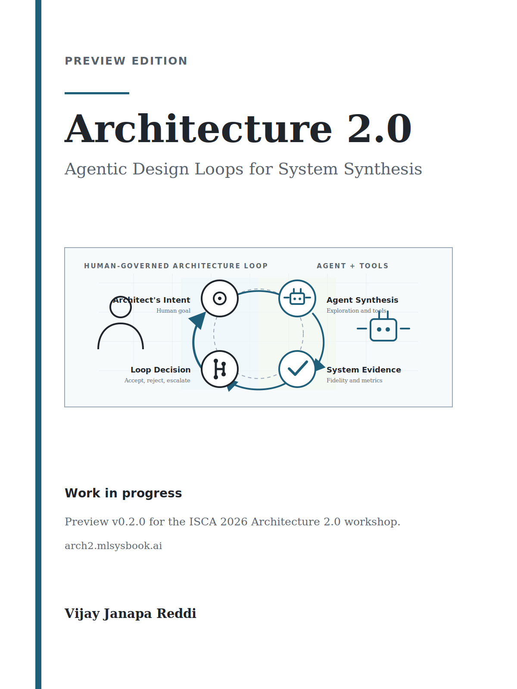

```{=latex}
\frontmatter
```

::: {.content-visible when-format="html"}
```{=html}

```
:::

# Preface {.unnumbered}

Computer architecture has a new question. For decades the field asked what
machines should be built for new kinds of computation. Capable AI systems now
pose the reverse question: what can those systems do for the practice of
architecture itself? This book is about that reversal and the claim that
follows from it. The object an architect designs is no longer only the
artifact. It is increasingly the design loop that produces, evaluates, rejects,
and justifies the artifact.

The broader shift is already underway. The Architecture 2.0 foundations
article argues why AI methods and agents belong in modern computer system
design and sets out the vision, history, ecosystem, capability horizons, and
levels of autonomy that could follow
[@ReddiYazdanbakhsh2025Architecture20]. This book makes the next question
self-contained. Suppose an AI-assisted loop proposes a faster accelerator
configuration, a lower-energy kernel, or a plausible physical-design move. What
state did it inspect? What could reject the result? Who accepts the commitment
if the evidence is wrong? Those are the questions this book treats as the
practical core of Architecture 2.0.

That question is familiar from a different field. Machine learning systems
faced the same credibility problem a decade ago. Claims were everywhere and
comparison was hard. The answer was not a better model. It was measurement
discipline: shared workloads, defined scenarios, provenance, and rules that
made a performance claim mean the same thing across systems. Benchmarking
efforts mattered because they turned enthusiasm into evidence. Architecture
2.0 needs the same move one level up. The task is to make AI-assisted
architecture claims as credible and comparable as the community learned to
make AI-systems claims.

The central problem sits at the boundary between computer architecture,
machine learning systems, benchmarking, and tool-based design. AI methods are
powerful, but architecture progress depends on hardware and software
interfaces, workload definitions, toolchains, evidence standards, and human
judgment. That is why the unit of analysis here is the design loop, not the
isolated model.

The argument is therefore data-centric in a specific sense. The limiting
question is not only which model or agent is used. It is which parts of
architecture work are made observable: workload traces, design artifacts, tool
outputs, constraints, rejected candidates, failed runs, and the provenance that
ties feedback to a decision. Data-driven methods become credible only when the
data records the design loop, not just its successful endpoints.

What follows is an operating framework, not a catalog. The field is moving
quickly, and a catalog of today's agents, tools, and benchmarks would age
before it was useful. The durable contribution is a way to describe an
architecture design loop, judge its evidence, and decide what the architect
still owns. Architecture 2.0 is therefore not primarily a survey of current AI
agents for computer architecture. Agents are the forcing function. The
foundation is a set of durable principles for making architecture design loops
representable, governable, evidence-bearing, rejectable, and improvable as
methods become more capable.

The book calls that broader act *synthesizing systems*: turning intent into
defensible computing-system design. Logic synthesis turns logic into circuits.
High-level synthesis turns behavior into hardware. Program synthesis turns
specifications into programs. Synthesizing a system operates at the architecture
level, where intent, constraints, representations, tools, feedback, evidence,
and human judgment have to be coordinated before a design deserves commitment.

The framework keeps returning to three reader questions. What state is visible
to the loop? What actions and tools can change that state? What evidence can
reject a result before a person or organization commits to it? Later chapters
give those questions reusable names: loop contracts, architecture environments,
method roles, evidence ledgers, rejection authority, commitment boundaries, and
design-loop cards. The
faster-moving record of who is doing what belongs with the community now forming
around this topic. The book keeps the parts meant to last.

## How to read this book {.unnumbered}

Each chapter is framed by a guiding question and a short *What this chapter gives
you* list of the moves you will be able to make, and the lighthouse prompt from
@sec-moonshot, a compact mobile-XR subsystem design request, runs through the
book as a shared example. The book serves several
readers. A graduate student entering the area should
find the vocabulary and the lay of the land. A reviewer should find a way to
ask what a project exposes and what could reject its result, not only what
result it reports. An instructor should find artifacts that make the framework
teachable: cards, checklists, and a paper-to-loop exercise. A practitioner
should find a way to reason about where an agent may act and where the
architect must still decide. If the book succeeds, each of these readers should
be able to do something afterward that was harder before: name a loop, judge
its evidence, and state what remains an architect-owned commitment.

For a quick pass, read the Preface and @sec-moonshot, then skim the design-loop
card in @sec-appendix-b-design-loop-card. For a one-hour pass, read
@sec-design-loop-no-longer-scales, @sec-architecture-20-ontology, and
@sec-loop-patterns-across-stack to see why the loop becomes the object of
design. For a deeper release review, read the chapters in order and use the
loop-role resource catalog in @sec-appendix-c-resource-catalog plus the living
link list in @sec-appendix-d-architecture-20-resources to test where the
framework needs better examples, tools, or evidence.

AI systems do not remove the architect. They raise what the architect must be
good at. The work moves upward, toward intent, representation, evidence
standards, rejection authority, and accountability for the final decision. The
opportunity is not to wait for a system that designs a computer from a single
sentence. It is to change the unit of architectural practice from the isolated
artifact to the represented, instrumented, evidence-bearing design loop, and to
build loops worthy of an architect's judgment.

Vijay Janapa Reddi

# Acknowledgments {.unnumbered}

This book grew out of work and conversations across computer architecture,
machine learning systems, benchmarking, and education. I am grateful to the
students, collaborators, colleagues, and broader research community who
pressure-tested the framing, challenged weak claims, and insisted on evidence
over enthusiasm. Their questions and examples shaped the emphasis on design
loops, evidence standards, rejection, and human architectural judgment
throughout the book.

I am especially grateful to Partha Ranganathan, Vice President and Engineering
Fellow at Google, who delivered the inaugural keynote for the online
Architecture 2.0 workshop.

For feedback, discussions, and challenges that sharpened this work, I am
also grateful to Siddharth Garg (NYU), Brian Hirano (Micron), Jenny Huang
(NVIDIA), Tushar Krishna (Georgia Tech), Srivatsan Krishnan (NVIDIA), Benjamin
Lee (University of Pennsylvania), Yingyan (Celine) Lin (Georgia Tech), Jason
Lowe-Power (UC Davis), Martin Maas (Google DeepMind), Ankita Nayak (Qualcomm), Matt Sinclair (University
of Wisconsin-Madison), Srinivas Sridharan (NVIDIA), Amir Yazdanbakhsh (Google
DeepMind), Cliff Young (Google DeepMind), and Zishen Wan (Columbia University).

Any errors that remain are my own.

```{=latex}
\tableofcontents
```

# About the Author {.unnumbered}

Vijay Janapa Reddi is a professor at Harvard University. His work sits at the
boundary of computer architecture, runtime systems, edge computing, and
machine learning systems, with a recurring focus on how measurements,
benchmarks, and teaching artifacts turn systems ideas into practice. As a
co-founder of MLCommons and one of the architects of the MLPerf benchmarks, he
has helped make machine-learning performance a measurable, reproducible
engineering claim. Architecture 2.0 grows out of that boundary: hardware realities, software
interfaces, workload evidence, and the question of how engineers learn to
trust the systems they build.

```{=latex}
\mainmatter
```
